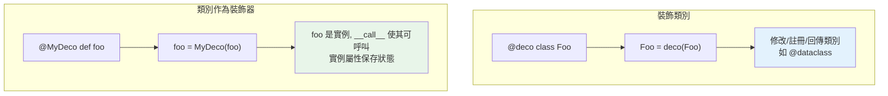

# 類別裝飾器

> 裝飾器不只能裝飾函式——還能「裝飾類別」（修改整個類別），也能「用類別當裝飾器」（實例是可呼叫物件，能攜帶狀態）。`@dataclass` 就是最有名的類別裝飾器。

## Why（為什麼）

前面的裝飾器都作用在函式上。但「裝飾器」的概念更廣，有兩個延伸：

1. **裝飾類別**：`@decorator` 放在 `class` 上，接收類別、回傳（修改後的）類別——`@dataclass`、`@total_ordering` 都是（見 [dataclass](../04-oop/09-dataclass.md)、[functools](05-functools.md)）。
2. **用類別當裝飾器**：讓一個類別的**實例**成為裝飾器（透過 `__call__`），好處是能用實例屬性**攜帶狀態**，比閉包更清楚。

搞懂這兩者，你就掌握了裝飾器的完整光譜，也理解了 `@dataclass` 這類「魔法」的原理。

## Theory（理論：兩種「類別 + 裝飾器」）

**要分清兩件不同的事**：

- **裝飾類別（decorating a class）**：裝飾器**接收類別、回傳類別**——`class Foo` 定義後，`Foo = decorator(Foo)`。用來為類別自動加方法、註冊、修改。
- **類別作為裝飾器（class as decorator）**：**一個類別當裝飾器用**——`@MyDecorator` 放在函式上，`func = MyDecorator(func)`，於是 `func` 變成 `MyDecorator` 的實例；該實例實作 `__call__`（見 [魔術方法](../04-oop/08-dunder-methods.md)）所以「可呼叫」，呼叫時執行包裝邏輯。實例的屬性可保存狀態。

## Specification（規範：兩種語法）

```python
# ① 裝飾類別：接收類別、回傳類別
def add_repr(cls):
    cls.__repr__ = lambda self: f"{cls.__name__}({vars(self)})"
    return cls

@add_repr
class Point:
    def __init__(self, x, y):
        self.x, self.y = x, y
# 等於 Point = add_repr(Point)

# ② 類別作為裝飾器：用 __call__
class CountCalls:
    def __init__(self, func):        # 接收被裝飾函式
        self.func = func
        self.count = 0               # 狀態存在實例屬性
    def __call__(self, *args, **kwargs):   # 讓實例可呼叫
        self.count += 1
        return self.func(*args, **kwargs)

@CountCalls
def greet():
    return "hi"
# 等於 greet = CountCalls(greet)；greet 現在是 CountCalls 實例
```

## Implementation（裝飾類別、類別當裝飾器、狀態）

### 裝飾類別：自動增強類別

裝飾類別的裝飾器接收類別、可修改它（加方法、屬性、註冊到某處）、回傳它：

```python
_registry = {}

def register(cls):
    """把類別註冊到全域登記表（裝飾類別）。"""
    _registry[cls.__name__] = cls
    return cls

@register
class UserHandler: ...

@register
class OrderHandler: ...

print(_registry)     # {'UserHandler': ..., 'OrderHandler': ...}
```

這是外掛系統、序列化框架的常見手法（也可用 `__init_subclass__` 或 metaclass，見 [metaclass](../04-oop/13-metaclass.md)——但類別裝飾器最簡單）。`@dataclass` 是最有名的例子：它接收類別、讀取欄位註記、自動加 `__init__`/`__repr__`/`__eq__`、回傳增強後的類別。

### 類別作為裝飾器：用實例狀態

用類別當裝飾器的最大好處是**用實例屬性保存狀態**，比閉包 + `nonlocal` 更直觀：

```python
from functools import wraps

class CallCounter:
    def __init__(self, func):
        wraps(func)(self)            # 對類別裝飾器用 wraps 的方式
        self.func = func
        self.count = 0

    def __call__(self, *args, **kwargs):
        self.count += 1
        print(f"{self.func.__name__} 第 {self.count} 次呼叫")
        return self.func(*args, **kwargs)

@CallCounter
def process():
    return "done"

process()      # process 第 1 次呼叫
process()      # process 第 2 次呼叫
print(process.count)     # 2（直接讀實例屬性！）
```

`process.count` 直接可讀——因為 `process` 是 `CallCounter` 實例。用閉包版要靠函式屬性（`wrapper.count`），沒這麼直觀。**當裝飾器需要複雜狀態或多個方法時，類別版更清楚。**

### 閉包版 vs 類別版裝飾器

| | 閉包版（函式） | 類別版 |
|--|----------------|--------|
| 簡單裝飾器 | ✅ 簡潔 | 較囉嗦 |
| 需保存狀態 | 靠函式屬性/nonlocal | ✅ 實例屬性，直觀 |
| 需要多個方法（如 reset） | 難 | ✅ 自然 |
| `@wraps` | `@wraps(func)` | `wraps(func)(self)` 或設 `__wrapped__` |

**準則**：簡單的用閉包（函式裝飾器）；需要保存複雜狀態、提供額外方法（如 `.reset()`、`.count`）時用類別裝飾器。

### 帶參數的類別裝飾器

若類別裝飾器要帶參數，`__init__` 收裝飾器參數、`__call__` 收函式並回傳包裝器（多一層，類似 [帶參數的裝飾器](04-decorator-with-args.md)）：

```python
class Repeat:
    def __init__(self, times):       # 收裝飾器參數
        self.times = times
    def __call__(self, func):        # 收被裝飾函式，回傳包裝器
        @wraps(func)
        def wrapper(*args, **kwargs):
            return [func(*args, **kwargs) for _ in range(self.times)]
        return wrapper

@Repeat(times=3)
def roll(): return "🎲"
```

## Code Example（可執行的 Python 範例）

```python
# class_decorators_demo.py
from __future__ import annotations

from collections.abc import Callable
from functools import wraps
from typing import Any

# ① 裝飾類別：註冊到登記表
_registry: dict[str, type] = {}


def register(cls: type) -> type:
    _registry[cls.__name__] = cls
    return cls


@register
class UserHandler:
    pass


@register
class OrderHandler:
    pass


# ② 類別作為裝飾器：用實例狀態計數
class CallCounter:
    def __init__(self, func: Callable[..., Any]) -> None:
        wraps(func)(self)
        self.func = func
        self.count = 0

    def __call__(self, *args: Any, **kwargs: Any) -> Any:
        self.count += 1
        return self.func(*args, **kwargs)

    def reset(self) -> None:
        self.count = 0


@CallCounter
def ping() -> str:
    return "pong"


def demo() -> None:
    # 裝飾類別的效果：自動註冊
    print(f"登記表: {sorted(_registry)}")

    # 類別裝飾器：實例狀態直接可讀
    ping()
    ping()
    ping()
    print(f"ping 呼叫 {ping.count} 次")      # 3

    ping.reset()                             # 額外方法
    print(f"reset 後: {ping.count} 次")       # 0


if __name__ == "__main__":
    demo()
```

**預期輸出**：

```pycon
$ python class_decorators_demo.py
登記表: ['OrderHandler', 'UserHandler']
ping 呼叫 3 次
reset 後: 0 次
```

## Diagram（圖解：兩種類別 + 裝飾器）



## Best Practice（最佳實踐）

- **裝飾類別用於「自動增強/註冊類別」**：加方法、註冊到登記表——類別裝飾器比 metaclass 簡單，優先考慮（見 [metaclass](../04-oop/13-metaclass.md)）。
- **需要保存複雜狀態或提供額外方法（reset/stats）的裝飾器用類別版**：實例屬性比閉包直觀。
- **簡單裝飾器用閉包（函式）版**：更簡潔，不必開一個類別。
- **類別裝飾器也要處理 `wraps`**：`wraps(func)(self)` 或設 `__wrapped__`/`__name__`。
- **善用現成的類別裝飾器**：`@dataclass`、`@total_ordering` 已覆蓋常見需求。
- **帶參數的類別裝飾器用 `__init__`（參數）+ `__call__`（函式 → 包裝器）**。

## Common Mistakes（常見誤解）

- **混淆「裝飾類別」與「類別當裝飾器」**：前者接收類別回傳類別；後者用類別實例（`__call__`）當裝飾器。
- **類別裝飾器忘了 `__call__`**：實例不可呼叫，`@MyDeco` 後呼叫函式會 `TypeError`。
- **類別裝飾器沒處理 wraps**：被裝飾函式遺失 `__name__`/`__doc__`。
- **裝飾方法時類別裝飾器的 self 綁定問題**：類別實例當裝飾器裝飾「方法」時，描述器綁定會出問題（需實作 `__get__`），較進階。
- **該用簡單閉包卻開一個類別**：過度工程；無狀態的簡單裝飾器用函式即可。
- **裝飾類別時破壞了原類別**：修改要小心（如覆蓋了重要方法）。

## Interview Notes（面試重點）

- **能區分兩種「類別 + 裝飾器」**：**裝飾類別**（接收類別、回傳類別，如 `@dataclass`）vs **類別作為裝飾器**（實例透過 `__call__` 當裝飾器、用實例屬性保存狀態）。
- 知道 **`@dataclass` 是類別裝飾器**（讀註記、自動加方法、回傳增強的類別）。
- 能說出**類別裝飾器 vs 閉包裝飾器**的取捨：需要複雜狀態/額外方法（reset/stats）用類別；簡單的用閉包。
- 知道類別裝飾器要有 **`__call__`** 且要處理 **wraps**。
- 知道帶參數的類別裝飾器用 `__init__`（參數）+ `__call__`（函式→包裝器）。
- 知道裝飾類別可做「自動註冊」，是 metaclass 的輕量替代。

---

🎉 **恭喜完成 Part 8！** 你已掌握 Python 的函數式與裝飾器：一等公民函式、高階函式 map/filter/reduce、裝飾器基礎與帶參數版、functools（wraps/lru_cache/total_ordering/singledispatch）、partial、以及類別裝飾器。
接下來 [Part 9 並發與並行](../09-concurrency/README.md) 將進入 threading、GIL、multiprocessing 與 asyncio。

[⬆️ 回 Part 8 索引](README.md)
