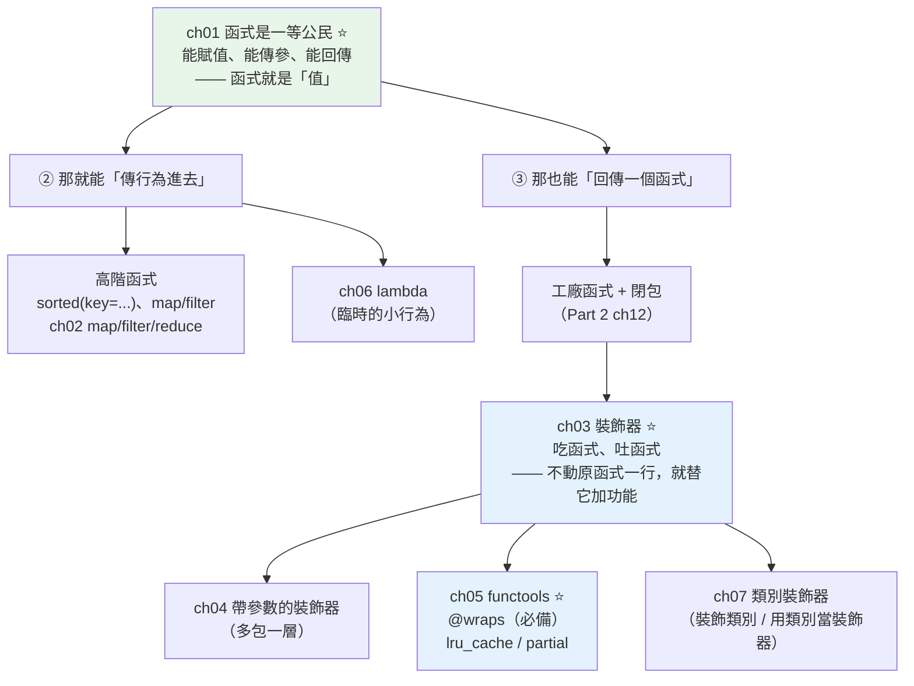

# Part 8 統整：函數式與裝飾器全貌

> 把這 7 章串成一張圖——一切都建立在一個事實上：**函式是「值」**，能傳、能存、能回傳。

## 🗺️ 知識地圖（這 7 章怎麼串起來）

Part 8 只有一個起點：**[函式是一等公民](01-first-class-functions.md)**。
接受了這件事，其餘全是它的推論：



**一句話串起來**：

因為**函式是值**（ch01），所以你能**把行為當參數傳進去**——
`sorted(data, key=len)` 就是在傳一個「怎麼比大小」的行為（ch02、ch06）。

也因為函式是值，你能**回傳一個函式**。
一個「**吃函式、吐函式**」的函式，就是 **[裝飾器](03-decorator-basics.md)**（ch03）——
它讓你**不動原函式一行程式碼**，就替它加上計時、快取、重試、權限檢查。

`@decorator` 只是 `func = decorator(func)` 的語法糖。
想讓裝飾器帶參數？**再多包一層**就好（ch04）。

而 **[`functools`](05-functools.md)**（ch05）是配套工具箱——
其中 **`@wraps` 是寫裝飾器的必備**（不加，函式的名字和 docstring 會被吃掉）。

## ⚡ 速查表（什麼情境用什麼）

| 情境 | 怎麼做 | 章節 |
|------|--------|------|
| 把「怎麼比較／怎麼轉換」當參數傳 | `sorted(xs, key=...)`、`max(xs, key=...)` | [ch01](01-first-class-functions.md) |
| 用 dict 派發取代一長串 `if/elif` | `handlers = {"add": do_add}; handlers[cmd]()` | [ch01](01-first-class-functions.md) |
| 臨時傳一個一行的小行為 | `lambda`（長了就改用 `def`） | [ch06](06-lambda.md) |
| 對序列做轉換／篩選 | **推導式**（比 `map`/`filter` 更 Pythonic） | [ch02](02-map-filter-reduce.md) |
| **替函式加功能但不改它的程式碼** | **裝飾器**（計時、快取、重試、log、權限） | [ch03](03-decorator-basics.md) |
| 裝飾器要收參數（`@retry(times=3)`） | **再多包一層**（三層巢狀函式） | [ch04](04-decorator-with-args.md) |
| **寫任何裝飾器** | **一定加 `@functools.wraps(func)`** | [ch05](05-functools.md) |
| 純函式、同輸入同輸出、會重複呼叫 | **`@functools.lru_cache`**（一行加速） | [ch05](05-functools.md) |
| 想「先固定某幾個參數」產生新函式 | `functools.partial(f, a=1)` | [ch05](05-functools.md) |
| 實例上「算一次就固定」的昂貴屬性 | `@functools.cached_property` | [ch05](05-functools.md) |
| 依「第一個參數的型別」分派實作 | `@functools.singledispatch` | [ch05](05-functools.md) |
| 對**整個類別**做統一改造（自動註冊…） | **類別裝飾器**（`@dataclass` 就是這類） | [ch07](07-class-decorators.md) |
| 裝飾器**自己需要保存狀態**（計數、限流） | **用類別當裝飾器**（實例可呼叫） | [ch07](07-class-decorators.md) |
| 累積成一個值 | 多數時候用 `sum`/`math.prod`/迴圈；`reduce` 留給非標準累積 | [ch02](02-map-filter-reduce.md) |

## 🔑 核心心智模型（帶得走的幾句話）

- **函式是「值」。** 這一句推出整個 Part 8：能存進 dict（派發表）、能當參數（`key=`）、
  能被回傳（工廠、閉包、裝飾器）。
- **`@decorator` 只是語法糖**：
  ```text
  @timer
  def fib(): ...
  ```
  **完全等同於** `fib = timer(fib)`。理解這一行，裝飾器就不再神秘。
- **裝飾器 = 手機貼膜。** 不改變手機本體（原函式），卻替它加上一層保護／功能。
  同一張膜（`@timer`）可以貼在任何手機上——這就是**橫切關注**（cross-cutting concern）：
  計時、log、快取、重試、權限——**每個函式都需要，但不屬於任何函式的業務邏輯**。
- **`@wraps` 是必備，不是選配。** 裝飾器回傳的是**內層的 `wrapper`**——
  沒有 `@wraps`，`fib.__name__` 會變成 `'wrapper'`、docstring 消失、
  `help()` 一片空白，除錯時你會瘋掉。
- **帶參數的裝飾器 = 多包一層。** `@retry(times=3)` 先執行 `retry(times=3)` **拿到一個裝飾器**，
  再用它去裝飾函式。所以是**三層**：`retry` → `decorator` → `wrapper`。

## 🛠️ 小實作：一個裝飾器換來 100 倍加速

```python
# decorators_demo.py —— Part 8 主線：函式是值 → 吃函式吐函式 → 裝飾器
from __future__ import annotations

import functools
import time
from collections.abc import Callable
from typing import Any


def timer(func: Callable[..., Any]) -> Callable[..., Any]:
    """ch03 裝飾器：吃一個函式、吐一個函式——原函式一行都不用改。"""

    @functools.wraps(func)          # ch05：不加這行，函式的名字與 docstring 會被吃掉
    def wrapper(*args: Any, **kwargs: Any) -> Any:
        start = time.perf_counter()
        result = func(*args, **kwargs)          # 呼叫原函式
        elapsed = (time.perf_counter() - start) * 1000
        print(f"    ⏱  {func.__name__}() 花了 {elapsed:7.2f} ms")
        return result

    return wrapper


def retry(times: int) -> Callable[[Callable[..., Any]], Callable[..., Any]]:
    """ch04 帶參數的裝飾器——比一般裝飾器「多包一層」（三層巢狀）。"""

    def decorator(func: Callable[..., Any]) -> Callable[..., Any]:
        @functools.wraps(func)
        def wrapper(*args: Any, **kwargs: Any) -> Any:
            for attempt in range(1, times + 1):
                try:
                    return func(*args, **kwargs)
                except ValueError as exc:
                    print(f"    第 {attempt} 次失敗: {exc}")
                    if attempt == times:
                        raise
            return None

        return wrapper

    return decorator


def fib_slow(n: int) -> int:
    """沒有快取的遞迴費氏——同一個 n 被重複算了指數級次。"""
    return n if n < 2 else fib_slow(n - 1) + fib_slow(n - 2)


@functools.lru_cache(maxsize=None)      # ch05：最快的計算，是不計算
def fib_cached(n: int) -> int:
    """有快取的遞迴費氏——只差一行裝飾器。"""
    return n if n < 2 else fib_cached(n - 1) + fib_cached(n - 2)


@timer
def run_slow() -> int:
    return fib_slow(30)


@timer
def run_cached() -> int:
    return fib_cached(30)


_attempts = {"n": 0}


@retry(times=3)
def flaky() -> str:
    """前兩次會失敗，第三次才成功——模擬暫時性錯誤。"""
    _attempts["n"] += 1
    if _attempts["n"] < 3:
        raise ValueError("暫時性失敗")
    return "終於成功"


def demo() -> None:
    print("【ch01 一等函式】函式是「值」，能存能傳")
    ops: dict[str, Callable[[int, int], int]] = {
        "加": lambda a, b: a + b,
        "乘": lambda a, b: a * b,
    }
    print(f"  用 dict 派發取代 if/elif: ops['乘'](3, 4) = {ops['乘'](3, 4)}")
    print(f"  把「行為」當參數傳: sorted(key=len) → {sorted(['ccc', 'a', 'bb'], key=len)}")

    print("\n【ch03 裝飾器 + ch05 lru_cache】不動 fib 一行，就替它加上計時與快取")
    print(f"  沒快取 fib(30) = {run_slow()}")
    print(f"  有快取 fib(30) = {run_cached()}")
    print(f"  再算一次       = {run_cached()}   ← 快取全命中")
    print(f"  cache_info(): {fib_cached.cache_info()}")

    print("\n【ch05 functools.wraps】函式的身分沒有被裝飾器吃掉")
    print(f"  run_cached.__name__ = {run_cached.__name__!r}")

    print("\n【ch04 帶參數的裝飾器】retry(times=3)")
    print(f"  結果: {flaky()}")


if __name__ == "__main__":
    demo()
```

**預期輸出**（時間依機器而異）：

```pycon
$ python decorators_demo.py
【ch01 一等函式】函式是「值」，能存能傳
  用 dict 派發取代 if/elif: ops['乘'](3, 4) = 12
  把「行為」當參數傳: sorted(key=len) → ['a', 'bb', 'ccc']

【ch03 裝飾器 + ch05 lru_cache】不動 fib 一行，就替它加上計時與快取
    ⏱  run_slow() 花了   81.18 ms
  沒快取 fib(30) = 832040
    ⏱  run_cached() 花了    0.74 ms
  有快取 fib(30) = 832040
    ⏱  run_cached() 花了    0.00 ms
  再算一次       = 832040   ← 快取全命中
  cache_info(): CacheInfo(hits=29, misses=31, maxsize=None, currsize=31)

【ch05 functools.wraps】函式的身分沒有被裝飾器吃掉
  run_cached.__name__ = 'run_cached'

【ch04 帶參數的裝飾器】retry(times=3)
    第 1 次失敗: 暫時性失敗
    第 2 次失敗: 暫時性失敗
  結果: 終於成功
```

**這三個數字說完了整個 Part 8**：

```text
81.18 ms  →  0.74 ms  →  0.00 ms
沒快取        加了一行     快取全命中
              @lru_cache
```

`fib_slow` 和 `fib_cached` 的**函式本體一模一樣**——
差別只在一行 **`@functools.lru_cache`**。
遞迴的費氏數列會把同一個 `fib(n)` 重複算指數級次；
加上快取後，每個 `n` **只算一次**（看 `cache_info()`：31 次 miss、29 次 hit）。

這就是裝飾器的精髓：**橫切的功能（快取、計時、重試）與業務邏輯完全分離**——
`fib` 只管算費氏數列，「要不要快取」是貼在外面的一張膜。

## ✅ 自測清單（答不出來就回去讀）

- [ ] 「函式是一等公民」具體代表哪三件事？（[ch01](01-first-class-functions.md)）
- [ ] `@decorator` 這個語法糖，展開後等於什麼？（[ch03](03-decorator-basics.md)）
- [ ] 為什麼寫裝飾器**一定**要加 `@functools.wraps`？不加會怎樣？（[ch05](05-functools.md)）
- [ ] `@retry(times=3)` 這種帶參數的裝飾器，為什麼需要**三層**函式？（[ch04](04-decorator-with-args.md)）
- [ ] `lru_cache` 能用在什麼樣的函式上？什麼函式**不能**用？（[ch05](05-functools.md)）
- [ ] `functools.partial` 解決什麼問題？（[ch05](05-functools.md)）
- [ ] lambda 什麼時候該用、什麼時候不該用？（[ch06](06-lambda.md)）
- [ ] `map`/`filter` 和推導式，Python 慣例上偏好哪個？（[ch02](02-map-filter-reduce.md)）
- [ ] 什麼時候該「用類別當裝飾器」而不是函式？（[ch07](07-class-decorators.md)）
- [ ] 裝飾器和 [Part 4 的描述器](../04-oop/11-descriptors.md)、[Part 2 的閉包](../02-fundamentals/12-closures.md) 有什麼關係？

## 🎯 面試速查

| 考點 | 面試官想聽到什麼 | 章節 |
|------|------------------|------|
| **裝飾器是什麼？原理？** | 「一個**吃函式、吐函式**的函式。`@deco` 只是語法糖，等同 `f = deco(f)`。它讓你**不修改原函式**就加上**橫切關注**（計時、快取、log、重試、權限）。底層靠的是**閉包**——內層 `wrapper` 記住了外層的 `func`。」 | [ch03](03-decorator-basics.md) |
| **為什麼要 `@functools.wraps`？** | 「裝飾器回傳的是**內層的 `wrapper`**——不加 `@wraps`，被裝飾函式的 `__name__` 會變成 `'wrapper'`、`__doc__` 消失、簽章資訊丟失。`@wraps` 把原函式的 metadata **複製到 wrapper 上**，讓除錯與內省正常。」 | [ch05](05-functools.md) |
| **帶參數的裝飾器怎麼寫？** | 「**多包一層**：`retry(times=3)` 先被呼叫，**回傳一個裝飾器**，那個裝飾器才去裝飾函式。所以是三層：`retry(參數)` → `decorator(func)` → `wrapper(*args)`。」 | [ch04](04-decorator-with-args.md) |
| **`lru_cache` 的限制？** | 「① 函式必須是**純函式**（同輸入同輸出、無副作用）——不然會回傳過時的錯誤結果；② **參數必須 hashable**（不能傳 list／dict，呼應 [Part 3](../03-data-structures/07-hashable.md)）；③ 快取會**一直長大**，要設 `maxsize`。」 | [ch05](05-functools.md) |
| **裝飾器的實際用途？** | 「**橫切關注**——那些『每個函式都需要、卻不屬於業務邏輯』的事：Flask/FastAPI 的路由註冊、權限檢查、交易管理、重試、快取、計時、log。它讓業務函式**保持乾淨**。」 | [ch03](03-decorator-basics.md) |
| **`map`/`filter` vs 推導式？** | 「Python 慣例**偏好推導式**——更好讀、且能同時做轉換與篩選。`map`/`filter` 在『已有現成函式可傳』時還算自然（`map(int, xs)`），但配 `lambda` 就不如推導式清楚。」 | [ch02](02-map-filter-reduce.md) |

---

🎉 **恭喜完成 Part 8！** 你已經掌握 Python 最有生產力的一招——
**用裝飾器把橫切的功能，從業務邏輯裡剝離出來**。

接下來 [Part 9 並發](../09-concurrency/README.md) 是本書第一座大山：
**為什麼 Python 開了多執行緒卻沒變快？** 答案是 **GIL**——
一間餐廳只有**一把菜刀**。而 asyncio 的解法很聰明：
**不多請廚師，改請一個「不站著等菜」的服務生**。

➡️ 下一 Part：[並發與並行 Concurrency](../09-concurrency/README.md)

[⬆️ 回 Part 8 索引](README.md)
