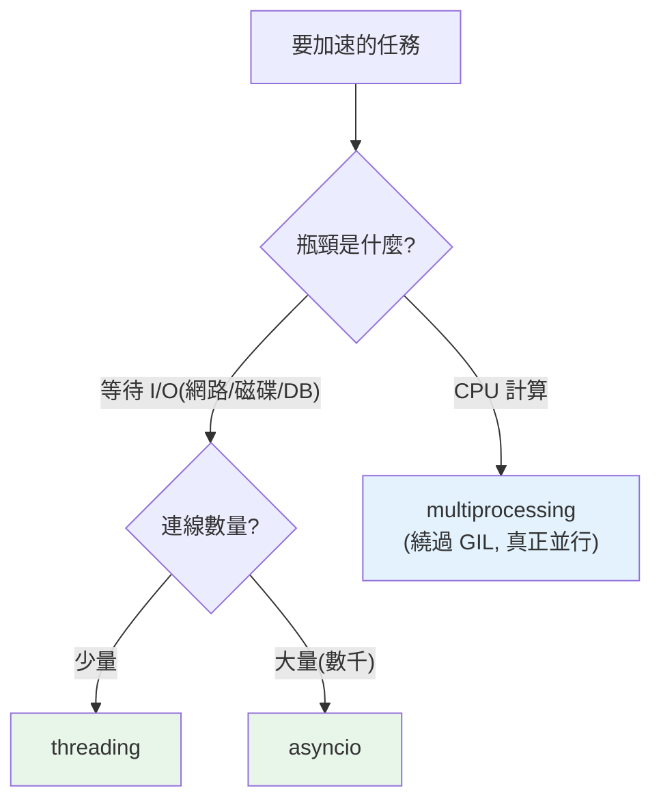

# 並發 vs 並行

> 並發是「同時處理多件事」（結構），並行是「同時執行多件事」（實際）。這個區分是理解 Python 並發的起點——因為 GIL 讓 Python 的執行緒能並發卻難並行，你必須知道差別才能選對工具。

## Why（為什麼）

Python 有三套並發工具：`threading`、`multiprocessing`、`asyncio`。選錯會讓程式不但沒變快，反而更慢更複雜。要選對，你得先分清兩個常被混用的詞：**並發（concurrency）** 與 **並行（parallelism）**，以及一個關鍵區分——你的任務是 **I/O 密集** 還是 **CPU 密集**。這章建立這些基礎概念，是整個 Part 9 的地圖，也是理解 GIL（見 [GIL](02-gil.md)）為何重要的前提。

## Theory（理論：兩個正交概念）

**並發（concurrency）** 和 **並行（parallelism）** 常被當同義詞，其實不同：

- **並發**：**結構上**同時「處理」多個任務——它們的執行時間重疊，但不一定「真的同時跑」。像一個廚師同時照看多鍋菜（切換照顧，但只有一雙手）。
- **並行**：**實際上**同時「執行」多個任務——多個計算真的在同一瞬間進行。像多個廚師各炒一鍋（多雙手同時動）。

Rob Pike 的名言：「**並發是關於處理很多事情，並行是關於同時做很多事情。**」並發是一種**程式結構**（把任務拆成可交錯的單位）；並行是一種**執行方式**（多核心真的同時跑）。並發**不需要**多核心（單核也能交錯處理），並行**需要**多核心。

## Specification（規範：I/O 密集 vs CPU 密集）

選並發工具的關鍵，是判斷任務的**瓶頸類型**：

| 類型 | 瓶頸在 | 例子 | 特徵 |
|------|--------|------|------|
| **I/O 密集（I/O-bound）** | 等待外部（網路、磁碟、DB） | 網路請求、讀檔、查資料庫、API 呼叫 | CPU 大部分時間在**等**，閒著 |
| **CPU 密集（CPU-bound）** | 計算本身 | 數值運算、影像處理、加密、壓縮 | CPU 一直**忙**著算 |

**這個區分決定一切**：I/O 密集的任務「大部分時間在等」，所以「等的時候切去做別的」（並發）就能大幅加速——不需要真正的並行。CPU 密集的任務「一直在算」，只有「多核心真的同時算」（並行）才會快。

## Implementation（Python 三工具對應 + 為何 GIL 讓一切不同）

### Python 三套工具的對應

| 工具 | 機制 | 適合 | 能並行? |
|------|------|------|:------:|
| **`threading`** | 多執行緒（共享記憶體） | **I/O 密集** | ❌（受 GIL 限制，見下） |
| **`asyncio`** | 單執行緒協程（事件迴圈） | **I/O 密集**（大量連線） | ❌（單執行緒） |
| **`multiprocessing`** | 多行程（各自記憶體） | **CPU 密集** | ✅（繞過 GIL） |

### 關鍵：GIL 讓 Python 執行緒無法並行 CPU 運算

這是 Python 並發最重要、最違反直覺的事實：**CPython 有 GIL（全域直譯器鎖），同一時刻只有一個執行緒能執行 Python bytecode**（見 [GIL](02-gil.md)）。後果：

- **多執行緒無法並行執行 CPU 運算**——就算你開 8 個執行緒跑數值計算、機器有 8 核，GIL 讓它們**輪流**跑，總時間不會變快（甚至因切換開銷變慢）。
- **但多執行緒能加速 I/O**——因為執行緒**等待 I/O 時會釋放 GIL**，讓別的執行緒趁機執行。「等網路」的時候別的執行緒可以做事，所以 I/O 密集受益。

所以 Python 的黃金法則：

- **I/O 密集 → `threading` 或 `asyncio`**（並發足矣，GIL 不礙事，因為都在等）。
- **CPU 密集 → `multiprocessing`**（每個行程有自己的直譯器與 GIL，真正並行；見 [multiprocessing](05-multiprocessing.md)）。

用錯（拿 threading 做 CPU 密集）是新手最常見的並發錯誤——不但不快，還更慢。

### 一個直覺類比

- **並發（asyncio/threading 做 I/O）**：一個服務生（單核）同時服務多桌——這桌點餐後去下一桌，不必站著等這桌吃完。等待時間被填滿，效率高。
- **並行（multiprocessing 做 CPU）**：多個服務生各服務自己的桌——真正同時進行，適合「每桌都需要全程專注」的重活。

## Code Example（可執行的 Python 範例）

```python
# concurrency_vs_parallelism_demo.py
from __future__ import annotations

import time


def io_bound_task(n: int) -> str:
    """I/O 密集：模擬等待（sleep 代表等網路/磁碟）。"""
    time.sleep(0.1)  # 等待期間 GIL 會釋放 → threading 可趁機做別的
    return f"任務 {n} 完成"


def cpu_bound_task(n: int) -> int:
    """CPU 密集：純計算，一直佔用 CPU。"""
    total = 0
    for i in range(n):
        total += i * i
    return total


def demo() -> None:
    # 判斷任務類型 → 選工具
    print("I/O 密集任務（等待）：")
    print("  → 用 threading 或 asyncio（並發即可，GIL 不礙事）")
    start = time.perf_counter()
    results = [io_bound_task(i) for i in range(3)]  # 序列版對照
    print(f"  序列執行 3 個 I/O 任務: {time.perf_counter() - start:.2f}s")

    print("\nCPU 密集任務（計算）：")
    print("  → 用 multiprocessing（需真正並行，threading 無效）")
    start = time.perf_counter()
    total = sum(cpu_bound_task(100_000) for _ in range(3))
    print(f"  序列執行結果: {total}，耗時 {time.perf_counter() - start:.2f}s")


if __name__ == "__main__":
    demo()
```

**預期輸出**（耗時依機器而異）：

```pycon
$ python concurrency_vs_parallelism_demo.py
I/O 密集任務（等待）：
  → 用 threading 或 asyncio（並發即可，GIL 不礙事）
  序列執行 3 個 I/O 任務: 0.30s
CPU 密集任務（計算）：
  → 用 multiprocessing（需真正並行，threading 無效）
  序列執行結果: ...，耗時 0.0Xs
```

（後續章節會示範用 threading/asyncio 把 0.30s 的 I/O 縮短、用 multiprocessing 把 CPU 任務並行。）

## Diagram（圖解：選並發工具的決策）



## Best Practice（最佳實踐）

- **先判斷任務類型（I/O 密集 vs CPU 密集）再選工具**：這是選對並發模型的第一步。
- **I/O 密集用 `threading`（少量）或 `asyncio`（大量連線）**：並發足矣，GIL 不礙事。
- **CPU 密集用 `multiprocessing`**：只有多行程能真正並行繞過 GIL；別用 threading（無效）。
- **CPU 密集也考慮向量化**：numpy 等把運算下放到 C（釋放 GIL），常比 multiprocessing 更簡單快速（見 [Part 17](../17-data-science/README.md)）。
- **不確定就先量測**：用序列版當基準，再試並發，確認真的變快（見 [profiling](../18-performance/01-profiling.md)）。
- **並發增加複雜度**：能不並發就不並發；只在真的需要加速且量測證明有效時才用。

## Common Mistakes（常見誤解）

- **混用「並發」與「並行」**：並發是結構（處理多事）、並行是執行（同時做）；Python 執行緒能並發卻難並行 CPU。
- **拿 `threading` 做 CPU 密集**：GIL 讓執行緒無法並行運算，不但不快還更慢（切換開銷）。用 multiprocessing。
- **以為「開更多執行緒 = 更快」**：對 CPU 密集無效；對 I/O 密集也有上限（連線數、資源）。
- **不判斷任務類型就選工具**：I/O 用 multiprocessing 是浪費（行程開銷大）、CPU 用 threading 是無效。
- **以為 GIL 讓 Python 完全不能並行**：multiprocessing 能真正並行；且 I/O 等待時 GIL 會釋放。
- **忽略向量化選項**：CPU 密集的數值運算，numpy 常比手刻 multiprocessing 更好。

## Interview Notes（面試重點）

- **能清楚區分並發（結構、處理多事、可單核交錯）vs 並行（執行、同時做、需多核）**，並引用「處理 vs 做」的區分。
- **能區分 I/O 密集 vs CPU 密集**，並說出各自該用的工具（I/O → threading/asyncio；CPU → multiprocessing）。
- **關鍵**：能解釋 **GIL 讓 Python 執行緒無法並行 CPU 運算，但 I/O 等待時釋放 GIL 故能加速 I/O**——這是選工具的核心理由。
- 知道 CPU 密集的替代方案（multiprocessing、向量化/numpy、C 擴充）。
- 知道並發增加複雜度，該先量測、能不用就不用。

---

➡️ 下一章：[GIL 全域直譯器鎖](02-gil.md)

[⬆️ 回 Part 9 索引](README.md)
