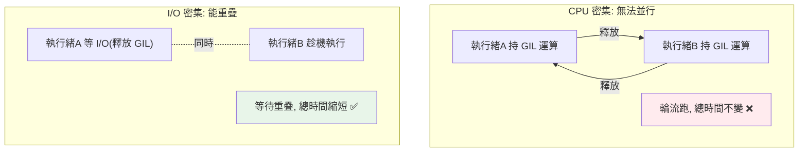

# GIL 全域直譯器鎖

> GIL 是 CPython 的一把大鎖，保證「同一時刻只有一個執行緒執行 Python bytecode」。它讓 CPython 的記憶體管理簡單安全，代價是多執行緒無法並行 CPU 運算。理解它是理解 Python 並發的核心。

## 💡 白話導讀（建議先讀）

Python 併發最有名的問題：「我開了 8 條執行緒，為什麼沒有變快？」——答案是一把刀。

想像這間餐廳有個奇怪的規定：**整間廚房只有一把菜刀（GIL）**。

- 你可以請 8 位廚師（開 8 條執行緒）——沒問題。
- 但**同一時刻，只有拿到刀的那位能切菜**（執行 Python bytecode）。其他 7 位站著等刀。

所以：

- **切菜型工作（CPU 密集,純計算）**：8 位廚師輪流用一把刀——**跟一位廚師一樣快**,甚至因為搶刀更慢。多執行緒無效。
- **等食材型工作（I/O 密集,等網路/磁碟）**：廚師 A 等外送時**會把刀放下**（等 I/O 時釋放 GIL）,B 接手用刀。8 位廚師交錯等貨、交錯切菜——**整體真的變快**。多執行緒有效!

一句口訣：**GIL 卡計算,不卡等待。**

那為什麼要有這把刀？不是設計者笨——廚房有一本**庫存帳**（每個物件的[引用計數](../10-cpython-internals/03-reference-counting.md)）,兩位廚師**同時改同一行帳**會把帳改壞（記憶體損毀）。
與其每行帳都配一把小鎖（慢、複雜）,CPython 選擇「一次只讓一人動手」——簡單、單執行緒超快、C 擴充好寫。這是**取捨**,不是缺陷。

最後畫重點：GIL 是 **CPython 這個實作**的細節,不是 Python 語言規範——而且 [3.13 開始有實驗性的「無刀廚房」](12-free-threaded-python.md)。

## Why（為什麼）

「Python 的多執行緒為什麼跑 CPU 密集任務不會變快？」這個所有 Python 工程師都會遇到的困惑，答案就是 **GIL（Global Interpreter Lock，全域直譯器鎖）**。它是 Python 最常被討論、最常被誤解的機制。理解 GIL 是什麼、為什麼存在、如何影響並發，你才能解釋 threading 的行為、知道何時該用 multiprocessing、並看懂 Python 3.13 「去 GIL」的意義（見 [free-threaded](12-free-threaded-python.md)）。這是並發章的理論核心，也是面試必考。

## Theory（理論：什麼是 GIL）

**GIL 是 CPython 直譯器的一把互斥鎖，保證同一時刻只有一個執行緒能執行 Python bytecode**——廚房裡唯一的那把菜刀。

兩個關鍵釐清：

- **GIL 是 CPython 的實作細節，不是 Python 語言規範**——Jython、IronPython 沒有 GIL；PyPy 有。談 GIL 就是談 CPython。
- **它保護的是直譯器的內部狀態**——尤其是**引用計數**（廚房的庫存帳，見[引用計數](../10-cpython-internals/03-reference-counting.md)）。多執行緒不加鎖地增減引用計數會產生競態、導致記憶體損毀。GIL 用「一次只讓一個執行緒跑」簡單地避免這個問題。

所以 GIL 的存在是一個**取捨**：

> 用「犧牲多執行緒 CPU 並行」換取「單執行緒高效 + 記憶體管理簡單安全 + C 擴充容易寫」。

## Specification（規範：GIL 的行為）

- **同一時刻只有一個執行緒持有 GIL、執行 bytecode**。
- **執行緒會定期釋放 GIL** 讓別的執行緒有機會跑：
  - 執行**阻塞式 I/O**（網路、磁碟、`time.sleep`）時**主動釋放**——這是 threading 能加速 I/O 的關鍵。
  - 執行一段時間後（預設約 5ms，由 `sys.setswitchinterval` 控制）**強制釋放**，輪給別的執行緒。
- **C 擴充可主動釋放 GIL**：numpy 等在做純 C 的密集運算時釋放 GIL，讓其他執行緒能跑（甚至讓純運算「並行」）。

## Implementation（為何 CPU 密集無效、I/O 有效、實測）

### CPU 密集：多執行緒不會變快（甚至更慢）

```python
import threading
import time

def cpu_task():
    count = 0
    for _ in range(50_000_000):
        count += 1

# 序列：跑兩次
start = time.perf_counter()
cpu_task()
cpu_task()
print(f"序列: {time.perf_counter()-start:.2f}s")

# 多執行緒：兩個執行緒「同時」跑
start = time.perf_counter()
t1 = threading.Thread(target=cpu_task)
t2 = threading.Thread(target=cpu_task)
t1.start(); t2.start()
t1.join(); t2.join()
print(f"雙執行緒: {time.perf_counter()-start:.2f}s")
```

結果：**雙執行緒版和序列版時間差不多，甚至更慢**——因為 GIL 讓兩個 CPU 任務**輪流**跑（不是並行），還多了搶鎖/切換的開銷。這就是「threading 對 CPU 密集無效」的鐵證。

### I/O 密集：多執行緒能加速

```python
import threading
import time

def io_task():
    time.sleep(1)      # 模擬等待 I/O（此時釋放 GIL）

# 序列：3 個各等 1 秒 → 3 秒
# 多執行緒：3 個同時等 → 約 1 秒
threads = [threading.Thread(target=io_task) for _ in range(3)]
start = time.perf_counter()
for t in threads: t.start()
for t in threads: t.join()
print(f"三執行緒 I/O: {time.perf_counter()-start:.2f}s")   # 約 1 秒！
```

I/O 等待（`sleep`/網路/磁碟）時執行緒**釋放 GIL**，別的執行緒趁機執行——所以三個「各等 1 秒」的任務能**同時等**，總共約 1 秒而非 3 秒。這就是「threading 對 I/O 密集有效」的原因。

### 為什麼不直接拿掉 GIL？

歷史上多次嘗試移除 GIL，都因為「拿掉後單執行緒效能變差、C 擴充相容性破壞」而作罷。GIL 讓：

- **單執行緒程式跑得快**（不必為每個物件操作加細粒度鎖）。
- **引用計數的記憶體管理簡單安全**。
- **C 擴充好寫**（不必處理複雜的多執行緒安全）。

直到近年（PEP 703），才有了「可選的、無 GIL」建置（見 [free-threaded](12-free-threaded-python.md)）——但那需要重新設計記憶體管理，且仍在成熟中。

### 繞過 GIL 的方法

- **multiprocessing**：每個行程有**獨立的直譯器與 GIL**，所以能真正並行（見 [multiprocessing](05-multiprocessing.md)）。
- **C 擴充 / 向量化**：numpy、pandas 在 C 層運算時釋放 GIL（見 [Part 17](../17-data-science/README.md)）。
- **free-threaded Python（3.13+）**：實驗性的無 GIL 建置（見 [free-threaded](12-free-threaded-python.md)）。

## Code Example（可執行的 Python 範例）

```python
# gil_demo.py
from __future__ import annotations

import threading
import time


def cpu_task(n: int) -> int:
    total = 0
    for i in range(n):
        total += i
    return total


def io_task(seconds: float) -> None:
    time.sleep(seconds)  # 等待期間釋放 GIL


def run_threaded(target, args_list) -> float:
    threads = [threading.Thread(target=target, args=a) for a in args_list]
    start = time.perf_counter()
    for t in threads:
        t.start()
    for t in threads:
        t.join()
    return time.perf_counter() - start


def demo() -> None:
    n = 10_000_000

    # CPU 密集：序列 vs 執行緒（threading 無加速）
    start = time.perf_counter()
    cpu_task(n)
    cpu_task(n)
    serial = time.perf_counter() - start
    threaded = run_threaded(cpu_task, [(n,), (n,)])
    print(f"CPU 密集: 序列 {serial:.2f}s vs 雙執行緒 {threaded:.2f}s")
    print("  → 執行緒沒有更快（甚至更慢），因為 GIL")

    # I/O 密集：threading 有加速
    io_serial = 3 * 0.3
    io_threaded = run_threaded(io_task, [(0.3,), (0.3,), (0.3,)])
    print(f"\nI/O 密集: 序列約 {io_serial:.2f}s vs 三執行緒 {io_threaded:.2f}s")
    print("  → 執行緒明顯更快，因為等待時釋放 GIL")


if __name__ == "__main__":
    demo()
```

**預期輸出**（數字依機器而異）：

```pycon
$ python gil_demo.py
CPU 密集: 序列 0.5Xs vs 雙執行緒 0.5Xs
  → 執行緒沒有更快（甚至更慢），因為 GIL
I/O 密集: 序列約 0.90s vs 三執行緒 0.3Xs
  → 執行緒明顯更快，因為等待時釋放 GIL
```

## Diagram（圖解：GIL 的輪流機制）



## Best Practice（最佳實踐）

- **CPU 密集絕不用 threading**：GIL 讓它無法並行，用 `multiprocessing` 或向量化（numpy）。
- **I/O 密集用 threading/asyncio**：等待時 GIL 釋放，能有效重疊。
- **理解 GIL 是 CPython 實作細節**：談並行策略時心裡有數（PyPy/Jython/free-threaded 不同）。
- **CPU 密集優先考慮向量化**：numpy 在 C 層釋放 GIL 且高效，常比 multiprocessing 簡單又快。
- **需要真並行的純 Python 運算 → multiprocessing**（獨立 GIL）。
- **關注 free-threaded Python 的進展**（3.13+ PEP 703），未來可能改變這個格局（見 [free-threaded](12-free-threaded-python.md)）。

## Common Mistakes（常見誤解）

- **以為 GIL 讓 Python 完全不能並行**：multiprocessing 能真正並行；I/O 等待時 GIL 釋放。
- **拿 threading 加速 CPU 密集**：無效甚至更慢——最經典的 GIL 誤用。
- **以為 GIL 是 Python 語言的一部分**：它是 **CPython 實作細節**；其他實作不同。
- **以為「有 GIL 所以 threading 沒用」**：對 I/O 密集非常有用。
- **忽略 numpy 等會釋放 GIL**：CPU 密集的向量運算配 threading 有時也能並行（因 C 層釋放 GIL）。
- **不知道 GIL 為何存在**：它是為了簡化引用計數的記憶體管理、加快單執行緒、方便 C 擴充的取捨。

## Interview Notes（面試重點）

- **能定義 GIL**：CPython 的鎖，保證同一時刻只有一個執行緒執行 Python bytecode；是**實作細節**非語言規範。
- **能解釋它為何存在**：保護引用計數等直譯器內部狀態、簡化記憶體管理、加快單執行緒、方便 C 擴充（是取捨）。
- **核心考點**：**CPU 密集多執行緒無法並行（輪流 + 開銷，故不快甚至更慢）；I/O 密集有效（等待時釋放 GIL）**——並知道執行緒在 I/O 與定期（~5ms）會釋放 GIL。
- 知道**繞過 GIL 的方法**：multiprocessing（獨立 GIL）、C 擴充/向量化（C 層釋放 GIL）、free-threaded Python（3.13+）。
- 知道「為何不直接拿掉 GIL」（單執行緒效能、C 擴充相容性）與 PEP 703 的進展。

---

➡️ 下一章：[threading 執行緒](03-threading.md)

[⬆️ 回 Part 9 索引](README.md)
