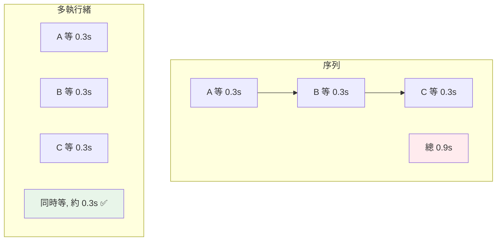

# threading 執行緒

> `threading` 讓多個執行緒共享記憶體、交錯執行——對 I/O 密集任務（等待網路、磁碟）能顯著加速。但「共享記憶體」也帶來競態條件，需要同步機制保護。

## 💡 白話導讀（建議先讀）

`threading` 就是「**同一間店裡多請幾位店員**」。

重點是「同一間店」——所有店員**共用同一個空間**：同一個貨架、同一本帳、同一台收銀機（**共享記憶體**：全域變數、物件全部共用）。

這帶來一好一壞：

- **好：合作零成本。** 店員 A 進的貨,B 伸手就拿得到——不用打包寄送（不像[下下章的分店](05-multiprocessing.md)）。
- **壞：會互相踩踏。** 兩位店員**同時**改同一行帳——A 讀到 100、B 也讀到 100、各自加 10 寫回——帳上是 110,**少了 10 塊**。這叫**競態條件（race condition）**,多執行緒 bug 之王:平常沒事、上線偶發、難以重現。

搭配[上一章的刀](02-gil.md),threading 的定位就清楚了：

> **適合 I/O 密集**（等網路、等檔案、等資料庫——等待時放下刀讓別人做事）;
> **不適合 CPU 密集**（一把刀,人多無用）。

典型戰場:同時下載 20 個網頁、同時查多個 API——每條執行緒大部分時間在「等回應」,threading 讓等待重疊,總時間從「相加」變「最慢的那個」。

競態怎麼防?[下一章](04-thread-sync.md)的鎖與佇列。這章先把執行緒開起來、親眼看見加速與踩踏。

## Why（為什麼）

當你有一堆「大部分時間在等」的任務——下載十個網頁、讀多個檔案、查多個 API——序列執行是浪費：等第一個時 CPU 閒著。`threading` 讓這些任務**並發**，等待時切去做別的，總時間大幅縮短。理解如何建立、啟動、等待執行緒，以及「共享記憶體帶來競態」的風險，是用好 threading 的基礎（同步機制見 [執行緒同步](04-thread-sync.md)，實務上更常用 [concurrent.futures](06-concurrent-futures.md)）。

## Theory（理論：共享記憶體的並發）

**執行緒（thread）** 是同一個行程內的多條執行流，**共享同一份記憶體空間**——同一間店的多位店員（全域變數、物件都共用）。

- **優點**：建立輕量、切換快、共享資料方便（伸手就拿，不必複製或序列化）。
- **缺點**：共享記憶體 → **競態條件（race condition）**——多執行緒同時讀寫同一資料會出錯（兩人同時改帳，錢憑空消失）。

回顧 [GIL](02-gil.md)：CPython 的執行緒**無法並行 CPU 運算**（一把刀），但**能加速 I/O**（等待時釋放 GIL、放下刀）。

所以 `threading` 的正確用途：**I/O 密集**任務。

## Specification（規範：threading 基本用法）

```python
import threading

# 方式一：傳 target 函式
def worker(name: str) -> None:
    print(f"執行緒 {name} 工作中")

t = threading.Thread(target=worker, args=("A",))
t.start()          # 啟動（非同步，立刻返回）
t.join()           # 等待該執行緒結束

# 方式二：繼承 Thread
class Worker(threading.Thread):
    def run(self) -> None:      # 覆寫 run
        print("工作中")

w = Worker()
w.start()
w.join()

# 常用
threading.current_thread().name    # 當前執行緒名
threading.active_count()           # 活躍執行緒數
t = threading.Thread(target=f, daemon=True)   # 守護執行緒（主程式結束就跟著結束）
```

## Implementation（start/join、競態條件、daemon）

### start / join：啟動與等待

```python
import threading
import time

def download(url: str) -> None:
    print(f"開始下載 {url}")
    time.sleep(1)              # 模擬 I/O 等待
    print(f"完成 {url}")

urls = ["a.com", "b.com", "c.com"]
threads = [threading.Thread(target=download, args=(url,)) for url in urls]

for t in threads:
    t.start()                 # 全部啟動（幾乎同時開始）
for t in threads:
    t.join()                  # 等全部完成
```

- **`start()`**：啟動執行緒，**立刻返回**（不等它做完）——執行緒在背景跑。
- **`join()`**：**阻塞**直到該執行緒結束。要「等所有執行緒完成再繼續」，對每個 join。

三個「各等 1 秒」的下載，因並發（等待時釋放 GIL）總共約 1 秒，而非 3 秒——這就是 threading 對 I/O 的價值。

### 競態條件（race condition）：共享記憶體的陷阱

多執行緒共享記憶體，若**同時修改同一變數**會出錯。經典例子：多執行緒對同一計數器 `+=`：

```python
import threading

counter = 0

def increment():
    global counter
    for _ in range(100_000):
        counter += 1          # ⚠️ 不是原子操作！

threads = [threading.Thread(target=increment) for _ in range(2)]
for t in threads: t.start()
for t in threads: t.join()
print(counter)                # 期望 200000，實際往往「少於」200000！
```

為什麼會少？`counter += 1` 其實是三步（讀 counter → 加 1 → 寫回，見 [bytecode](../10-cpython-internals/06-bytecode-and-dis.md)），不是原子的。兩個執行緒可能都讀到同一個舊值、各加 1、各寫回——於是「兩次加法只生效一次」，計數丟失。這就是**競態條件**。

**解法：用鎖（Lock）保護共享資料**（見 [執行緒同步](04-thread-sync.md)），或更好——**用 `queue.Queue` 等執行緒安全結構、或避免共享可變狀態**。

> 註：雖然有 GIL，競態仍會發生——GIL 只保證「單一 bytecode」原子，但 `+=` 是多個 bytecode，中間可能被切換。別以為「有 GIL 就不必加鎖」。

### daemon 執行緒

`daemon=True` 的執行緒是「背景服務」——**主程式結束時，daemon 執行緒會被強制結束**（不會阻止程式退出）。適合「不重要、隨程式生死」的背景任務（如心跳、監控）。非 daemon（預設）執行緒會讓程式等它做完才退出。

```python
t = threading.Thread(target=background_job, daemon=True)
t.start()
# 主程式結束時，t 自動被終止（不必 join）
```

⚠️ daemon 執行緒被強制終止時**不保證清理**（不執行 finally 等），別用它做需要收尾的重要工作。

## Code Example（可執行的 Python 範例）

```python
# threading_demo.py
from __future__ import annotations

import threading
import time


def io_task(name: str, duration: float, results: dict[str, str]) -> None:
    """模擬 I/O 任務，把結果寫入共享 dict。"""
    time.sleep(duration)
    results[name] = f"{name} 完成（{duration}s）"


def run_serial(tasks: list[tuple[str, float]]) -> float:
    results: dict[str, str] = {}
    start = time.perf_counter()
    for name, dur in tasks:
        io_task(name, dur, results)
    return time.perf_counter() - start


def run_threaded(tasks: list[tuple[str, float]]) -> tuple[float, dict[str, str]]:
    results: dict[str, str] = {}
    threads = [
        threading.Thread(target=io_task, args=(name, dur, results))
        for name, dur in tasks
    ]
    start = time.perf_counter()
    for t in threads:
        t.start()
    for t in threads:
        t.join()
    return time.perf_counter() - start, results


def demo() -> None:
    tasks = [("A", 0.3), ("B", 0.3), ("C", 0.3)]

    serial = run_serial(tasks)
    print(f"序列: {serial:.2f}s（3 個各 0.3s）")

    threaded, results = run_threaded(tasks)
    print(f"多執行緒: {threaded:.2f}s（並發，約 0.3s）")
    print(f"結果: {sorted(results.values())}")


if __name__ == "__main__":
    demo()
```

**預期輸出**：

```pycon
$ python threading_demo.py
序列: 0.90s（3 個各 0.3s）
多執行緒: 0.30s（並發，約 0.3s）
結果: ['A 完成（0.3s）', 'B 完成（0.3s）', 'C 完成（0.3s）']
```

## Diagram（圖解：threading 對 I/O 的加速）



## Best Practice（最佳實踐）

- **threading 只用於 I/O 密集任務**：等待網路/磁碟/DB；CPU 密集用 multiprocessing（GIL 見 [GIL](02-gil.md)）。
- **實務上優先用 `concurrent.futures.ThreadPoolExecutor`**（見 [concurrent.futures](06-concurrent-futures.md)）——比手動管理 Thread 更簡潔、有執行緒池、易取結果。
- **保護共享可變狀態**：用 `Lock`（見 [同步](04-thread-sync.md)）或改用 `queue.Queue` 等執行緒安全結構；最好**避免共享可變狀態**。
- **別假設「有 GIL 就不必加鎖」**：`+=` 等非原子操作仍有競態。
- **`join()` 等待完成**；`daemon=True` 用於「隨程式生死、不需清理」的背景任務。
- **控制執行緒數量**：太多執行緒有開銷與資源上限；用執行緒池限制。

## Common Mistakes（常見誤解）

- **用 threading 做 CPU 密集**：GIL 讓它無效甚至更慢。
- **競態條件**：多執行緒不加保護地改共享變數（`counter += 1`），結果錯誤且不穩定。
- **以為 GIL 讓 threading 不必加鎖**：`+=` 等多 bytecode 操作仍會被切換、產生競態。
- **忘了 `join()`**：主程式可能在執行緒完成前就結束（非 daemon 會等，但你拿不到「已完成」的保證去用結果）。
- **daemon 執行緒做重要清理工作**：它被強制終止時不保證執行 finally。
- **手動管理大量 Thread**：容易出錯；用 ThreadPoolExecutor。
- **共享可變狀態難以除錯**：競態的 bug 難重現；優先用 queue 或不可變資料。

## Interview Notes（面試重點）

- 知道 **threading 共享記憶體、輕量、適合 I/O 密集**（等待時釋放 GIL），CPU 密集無效。
- 會用 **`Thread(target=)` + `start()`（非同步啟動）+ `join()`（等待）**。
- **競態條件是高頻考點**：能解釋 `counter += 1` 為何在多執行緒下丟失計數（非原子、多 bytecode 可被切換），以及「有 GIL 也需要鎖」。
- 知道 **daemon 執行緒** 隨主程式結束而終止、不保證清理。
- 知道實務上優先用 **ThreadPoolExecutor** 而非手動 Thread，且應避免/保護共享可變狀態。

---

➡️ 下一章：[執行緒同步 Lock / Event / Queue](04-thread-sync.md)

[⬆️ 回 Part 9 索引](README.md)
