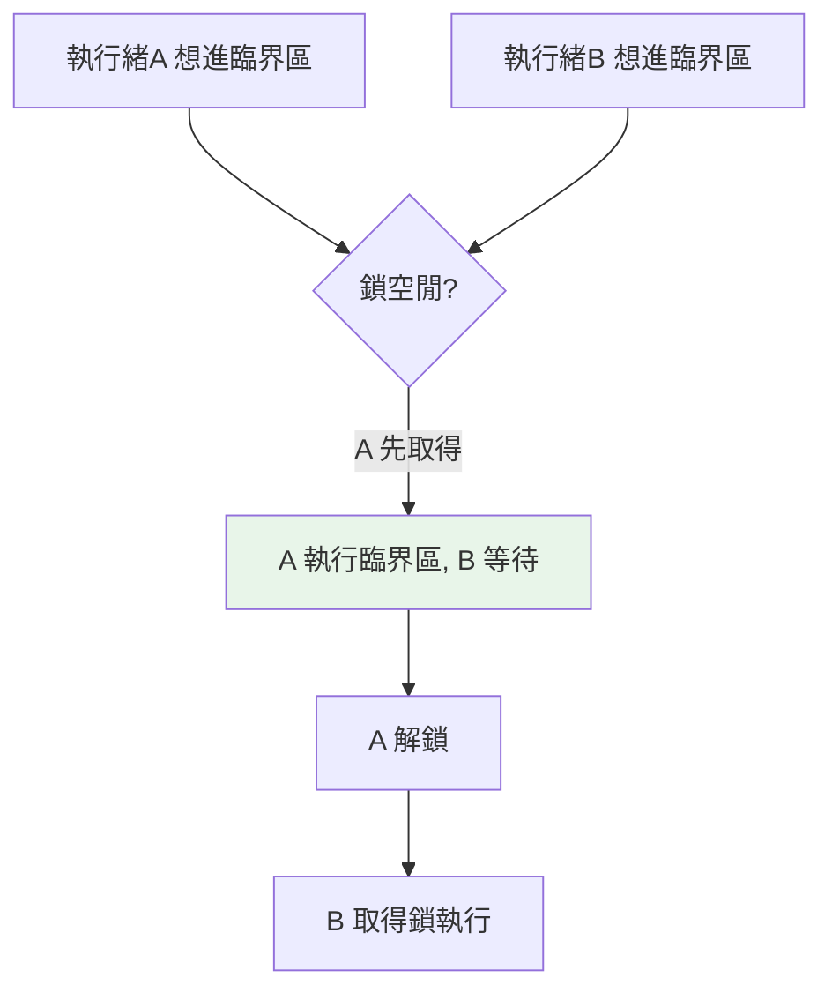

# 執行緒同步 Lock / Event / Queue

> 多執行緒共享資料就需要同步：`Lock` 保護臨界區、`Event` 傳訊號、`Queue` 提供執行緒安全的資料交換。用對它們能消除競態；但最好的做法往往是「用 Queue 避免共享可變狀態」。

## Why（為什麼）

上一章看到競態條件——多執行緒同時改共享資料會出錯。**同步機制**是解法：`Lock`（互斥鎖）確保「一次只有一個執行緒進入臨界區」、`Event` 讓執行緒互相通知、`Queue` 提供執行緒安全的生產者-消費者管道。但同步也帶來新風險（死鎖）。這章講清楚何時用哪個，以及一個重要原則：**與其小心地共享+加鎖，不如用 Queue 讓執行緒間「傳遞」資料而非「共享」**。

## Theory（理論：三種同步原語）

| 工具 | 用途 | 一句話 |
|------|------|--------|
| **`Lock`** | 互斥：保護臨界區（一次一個執行緒） | 上鎖才能進、用完解鎖 |
| **`RLock`** | 可重入鎖：同一執行緒可重複取得 | 遞迴/巢狀加鎖用 |
| **`Event`** | 執行緒間傳訊號（等待/通知） | 一個 set、其他 wait |
| **`Condition`** | 複雜的等待條件 | wait/notify 特定條件 |
| **`Semaphore`** | 限制同時存取的數量 | 最多 N 個一起進 |
| **`Queue`** | 執行緒安全的資料交換 | 生產者放、消費者取 |

核心觀念：**共享可變狀態需要保護**。`Lock` 是最基本的保護；`Queue` 則透過「傳遞而非共享」從根本降低問題。

## Specification（規範：各工具語法）

```python
import threading
import queue

# Lock：保護臨界區
lock = threading.Lock()
with lock:                    # 進入臨界區（自動解鎖，即使出錯）
    shared_data += 1

# Event：訊號
event = threading.Event()
event.wait()                  # 阻塞直到被 set
event.set()                   # 通知（喚醒所有 wait）
event.clear()                 # 重置

# Semaphore：限制並發數
sem = threading.Semaphore(3)  # 最多 3 個同時
with sem:
    access_resource()

# Queue：執行緒安全佇列
q = queue.Queue()
q.put(item)                   # 放入
item = q.get()                # 取出（阻塞直到有）
q.task_done()                 # 標記處理完
q.join()                      # 等所有項目處理完
```

## Implementation（Lock 修正競態、Queue 生產者消費者、死鎖）

### `Lock`：修正計數器競態

用鎖保護 `counter += 1` 這個臨界區，確保「讀-改-寫」不被打斷：

```python
import threading

counter = 0
lock = threading.Lock()

def increment():
    global counter
    for _ in range(100_000):
        with lock:            # 一次只有一個執行緒能進
            counter += 1      # 現在是安全的

threads = [threading.Thread(target=increment) for _ in range(2)]
for t in threads: t.start()
for t in threads: t.join()
print(counter)                # 正確：200000
```

`with lock:` 進入時上鎖、離開時解鎖（即使出錯，因為是 context manager）。臨界區內一次只有一個執行緒，競態消失。**但鎖有代價**：序列化了臨界區（降低並發）、且用不好會死鎖。臨界區要盡量小。

### `Queue`：生產者-消費者（避免共享狀態的正解）

`queue.Queue` 是**執行緒安全**的——多個執行緒可安全地 put/get，**不必自己加鎖**。這是「傳遞而非共享」的體現，也是多執行緒協作的推薦模式：

```python
import queue
import threading

def producer(q: queue.Queue) -> None:
    for i in range(5):
        q.put(i)              # 執行緒安全，不必加鎖
    q.put(None)               # 哨兵：通知消費者結束

def consumer(q: queue.Queue) -> None:
    while True:
        item = q.get()        # 阻塞直到有項目
        if item is None:      # 收到哨兵
            break
        print(f"處理 {item}")
        q.task_done()

q: queue.Queue = queue.Queue()
threading.Thread(target=producer, args=(q,)).start()
threading.Thread(target=consumer, args=(q,)).start()
```

`Queue` 內部已處理好所有鎖——生產者放、消費者取，資料透過佇列**傳遞**而非**共享變數**，從根本避免競態。這是多執行緒工作分派的標準做法（工作池、任務佇列）。

### `Event`：執行緒間通知

`Event` 讓一個執行緒「發訊號」、其他執行緒「等訊號」：

```python
import threading

ready = threading.Event()

def waiter():
    print("等待訊號...")
    ready.wait()              # 阻塞直到 set
    print("收到訊號，開始工作")

def signaler():
    time.sleep(1)
    ready.set()               # 發訊號，喚醒所有 waiter

threading.Thread(target=waiter).start()
threading.Thread(target=signaler).start()
```

用於「等某個條件就緒才開始」「優雅停止」（設一個 stop event，執行緒定期檢查）等。

### 死鎖（deadlock）：同步的風險

用鎖不當會**死鎖**——兩個執行緒各持一把鎖、又都在等對方的鎖，永遠卡住：

```python
# ❌ 死鎖：執行緒A 持 lock1 等 lock2，執行緒B 持 lock2 等 lock1
def task_a():
    with lock1:
        with lock2: ...       # 等 lock2（被 B 持有）

def task_b():
    with lock2:
        with lock1: ...       # 等 lock1（被 A 持有）→ 互相等 → 死鎖
```

**避免死鎖**：所有執行緒**以相同順序**取得多把鎖、盡量減少同時持有的鎖數、用 `Lock.acquire(timeout=...)` 設逾時、或根本**避免多把鎖**（用 Queue 等更高階的結構）。

## Code Example（可執行的 Python 範例）

```python
# thread_sync_demo.py
from __future__ import annotations

import queue
import threading


def unsafe_counter() -> int:
    """無鎖：可能因競態丟失計數。"""
    counter = 0

    def increment() -> None:
        nonlocal counter
        for _ in range(100_000):
            counter += 1

    threads = [threading.Thread(target=increment) for _ in range(4)]
    for t in threads:
        t.start()
    for t in threads:
        t.join()
    return counter


def safe_counter() -> int:
    """有鎖：正確。"""
    counter = 0
    lock = threading.Lock()

    def increment() -> None:
        nonlocal counter
        for _ in range(100_000):
            with lock:
                counter += 1

    threads = [threading.Thread(target=increment) for _ in range(4)]
    for t in threads:
        t.start()
    for t in threads:
        t.join()
    return counter


def producer_consumer() -> list[int]:
    """用 Queue 做生產者-消費者（傳遞而非共享）。"""
    q: queue.Queue[int | None] = queue.Queue()
    processed: list[int] = []

    def producer() -> None:
        for i in range(10):
            q.put(i)
        q.put(None)  # 哨兵

    def consumer() -> None:
        while True:
            item = q.get()
            if item is None:
                break
            processed.append(item * 2)

    p = threading.Thread(target=producer)
    c = threading.Thread(target=consumer)
    p.start()
    c.start()
    p.join()
    c.join()
    return processed


def demo() -> None:
    # 安全的計數器（正確）
    print(f"有鎖計數器: {safe_counter()}")  # 400000

    # Queue 生產者-消費者
    print(f"生產者-消費者: {producer_consumer()}")


if __name__ == "__main__":
    demo()
```

**預期輸出**：

```pycon
$ python thread_sync_demo.py
有鎖計數器: 400000
生產者-消費者: [0, 2, 4, 6, 8, 10, 12, 14, 16, 18]
```

## Diagram（圖解：Lock 保護臨界區）



## Best Practice（最佳實踐）

- **優先用 `queue.Queue` 讓執行緒間「傳遞」資料**，而非共享變數 + 手動加鎖——執行緒安全、更難出錯。
- **必須共享可變狀態時用 `Lock` 保護臨界區**，並讓臨界區**盡量小**（減少序列化）。
- **用 `with lock:`**（context manager）確保解鎖，即使出錯（別手動 acquire/release）。
- **避免死鎖**：多把鎖以固定順序取得、減少同時持鎖、用 `timeout`、或用高階結構避免多鎖。
- **`Event` 用於通知/優雅停止**（stop event 模式）；`Semaphore` 限制並發資源數。
- **能不共享就不共享**：把工作切成獨立單位、用 Queue 分派，是最省心的並發設計。

## Common Mistakes（常見誤解）

- **共享可變狀態卻不保護**：競態，結果錯誤且難重現。
- **死鎖**：多執行緒以不同順序取多把鎖、互相等待。
- **臨界區太大**：把不必保護的程式也放進鎖裡，扼殺並發。
- **手動 acquire/release 忘了 release**（尤其出錯時）：鎖永遠不放 → 卡死；用 `with lock:`。
- **自己用 Lock 重造 Queue**：`queue.Queue` 已執行緒安全，別重造輪子。
- **以為 Event 是「一次性」**：set 後要 clear 才能重用；且 set 會喚醒**所有** waiter。
- **忘了 Queue 消費者的結束條件**：用哨兵（`None`）或 `task_done`/`join` 協調。

## Interview Notes（面試重點）

- 知道各同步原語用途：**`Lock`（互斥保護臨界區）、`Event`（訊號通知）、`Semaphore`（限制並發數）、`Queue`（執行緒安全交換）**。
- **能用 `Lock` 修正競態**（保護 `counter += 1`），並知道臨界區要小、用 `with lock:`。
- **核心觀念**：優先用 **`queue.Queue`「傳遞而非共享」** 避免競態，是多執行緒協作的推薦模式（生產者-消費者）。
- **死鎖是高頻考點**：能說出成因（多鎖 + 不同取得順序 + 互相等待）與避免法（固定順序、timeout、減少鎖）。
- 知道 `Event` 的 set/wait/clear 語意與「優雅停止」模式。

---

➡️ 下一章：[multiprocessing 多行程](05-multiprocessing.md)

[⬆️ 回 Part 9 索引](README.md)
