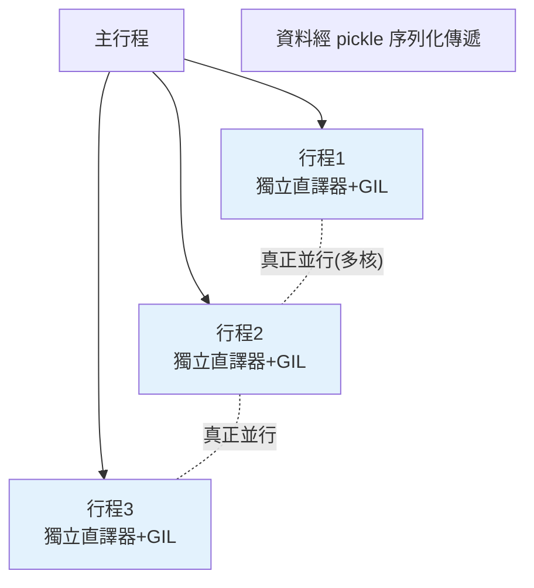

# multiprocessing 多行程

> `multiprocessing` 用「多個行程」繞過 GIL——每個行程有獨立的直譯器與記憶體，能在多核心上**真正並行**。這是 Python 加速 CPU 密集任務的正解，代價是行程間資料要序列化傳遞。

## Why（為什麼）

CPU 密集任務（數值計算、影像處理、加密）用 threading 無效——GIL 讓執行緒無法並行運算（見 [GIL](02-gil.md)）。**multiprocessing** 是解法：它啟動**多個獨立行程**，每個有自己的 Python 直譯器與 GIL，所以能在多核心上真正同時計算。理解它的機制（獨立記憶體、資料要序列化、行程開銷）與陷阱（`if __name__ == "__main__"`、不能傳 lambda），才能正確地為 CPU 密集任務榨出多核心的效能。

## Theory（理論：行程 vs 執行緒）

**行程（process）** 與**執行緒（thread）** 的根本差異：

| | 執行緒（threading） | 行程（multiprocessing） |
|--|---------------------|-------------------------|
| 記憶體 | **共享** | **獨立**（各自一份） |
| GIL | 共用一個（無法並行 CPU） | **各自一個（能並行）** |
| 建立成本 | 輕 | 重（要複製/啟動直譯器） |
| 資料交換 | 直接共享 | **要序列化（pickle）傳遞** |
| 適合 | I/O 密集 | **CPU 密集** |

關鍵：行程**獨立記憶體 + 獨立 GIL** → 能真正並行，但**資料無法直接共享**，要透過 pickle 序列化來回傳（有開銷）。所以 multiprocessing 適合「計算重、資料傳遞相對少」的 CPU 密集任務。

## Specification（規範：multiprocessing 用法）

```python
from multiprocessing import Process, Pool, Queue

# 方式一：Process（類似 threading.Thread）
def worker(n):
    print(f"處理 {n}")

if __name__ == "__main__":        # ⚠️ 必須！見下
    p = Process(target=worker, args=(5,))
    p.start()
    p.join()

# 方式二：Pool（行程池，最常用）
if __name__ == "__main__":
    with Pool(processes=4) as pool:
        results = pool.map(cpu_task, [1, 2, 3, 4])    # 平行處理

# 行程間通訊
q = Queue()                       # 行程安全佇列（透過 pickle）
# 或用 Pipe、共享記憶體 Value/Array
```

## Implementation（真並行、__main__ 陷阱、pickle 限制、開銷）

### 真正並行：CPU 密集加速

```python
from multiprocessing import Pool
import time

def cpu_task(n: int) -> int:
    return sum(i * i for i in range(n))

if __name__ == "__main__":
    data = [10_000_000] * 4

    # 序列
    start = time.perf_counter()
    [cpu_task(n) for n in data]
    print(f"序列: {time.perf_counter()-start:.2f}s")

    # 多行程（4 核心真正並行）
    start = time.perf_counter()
    with Pool(4) as pool:
        pool.map(cpu_task, data)
    print(f"多行程: {time.perf_counter()-start:.2f}s")   # 約 1/4 時間（多核）
```

在 4 核心機器上，4 個 CPU 任務多行程約是序列的 **1/4 時間**（真正並行）——這是 threading 做不到的。`Pool.map(func, iterable)` 把工作分給行程池平行處理，回傳結果列表。

### 🔴 `if __name__ == "__main__":` 是必須的

**在 Windows / macOS（spawn 啟動方式），主程式碼必須包在 `if __name__ == "__main__":` 裡**，否則會**無限遞迴建立子行程**（每個子行程 import 主模組又建立子行程…）：

```python
# ❌ 沒有 __main__ 保護 → 子行程 import 時又執行建立行程 → 無限遞迴/崩潰
from multiprocessing import Pool
with Pool(4) as pool:             # 危險！
    pool.map(task, data)

# ✅ 包在 __main__ 裡
if __name__ == "__main__":
    with Pool(4) as pool:
        pool.map(task, data)
```

原因：子行程用 **spawn**（重新啟動直譯器並 import 主模組，見 [__main__](../01-getting-started/03-repl-and-first-program.md)）取得程式碼。`if __name__ == "__main__":` 讓「建立行程」的程式碼只在主行程執行、不在被 import 的子行程執行。這是 multiprocessing **最經典的陷阱**。

### pickle 限制：不能傳 lambda / 巢狀函式

行程間傳資料要 **pickle 序列化**（見 [pickle](../11-stdlib/12-pickle.md)）。有些東西不能 pickle：

```python
# ❌ lambda 不能 pickle
with Pool() as pool:
    pool.map(lambda x: x * 2, data)     # PicklingError!

# ✅ 用具名的模組層級函式
def double(x): return x * 2
with Pool() as pool:
    pool.map(double, data)
```

傳給行程的**函式與引數都必須可 pickle**：模組層級的具名函式可以，lambda、巢狀函式、某些物件不行。這也是 [partial](../08-functional-decorators/06-partial.md) 勝過 lambda 的場景（partial 可 pickle）。

### 行程間共享資料

行程不共享記憶體，需要明確的通訊機制：

- **`Pool.map` 的回傳值**：最簡單——工作分出去、結果收回來。
- **`Queue` / `Pipe`**：行程安全的訊息傳遞。
- **`Value` / `Array`**：共享記憶體（少量簡單資料）。
- **`Manager`**：代理的共享物件（dict、list），較慢但方便。

原則：**盡量用「純函式 + map 收結果」的模式**，避免複雜的行程間共享狀態。

### 開銷：不是萬靈丹

multiprocessing 有成本：**啟動行程慢、資料序列化有開銷**。所以：

- 任務太小（計算輕）→ 序列化與行程開銷可能**超過**並行的好處，反而更慢。
- 資料量大（要傳大物件）→ pickle 開銷可能吃掉並行收益。

只有「計算夠重、資料傳遞相對少」的 CPU 密集任務才划算。輕量任務或 I/O 密集別用它。

## Code Example（可執行的 Python 範例）

```python
# multiprocessing_demo.py
from __future__ import annotations

import time
from multiprocessing import Pool


def cpu_task(n: int) -> int:
    """CPU 密集：純計算。必須是模組層級函式（可 pickle）。"""
    return sum(i * i for i in range(n))


def run_serial(data: list[int]) -> tuple[float, list[int]]:
    start = time.perf_counter()
    results = [cpu_task(n) for n in data]
    return time.perf_counter() - start, results


def run_parallel(data: list[int], workers: int) -> tuple[float, list[int]]:
    start = time.perf_counter()
    with Pool(workers) as pool:
        results = pool.map(cpu_task, data)
    return time.perf_counter() - start, results


def demo() -> None:
    data = [2_000_000] * 4

    serial_time, serial_result = run_serial(data)
    print(f"序列: {serial_time:.2f}s")

    parallel_time, parallel_result = run_parallel(data, workers=4)
    print(f"多行程(4): {parallel_time:.2f}s")

    # 結果一致，但多行程用了多核心
    print(f"結果一致: {serial_result == parallel_result}")


if __name__ == "__main__":  # ⚠️ multiprocessing 必須的保護
    demo()
```

**預期輸出**（加速比依核心數而異）：

```pycon
$ python multiprocessing_demo.py
序列: 0.XXs
多行程(4): 0.YYs   （多核時 YY 明顯小於 XX）
結果一致: True
```

## Diagram（圖解：多行程繞過 GIL）



## Best Practice（最佳實踐）

- **CPU 密集任務用 multiprocessing**（真正並行繞過 GIL）；I/O 密集用 threading/asyncio。
- **實務上優先用 `concurrent.futures.ProcessPoolExecutor`**（見 [concurrent.futures](06-concurrent-futures.md)）——比手動 Process/Pool 更統一、易取結果與例外。
- **一律加 `if __name__ == "__main__":`** 保護建立行程的程式碼（Windows/macOS 必須）。
- **傳給行程的函式與引數要可 pickle**：用模組層級具名函式，別用 lambda/巢狀函式；固定參數用 `partial`。
- **用「純函式 + map 收結果」模式**，避免複雜的行程間共享狀態。
- **權衡開銷**：任務要夠重、資料傳遞要少，才划算；輕量/大資料任務可能更慢。
- **CPU 密集也考慮向量化（numpy）**：常比 multiprocessing 更簡單快速（見 [Part 17](../17-data-science/README.md)）。

## Common Mistakes（常見誤解）

- **忘了 `if __name__ == "__main__":`**：Windows/macOS 下無限遞迴建立子行程 → 崩潰。最經典的陷阱。
- **傳 lambda / 巢狀函式給 Pool**：`PicklingError`；用模組層級具名函式或 partial。
- **對 I/O 密集用 multiprocessing**：行程開銷大、沒必要（I/O 用 threading/asyncio 更輕）。
- **對輕量任務用 multiprocessing**：序列化 + 行程開銷 > 並行收益，反而更慢。
- **以為行程間能直接共享變數**：獨立記憶體，要透過 Queue/Value/Manager 明確通訊。
- **傳大量資料進行程**：pickle 開銷吃掉並行收益。
- **忘了 join / 用 with 管理 Pool**：資源未正確釋放。

## Interview Notes（面試重點）

- **能對比行程 vs 執行緒**：行程**獨立記憶體 + 獨立 GIL → 真正並行**（適合 CPU 密集），但資料要 **pickle 序列化**傳遞、建立成本高。
- 知道 **CPU 密集用 multiprocessing 繞過 GIL**，是 threading 對 CPU 無效的解法。
- **`if __name__ == "__main__":` 是必考陷阱**：能解釋為何 Windows/macOS（spawn）需要它（避免子行程遞迴建立行程）。
- 知道 **不能傳 lambda（pickle 限制）**，要用模組層級函式或 partial。
- 知道 multiprocessing **有開銷**（序列化、行程建立），只對「計算重、資料少」划算。
- 知道實務優先用 **ProcessPoolExecutor**，且 CPU 密集也可考慮向量化。

---

➡️ 下一章：[concurrent.futures](06-concurrent-futures.md)

[⬆️ 回 Part 9 索引](README.md)
