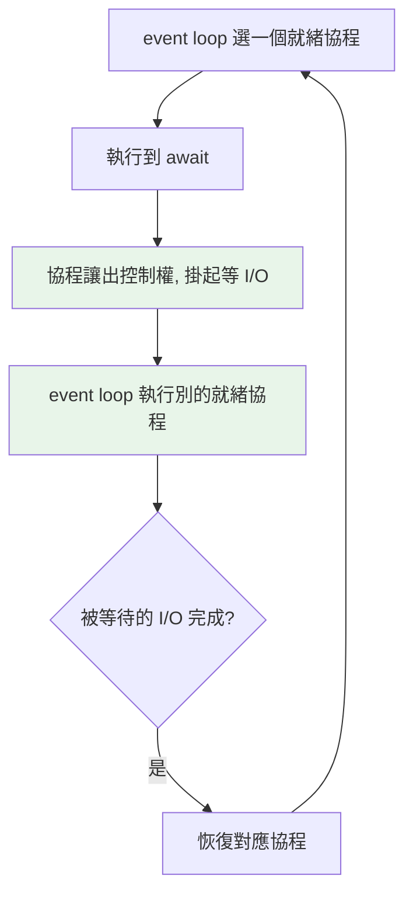

# asyncio 基礎與 event loop

> asyncio 用「單執行緒 + 事件迴圈 + 協作式多工」處理大量並發 I/O——沒有執行緒切換開銷、沒有競態鎖。它的核心是 event loop：一個不斷「執行就緒的協程、等 I/O 的就掛起」的排程器。

## 💡 白話導讀（建議先讀）

threading 是多請店員。asyncio 反其道而行：**只用一位服務生——但他絕不站著空等**。

看這位服務生（**event loop**）的巡場邏輯：

1. 幫 A 桌點完餐、單子送進廚房——**他不站在廚房口等菜**（不阻塞）。
2. 「等菜」的空檔,馬上去 B 桌點餐、C 桌上水。
3. A 桌的菜好了（I/O 完成）,他繞回來上菜,從剛才中斷的地方繼續服務 A。

一個人,同時照看 50 桌——因為**服務的大部分時間其實在「等」**（等廚房=等網路/磁碟）,而他把所有等待重疊了。

程式對應：每一桌的服務流程是一個**協程**;`await` 就是服務生說「**這裡要等,我先去忙別桌**」的那個瞬間。

和 threading 的本質差異——**誰決定切換**：

- threading 是**搶佔式**:作業系統隨時可能把店員拉去做別的事（你無法預測）。
- asyncio 是**協作式**:服務生**只在 await 點主動讓位**——切換點你自己寫的,完全可預測。

這帶來一個巨大紅利：**單人做事,永遠不會「兩件事同時發生」→ 幾乎不需要鎖**——threading 的競態惡夢在這裡基本不存在。

代價也先講:整場只有一個人——**只要他在任何一處站住不動（阻塞）,全餐廳停擺**（[第 11 章](11-blocking-in-async.md)的頭號地雷）。
定位:**大量並發 I/O**（數百至數千連線）的首選——現代 Python Web 後端的心臟。

## 🔗 前端對照

如果你懂 JavaScript 的 event loop,`asyncio` 會非常親切——**兩者是同一個模型**:單執行緒,靠一個事件迴圈
在「等 I/O」時去做別的事（就是比喻表裡那個「單人服務生」）。差別在幾個關鍵細節:

| | Python `asyncio` | JavaScript |
|---|------------------|-----------|
| event loop | **要自己啟動**（`asyncio.run(main())`） | **永遠內建在跑**,不用啟動 |
| 非同步的值 | coroutine——**不 `await` 就完全不執行** | Promise——**建立當下就開始執行** |
| 還有別的併發選項嗎 | 有:threading / multiprocessing（真並行） | 沒有:只有 async（Web Worker 是獨立執行緒） |

一句話:**event loop 的直覺整套搬得過來**,但記住兩個差異:Python 的 loop 要你手動開,
而且 coroutine「你不 `await` 它就不動」（JS 的 Promise 一建立就跑了）。

## Why（為什麼）

當你要同時處理**成千上萬**的網路連線（Web 伺服器、爬蟲、聊天服務），threading 會遇到瓶頸——每個執行緒有記憶體與切換開銷，開幾千個執行緒不切實際。**asyncio** 用完全不同的模型：**單一執行緒**內用**事件迴圈**排程大量協程，每個協程「等 I/O 時主動讓出」，讓一個執行緒就能處理海量並發連線。理解 event loop 與「協作式多工」是理解 asyncio 的關鍵，也是現代 Python I/O 密集服務（FastAPI 等）的基礎。

## Theory（理論：事件迴圈與協作式多工）

asyncio 的核心是 **event loop（事件迴圈）**——那位單人服務生，在**單一執行緒**內運行的排程器。工作循環：

1. 執行一個協程，直到它遇到 `await`（等待某個 I/O）。
2. 該協程**主動讓出控制權**（「這裡要等，我先去忙別桌」），event loop 去執行**別的就緒的**協程。
3. 被等待的 I/O 完成後，event loop 恢復對應的協程（繞回來上菜）。

這叫**協作式多工（cooperative multitasking）**——與 threading 的「搶佔式（OS 隨時切換）」不同，切換只發生在 `await` 點、由協程**主動**讓出。

三種模型對比：

| | threading | multiprocessing | asyncio |
|--|-----------|-----------------|---------|
| 切換 | 搶佔式（OS 決定） | 各自獨立 | **協作式（await 點）** |
| 執行單位 | 多執行緒 | 多行程 | **單執行緒** |
| 競態/鎖 | 需要 | 少 | **幾乎不需要**（單人做事） |
| 適合 | I/O（中量） | CPU | **I/O（大量連線）** |

單執行緒 + 只在 await 切換 → **幾乎不需要鎖**（沒有兩個協程「同時」執行的問題）——消除了 threading 的一大類競態 bug。

## Specification（規範：基本語法）

```python
import asyncio

# 協程函式：用 async def 定義
async def hello() -> str:
    await asyncio.sleep(1)        # 非阻塞等待（讓出控制權）
    return "hello"

# 執行協程：asyncio.run（程式進入點）
asyncio.run(hello())             # 啟動 event loop、跑協程、關閉

# 並發多個協程
async def main():
    results = await asyncio.gather(hello(), hello(), hello())   # 並發
    return results
asyncio.run(main())
```

## Implementation（協程、await、run、gather、非阻塞）

### 協程函式與協程物件

```python
import asyncio

async def greet(name: str) -> str:      # async def → 協程函式
    await asyncio.sleep(0.5)            # await 讓出控制權
    return f"Hi {name}"

coro = greet("Alice")       # 呼叫 async 函式 → 得到「協程物件」，還沒執行！
# 協程物件要被 await 或交給 event loop 才會執行
```

關鍵：**呼叫 `async def` 函式不會執行它**，只回傳一個**協程物件**（像生成器，見 [生成器協程](../07-iterators-generators/08-generator-as-coroutine.md)）——它要被 `await` 或交給 event loop 才真正跑。這是新手常見困惑。

### `asyncio.run`：程式進入點

`asyncio.run(coro)` 是啟動 asyncio 程式的標準方式——它建立 event loop、執行協程直到完成、然後關閉 loop：

```python
async def main() -> None:
    print(await greet("World"))

asyncio.run(main())         # 一個程式通常只呼叫一次 run
```

**`asyncio.run` 應在程式最外層呼叫一次**（不要在已運行的 loop 裡再呼叫）。

### `await`：非阻塞地等待

`await` 用於「等一個非同步操作完成」——但關鍵是**它不阻塞整個執行緒，而是讓出控制權**給 event loop 去跑別的協程：

```python
async def task(name: str, delay: float) -> str:
    print(f"{name} 開始")
    await asyncio.sleep(delay)    # 等待期間，event loop 去跑別的協程
    print(f"{name} 完成")
    return name
```

`asyncio.sleep` 是「非阻塞的睡眠」——和 `time.sleep`（阻塞整個執行緒）完全不同。await 一個 async 操作時，其他協程能趁機執行。

### `gather`：並發執行多個協程

`asyncio.gather` 讓多個協程**並發**執行（不是序列）：

```python
async def main():
    # 序列：一個接一個 → 總時間相加
    # await task("A", 1)
    # await task("B", 1)      # 這樣是序列，共 2 秒！

    # 並發：同時進行 → 總時間 = 最長的那個
    results = await asyncio.gather(
        task("A", 1),
        task("B", 1),
        task("C", 1),
    )
    return results            # 三個並發，約 1 秒（不是 3 秒）
```

⚠️ **注意：`await task_a(); await task_b()` 是「序列」不是並發**（第二個要等第一個完成）。要並發必須用 `gather`（或 Task，見 [Task](09-asyncio-tasks.md)）把它們「一起丟出去」。這是 asyncio 最常見的誤用。

### 非阻塞是全有全無的：一個阻塞毀掉一切

因為單執行緒，**任何一個協程裡的阻塞操作（`time.sleep`、同步 I/O、重 CPU 運算）會卡住整個 event loop**——所有協程都動不了：

```python
async def bad():
    time.sleep(1)             # ❌ 阻塞整個 event loop！其他協程全卡住
    # 應該用 await asyncio.sleep(1)
```

asyncio 生態要求「一路 async 到底」——用 async 版的函式庫（`aiohttp` 而非 `requests`、`asyncpg` 而非同步 DB 驅動）。阻塞操作要丟到執行緒池（見 [to_thread](11-blocking-in-async.md)）。

## Code Example（可執行的 Python 範例）

```python
# asyncio_basics_demo.py
from __future__ import annotations

import asyncio
import time


async def fetch(name: str, delay: float) -> str:
    """模擬非同步 I/O。"""
    await asyncio.sleep(delay)  # 非阻塞等待
    return f"{name}（{delay}s）"


async def sequential() -> tuple[float, list[str]]:
    """序列：一個接一個（await 逐個）。"""
    start = time.perf_counter()
    results = [
        await fetch("A", 0.3),
        await fetch("B", 0.3),
        await fetch("C", 0.3),
    ]
    return time.perf_counter() - start, results


async def concurrent() -> tuple[float, list[str]]:
    """並發：用 gather 一起執行。"""
    start = time.perf_counter()
    results = await asyncio.gather(
        fetch("A", 0.3),
        fetch("B", 0.3),
        fetch("C", 0.3),
    )
    return time.perf_counter() - start, results


async def main() -> None:
    seq_time, seq_result = await sequential()
    print(f"序列: {seq_time:.2f}s → {seq_result}")

    conc_time, conc_result = await concurrent()
    print(f"並發: {conc_time:.2f}s → {conc_result}")


if __name__ == "__main__":
    asyncio.run(main())  # event loop 進入點
```

**預期輸出**：

```pycon
$ python asyncio_basics_demo.py
序列: 0.90s → ['A（0.3s）', 'B（0.3s）', 'C（0.3s）']
並發: 0.30s → ['A（0.3s）', 'B（0.3s）', 'C（0.3s）']
```

序列版每個 `await` 逐個等（0.9s），並發版 `gather` 讓三個同時進行（0.3s）——這就是 asyncio 的價值。

## Diagram（圖解：event loop 排程）



## Best Practice（最佳實踐）

- **大量 I/O 並發（數千連線）用 asyncio**：單執行緒 + 事件迴圈，無執行緒開銷、幾乎無競態。
- **用 `asyncio.run(main())` 當進入點**，一個程式呼叫一次。
- **要並發必須用 `gather`/Task**：`await a(); await b()` 是序列！（見 [Task](09-asyncio-tasks.md)）。
- **一路 async 到底**：用 async 函式庫（`aiohttp`/`httpx`/`asyncpg`），`await asyncio.sleep` 而非 `time.sleep`。
- **絕不在協程裡做阻塞操作**：阻塞會卡住整個 event loop；阻塞/CPU 工作丟到執行緒/行程池（見 [to_thread](11-blocking-in-async.md)）。
- **理解協作式多工**：切換只在 await 點，所以幾乎不需要鎖，但也代表「不讓出就不切換」。

## Common Mistakes（常見誤解）

- **`await a(); await b()` 以為是並發**：它是**序列**（b 等 a 完成）；並發要 `gather`/Task。
- **在協程裡用 `time.sleep` / 同步 I/O / 重 CPU**：阻塞整個 event loop，所有協程卡住。
- **呼叫 async 函式卻沒 await**：只得到協程物件、不執行，還可能有「coroutine was never awaited」警告。
- **在已運行的 event loop 裡呼叫 `asyncio.run`**：會報錯；`run` 只在最外層一次。
- **以為 asyncio 能加速 CPU 密集**：不行——單執行緒，CPU 重活會卡住 loop；CPU 用 multiprocessing。
- **混用 async 與阻塞函式庫**：`requests`（阻塞）毀掉 async；要用 `aiohttp`/`httpx`。

## Interview Notes（面試重點）

- **能描述 event loop 與協作式多工**：單執行緒排程器，協程在 **await 點主動讓出**，event loop 去跑別的就緒協程——與 threading 的搶佔式不同。
- 知道 **asyncio 適合大量 I/O 並發**（單執行緒、無執行緒開銷、幾乎無競態/鎖）。
- **關鍵考點**：**`await a(); await b()` 是序列，並發要 `gather`/Task**。
- 知道**呼叫 async 函式回傳協程物件（不執行），要 await 或交給 loop**；`asyncio.run` 是進入點。
- **知道「一個阻塞操作卡住整個 event loop」**，要一路 async 到底、阻塞工作丟執行緒池。
- 知道 asyncio 不適合 CPU 密集（單執行緒）。

---

➡️ 下一章：[async / await 協程](08-async-await.md)

[⬆️ 回 Part 9 索引](README.md)
