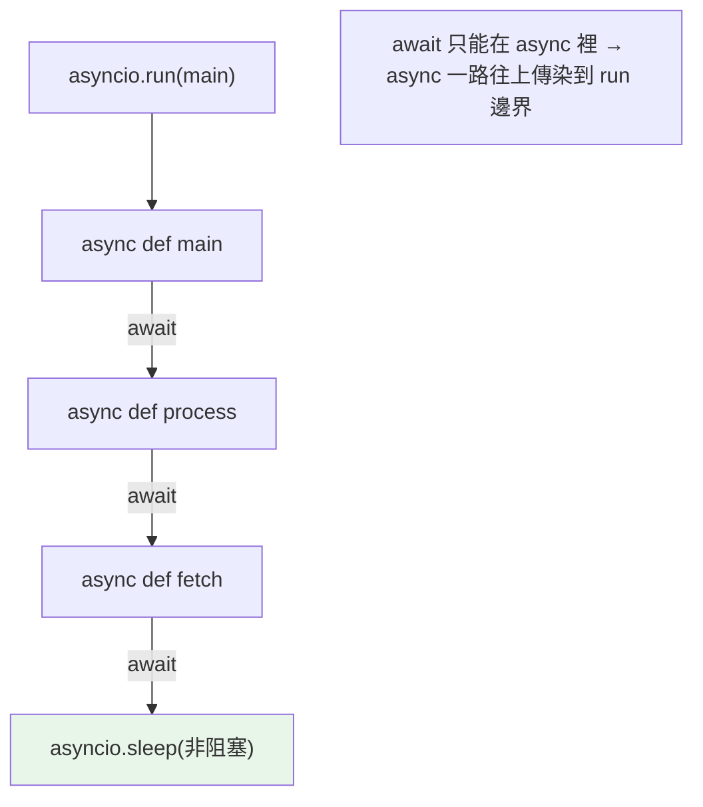

# async / await 協程

> `async def` 定義協程、`await` 等待另一個協程或 awaitable。這兩個關鍵字是 asyncio 的語法核心——搞懂「await 只能在 async 裡、await 誰、什麼是 awaitable」，就掌握了非同步程式的骨架。

## 💡 白話導讀（建議先讀）

asyncio 的兩個關鍵字,各一句話：

**`async def`＝把函式標記成「可暫停的服務流程」（協程函式）。**

一個大坑立刻要拆：**呼叫協程函式,不會執行它**——

```python
async def serve(): ...

serve()          # ⚠️ 什麼都沒發生!只是拿到一張「服務流程單」(協程物件)
await serve()    # ✓ 這才是「開始執行,做完為止」
```

（似曾相識?[生成器](../07-iterators-generators/03-generator.md)也是「呼叫不執行,只是請到說書人」——不是巧合,協程正是從生成器演化來的。）

**`await`＝「等這件事完成——等的期間,讓位」。**

兩層意思缺一不可：拿到結果之後才繼續往下（像同步呼叫一樣好讀）;但**等待期間控制權交還給服務生**,他能去忙別桌。

兩條語法鐵律,背起來省很多錯：

1. **`await` 只能寫在 `async def` 裡**（普通函式裡用=語法錯誤）。
2. **能被 await 的東西叫 awaitable**,就三種:協程、Task（[下一章](09-asyncio-tasks.md)）、Future。
   ——`await time.sleep(1)` 錯（那不是 awaitable）,`await asyncio.sleep(1)` 對。

最後,整個程式的入口:`asyncio.run(main())`——「開店,讓服務生開始巡場,從 main 這桌服務起」。

## Why（為什麼）

上一章講了 event loop 的概念，這章聚焦 `async`/`await` 這兩個關鍵字的**語法規則與語意**。新手最卡的問題：`await` 能放哪裡？await 誰？為什麼有些函式要 `await` 有些不用？「coroutine was never awaited」是什麼警告？把這些規則講清楚，你才能正確地組織非同步程式碼，避免最常見的 async 錯誤。

## Theory（理論：協程與 awaitable）

兩個關鍵字：

- **`async def`**：定義**協程函式（coroutine function）**——可暫停的服務流程。
  呼叫它回傳**協程物件（coroutine object）**——一張「還沒開始執行」的流程單（呼叫≠執行，同生成器）。
- **`await`**：**只能用在 `async def` 裡**。「等待一個 awaitable 完成並取得結果」——同時**讓出控制權**給 event loop（等的期間服務生去忙別桌）。

**awaitable（可等待物件）**——能被 await 的東西，三種：

1. **協程（coroutine）**：`async def` 呼叫的結果。
2. **Task**：包裝協程、排入 event loop 的物件（見 [Task](09-asyncio-tasks.md)）。
3. **Future**：低階的「未來結果」物件。

日常你 await 的多半是協程或 Task。

## Specification（規範：規則）

```python
import asyncio

# async def 定義協程
async def fetch(url: str) -> str:
    await asyncio.sleep(1)        # await 另一個 awaitable
    return "content"

# await 只能在 async 函式內
async def main():
    result = await fetch("x")    # ✅ 在 async 裡 await
    return result

# ❌ 在普通函式裡 await → SyntaxError
def sync_func():
    result = await fetch("x")    # SyntaxError!

# 呼叫協程函式 → 協程物件（未執行）
coro = fetch("x")                # 沒執行！要 await 或交給 loop
```

## Implementation（await 規則、never awaited、傳播、async 生態）

### `await` 只能在 `async def` 裡

這是硬性語法規則——`await` 出現在非 async 函式裡是 **SyntaxError**：

```python
# ❌ 普通函式不能 await
def process():
    data = await fetch()      # SyntaxError: 'await' outside async function

# ✅ 必須是 async 函式
async def process():
    data = await fetch()      # OK
```

這帶來「**async 會傳染**」的現象——一個函式要 await，它就得是 async；呼叫它的函式要 await 它，也得是 async……一路往上，直到 `asyncio.run` 這個邊界。這叫「函式染色（function coloring）」，是 async 的特性。

### 「coroutine was never awaited」警告

呼叫 `async def` 函式**只建立協程物件、不執行**——若忘了 await 它，會得到警告且程式沒做你以為的事：

```python
async def task():
    print("執行了")
    return 42

async def main():
    task()             # ❌ 只建立協程物件，沒執行！
    # RuntimeWarning: coroutine 'task' was never awaited

    result = await task()   # ✅ await 才執行
```

看到 **"coroutine was never awaited"** 就是忘了 await。這是 async 最常見的 bug——「明明呼叫了函式，怎麼沒執行」。

### await 會傳播結果與例外

`await coro` 會：等協程完成、取得它的回傳值、若它拋例外則在 await 處重新拋出：

```python
async def risky() -> int:
    raise ValueError("boom")

async def main():
    try:
        result = await risky()     # 例外在這裡拋出
    except ValueError as e:
        print(f"捕捉: {e}")
```

例外傳播和一般函式一樣自然——`await` 讓非同步程式碼讀起來像同步程式碼（這是 async/await 語法的設計目標）。

### async 版的常用操作

因為「一路 async 到底」，很多同步操作有 async 對應版：

```python
# 睡眠
await asyncio.sleep(1)              # 非阻塞（不是 time.sleep）

# HTTP（用 async 函式庫）
async with aiohttp.ClientSession() as session:
    async with session.get(url) as resp:
        data = await resp.text()

# 資料庫（asyncpg 等）
rows = await conn.fetch("SELECT ...")
```

用 async 版函式庫（`aiohttp`/`httpx`/`asyncpg`/`aiofiles`）才能真正非阻塞；用同步版（`requests`、同步 DB）會卡住 event loop（見 [asyncio 基礎](07-asyncio-basics.md)）。

### `async with` 與 `async for`（預告）

context manager 與迭代也有 async 版（見 [asyncio 進階](10-asyncio-advanced.md)）：

```python
async with resource as r:      # async context manager（__aenter__/__aexit__）
    ...
async for item in async_iterable:   # async iterator（__anext__）
    ...
```

用於非同步的資源管理與串流。

## Code Example（可執行的 Python 範例）

```python
# async_await_demo.py
from __future__ import annotations

import asyncio


async def fetch_data(source: str, delay: float) -> dict[str, str]:
    """模擬非同步資料抓取。"""
    await asyncio.sleep(delay)
    return {"source": source, "data": f"{source} 的資料"}


async def process_source(source: str) -> str:
    """await 另一個協程，傳播結果。"""
    result = await fetch_data(source, 0.2)
    return f"處理完成: {result['data']}"


async def with_error() -> str:
    """示範例外透過 await 傳播。"""
    await asyncio.sleep(0.1)
    raise ValueError("來源不可用")


async def main() -> None:
    # 1. await 協程取得結果
    print(await process_source("API"))

    # 2. 例外透過 await 傳播
    try:
        await with_error()
    except ValueError as e:
        print(f"捕捉到: {e}")

    # 3. 忘了 await 的後果（示範用，實務別這樣）
    coro = fetch_data("X", 0.1)  # 只建立協程物件
    print(f"未 await 的協程物件: {type(coro).__name__}")
    await coro  # 補上 await 才執行（也避免 never-awaited 警告）


if __name__ == "__main__":
    asyncio.run(main())
```

**預期輸出**：

```pycon
$ python async_await_demo.py
處理完成: API 的資料
捕捉到: 來源不可用
未 await 的協程物件: coroutine
```

## Diagram（圖解：async 傳染與 await）



## Best Practice（最佳實踐）

- **`await` 只在 `async def` 裡用**；記住 async 會「傳染」到呼叫鏈，邊界是 `asyncio.run`。
- **呼叫協程一定要 await（或交給 Task/gather）**：否則不執行，且有 "never awaited" 警告。
- **用 async 版函式庫**（`aiohttp`/`httpx`/`asyncpg`/`aiofiles`）+ `asyncio.sleep`，一路非阻塞。
- **例外處理和同步一樣用 try/except**（await 會重拋協程的例外）——這是 async/await 讓非同步讀起來像同步的好處。
- **非同步資源用 `async with`、非同步串流用 `async for`**（見 [asyncio 進階](10-asyncio-advanced.md)）。
- **型別註記**：協程函式回傳 `-> ResultType`（不是 `Coroutine[...]`，那是內部型別）。

## Common Mistakes（常見誤解）

- **在普通函式裡 `await`**：SyntaxError；await 只能在 async 函式。
- **呼叫協程忘了 await**："coroutine was never awaited"，函式沒執行——最常見的 async bug。
- **用同步阻塞函式庫**（`requests`、`time.sleep`）：卡住 event loop（見 [asyncio 基礎](07-asyncio-basics.md)）。
- **以為 async 函式呼叫就會執行**：它回傳協程物件，要 await 才跑。
- **忘了 async 的傳染性**：一個深處的 await 要求整條呼叫鏈都是 async。
- **在同步程式中直接呼叫 async 函式並用結果**：拿到協程物件不是結果；要 `asyncio.run` 或在 async context 裡 await。

## Interview Notes（面試重點）

- 說得出 **`async def`（定義協程函式，呼叫回傳協程物件、不執行）** 與 **`await`（只能在 async 裡、等待 awaitable 並讓出控制權）** 的語意。
- 知道 **awaitable** 三種：協程、Task、Future。
- **知道 "coroutine was never awaited" 的原因**（呼叫協程忘了 await）。
- 能說明 **async 的「傳染性/函式染色」**：await 要求函式是 async，一路傳到 `asyncio.run` 邊界。
- 知道 **例外透過 await 自然傳播**（try/except 照常用），以及要用 async 版函式庫。
- 知道 `async with`/`async for` 的存在（非同步資源/串流）。

---

➡️ 下一章：[Task、Future 與併發控制](09-asyncio-tasks.md)

[⬆️ 回 Part 9 索引](README.md)
