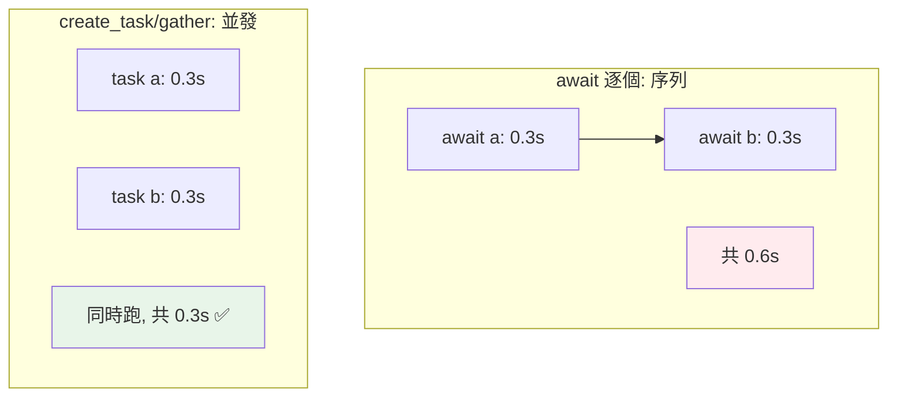

# Task、Future 與併發控制

> `await coro` 是序列的；要真正並發，得把協程包成 **Task** 排入 event loop。`gather`、`wait_for`（逾時）、`Task.cancel`（取消）是控制多個並發協程的核心工具。

## Why（為什麼）

上一章強調「`await a(); await b()` 是序列」。那怎麼讓多個協程**真正並發**？答案是 **Task**——把協程「排程」到 event loop，讓它們同時進行。加上併發控制工具（`gather` 收集結果、`wait_for` 設逾時、`cancel` 取消、`Semaphore` 限流），你才能寫出實用的非同步程式：並發抓取、逾時保護、優雅取消。這是 asyncio 從「會用」到「用好」的關鍵。

## Theory（理論：Task vs 協程）

- **協程物件**：`async def` 呼叫的結果，「還沒排程」——直到你 await 它（序列）或包成 Task。
- **Task**：把協程「**排入 event loop、立刻開始並發執行**」的包裝。`asyncio.create_task(coro)` 建立並排程一個 Task——它馬上開始跑（在下一個 await 點），不必等你 await 它。

關鍵差異：`await coro` 是「現在就等它完成」（序列）；`create_task(coro)` 是「排程它、讓它在背景跑」（並發），之後再 await Task 取結果。

**Future** 是更低階的「未來結果」物件；Task 是 Future 的子類。日常用 Task/gather，很少直接碰 Future。

## Specification（規範：Task 與控制工具）

```python
import asyncio

# create_task：排程協程，立刻並發執行
async def main():
    task1 = asyncio.create_task(fetch("a"))   # 開始並發
    task2 = asyncio.create_task(fetch("b"))
    result1 = await task1                      # 取結果
    result2 = await task2

# gather：並發執行多個，收集所有結果（依輸入序）
results = await asyncio.gather(fetch("a"), fetch("b"), fetch("c"))
results = await asyncio.gather(*coros, return_exceptions=True)   # 例外當結果

# wait_for：加逾時
result = await asyncio.wait_for(slow_task(), timeout=5.0)   # 超時 raise TimeoutError

# 取消
task = asyncio.create_task(long_task())
task.cancel()                              # 請求取消 → 協程收到 CancelledError

# Semaphore：限制並發數
sem = asyncio.Semaphore(10)
async with sem:
    await do_request()
```

## Implementation（create_task 並發、gather、逾時、取消、限流）

### `create_task`：讓協程並發

```python
import asyncio

async def fetch(name, delay):
    await asyncio.sleep(delay)
    return name

async def main():
    # ❌ 序列：await 逐個，共 0.6 秒
    # a = await fetch("A", 0.3)
    # b = await fetch("B", 0.3)

    # ✅ 並發：create_task 讓兩個同時跑，共 0.3 秒
    task_a = asyncio.create_task(fetch("A", 0.3))
    task_b = asyncio.create_task(fetch("B", 0.3))
    a = await task_a       # 此時 B 也在跑
    b = await task_b
```

`create_task` 一呼叫就把協程排入 loop——`task_a`、`task_b` 都在背景並發跑，`await task_a` 時 `task_b` 也在進行。

### `gather`：並發收集結果

`gather` 是「並發執行多個協程 + 等全部完成 + 收集結果」的便捷方式（它內部會把協程包成 Task）：

```python
async def main():
    results = await asyncio.gather(
        fetch("A", 0.3), fetch("B", 0.2), fetch("C", 0.1)
    )
    # results = ['A', 'B', 'C']（依輸入順序，不是完成順序），約 0.3 秒
```

**例外處理**：預設 `gather` 中任一協程拋例外，會立刻傳播（其他仍在跑）。`gather(..., return_exceptions=True)` 讓例外**當作結果回傳**（不中斷其他）：

```python
results = await asyncio.gather(*tasks, return_exceptions=True)
for r in results:
    if isinstance(r, Exception):
        print(f"失敗: {r}")
    else:
        print(f"成功: {r}")
```

（3.11+ 更推薦用 `TaskGroup`，見 [asyncio 進階](10-asyncio-advanced.md)。）

### `wait_for`：逾時保護

`asyncio.wait_for(coro, timeout)` 給協程設逾時，超時拋 `TimeoutError` 並取消該協程：

```python
try:
    result = await asyncio.wait_for(slow_fetch(), timeout=2.0)
except asyncio.TimeoutError:
    print("逾時！")
```

網路請求、外部呼叫都該設逾時，避免無限等待。

### 取消（cancellation）

Task 可以被取消——`task.cancel()` 會在協程的下一個 await 點拋入 `asyncio.CancelledError`：

```python
async def main():
    task = asyncio.create_task(long_running())
    await asyncio.sleep(1)
    task.cancel()                       # 請求取消
    try:
        await task                       # 等取消完成
    except asyncio.CancelledError:
        print("已取消")
```

協程可捕捉 `CancelledError` 做清理（但通常應重新拋出，別吞掉取消）。取消是 asyncio 優雅停止的機制。

### `Semaphore`：限制並發數

同時開太多請求會壓垮伺服器或耗盡資源。`asyncio.Semaphore(n)` 限制「最多 n 個並發」：

```python
async def fetch_limited(url, sem):
    async with sem:                     # 最多 n 個同時進入
        return await fetch(url)

async def main():
    sem = asyncio.Semaphore(10)          # 最多 10 個並發請求
    urls = [...]                          # 上千個 URL
    results = await asyncio.gather(*(fetch_limited(u, sem) for u in urls))
```

即使有上千個 URL，Semaphore 確保同時只有 10 個在跑——這是大量並發時的必要限流。

## Code Example（可執行的 Python 範例）

```python
# asyncio_tasks_demo.py
from __future__ import annotations

import asyncio


async def fetch(name: str, delay: float) -> str:
    await asyncio.sleep(delay)
    return f"{name}（{delay}s）"


async def fetch_limited(name: str, delay: float, sem: asyncio.Semaphore) -> str:
    async with sem:  # 限制並發
        return await fetch(name, delay)


async def main() -> None:
    # 1. create_task 並發
    task_a = asyncio.create_task(fetch("A", 0.3))
    task_b = asyncio.create_task(fetch("B", 0.3))
    print(f"create_task: {await task_a}, {await task_b}")  # 約 0.3s 完成

    # 2. gather 收集結果
    results = await asyncio.gather(fetch("X", 0.2), fetch("Y", 0.1))
    print(f"gather: {results}")

    # 3. gather + return_exceptions
    async def failing() -> str:
        raise ValueError("失敗了")

    mixed = await asyncio.gather(fetch("Z", 0.1), failing(), return_exceptions=True)
    print(f"含例外: {[str(r) if isinstance(r, Exception) else r for r in mixed]}")

    # 4. wait_for 逾時
    try:
        await asyncio.wait_for(fetch("slow", 1.0), timeout=0.2)
    except asyncio.TimeoutError:
        print("逾時保護生效")

    # 5. Semaphore 限流
    sem = asyncio.Semaphore(2)  # 最多 2 個並發
    limited = await asyncio.gather(*(fetch_limited(f"T{i}", 0.1, sem) for i in range(5)))
    print(f"限流結果: {len(limited)} 個完成")


if __name__ == "__main__":
    asyncio.run(main())
```

**預期輸出**：

```pycon
$ python asyncio_tasks_demo.py
create_task: A（0.3s）, B（0.3s）
gather: ['X（0.2s）', 'Y（0.1s）']
含例外: ['Z（0.1s）', '失敗了']
逾時保護生效
限流結果: 5 個完成
```

## Diagram（圖解：序列 vs Task 並發）



## Best Practice（最佳實踐）

- **要並發用 `create_task` 或 `gather`**，別 `await a(); await b()`（序列）。
- **收集多個結果用 `gather`**（依輸入序）；需要更好的錯誤處理/結構化用 **`TaskGroup`（3.11+）**（見 [asyncio 進階](10-asyncio-advanced.md)）。
- **外部呼叫一定設逾時**：`asyncio.wait_for(coro, timeout)`，避免無限等待。
- **大量並發用 `Semaphore` 限流**：避免壓垮伺服器/耗盡資源（如「最多 N 個並發連線」）。
- **需要例外不中斷其他用 `gather(..., return_exceptions=True)`**。
- **支援取消**：長任務要能回應 `CancelledError`（清理後重拋，別吞掉）。
- **保留 Task 參考**：`create_task` 的 Task 若沒被參考可能被 GC 回收；存起來或用 gather/TaskGroup。

## Common Mistakes（常見誤解）

- **`await a(); await b()` 以為並發**：序列！用 create_task/gather。
- **不設逾時**：外部呼叫掛住 → 整個協程/請求卡死。
- **大量並發不限流**：同時開幾千連線壓垮對方或自己；用 Semaphore。
- **吞掉 `CancelledError`**：破壞取消機制；捕捉後應清理並重拋。
- **`create_task` 的 Task 沒保留參考**：可能被 GC，任務「消失」；存 list 或用 gather/TaskGroup。
- **`gather` 一個失敗全炸卻沒預期**：預設任一例外會傳播；需要容錯用 `return_exceptions=True`。
- **在 gather 裡混入阻塞操作**：卡住 event loop（見 [to_thread](11-blocking-in-async.md)）。

## Interview Notes（面試重點）

- **能區分 `await coro`（序列）vs `create_task`/`gather`（並發）**——這是 asyncio 併發的核心。
- 知道 **`gather`** 收集結果（依輸入序）、`return_exceptions=True` 讓例外當結果不中斷其他。
- 知道 **`wait_for`（逾時）、`Task.cancel()`（取消，拋 `CancelledError`）、`Semaphore`（限流）** 的用途。
- 知道 **Task 是排程的協程、立刻並發**；Future 是低階未來物件（Task 是其子類）。
- 知道**取消要清理後重拋、Task 要保留參考、外部呼叫要設逾時、大量並發要限流**。
- 知道 3.11+ 更推薦 **TaskGroup**（連結 [asyncio 進階](10-asyncio-advanced.md)）。

---

➡️ 下一章：[asyncio 進階：TaskGroup、async with / async for](10-asyncio-advanced.md)

[⬆️ 回 Part 9 索引](README.md)
