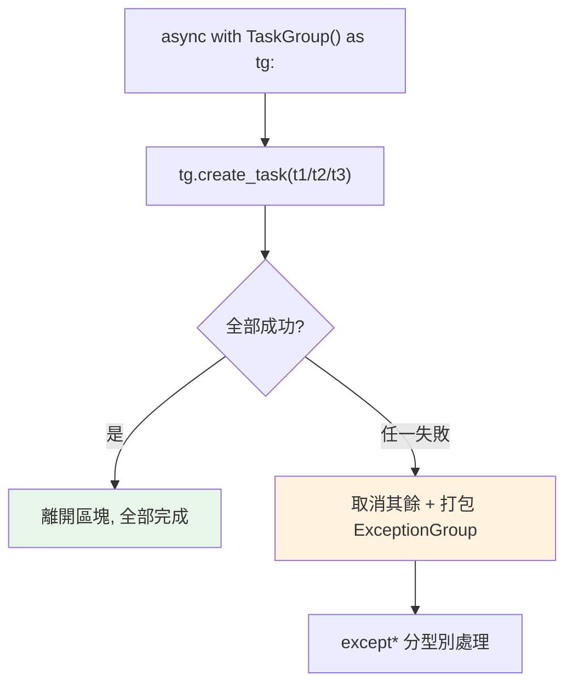

# asyncio 進階：TaskGroup、async with / async for

> Python 3.11 的 `TaskGroup` 帶來「結構化並發」——一組任務要嘛全部成功、要嘛一起取消，錯誤自動打包成 ExceptionGroup。加上 `async with`、`async for`，你能寫出更安全、更清楚的非同步程式。

## 💡 白話導讀（建議先讀）

`gather` 開了很多並發任務之後,新問題浮現:**誰對這群任務的「善後」負責?**

一個任務失敗了,其他還在跑——它們變成**沒人管的散客**:結果沒人收、錯誤可能被吞、資源掛著不放。

Python 3.11 的 **`TaskGroup`** 用「**旅行團**」模式解決——結構化並發：

```python
async def main() -> None:
    async with asyncio.TaskGroup() as tg:      # 旅行團集合
        tg.create_task(fetch(u1))               # 團員一
        tg.create_task(fetch(u2))               # 團員二
    # 離開這個區塊 = 全員到齊才出發回家 —— 保證沒有失蹤人口
```

旅行團的三條團規：

1. **出入有邊界**：離開 `async with` 區塊時,**所有任務保證已完成或已取消**——不存在「還在外面飄的任務」。
2. **一人出事,全團帶回**：任一任務拋例外 → **其餘任務自動取消**——不會有「隊友失敗了我還在傻跑」。
3. **事故打包成報告**：多個錯誤裝進 [ExceptionGroup](../06-error-handling/11-exception-groups.md),用 `except*` 分科處理——正好是 Part 6 那個「整箱上報」的主場。

「結構化並發」的精神跟 `with` 管檔案一模一樣：**併發任務的生命週期,應該被程式碼的區塊結構框住**——看縮排就知道任務活到哪。

實務建議:**3.11+ 的新程式碼,預設用 TaskGroup 取代 gather**——gather 留給「簡單、不在乎精細錯誤處理」的場合。

## Why（為什麼）

`gather` 有幾個痛點：一個任務失敗時其他不會自動取消（除非設定）、錯誤處理笨拙、任務生命週期不明確。Python **3.11 的 `TaskGroup`（PEP 654 相關）** 引入**結構化並發（structured concurrency）**——把一組任務的生命週期綁在一個明確的區塊裡，全部完成才離開、任一失敗則全體取消。加上非同步的 context manager（`async with`）與迭代（`async for`），這章補齊現代 asyncio 的進階工具，讓非同步程式更健壯。

## Theory（理論：結構化並發）

**結構化並發**的核心理念：

> **並發任務的生命週期應該有明確的邊界**——就像 `with` 區塊保證資源釋放，`TaskGroup` 保證「離開區塊時，所有任務都已完成或取消」。（旅行團：出入有邊界，沒有失蹤人口。）

`asyncio.TaskGroup`（3.11+）的三條規則：

- 在 `async with asyncio.TaskGroup() as tg:` 區塊內用 `tg.create_task()` 建任務。
- **離開區塊時，等待所有任務完成**。
- **任一任務失敗 → 其餘任務自動取消**，錯誤打包成 `ExceptionGroup`（見 [ExceptionGroup](../06-error-handling/11-exception-groups.md)），用 `except*` 處理。

這比 `gather` 更安全——沒有「一個失敗了但其他還在跑」的懸空任務，錯誤也不會遺漏。

## Specification（規範：TaskGroup、async with/for）

```text
import asyncio

# TaskGroup（3.11+）：結構化並發
async def main():
    async with asyncio.TaskGroup() as tg:
        tg.create_task(fetch("a"))
        tg.create_task(fetch("b"))
    # 離開區塊時，所有任務已完成；任一失敗則全體取消 + ExceptionGroup

# 處理群組錯誤用 except*
try:
    async with asyncio.TaskGroup() as tg:
        tg.create_task(may_fail_1())
        tg.create_task(may_fail_2())
except* ValueError as eg:
    ...     # 處理所有 ValueError

# async with：非同步 context manager（__aenter__/__aexit__）
async with aiohttp.ClientSession() as session:
    ...

# async for：非同步迭代（__anext__）
async for item in async_generator():
    ...
```

## Implementation（TaskGroup、async context manager、async generator）

### `TaskGroup`：取代 gather 的結構化做法

```python
import asyncio

async def fetch(name, delay):
    await asyncio.sleep(delay)
    return name

async def main():
    results = []
    async with asyncio.TaskGroup() as tg:
        t1 = tg.create_task(fetch("A", 0.3))
        t2 = tg.create_task(fetch("B", 0.2))
        t3 = tg.create_task(fetch("C", 0.1))
    # 離開 async with → 所有任務保證完成
    results = [t1.result(), t2.result(), t3.result()]
    return results
```

對比 `gather`：TaskGroup 的任務生命週期綁在區塊內、離開時保證全部結束、任一失敗自動取消其餘——更安全。**3.11+ 優先用 TaskGroup 而非 gather**。

### TaskGroup 的錯誤處理：ExceptionGroup + except*

任一任務失敗時，TaskGroup 取消其餘任務，並把所有錯誤打包成 `ExceptionGroup`，用 `except*`（見 [ExceptionGroup](../06-error-handling/11-exception-groups.md)）分型別處理：

```python
async def main():
    try:
        async with asyncio.TaskGroup() as tg:
            tg.create_task(fails_with_value_error())
            tg.create_task(fails_with_type_error())
    except* ValueError as eg:
        print(f"值錯誤: {eg.exceptions}")
    except* TypeError as eg:
        print(f"型別錯誤: {eg.exceptions}")
```

這讓「多個並發任務同時失敗」的錯誤能被完整、分類地處理——`gather` 只給你第一個例外。

### `async with`：非同步資源管理

同步的 context manager 用 `__enter__`/`__exit__`；非同步版用 **`__aenter__`/`__aexit__`**，配 `async with`：

```python
class AsyncResource:
    async def __aenter__(self):
        await self.connect()          # 非同步取得資源
        return self
    async def __aexit__(self, *args):
        await self.close()            # 非同步釋放

async def main():
    async with AsyncResource() as r:   # 非同步取得/釋放
        await r.use()
```

用於非同步的連線、session、鎖（`aiohttp.ClientSession`、`asyncpg` 連線、`asyncio.Lock`）——取得/釋放本身是非同步的，所以需要 `async with`。用 `contextlib.asynccontextmanager` 可用 async generator 寫（類似 [contextlib](../06-error-handling/07-contextlib.md)）。

### `async for` 與 async generator

非同步迭代用 **`__anext__`**（回傳 awaitable），配 `async for`。**async generator**（`async def` + `yield`）是最簡單的寫法：

```python
async def fetch_pages(urls):
    for url in urls:
        page = await fetch(url)        # 每次非同步取得
        yield page                     # async generator

async def main():
    async for page in fetch_pages(urls):    # 非同步迭代
        process(page)
```

用於「逐一非同步產出」的串流——分頁 API、串流回應、非同步資料源。每次迭代可以 await（同步生成器做不到）。

### asyncio 同步原語（async 版的 Lock 等）

即使 asyncio 單執行緒幾乎不需鎖，某些情況（保護「跨多個 await 的原子操作」）仍需要——asyncio 提供 async 版的同步原語：

```python
async def main() -> None:
    lock = asyncio.Lock()
    async with lock:                    # async 版的鎖
        await modify_shared_state()

    sem = asyncio.Semaphore(10)         # 限流（見上一章）
    event = asyncio.Event()
```

注意：用 **`asyncio.Lock` 而非 `threading.Lock`**（後者會阻塞 event loop）。

## Code Example（可執行的 Python 範例）

```python
# asyncio_advanced_demo.py
from __future__ import annotations

import asyncio
from collections.abc import AsyncIterator


async def fetch(name: str, delay: float) -> str:
    await asyncio.sleep(delay)
    return f"{name}（{delay}s）"


async def fetch_stream(names: list[str]) -> AsyncIterator[str]:
    """async generator：逐一非同步產出。"""
    for name in names:
        await asyncio.sleep(0.1)
        yield f"串流: {name}"


async def taskgroup_demo() -> list[str]:
    """TaskGroup 結構化並發。"""
    async with asyncio.TaskGroup() as tg:
        t1 = tg.create_task(fetch("A", 0.3))
        t2 = tg.create_task(fetch("B", 0.2))
        t3 = tg.create_task(fetch("C", 0.1))
    return [t1.result(), t2.result(), t3.result()]


async def taskgroup_error_demo() -> str:
    """TaskGroup 錯誤 → ExceptionGroup + except*。"""

    async def ok() -> str:
        await asyncio.sleep(0.1)
        return "ok"

    async def fail() -> str:
        await asyncio.sleep(0.05)
        raise ValueError("任務失敗")

    # ⚠️ 注意：except* 區塊內「不能」有 return/break/continue（SyntaxError）——
    # 要回傳結果，先存進變數，離開 except* 後再 return。
    result = "無錯誤"
    try:
        async with asyncio.TaskGroup() as tg:
            tg.create_task(ok())
            tg.create_task(fail())
    except* ValueError as eg:
        result = f"捕捉到 {len(eg.exceptions)} 個 ValueError"
    return result


async def main() -> None:
    # 1. TaskGroup 並發
    print(f"TaskGroup: {await taskgroup_demo()}")

    # 2. TaskGroup 錯誤處理
    print(f"錯誤處理: {await taskgroup_error_demo()}")

    # 3. async for 串流
    async for item in fetch_stream(["x", "y", "z"]):
        print(f"  {item}")


if __name__ == "__main__":
    asyncio.run(main())
```

**預期輸出**（需 Python 3.11+）：

```pycon
$ python asyncio_advanced_demo.py
TaskGroup: ['A（0.3s）', 'B（0.2s）', 'C（0.1s）']
錯誤處理: 捕捉到 1 個 ValueError
  串流: x
  串流: y
  串流: z
```

## Diagram（圖解：TaskGroup 結構化並發）



## Best Practice（最佳實踐）

- **3.11+ 優先用 `TaskGroup` 而非 `gather`**：結構化並發、自動取消、錯誤完整（ExceptionGroup）。
- **用 `except*` 處理 TaskGroup 的錯誤**（見 [ExceptionGroup](../06-error-handling/11-exception-groups.md)）。
- **非同步資源用 `async with`**（session、連線、`asyncio.Lock`），用 `contextlib.asynccontextmanager` 簡化。
- **非同步串流用 `async for` + async generator**（分頁、串流回應）。
- **用 `asyncio.Lock`/`Semaphore` 而非 threading 版**：後者會阻塞 event loop。
- **需相容 3.10 以前用 `gather`**；能用 3.11+ 就享受 TaskGroup 的好處。

## Common Mistakes（常見誤解）

- **在 3.10 以前用 `TaskGroup`/`except*`**：不存在/語法錯；用 gather 或升級。
- **用 `threading.Lock` 在協程裡**：阻塞 event loop；用 `asyncio.Lock`。
- **忘了 TaskGroup 任一失敗會取消其餘**：這是特性不是 bug（結構化並發），但要預期。
- **對 async generator 用普通 `for`**：要用 `async for`（它是 async iterator）。
- **對 async context manager 用普通 `with`**：要用 `async with`。
- **不用 except\* 處理 TaskGroup 錯誤**：拿到 ExceptionGroup 卻用普通 except，失去分型別能力。
- **以為 asyncio 完全不需要鎖**：跨多個 await 的「原子」操作仍可能需要 `asyncio.Lock`。

## Interview Notes（面試重點）

- 說得出 **`TaskGroup`（3.11+）= 結構化並發**：任務生命週期綁在區塊、離開時全部完成、**任一失敗自動取消其餘**、錯誤打包成 **ExceptionGroup**（用 `except*` 處理）——比 gather 安全。
- 知道 **`async with`（`__aenter__`/`__aexit__`）非同步資源管理**、**`async for`（`__anext__`）+ async generator 非同步串流**。
- 知道用 **`asyncio.Lock`/`Semaphore` 而非 threading 版**（後者阻塞 loop）。
- 能對比 **TaskGroup vs gather**（結構化/自動取消/完整錯誤 vs 較舊、需手動處理）。
- 知道這些多為 3.11+ 特性，相容舊版用 gather。

---

➡️ 下一章：[在 async 中跑阻塞工作：to_thread、run_in_executor](11-blocking-in-async.md)

[⬆️ 回 Part 9 索引](README.md)
