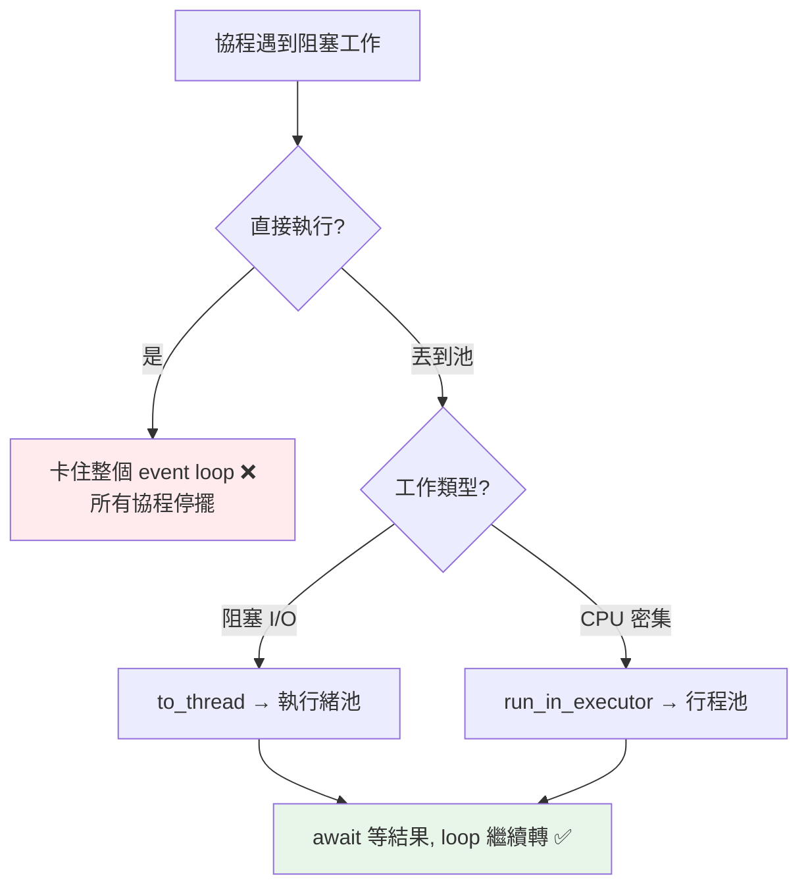

# 在 async 中跑阻塞工作：to_thread、run_in_executor

> asyncio 最大的地雷：一個阻塞操作卡住整個 event loop，所有協程都動不了。解法是把阻塞/CPU 工作丟到執行緒或行程池——`asyncio.to_thread` 是最簡單的方式。

## 💡 白話導讀（建議先讀）

asyncio 的頭號地雷,一個畫面就懂：

全餐廳只有一位服務生。他走到某一桌,**站在原地盯著爐子看了 5 秒**——

這 5 秒裡:沒人點餐、沒人上菜、沒人結帳。**全餐廳凍結。**

```python
async def bad():
    time.sleep(5)        # ❌ 服務生站住 5 秒 —— 整個 event loop 凍結
    requests.get(url)    # ❌ 同罪:同步 HTTP 也是站住不動
```

原因回到[第 7 章](07-asyncio-basics.md)的機制:asyncio 靠協程**在 await 點主動讓位**——阻塞呼叫**不讓位**,單執行緒裡沒有任何人能接手。
最陰的是:**程式不報錯**,只是所有並發默默失效——你以為在服務 50 桌,實際上一次只服務一桌。

守則與解法,三條：

1. **用 async 版的庫**:`asyncio.sleep` 不是 `time.sleep`、`httpx.AsyncClient` 不是 `requests`——讓每一次「等」都是 await。
2. **沒有 async 版的阻塞 I/O**（老的 DB 驅動、檔案操作）→ **外包給幫手**:
   `await asyncio.to_thread(blocking_func, args)`——丟給執行緒去顧爐子,服務生繼續巡場。
3. **CPU 密集的重活**（揉麵 10 秒）→ 執行緒幫不了（[刀](02-gil.md)還是一把）→ 外包給**分店**:`run_in_executor(ProcessPoolExecutor(), ...)`。

口訣:**async 世界裡,任何會「站住」的事,要嘛換 async 版,要嘛外包出去。**

## Why（為什麼）

asyncio 是**單執行緒**的（見 [asyncio 基礎](07-asyncio-basics.md)）。這意味著：**任何一個協程裡的阻塞操作——同步 I/O（`requests`、`open`）、`time.sleep`、重 CPU 運算——都會凍結整個 event loop**，讓所有其他協程停擺。但現實中你常需要用「只有同步版的函式庫」或做點 CPU 運算。解法是把這些阻塞工作**丟到另一個執行緒或行程**，讓 event loop 繼續轉。`asyncio.to_thread`（3.9+）與 `run_in_executor` 就是做這件事的橋樑。這是寫實用 asyncio 程式繞不開的一課。

## Theory（理論：為何阻塞會毀掉 event loop）

event loop 在單執行緒裡輪流跑協程，靠協程在 `await` 點**主動讓出**。若一個協程執行**阻塞操作**（站住不讓位）：

```python
async def bad():
    time.sleep(5)          # ❌ 阻塞 5 秒，event loop 完全凍結
    # 這期間其他所有協程都動不了！
```

整個 loop 卡 5 秒——沒有任何協程能推進，等於整個服務停擺（全餐廳凍結）。這是 asyncio 最嚴重的效能殺手，且**不會報錯**、只是並發默默失效。

**解法**：把阻塞工作**移出 event loop 執行緒**（外包）：

- **執行緒池**（`asyncio.to_thread` / `run_in_executor` + ThreadPoolExecutor）：適合**阻塞 I/O**（同步 HTTP、檔案、DB 驅動）——執行緒等 I/O 時釋放 GIL，event loop 繼續巡場。
- **行程池**（`run_in_executor` + ProcessPoolExecutor）：適合 **CPU 密集**——繞過 GIL 真正並行（外包給分店）。

event loop 用 `await` 等「外包出去的工作」完成，期間繼續跑別的協程——loop 不再被卡。

## Specification（規範：to_thread 與 run_in_executor）

```python
import asyncio
from concurrent.futures import ProcessPoolExecutor

async def main() -> None:
    # to_thread（3.9+，最簡單）：把阻塞函式丟到執行緒
    result = await asyncio.to_thread(blocking_func, arg1, arg2)

    # run_in_executor（較低階，可指定池）
    loop = asyncio.get_running_loop()
    result = await loop.run_in_executor(None, blocking_func, arg)   # None = 預設執行緒池

    # CPU 密集：用行程池
    with ProcessPoolExecutor() as pool:
        result = await loop.run_in_executor(pool, cpu_func, arg)
```

## Implementation（to_thread、run_in_executor、CPU vs I/O）

### `asyncio.to_thread`：最簡單的做法（阻塞 I/O）

`asyncio.to_thread(func, *args)`（3.9+）把阻塞函式丟到**執行緒池**執行，回傳一個可 await 的 awaitable：

```python
import asyncio
import time

def blocking_io(name: str) -> str:
    time.sleep(1)              # 同步阻塞（模擬同步 HTTP/檔案/DB）
    return f"{name} 完成"

async def main():
    # ❌ 直接呼叫：阻塞整個 loop
    # blocking_io("A")

    # ✅ 丟到執行緒：loop 不被卡，還能並發
    results = await asyncio.gather(
        asyncio.to_thread(blocking_io, "A"),
        asyncio.to_thread(blocking_io, "B"),
        asyncio.to_thread(blocking_io, "C"),
    )
    # 三個阻塞 I/O 在三個執行緒並發，約 1 秒（不是 3 秒）
```

`to_thread` 讓你能在 asyncio 程式裡**安全地使用只有同步版的函式庫**（`requests`、同步 DB 驅動、`Pillow` 等）——把它們丟到執行緒，event loop 照常運轉。這是最常用、最簡單的解法。

### `run_in_executor`：可指定池（含 CPU 密集）

`to_thread` 只用執行緒池。若要用**行程池**做 CPU 密集，用較低階的 `run_in_executor`：

```python
import asyncio
from concurrent.futures import ProcessPoolExecutor

def cpu_heavy(n: int) -> int:
    return sum(i * i for i in range(n))    # CPU 密集

async def main():
    loop = asyncio.get_running_loop()
    with ProcessPoolExecutor() as pool:
        # CPU 密集丟到行程池 → 繞過 GIL、真正並行、不卡 loop
        result = await loop.run_in_executor(pool, cpu_heavy, 10_000_000)
```

`run_in_executor(executor, func, *args)`：`executor=None` 用預設執行緒池（等同 to_thread）、傳 `ProcessPoolExecutor` 則用行程池（CPU 密集）。**注意行程池有 pickle 限制與 `__main__` 規則**（見 [multiprocessing](05-multiprocessing.md)）。

### 該用執行緒池還是行程池？

同樣的判斷：**阻塞 I/O → 執行緒池（to_thread）；CPU 密集 → 行程池（run_in_executor + ProcessPoolExecutor）**。

| 阻塞工作類型 | 用 | 原因 |
|--------------|-----|------|
| 同步 I/O（requests、檔案、DB） | `to_thread` / 執行緒池 | 等 I/O 時釋放 GIL，執行緒足矣 |
| CPU 密集（運算、影像） | `run_in_executor` + 行程池 | 繞過 GIL 才能真正並行 |

### 更好的選擇：一開始就用 async 函式庫

`to_thread` 是「橋接同步函式庫」的權宜之計。若有 async 原生版，**優先用它**（不需執行緒開銷）：

```python
async def main() -> None:
    # 權宜：用執行緒橋接同步的 requests
    data = await asyncio.to_thread(requests.get, url)

    # ✅ 更好：直接用 async 的 httpx/aiohttp
    async with httpx.AsyncClient() as client:
        resp = await client.get(url)
```

`to_thread` 用於「沒有 async 版可用」時；能一路 async 就一路 async（見 [async/await](08-async-await.md)）。

## Code Example（可執行的 Python 範例）

```python
# blocking_in_async_demo.py
from __future__ import annotations

import asyncio
import time


def blocking_io(name: str, duration: float) -> str:
    """同步阻塞函式（模擬只有同步版的函式庫）。"""
    time.sleep(duration)
    return f"{name} 完成（{duration}s）"


async def without_to_thread() -> tuple[float, list[str]]:
    """直接在協程裡呼叫阻塞函式 → 卡住 loop，變序列。"""
    start = time.perf_counter()
    results = [
        blocking_io("A", 0.2),  # 阻塞！
        blocking_io("B", 0.2),
        blocking_io("C", 0.2),
    ]
    return time.perf_counter() - start, results


async def with_to_thread() -> tuple[float, list[str]]:
    """用 to_thread 丟到執行緒 → loop 不卡，並發。"""
    start = time.perf_counter()
    results = await asyncio.gather(
        asyncio.to_thread(blocking_io, "A", 0.2),
        asyncio.to_thread(blocking_io, "B", 0.2),
        asyncio.to_thread(blocking_io, "C", 0.2),
    )
    return time.perf_counter() - start, results


async def main() -> None:
    bad_time, _ = await without_to_thread()
    print(f"直接呼叫（卡 loop）: {bad_time:.2f}s（序列，約 0.6s）")

    good_time, results = await with_to_thread()
    print(f"用 to_thread: {good_time:.2f}s（並發，約 0.2s）")
    print(f"結果: {results}")


if __name__ == "__main__":
    asyncio.run(main())
```

**預期輸出**：

```pycon
$ python blocking_in_async_demo.py
直接呼叫（卡 loop）: 0.60s（序列，約 0.6s）
用 to_thread: 0.20s（並發，約 0.2s）
結果: ['A 完成（0.2s）', 'B 完成（0.2s）', 'C 完成（0.2s）']
```

直接呼叫阻塞函式讓三個工作序列化（0.6s，且期間 loop 凍結）；`to_thread` 讓它們在執行緒並發（0.2s，loop 照常運轉）。

## Diagram（圖解：把阻塞工作外包）



## Best Practice（最佳實踐）

- **絕不在協程裡直接做阻塞操作**：同步 I/O、`time.sleep`、重 CPU 都會凍結 event loop。
- **阻塞 I/O 用 `asyncio.to_thread`**（3.9+，最簡單）把它丟到執行緒池。
- **CPU 密集用 `run_in_executor` + `ProcessPoolExecutor`**：繞過 GIL、不卡 loop。
- **優先用 async 原生函式庫**（`httpx`/`aiohttp`/`asyncpg`/`aiofiles`），`to_thread` 是沒有 async 版時的橋接。
- **配 `gather`/TaskGroup 讓多個外包工作並發**。
- **行程池遵守 multiprocessing 規則**：函式可 pickle、`__main__` 保護（見 [multiprocessing](05-multiprocessing.md)）。

## Common Mistakes（常見誤解）

- **在協程裡直接呼叫阻塞函式**（`requests.get`、`time.sleep`、同步 DB）：凍結整個 event loop，所有協程停擺——asyncio 頭號地雷。
- **用 `time.sleep` 而非 `asyncio.sleep`**：前者阻塞 loop；協程裡等待一律用 `asyncio.sleep`。
- **CPU 密集用 to_thread（執行緒池）**：GIL 讓它無法並行運算；CPU 要用行程池。
- **阻塞 I/O 用行程池**：浪費（行程開銷大）；用執行緒池就好。
- **明明有 async 版卻用 to_thread 橋接同步版**：徒增執行緒開銷；優先 async 原生。
- **行程池傳 lambda**：pickle 限制。

## Interview Notes（面試重點）

- **核心考點**：能說出「**asyncio 是單執行緒，一個阻塞操作凍結整個 event loop**」，以及解法——把阻塞工作丟到執行緒/行程池。
- 知道 **`asyncio.to_thread`（3.9+）** 把阻塞 I/O 丟到執行緒池（最簡單），**`run_in_executor` + ProcessPoolExecutor** 把 CPU 密集丟到行程池。
- **能對應：阻塞 I/O → 執行緒池；CPU 密集 → 行程池**（同 threading/multiprocessing 的判斷）。
- 知道**優先用 async 原生函式庫**，to_thread 是橋接同步函式庫的權宜之計。
- 知道協程裡等待用 `asyncio.sleep` 而非 `time.sleep`，行程池遵守 pickle/`__main__` 規則。

---

➡️ 下一章：[free-threaded Python 與 GIL 的未來](12-free-threaded-python.md)

[⬆️ 回 Part 9 索引](README.md)
