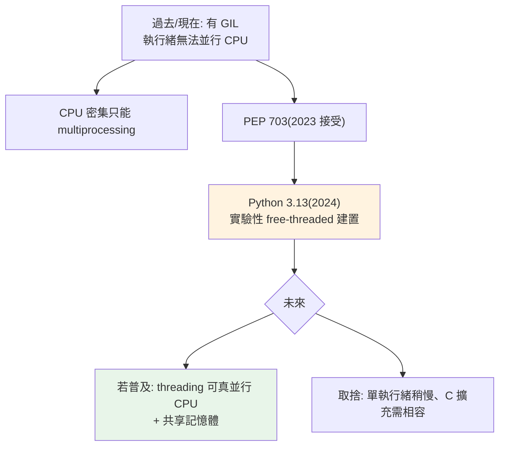

# free-threaded Python 與 GIL 的未來

> Python 3.13 帶來實驗性的「無 GIL」建置（PEP 703）——執行緒終於能並行執行 CPU 運算。這是 Python 並發史上最大的變革，但目前仍實驗性、有效能取捨。理解它，才知道未來的方向。

## 💡 白話導讀（建議先讀）

[第 2 章](02-gil.md)那把全廚房共用的菜刀（GIL），Python 3.13 開始有一個實驗性的答案：

> **拆掉那把刀——每位廚師發一把（free-threaded / 無 GIL 建置，PEP 703）。**

意義有多大？Python 併發的老難題一直是：

- 想真並行 CPU → 只能[開分店](05-multiprocessing.md)（multiprocessing）→ 忍受打包宅配（pickle）與開店成本。
- threading 共享記憶體很方便 → 但一把刀，CPU 並不了行。

無 GIL 版把兩個優點合體：**執行緒既能真正並行 CPU、又保有共享記憶體**——「同一間店、每人一把刀」。這是 Python 併發史上最大的變革。

但先冷靜，三個現實：

1. **它是「另一個建置」**,不是預設——要專門下載 free-threaded 版（3.13/3.14 仍屬實驗性）。
2. **拆刀不是免費的**:那把刀本來保護著庫存帳（引用計數）——拆掉後每筆帳都要自己上小鎖,**單執行緒反而變慢一些**;大量 C 擴充套件也要改寫才安全。
3. **競態全面回歸**:以前 GIL 順便擋掉的一些踩踏,現在要自己拿 [Lock](04-thread-sync.md) 防——自由的代價是自律。

現階段的正確姿勢:**知道它、關注它,生產環境先別賭它**——本章講清楚原理與取捨,讓你在它成熟時第一時間看懂。

## Why（為什麼）

整個 Part 9 圍繞一個限制：**GIL 讓 Python 執行緒無法並行 CPU 運算**（見 [GIL](02-gil.md)）。多年來，這逼得 CPU 密集任務只能用 multiprocessing（有序列化開銷）。**Python 3.13（PEP 703）** 首次提供**可選的「free-threaded」建置**——移除 GIL，讓執行緒能真正並行 CPU 運算。這可能改變 Python 並發的整個格局。雖然還在實驗階段，但作為「到 Senior」的工程師，你該理解它是什麼、現況如何、以及它對未來的意義。這也是近年最熱門的 Python 面試話題。

## Theory（理論：移除 GIL 的意義）

**free-threaded Python（無 GIL 建置）** 移除了全域直譯器鎖——每位廚師發一把刀：

- **執行緒能真正並行執行 Python bytecode**——多執行緒跑 CPU 密集任務終於能利用多核心，不必再開 multiprocessing。
- 保留 threading 的優勢：**共享記憶體**（不必像行程那樣 pickle 打包傳遞）。

這解決了 Python 併發最大的痛點：

> 以前「要真並行只能 multiprocessing（獨立記憶體、pickle 開銷）」；
> 未來「threading 就能真並行 + 共享記憶體」。

但移除 GIL 不是免費的——那把刀當初存在是有原因的（保護引用計數、單執行緒快、C 擴充好寫）。拆掉它需要對這些重新設計，且有取捨（單執行緒變慢、C 擴充要適配、競態需自防）——見下文。

## Specification（規範：現況）

- **PEP 703**：定義了「讓 GIL 可選」的方案，2023 年被接受。
- **Python 3.13（2024）**：首次提供 **實驗性的 free-threaded 建置**（需特別編譯，稱為 `python3.13t`）。標準建置**仍有 GIL**。
- **狀態**：**實驗性（experimental）**——不是預設、不保證穩定、效能仍在優化、C 擴充相容性仍在完善中。
- **未來**：分階段推進（實驗 → 支援 → 可能成為預設），但時程未定，可能數年。

**重點：截至目前（3.13），無 GIL 是「可選的實驗建置」，不是預設。** 大多數人用的 CPython 仍有 GIL。

## Implementation（效能取捨、C 擴充、對並發策略的影響）

### 效能取捨：單執行緒可能變慢

移除 GIL 需要用**更細粒度的鎖 / 不同的記憶體管理**（如偏向引用計數、無鎖資料結構）來保證執行緒安全。代價是：

- **單執行緒程式可能變慢**（早期版本約慢 10-40%，持續優化中）——因為原本 GIL 省下的「不必為每個物件操作加鎖」的成本回來了。
- 這正是歷史上多次「移除 GIL」嘗試失敗的原因（見 [GIL](02-gil.md)）——直到 PEP 703 用可接受的取捨才成功被接受。

所以 free-threaded 不是「純賺」——它用「單執行緒稍慢」換「多執行緒能並行」。對 CPU 密集多執行緒工作是大勝，對單執行緒程式是小虧。

### C 擴充相容性

大量 Python 生態靠 C 擴充（numpy、pandas…），這些擴充過去依賴 GIL 保證的執行緒安全。**free-threaded 建置需要 C 擴充明確支援**（標記為 free-threading 相容）——生態遷移需要時間。目前許多套件尚未完全支援 free-threaded 建置。

### 對並發策略的影響（若普及）

若 free-threaded 成為主流，Part 9 的建議會改變：

| 任務 | 現在（有 GIL） | 未來（無 GIL 若普及） |
|------|----------------|----------------------|
| CPU 密集 | multiprocessing | **threading 也可（真並行 + 共享記憶體）** |
| I/O 密集 | threading/asyncio | 不變 |

CPU 密集終於能用 threading（免去 multiprocessing 的序列化開銷）——這是最大的改變。但**現在還不是時候**：實驗性、效能未定、生態未齊。

### 現在該怎麼做

- **正式專案繼續用現有策略**（GIL 建置 + multiprocessing/asyncio/threading 的既有判斷）。
- **關注但別依賴**：free-threaded 仍實驗性，別在正式環境賭它。
- **理解它的意義**：作為知識與面試話題，知道 Python 並發正在演進。

## Code Example（觀念示意，可執行的檢查）

```python
# free_threaded_check_demo.py
from __future__ import annotations

import sys


def gil_status() -> str:
    """檢查目前 Python 是否為 free-threaded 建置。"""
    # 3.13+ 提供 sys._is_gil_enabled()（free-threaded 建置才有意義）
    is_gil_enabled = getattr(sys, "_is_gil_enabled", None)
    if is_gil_enabled is None:
        return "標準建置（有 GIL，無 free-threaded 支援）"
    return "GIL 啟用中" if is_gil_enabled() else "free-threaded（GIL 已停用）"


def demo() -> None:
    print(f"Python 版本: {sys.version.split()[0]}")
    print(f"GIL 狀態: {gil_status()}")
    print()
    print("並發策略速記：")
    print("  現在（有 GIL）：CPU 密集 → multiprocessing")
    print("  未來（無 GIL 若普及）：CPU 密集 → threading 也能真並行")
    print("  I/O 密集 → threading/asyncio（不受影響）")


if __name__ == "__main__":
    demo()
```

**預期輸出**（標準 3.12 建置）：

```pycon
$ python free_threaded_check_demo.py
Python 版本: 3.12.x
GIL 狀態: 標準建置（有 GIL，無 free-threaded 支援）

並發策略速記：
  現在（有 GIL）：CPU 密集 → multiprocessing
  未來（無 GIL 若普及）：CPU 密集 → threading 也能真並行
  I/O 密集 → threading/asyncio（不受影響）
```

## Diagram（圖解：GIL 的過去現在未來）



## Best Practice（最佳實踐）

- **正式專案繼續用既有並發策略**（GIL 建置 + I/O→threading/asyncio、CPU→multiprocessing）——free-threaded 仍實驗性。
- **關注 free-threaded 的進展**，但**別在正式環境依賴它**（穩定性、效能、C 擴充相容性未定）。
- **理解它的意義**：Python 並發正在演進，未來 CPU 密集可能可用 threading。
- **實驗性嘗試**：想試可用 3.13 的 free-threaded 建置（`python3.13t`），但知道是實驗性質。
- **持續學習**：這領域變化快，關注 PEP 703 後續與各套件的 free-threading 支援狀態。

## Common Mistakes（常見誤解）

- **以為 3.13 就沒有 GIL 了**：預設建置**仍有 GIL**；無 GIL 是**可選的實驗建置**。
- **以為 free-threaded 是純效能提升**：它有取捨（單執行緒可能變慢、C 擴充需相容）。
- **在正式環境用實驗性 free-threaded 建置**：尚不穩定、生態未齊，有風險。
- **以為移除 GIL 很簡單**：歷史上多次失敗；GIL 存在有其理由（記憶體管理、單執行緒效能、C 擴充）。
- **以為 free-threaded 影響 asyncio**：asyncio 是單執行緒模型，GIL 有無對它影響不大；主要受益的是 threading 做 CPU。
- **現在就重寫程式去掉 multiprocessing**：時候未到；等它成熟、生態齊備。

## Interview Notes（面試重點）

- **能說明 PEP 703 / free-threaded Python**：3.13 起提供**可選的實驗性無 GIL 建置**，讓執行緒能**真正並行 CPU 運算 + 保留共享記憶體**——解決 Python 並發最大痛點。
- **關鍵：知道它是實驗性、不是預設**（標準 3.13 仍有 GIL）。
- 能說出**取捨**：單執行緒可能變慢、需要 C 擴充相容——這是歷史上移除 GIL 困難的原因。
- 知道**若普及的影響**：CPU 密集可用 threading（免去 multiprocessing 序列化開銷）。
- 有分寸：**現在正式專案仍用既有策略，關注但不依賴**。
- 這是近年最熱門的 Python 並發面試話題，能談論代表你跟上生態演進。

---

➡️ 下一章：[如何選擇並發模型](13-choosing-concurrency-model.md)

[⬆️ 回 Part 9 索引](README.md)
