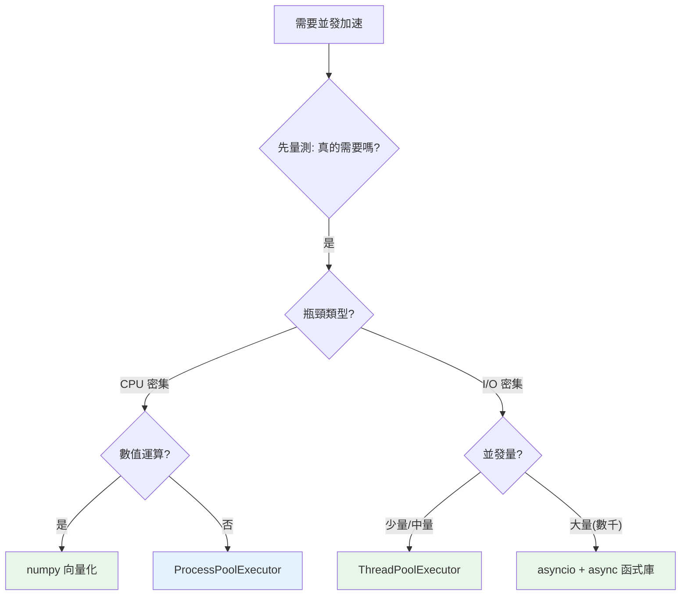

# 如何選擇並發模型

> 整個 Part 9 收斂成一張決策圖：先問「I/O 密集還是 CPU 密集」，再問「連線量多不多」。選對模型讓程式又快又簡單，選錯則白忙一場甚至更慢。

## 💡 白話導讀（建議先讀）

整個 Part 9 收斂成**兩個問題**——回答完，工具自動出現：

**問題一：你的瓶頸是「等」還是「算」？**

觀察程式大部分時間在幹嘛：

- 在**等**（等網路回應、等磁碟、等資料庫）→ **I/O 密集** → 並發就夠（把等待重疊起來）。
- 在**算**（跑迴圈、處理數據、壓縮影像）→ **CPU 密集** → 必須真並行 → **multiprocessing（開分店）**,一步到位。

**問題二（若是「等」）：同時要伺候多少個？**

- **幾個到幾十個**（抓 20 個網頁、查 5 個 API）→ **threading**(或 ThreadPoolExecutor)——簡單、夠用、生態全相容。
- **數百到數千**（Web 伺服器、聊天服務、爬蟲艦隊）→ **asyncio**（單人服務生）——執行緒開不了幾千條,服務生可以顧幾千桌。

畫成一張圖：

```text
瓶頸在哪?
├─ 算(CPU) ──────────────→ multiprocessing(分店,每店一把刀)
└─ 等(I/O)
   ├─ 中小量並發 ─────────→ threading(多店員,共用一把刀但常放下)
   └─ 海量連線 ──────────→ asyncio(單人服務生,絕不空等)
```

最後三句經驗談:**先確定真的需要並發**(過早優化是萬惡之源);**能用 concurrent.futures 就別手管執行緒**;**asyncio 是全有全無的**——整條呼叫鏈都要 async,[混進一個阻塞就全毀](11-blocking-in-async.md)。

## Why（為什麼）

Python 有 threading、multiprocessing、asyncio、concurrent.futures 四套並發工具，加上 GIL 的限制，很容易選錯——拿 threading 做 CPU 密集（無效）、拿 multiprocessing 做輕量 I/O（浪費）、該用 asyncio 卻硬開幾千個執行緒（撐不住）。這章把前面所有章節收斂成一套**可操作的決策準則**，讓你面對任何並發需求都能快速選對工具。這是 Part 9 的總結，也是面試「該用哪個並發模型」的標準答案。

## Theory（理論：兩個問題決定一切）

選並發模型，回答兩個問題：

1. **瓶頸是 I/O 還是 CPU？**（等 vs 算，見[並發 vs 並行](01-concurrency-vs-parallelism.md)）
   - **I/O 密集**（等網路/磁碟/DB）→ 並發即可：threading 或 asyncio。
   - **CPU 密集**（純計算）→ 需真並行：multiprocessing（繞過 GIL、開分店）。

2. **（若 I/O）並發量多大？**
   - **少量到中量**（幾個到幾十個）→ **threading**（簡單、夠用）。
   - **大量**（數百到數千連線）→ **asyncio**（單執行緒無切換開銷、可撐海量連線）。

兩個問題就能定位到正確的工具——選錯則白忙一場甚至更慢。

## Specification（規範：決策表）

| 情境 | 推薦模型 | 工具 |
|------|----------|------|
| CPU 密集（計算重） | 多行程真並行 | `ProcessPoolExecutor` / multiprocessing |
| CPU 密集（數值運算） | 向量化 | numpy / C 擴充（常勝過 multiprocessing） |
| I/O 密集，少量任務 | 多執行緒 | `ThreadPoolExecutor` / threading |
| I/O 密集，大量連線 | 非同步 | asyncio（+ async 函式庫） |
| 已在 asyncio 裡的阻塞 I/O | 丟執行緒 | `asyncio.to_thread` |
| 已在 asyncio 裡的 CPU 工作 | 丟行程 | `run_in_executor` + ProcessPool |
| 混合（I/O + CPU） | 組合 | asyncio 主 + 行程池處理 CPU |

## Implementation（決策流程、各模型速記、實務組合）

### 決策流程

```text
你的任務瓶頸是什麼？
├─ CPU 密集（計算）
│   ├─ 數值運算 → 先試向量化（numpy）
│   └─ 一般計算 → ProcessPoolExecutor（多行程真並行）
│
└─ I/O 密集（等待）
    ├─ 少量/中量任務 → ThreadPoolExecutor（threading）
    └─ 大量連線（數千） → asyncio（+ aiohttp/httpx/asyncpg）
```

### 各模型一句話速記

- **threading / ThreadPoolExecutor**：I/O 密集、少量、共享記憶體方便；受 GIL 限制無法並行 CPU；注意競態要加鎖/用 Queue。
- **multiprocessing / ProcessPoolExecutor**：CPU 密集、真並行繞過 GIL；獨立記憶體、資料要 pickle；有行程開銷、`__main__` 規則。
- **asyncio**：I/O 密集、大量連線、單執行緒協作式；幾乎無競態；要一路 async、阻塞會卡 loop。
- **concurrent.futures**：threading/multiprocessing 的統一高階介面，**實務首選**（換 Executor 即切換策略）。

### 為什麼「選錯」會出事

- **CPU 密集用 threading**：GIL 讓執行緒輪流跑，不但不快還多切換開銷（見 [GIL](02-gil.md)）。
- **輕量 I/O 用 multiprocessing**：行程建立與序列化開銷 > 收益，反而更慢。
- **海量連線用 threading**：每個執行緒的記憶體與切換開銷，開幾千個撐不住；asyncio 單執行緒才行。
- **asyncio 裡做阻塞操作**：凍結整個 event loop（見 [to_thread](11-blocking-in-async.md)）。

### 實務組合：混合負載

真實服務常是**混合**的——大量 I/O 為主，偶爾有 CPU 重活。組合做法：

```python
# asyncio 為主（處理大量 I/O），CPU 重活丟行程池
async def handle_request(data):
    raw = await fetch_from_db(data)          # async I/O
    result = await loop.run_in_executor(     # CPU 重活丟行程池
        process_pool, cpu_intensive, raw
    )
    await save_result(result)                # async I/O
```

asyncio 處理海量連線的 I/O，把少數 CPU 密集工作外包給行程池——各取所長。

### 先量測再優化

**別假設並發一定更快**。並發增加複雜度，且有開銷。做法：

1. 先寫**序列版**當基準。
2. 判斷瓶頸類型（用 profiler，見 [profiling](../18-performance/01-profiling.md)）。
3. 選對應模型、量測是否真的變快。
4. 只在「量測證明有效 + 真的需要」時保留並發。

「能不並發就不並發」——並發是必要時的工具，不是預設。

## Code Example（可執行的 Python 範例）

```python
# choosing_model_demo.py
from __future__ import annotations


def recommend_model(task_type: str, scale: str = "small") -> str:
    """依任務類型與規模推薦並發模型。"""
    if task_type == "cpu":
        return "ProcessPoolExecutor（多行程真並行，繞過 GIL）；數值運算優先 numpy 向量化"
    if task_type == "io":
        if scale == "large":
            return "asyncio（單執行緒撐大量連線）+ async 函式庫"
        return "ThreadPoolExecutor（I/O 少量，簡單夠用）"
    return "先判斷 I/O 還是 CPU 密集"


def demo() -> None:
    cases = [
        ("cpu", "any", "影像批次處理、數值計算"),
        ("io", "small", "下載 10 個網頁"),
        ("io", "large", "5000 個並發連線的聊天伺服器"),
    ]
    for task_type, scale, desc in cases:
        print(f"情境: {desc}")
        print(f"  → {recommend_model(task_type, scale)}\n")

    print("決策口訣：")
    print("  CPU 密集 → multiprocessing（或向量化）")
    print("  I/O 少量 → threading")
    print("  I/O 大量 → asyncio")
    print("  實務首選統一介面 → concurrent.futures")


if __name__ == "__main__":
    demo()
```

**預期輸出**：

```pycon
$ python choosing_model_demo.py
情境: 影像批次處理、數值計算
  → ProcessPoolExecutor（多行程真並行，繞過 GIL）；數值運算優先 numpy 向量化

情境: 下載 10 個網頁
  → ThreadPoolExecutor（I/O 少量，簡單夠用）

情境: 5000 個並發連線的聊天伺服器
  → asyncio（單執行緒撐大量連線）+ async 函式庫

決策口訣：
  CPU 密集 → multiprocessing（或向量化）
  I/O 少量 → threading
  I/O 大量 → asyncio
  實務首選統一介面 → concurrent.futures
```

## Diagram（圖解：並發模型決策圖）



## Best Practice（最佳實踐）

- **先判斷 I/O vs CPU 密集**，這是選模型的第一步。
- **CPU 密集 → multiprocessing/ProcessPoolExecutor**（或數值運算用向量化）；**I/O 少量 → threading**；**I/O 大量 → asyncio**。
- **實務優先用 `concurrent.futures`**（統一介面，換 Executor 即切換 thread/process）。
- **混合負載組合使用**：asyncio 主 + 行程池處理 CPU 重活；asyncio 裡的阻塞用 `to_thread`。
- **先量測再優化**：序列版當基準，確認並發真的變快，別盲目並發。
- **能不並發就不並發**：並發增加複雜度（競態、除錯難）；只在必要且有效時用。
- **關注 free-threaded Python**（見 [free-threaded](12-free-threaded-python.md)）：未來 CPU 密集可能可用 threading，但現在還不是時候。

## Common Mistakes（常見誤解）

- **CPU 密集用 threading**：GIL 讓它無效甚至更慢——最經典的選錯。
- **輕量 I/O 用 multiprocessing**：行程/序列化開銷 > 收益。
- **海量連線用 threading**：執行緒開銷撐不住幾千連線；用 asyncio。
- **asyncio 裡做阻塞操作**：凍結 event loop；用 to_thread/行程池。
- **不量測就並發**：假設並發一定快，可能反而更慢更複雜。
- **過度並發**：能序列/簡單解決卻硬上並發，徒增 bug 與維護成本。
- **不考慮向量化**：CPU 密集的數值運算，numpy 常比手刻 multiprocessing 簡單又快。

## Interview Notes（面試重點）

- **能背出決策準則**：**CPU 密集 → multiprocessing（繞過 GIL）；I/O 少量 → threading；I/O 大量 → asyncio**；數值運算優先向量化；實務用 concurrent.futures 統一介面。
- **能解釋每種「選錯」的後果**（CPU 用 threading 無效、輕量 I/O 用 process 浪費、海量連線用 thread 撐不住、asyncio 裡阻塞卡 loop）。
- 知道**混合負載的組合**（asyncio 主 + 行程池 CPU + to_thread 阻塞）。
- 知道要**先量測、能不並發就不並發**。
- 能連結整個 Part 9 的知識（GIL、三模型特性、concurrent.futures、to_thread、free-threaded 未來）做出正確選擇——這題答得好代表你真正理解 Python 並發。

---

🎉 **恭喜完成 Part 9！** 這是全書最硬的 Part 之一。你已掌握 Python 並發的全貌：並發vs並行、GIL、threading 與同步、multiprocessing、concurrent.futures、asyncio 的 event loop / async-await / Task / TaskGroup、在 async 中處理阻塞、free-threaded 的未來，以及如何選對並發模型。
接下來 [Part 10 CPython 內部與記憶體](../10-cpython-internals/README.md) 將深入物件模型、引用計數、GC 與 bytecode。

[⬆️ 回 Part 9 索引](README.md)
