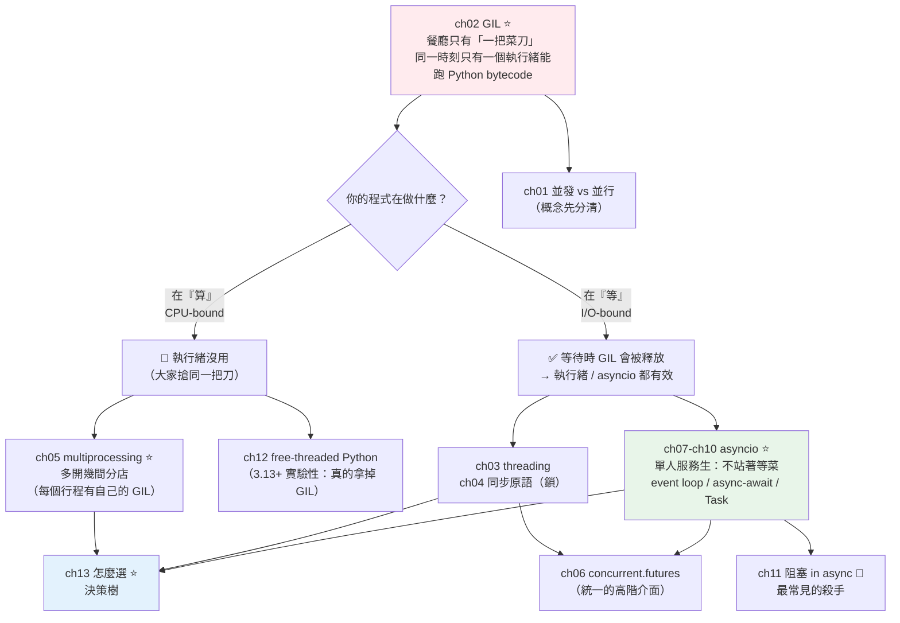

# Part 9 統整：並發與並行全貌

> 把這 13 章串成一張圖——**先問一個問題，其餘全部自動解答：你的程式是在「算」，還是在「等」？**

## 🗺️ 知識地圖（這 13 章怎麼串起來）

Part 9 是本書第一座大山，但它的結構其實極其簡單：
**所有選擇都取決於一個問題——CPU-bound（在算）還是 I/O-bound（在等）？**



**一句話串起來**：

一切的起點是 **[GIL](02-gil.md)**（ch02）——
**一間餐廳只有一把菜刀**：同一時刻，**只有一個執行緒能執行 Python bytecode**。

於是：

- **你的程式在「算」**（CPU-bound）→ **多開執行緒完全沒用**（大家搶同一把刀）。
  要真的變快，得**多開幾間分店**——[multiprocessing](05-multiprocessing.md)（ch05），
  每個行程有**自己的 GIL**。
- **你的程式在「等」**（I/O-bound：等網路、等資料庫、等檔案）→
  **等待時 GIL 會被釋放**！所以[執行緒](03-threading.md)有效，
  而 [asyncio](07-asyncio-basics.md) 更有效——它用**單一執行緒**、
  靠一個**不站著等菜的服務生**（event loop），就能同時照看幾百桌。

**下面的小實作會用真實數字證明這一切**（劇透：CPU 密集用執行緒只有 **0.99 倍**加速）。

## ⚡ 速查表（什麼情境用什麼）

| 情境 | 用什麼 | 章節 |
|------|--------|------|
| **CPU 密集**（數值計算、影像處理、加密） | **`multiprocessing`** / `ProcessPoolExecutor`——**執行緒完全無效** | [ch05](05-multiprocessing.md) |
| **I/O 密集 + 大量並發**（爬蟲、API 呼叫、微服務） | **`asyncio`**（單執行緒撐幾百上千個連線） | [ch07](07-asyncio-basics.md) |
| I/O 密集但**函式庫只有同步版** | `ThreadPoolExecutor`（執行緒等待時會釋放 GIL） | [ch03](03-threading.md)、[ch06](06-concurrent-futures.md) |
| 想用「同一套 API」切換執行緒／行程 | **`concurrent.futures`**（`ThreadPoolExecutor` ↔ `ProcessPoolExecutor` 只改一個字） | [ch06](06-concurrent-futures.md) |
| async 裡要呼叫**阻塞**的同步函式 | **`await asyncio.to_thread(blocking_fn, arg)`**（別直接呼叫！） | [ch11](11-blocking-in-async.md) |
| 併發跑多個協程、收集結果 | `await asyncio.gather(*coros)` | [ch09](09-asyncio-tasks.md) |
| 併發但要**結構化**（一個失敗就全取消） | **`async with asyncio.TaskGroup()`**（3.11+，**優先選它**） | [ch10](10-asyncio-advanced.md) |
| 限制同時併發數（別把下游打掛） | `asyncio.Semaphore(10)` | [ch10](10-asyncio-advanced.md) |
| 加逾時 | `async with asyncio.timeout(5):`（3.11+） | [ch10](10-asyncio-advanced.md) |
| 多執行緒共用可變狀態 | **鎖**（`threading.Lock`）——但**能不共用就別共用** | [ch04](04-thread-sync.md) |
| async 裡要鎖 | **`asyncio.Lock`**（**絕不要用 `threading.Lock`**——會卡死整個 event loop） | [ch10](10-asyncio-advanced.md) |
| 不知道該選哪個 | 看**決策樹**：先問「在算還是在等」 | [ch13](13-choosing-concurrency-model.md) |
| 想知道 GIL 何時會消失 | free-threaded build（3.13+ 實驗性） | [ch12](12-free-threaded-python.md) |

## 🔑 核心心智模型（帶得走的幾句話）

- **GIL ＝ 餐廳只有一把菜刀。** 廚師（執行緒）可以有很多個，但**同一時刻只有一個能切菜**
  （執行 Python bytecode）。所以「多請廚師」對**切菜**（CPU-bound）毫無幫助。
- **但「等菜」不需要菜刀。** 執行緒在等 I/O（網路、磁碟）時，**會把菜刀放下**（釋放 GIL）——
  這就是為什麼**執行緒對 I/O-bound 有效**。
- **asyncio ＝ 一個不站著等菜的服務生。** 不多請人，而是讓**同一個人**在等待時
  **轉身去服務別桌**。單執行緒就能同時照看幾百桌——前提是**每件事大部分時間都在等**。
- **並發（concurrency）≠ 並行（parallelism）。**
  並發是「**同時處理**很多事」（交錯進行，一個人也能做到）；
  並行是「**同時執行**很多事」（真的多核同時跑）。
  **asyncio 是並發、multiprocessing 是並行。**
- **async 的頭號殺手：在協程裡呼叫阻塞函式。**
  `time.sleep()`、`requests.get()` 會**卡死整個 event loop**——
  服務生站在廚房前發呆，**全店停擺**。
- **先問「在算還是在等」，答案就出來了。** 這是 Part 9 唯一需要記住的決策。

## 🛠️ 小實作：用真實數字證明 GIL 的存在

這支腳本跑同樣的 4 個任務，分別用**循序／多執行緒／多行程／asyncio**——
一次是 CPU 密集，一次是 I/O 密集。**數字會說話。**

```python
# concurrency_demo.py —— Part 9 主線：先問「在算，還是在等」
from __future__ import annotations

import asyncio
import multiprocessing
import time
from collections.abc import Callable
from concurrent.futures import ProcessPoolExecutor, ThreadPoolExecutor


def cpu_task(n: int) -> int:
    """CPU 密集：純計算——GIL 的受害者（需要「菜刀」）。"""
    return sum(i * i for i in range(n))


def io_task(seconds: float) -> str:
    """I/O 密集：純等待——等待時 GIL 會被釋放（不需要「菜刀」）。"""
    time.sleep(seconds)
    return "done"


async def async_io_task(seconds: float) -> str:
    await asyncio.sleep(seconds)
    return "done"


def timeit(label: str, func: Callable[[], object]) -> float:
    start = time.perf_counter()
    func()
    elapsed = time.perf_counter() - start
    print(f"  {label:32s} {elapsed:6.2f} s")
    return elapsed


async def async_main() -> None:
    await asyncio.gather(*[async_io_task(1) for _ in range(4)])


def main() -> None:
    n = 6_000_000

    print(f"【CPU 密集】4 個任務，每個算 sum(i*i) 到 {n:,}")
    seq = timeit("循序執行", lambda: [cpu_task(n) for _ in range(4)])
    thread = timeit(
        "多執行緒 ThreadPool",
        lambda: list(ThreadPoolExecutor(4).map(cpu_task, [n] * 4)),
    )
    process = timeit(
        "多行程 ProcessPool",
        lambda: list(ProcessPoolExecutor(4).map(cpu_task, [n] * 4)),
    )
    print(f"  → 執行緒加速比: {seq / thread:.2f}x  ← GIL 擋住了，幾乎沒變快！")
    print(f"  → 行程加速比:   {seq / process:.2f}x  ← 繞過 GIL，真的變快")

    print("\n【I/O 密集】4 個任務，每個 sleep(1 秒)")
    seq_io = timeit("循序執行", lambda: [io_task(1) for _ in range(4)])
    thread_io = timeit(
        "多執行緒 ThreadPool",
        lambda: list(ThreadPoolExecutor(4).map(io_task, [1] * 4)),
    )
    async_io = timeit("asyncio.gather", lambda: asyncio.run(async_main()))
    print(f"  → 執行緒加速比:   {seq_io / thread_io:.2f}x  ← 等待時 GIL 被釋放，有效！")
    print(f"  → asyncio 加速比: {seq_io / async_io:.2f}x  ← 單執行緒也做到了")


if __name__ == "__main__":
    multiprocessing.freeze_support()    # Windows 必要
    main()
```

**預期輸出**（實測，數字依機器而異但**趨勢完全一致**）：

```pycon
$ python concurrency_demo.py
【CPU 密集】4 個任務，每個算 sum(i*i) 到 6,000,000
  循序執行                           1.26 s
  多執行緒 ThreadPool                1.28 s
  多行程 ProcessPool                 0.47 s
  → 執行緒加速比: 0.99x  ← GIL 擋住了，幾乎沒變快！
  → 行程加速比:   2.68x  ← 繞過 GIL，真的變快

【I/O 密集】4 個任務，每個 sleep(1 秒)
  循序執行                           4.00 s
  多執行緒 ThreadPool                1.00 s
  asyncio.gather                     1.00 s
  → 執行緒加速比:   4.00x  ← 等待時 GIL 被釋放，有效！
  → asyncio 加速比: 4.00x  ← 單執行緒也做到了
```

**這四個數字，就是整個 Part 9**：

| 情境 | 多執行緒 | 解讀 |
|------|---------|------|
| **CPU 密集** | **0.99x** 🔴 | **完全沒變快**（甚至更慢——多了切換成本）。<br/>四個廚師搶**同一把菜刀**，還是只有一個人能切。 |
| **I/O 密集** | **4.00x** ✅ | **完美的 4 倍**。因為等待時**菜刀被放下了**，<br/>大家可以同時「等」。 |

而 CPU 密集要變快，只能**多開幾間分店**（`ProcessPoolExecutor` → **2.68x**）——
每個行程有**自己的 GIL、自己的菜刀**。

**asyncio 在 I/O 上做到和多執行緒一樣的 4 倍——但它只用了「一個執行緒」。**
這就是「單人服務生」的威力：不多請人，只是**不站著等菜**。

## ✅ 自測清單（答不出來就回去讀）

- [ ] 並發（concurrency）和並行（parallelism）差在哪？（[ch01](01-concurrency-vs-parallelism.md)）
- [ ] GIL 是什麼？它為什麼存在？（提示：跟[引用計數](../10-cpython-internals/03-reference-counting.md)有關）（[ch02](02-gil.md)）
- [ ] 為什麼多執行緒對 CPU 密集任務**沒有幫助**？（[ch02](02-gil.md)）
- [ ] 為什麼多執行緒對 I/O 密集任務**有幫助**？（[ch03](03-threading.md)）
- [ ] multiprocessing 為什麼能繞過 GIL？它的代價是什麼？（[ch05](05-multiprocessing.md)）
- [ ] `ThreadPoolExecutor` 和 `ProcessPoolExecutor` 怎麼選？（[ch06](06-concurrent-futures.md)）
- [ ] event loop 在做什麼？協程是怎麼「讓出」控制權的？（[ch07](07-asyncio-basics.md)、[ch08](08-async-await.md)）
- [ ] `await coro()` 和 `asyncio.create_task(coro())` 差在哪？（[ch09](09-asyncio-tasks.md)）
- [ ] `gather` 和 `TaskGroup` 差在哪？3.11+ 該用哪個？（[ch10](10-asyncio-advanced.md)）
- [ ] 在協程裡呼叫 `time.sleep(1)` 會發生什麼事？正確做法？（[ch11](11-blocking-in-async.md)）
- [ ] 多執行緒共用可變狀態要注意什麼？race condition 怎麼發生的？（[ch04](04-thread-sync.md)）
- [ ] free-threaded Python 是什麼？它解決了什麼、又帶來什麼？（[ch12](12-free-threaded-python.md)）
- [ ] 拿到一個新任務，你的決策流程是什麼？（[ch13](13-choosing-concurrency-model.md)）

## 🎯 面試速查

| 考點 | 面試官想聽到什麼 | 章節 |
|------|------------------|------|
| **什麼是 GIL？** | 「**全域直譯器鎖**——CPython 裡同一時刻**只有一個執行緒能執行 Python bytecode**。它存在是為了**保護引用計數**等內部狀態（讓 CPython 的記憶體管理不必每個物件都加鎖，單執行緒因此更快）。代價是：**多執行緒無法利用多核做 CPU 運算**。」 | [ch02](02-gil.md) |
| **那多執行緒還有什麼用？** | 「**I/O-bound 場景**。執行緒在**等 I/O 時會釋放 GIL**——所以等網路、等資料庫、等檔案時，其他執行緒可以跑。我實測過：CPU 密集用執行緒只有 **0.99 倍**（等於沒用），I/O 密集卻有 **4 倍**。」 | [ch03](03-threading.md) |
| **CPU 密集怎麼辦？** | 「**multiprocessing**——每個行程有**自己的直譯器與 GIL**，能真正並行。代價是：行程比執行緒**重**（記憶體、啟動成本），且**資料要序列化**（pickle）才能跨行程傳。或者：把熱點交給**釋放 GIL 的 C 擴充**（numpy）或[原生編譯](../18-performance/05-cython-numba.md)。」 | [ch05](05-multiprocessing.md) |
| **asyncio vs 多執行緒？** | 「asyncio 是**單執行緒的協作式並發**——沒有執行緒切換成本、沒有 race condition（不需要鎖），能撐**幾千個並發連線**。多執行緒是**搶佔式**，受 OS 排程，執行緒數一多開銷就大。**大量 I/O 並發選 asyncio；只有同步函式庫可用，才退回執行緒。**」 | [ch07](07-asyncio-basics.md) |
| **async 最常見的錯誤？** | 「**在協程裡呼叫阻塞函式**——`time.sleep()`、`requests.get()`。event loop 是**單執行緒**，一被卡住，**所有協程全部停擺**。解法：用 async 版本（`asyncio.sleep`、`httpx`），或 `await asyncio.to_thread(blocking_fn)` 丟到執行緒。」 | [ch11](11-blocking-in-async.md) |
| **`gather` vs `TaskGroup`？** | 「`gather` 在**一個任務失敗時，其他仍在跑**（除非設定），錯誤處理笨拙。**`TaskGroup`（3.11+）是結構化並發**：離開 `async with` 區塊時**保證所有任務已完成或取消**，任一失敗則**其餘自動取消**，錯誤打包成 `ExceptionGroup`。**新程式碼優先用 TaskGroup。**」 | [ch10](10-asyncio-advanced.md) |
| **GIL 會消失嗎？** | 「Python 3.13 有**實驗性的 free-threaded build**（PEP 703），真的移除了 GIL。代價是**單執行緒效能略降**、C 擴充需要適配。目前仍是選用性的，生態成熟還需要時間。」 | [ch12](12-free-threaded-python.md) |

---

🎉 **恭喜完成 Part 9！** 你翻過了本書的第一座大山——
而且你手上有一個能一秒做決策的問題：**「在算，還是在等？」**

接下來 [Part 10 CPython 內部](../10-cpython-internals/README.md) 要回答本 Part 留下的懸念：
**GIL 到底為什麼存在？** 答案藏在 CPython 的記憶體管理裡——
**引用計數**。你會發現 GIL 不是設計失誤，而是一個**權衡**：
用「多執行緒不能並行」換來「單執行緒更快、C 擴充更好寫」。

➡️ 下一 Part：[CPython 內部與記憶體 CPython Internals](../10-cpython-internals/README.md)

[⬆️ 回 Part 9 索引](README.md)
