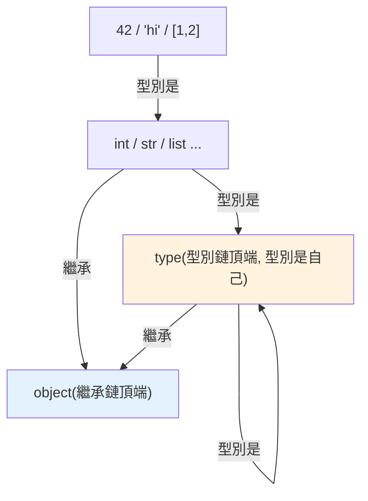

# 一切皆物件

> 「一切皆物件」不是口號——在 Python，整數、函式、類別、模組、型別本身，全都是堆積上的物件，有身分、有型別、可被賦值傳遞。這是理解 CPython 一切行為的第一原理。

## Why（為什麼）

前面的章節反覆出現這句話：「因為一切皆物件，所以…」——函式能當參數（[一等公民](../08-functional-decorators/01-first-class-functions.md)）、class 由 metaclass 建立（[metaclass](../04-oop/13-metaclass.md)）、運算子是方法呼叫（[運算子](../02-fundamentals/05-operators.md)）。這章把這條貫穿全書的主線正式講清楚：Python 裡**真的**沒有「基本型別」與「物件」的區分——連 `42`、`int`、`print` 都是物件。理解這個統一模型，CPython 後面所有機制（引用計數、型別系統、記憶體）才有共同的地基。

## Theory（理論：統一的物件模型）

在很多語言（如 Java），有「基本型別（primitive，如 `int`）」和「物件（Object）」的二分——`int` 不是物件，要 boxing 才能當物件用。**Python 沒有這種二分：所有值都是物件**。

「是物件」意味著每個值都：

- **存在於堆積（heap）記憶體**，透過參照（名稱綁定，見 [名稱綁定](../02-fundamentals/01-dynamic-typing.md)）存取。
- **有身分（identity）**：唯一的 `id`。
- **有型別（type）**：它屬於哪個類別。
- **有值（value）**：它的內容。
- **可被當作值操作**：賦值、傳遞、當參數/回傳、存進容器。

而且這是**遞迴的**——連「型別」本身也是物件（`int` 是一個 `type` 物件），「型別的型別」還是物件（`type` 是 `type` 自己，見 [metaclass](../04-oop/13-metaclass.md)）。

## Specification（規範：什麼都是物件）

```python
# 數字、字串、布林、None → 物件
type(42)          # <class 'int'>
type("hi")        # <class 'str'>
type(True)        # <class 'bool'>
type(None)        # <class 'NoneType'>

# 函式、lambda → 物件
type(print)       # <class 'builtin_function_or_method'>
def f(): pass
type(f)           # <class 'function'>

# 類別 → 物件（class 本身是物件！）
class C: pass
type(C)           # <class 'type'>

# 模組 → 物件
import math
type(math)        # <class 'module'>

# 型別本身 → 物件
type(int)         # <class 'type'>
type(type)        # <class 'type'>（type 是自己的型別）
```

## Implementation（物件都有共同結構、遞迴的型別）

### 每個物件有共同的三要素

無論是 `42` 還是一個複雜物件，在 CPython 內部都有共同的底層結構：**型別指標 + 引用計數**（外加型別特定的資料）。任何 Python 物件都能問這三件事（詳見 [物件模型](02-object-model.md)）：

```pycon
>>> x = 42
>>> id(x)          # 身分（identity）——在 CPython 是記憶體位址
140234...
>>> type(x)        # 型別
<class 'int'>
>>> x              # 值
42
```

連整數 `42` 都是一個完整的物件——有身分、有型別、有引用計數。這與 Java 的 primitive `int` 完全不同，也是為什麼 Python 整數「較重」（每個 int 物件有額外的物件開銷，見 [記憶體管理](05-memory-management.md)）。

### 型別也是物件（遞迴）

最能體現「一切皆物件」的是——**型別本身也是物件**：

```pycon
>>> int                # int 是一個物件
<class 'int'>
>>> type(int)          # 它的型別是 type
<class 'type'>
>>> isinstance(int, object)    # int 也是 object 的實例
True
>>> id(int)            # 型別也有身分
140234...
```

`int` 是一個 `type` 物件，可以被賦值（`my_int = int`）、當參數傳（`list(map(int, strs))`）、存進容器。這讓 Python 有極高的動態性——類別可以在執行期建立、修改、傳遞（見 [metaclass](../04-oop/13-metaclass.md)）。

### 兩個共同基底：`object` 與 `type`

Python 的物件系統由兩個特殊物件錨定：

- **`object`**：所有類別的最終基底——每個類別都（直接或間接）繼承 `object`。
- **`type`**：所有類別的型別——每個類別都是 `type`（或其子類 metaclass）的實例。

```pycon
>>> isinstance(42, object)     # 一切都是 object 的實例
True
>>> issubclass(int, object)    # 一切型別繼承 object
True
>>> isinstance(int, type)      # 一切型別是 type 的實例
True
```

這兩者構成物件模型的根：**「繼承鏈」的頂端是 `object`、「型別鏈」的頂端是 `type`**（`type` 本身是 `type`，形成閉環）。

### 為什麼這個統一模型重要

「一切皆物件」讓 Python 的許多特性得以成立：

- **一等公民函式**（[函數式](../08-functional-decorators/01-first-class-functions.md)）：函式是物件，能傳遞。
- **運算子多載**（[運算子](../02-fundamentals/05-operators.md)）：`a + b` 是 `a.__add__(b)`，因為 `a` 是物件、有方法。
- **內省（introspection）**：能問任何東西的 `type`、`dir`、屬性。
- **動態性**：執行期建立/修改類別（metaclass）、動態加屬性。
- **統一的記憶體管理**：所有物件用同一套引用計數 + GC（見 [引用計數](03-reference-counting.md)、[GC](04-garbage-collection.md)）。

## Code Example（可執行的 Python 範例）

```python
# everything_is_object_demo.py
from __future__ import annotations


def describe(obj: object, label: str) -> str:
    """任何物件都能問 id / type。"""
    return f"{label}: type={type(obj).__name__}, id={id(obj)}"


def demo() -> None:
    # 各種「值」都是物件
    print(describe(42, "整數"))
    print(describe("hi", "字串"))
    print(describe([1, 2], "列表"))
    print(describe(print, "內建函式"))

    # 函式是物件
    def greet() -> str:
        return "hi"

    print(describe(greet, "自訂函式"))

    # 類別是物件
    class Widget:
        pass

    print(describe(Widget, "類別"))

    # 型別也是物件（遞迴）
    print(describe(int, "int 型別"))
    print(describe(type, "type 自己"))

    # 統一模型：一切都是 object 的實例、型別都是 type 的實例
    print(f"\n42 是 object 實例: {isinstance(42, object)}")
    print(f"int 是 type 實例: {isinstance(int, type)}")
    print(f"type 的型別是自己: {type(type) is type}")


if __name__ == "__main__":
    demo()
```

**預期輸出**（id 數字依執行而異）：

```pycon
$ python everything_is_object_demo.py
整數: type=int, id=140234...
字串: type=str, id=140234...
列表: type=list, id=140234...
內建函式: type=builtin_function_or_method, id=140234...
自訂函式: type=function, id=140234...
類別: type=type, id=140234...
int 型別: type=type, id=140234...
type 自己: type=type, id=140234...

42 是 object 實例: True
int 是 type 實例: True
type 的型別是自己: True
```

## Diagram（圖解：物件模型的根）



## Best Practice（最佳實踐）

- **用「一切皆物件」的模型思考**：任何東西都能問 `type`/`id`、能被賦值傳遞——這統一解釋了函式一等公民、運算子多載、metaclass 等。
- **善用內省**：`type()`、`isinstance()`、`dir()`、`vars()` 查任何物件的結構。
- **理解 int/str 也是完整物件**：解釋了 Python 整數「較重」、以及小整數快取（見 [interning](09-interning.md)）的存在。
- **理解 `object`（繼承根）與 `type`（型別根）**：自訂類別繼承 object、由 type 建立（見 [metaclass](../04-oop/13-metaclass.md)）。
- **這是後續章節的地基**：引用計數、GC、記憶體都作用在「物件」上，因為一切都是物件。

## Common Mistakes（常見誤解）

- **以為 Python 有「基本型別 vs 物件」的二分**：沒有——`42`、`int`、`print` 全是物件（與 Java primitive 不同）。
- **以為型別/類別不是物件**：`int`、你的 `class` 都是物件，有 id、可傳遞（這是 metaclass 的基礎）。
- **驚訝於 `type(type) is type`**：型別鏈的閉環——`type` 是自己的型別，是刻意設計。
- **忽略「整數也是物件」的成本**：每個 int 有物件開銷，所以純 Python 數值迴圈慢（向量化見 [Part 17](../17-data-science/README.md)）。
- **混淆 `object` 與 `type`**：`object` 是繼承鏈頂端、`type` 是型別鏈頂端；一切繼承 object、一切型別是 type 的實例。

## Interview Notes（面試重點）

- **能說明「一切皆物件」**：數字、字串、函式、類別、模組、型別本身全是堆積上的物件，有 **id / type / value**、可被當值操作——與 Java 的 primitive/Object 二分對比。
- 知道**型別也是物件**（`int` 是 `type` 的實例、`type(type) is type`），這是 metaclass 與動態性的基礎。
- 知道兩個根：**`object`（所有類別的基底）與 `type`（所有類別的型別）**。
- 能連結它解釋的特性：**一等公民函式、運算子多載、內省、動態建類、統一記憶體管理**。
- 知道「整數也是完整物件」的成本（物件開銷 → 純 Python 數值運算慢 → 需向量化）。

---

➡️ 下一章：[物件模型：id / type / value](02-object-model.md)

[⬆️ 回 Part 10 索引](README.md)
