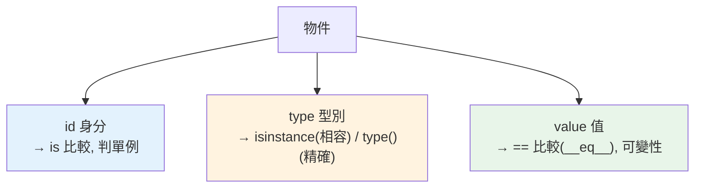

# 物件模型：id / type / value

> 每個 Python 物件都有三個不可分割的屬性：id（身分，誰）、type（型別，是什麼）、value（值，內容）。`is` 比 id、`==` 比 value、`type()`/`isinstance()` 查 type——搞懂這三者，就懂了 Python 物件的本質。

## Why（為什麼）

上一章說「一切皆物件」，這章講「物件由什麼構成」。每個物件的三要素——id、type、value——對應到三組你天天用卻可能混淆的操作：`is` vs `==`（身分 vs 值）、`type()` vs `isinstance()`（精確型別 vs 相容型別）、可變性（value 能不能改）。把這三要素與對應操作一次釐清，你就不會再搞混 `is` 和 `==`、或誤用 `type() ==`。這是 [名稱綁定](../02-fundamentals/01-dynamic-typing.md)、[hashable](../03-data-structures/07-hashable.md) 等章節的底層統一。

## Theory（理論：三要素）

CPython 的每個物件都有三個核心屬性：

| 屬性 | 是什麼 | 如何取得 | 相關操作 |
|------|--------|----------|----------|
| **id（身分）** | 物件的唯一識別（CPython 是記憶體位址） | `id(obj)` | `is`（比較身分） |
| **type（型別）** | 物件屬於哪個類別 | `type(obj)` | `isinstance` / `type() ==` |
| **value（值）** | 物件的內容 | 物件本身 | `==`（比較值）、可變性 |

**id 與 type 在物件生命週期內不變**（一個物件不會改變身分或型別）；**value 可能變**（若物件可變，見 [可變性](../03-data-structures/06-mutability.md)）。

## Specification（規範：三要素的操作）

```python
x = [1, 2, 3]

# id（身分）
id(x)             # 唯一識別
x is y            # x 和 y 是「同一個物件」嗎？（比 id）
x is None         # 判斷單例用 is

# type（型別）
type(x)           # <class 'list'>
type(x) is list   # 精確型別檢查
isinstance(x, list)          # 相容型別檢查（含子類別）
isinstance(x, (list, tuple)) # 多型別任一

# value（值）
x == [1, 2, 3]    # 值相等嗎？（比 value，呼叫 __eq__）
```

## Implementation（is vs ==、type vs isinstance、id 是位址）

### `is` vs `==`：身分 vs 值（最常混淆）

- **`is`** 比較 **id**——「是不是同一個物件」。快、不可覆寫。
- **`==`** 比較 **value**——「值相不相等」。呼叫 `__eq__`，可覆寫（見 [魔術方法](../04-oop/08-dunder-methods.md)）。

```pycon
>>> a = [1, 2, 3]
>>> b = [1, 2, 3]
>>> a == b        # 值相等
True
>>> a is b        # 但不是同一個物件（不同 id）
False
>>> c = a
>>> a is c        # c 和 a 是同一物件（別名）
True
>>> id(a) == id(c)
True
```

**規則**：**比較值用 `==`；判斷「是不是同一個物件 / 是不是那個單例」用 `is`。`is` 只該用於 `None`、`True`、`False` 這類單例**（`x is None`）。別用 `is` 比較數字/字串的值——那依賴 interning 實作細節（見 [interning](09-interning.md)），不可靠。

### `type()` vs `isinstance()`：精確 vs 相容

- **`type(x) is SomeClass`**：**精確**型別檢查——只有「剛好是這個類別」才為真，**子類別不算**。
- **`isinstance(x, SomeClass)`**：**相容**檢查——是這個類別**或其子類別**都為真。

```pycon
>>> class Animal: pass
>>> class Dog(Animal): pass
>>> d = Dog()
>>> type(d) is Dog          # True（精確）
True
>>> type(d) is Animal       # False（不是精確的 Animal）
False
>>> isinstance(d, Animal)   # True（Dog 是 Animal 的子類）
True
```

**規則**：**幾乎總是用 `isinstance`**（符合多型、Liskov 替換，見 [繼承](../04-oop/03-inheritance.md)）——你通常想「這個東西能不能當作某類型用」，子類別當然算。`type() ==` 只在「需要精確排除子類別」的罕見情況用。

### id 在 CPython 是記憶體位址

```pycon
>>> x = object()
>>> id(x)          # CPython：物件的記憶體位址
140234567890
>>> hex(id(x))     # 常以十六進位看
'0x7f8b...'
```

**注意**：`id` 是「記憶體位址」是 **CPython 實作細節**（語言只保證「生命週期內唯一且不變」）。且**物件被回收後，id 可能被新物件重用**——所以別長期保存 id 來識別物件（那個 id 可能已指向別的物件）。

### 三要素統一了前面的觀念

- [名稱綁定](../02-fundamentals/01-dynamic-typing.md)：名稱綁到物件，`is` 判斷是否同一物件（別名）。
- [可變性](../03-data-structures/06-mutability.md)：可變 = value 能原地改（id/type 不變）；不可變 = 只能換綁新物件。
- [hashable](../03-data-structures/07-hashable.md)：`__hash__` 基於 value、`__eq__` 比 value，契約要求 `a==b ⟹ hash(a)==hash(b)`。

## Code Example（可執行的 Python 範例）

```python
# object_model_demo.py
from __future__ import annotations


class Animal:
    pass


class Dog(Animal):
    pass


def demo() -> None:
    # 1. is vs ==（身分 vs 值）
    a = [1, 2, 3]
    b = [1, 2, 3]
    c = a
    print(f"a == b（值）: {a == b}")   # True
    print(f"a is b（身分）: {a is b}")  # False（不同物件）
    print(f"a is c（別名）: {a is c}")  # True（同一物件）
    print(f"id 相同: {id(a) == id(c)}")

    # 2. type vs isinstance（精確 vs 相容）
    d = Dog()
    print(f"\ntype(d) is Dog: {type(d) is Dog}")         # True
    print(f"type(d) is Animal: {type(d) is Animal}")     # False（不精確）
    print(f"isinstance(d, Animal): {isinstance(d, Animal)}")  # True（子類算）

    # 3. 判 None 用 is
    x = None
    print(f"\nx is None: {x is None}")

    # 4. id 生命週期內不變、type 不變
    lst = [1]
    original_id = id(lst)
    lst.append(2)  # 原地改 value
    print(f"\n改 value 後 id 不變: {id(lst) == original_id}")
    print(f"type 不變: {type(lst).__name__}")


if __name__ == "__main__":
    demo()
```

**預期輸出**：

```pycon
$ python object_model_demo.py
a == b（值）: True
a is b（身分）: False
a is c（別名）: True
id 相同: True

type(d) is Dog: True
type(d) is Animal: False
isinstance(d, Animal): True

x is None: True

改 value 後 id 不變: True
type 不變: list
```

## Diagram（圖解：三要素與操作）



## Best Practice（最佳實踐）

- **比較值用 `==`、判斷同一物件/單例用 `is`**；`is` 只用於 `None`/`True`/`False`（`x is None`）。
- **型別檢查用 `isinstance`**（相容、支援子類、符合多型），別用 `type() ==`（除非真的要精確排除子類別）。
- **別用 `is` 比較數字/字串的值**：依賴 interning，不可靠（見 [interning](09-interning.md)）。
- **別長期保存 id 識別物件**：物件回收後 id 可能被重用。
- **理解 id/type 不變、value 可變**（若物件可變）：這統一了可變性、別名等觀念。
- **需要「精確型別分派」用 `type()`**，如某些序列化/工廠邏輯；但多數情況 isinstance 更對。

## Common Mistakes（常見誤解）

- **用 `is` 比較值**：`x is 1000`、`s is "abc"` 結果不可靠（interning）；比值用 `==`。
- **用 `type(x) == SomeClass` 而漏掉子類別**：子類別不匹配，違反多型；用 `isinstance`。
- **`== None`**：該用 `is None`（單例身分比較，更快更明確）。
- **保存 id 當長期識別**：物件回收後 id 重用，指向錯誤物件。
- **以為 `id` 是跨執行/跨機器穩定的**：它只是本次執行的記憶體位址（CPython 實作細節）。
- **混淆「值相等」與「同一物件」**：`a == b` 不代表 `a is b`。

## Interview Notes（面試重點）

- **能說出物件三要素 id / type / value**，及對應操作：**`is`（比 id）、`==`（比 value、呼叫 `__eq__`）、`isinstance`/`type()`（查 type）**。
- **`is` vs `==` 是必考**：身分 vs 值、`is` 不可覆寫且只用於單例、不可用 `is` 比數字/字串值（interning）。
- **`isinstance` vs `type()` 是常考**：isinstance 相容（含子類、符合多型）、`type() ==` 精確（排除子類）；幾乎總用 isinstance。
- 知道 **id 在 CPython 是記憶體位址（實作細節）**、生命週期內唯一不變、**回收後可能重用**。
- 知道 id/type 不變、value 可變，統一了可變性/別名/hashable 等觀念。

---

➡️ 下一章：[引用計數 reference counting](03-reference-counting.md)

[⬆️ 回 Part 10 索引](README.md)
