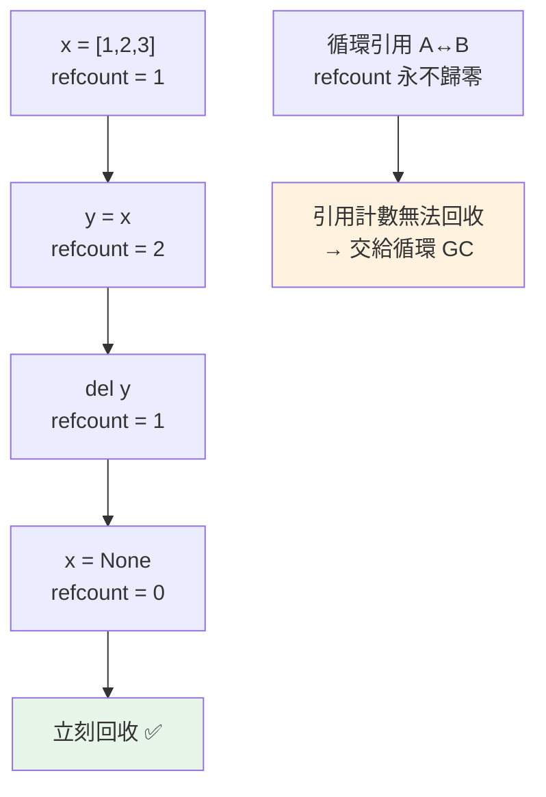

# 引用計數 reference counting

> CPython 記憶體管理的主力是引用計數——每個物件記著「有幾個名稱指向我」，歸零就立刻回收。它簡單、即時，但無法處理循環引用（那交給 GC）。這也是 GIL 存在的根本原因。

## 💡 白話導讀（建議先讀）

Python 不用手動釋放記憶體——那它怎麼知道「這個物件沒人要了，可以清掉」？

主力機制簡單得漂亮。還記得 [Part 2 的便利貼](../02-fundamentals/01-dynamic-typing.md)嗎（變數是貼在物件上的便利貼）？

> **每個物件掛著一個計數牌：「目前有幾張便利貼貼著我」。**

- 多一個名稱指向它（賦值、放進 list、傳進函式）→ 計數 **+1**
- 少一個（名稱改貼別處、離開作用域、從容器移除）→ 計數 **−1**
- **計數歸零＝沒有任何人貼著它＝立刻清走**（記憶體釋放、`__del__` 執行）

```pycon
>>> import sys
>>> a = [1, 2, 3]
>>> sys.getrefcount(a)    # 可以親眼看計數(注意:傳進函式本身會暫時 +1)
```

這個機制的性格是**即時**：歸零的瞬間就回收,不像 Java 的 GC「等有空再清」——所以 Python 的記憶體佔用相對可預測、檔案關閉等清理也及時。

但它有兩個著名的軟肋,各預告一章：

1. **循環引用**:A 貼著 B、B 貼著 A——兩個計數都永不歸零,但外界誰也摸不到他們。**計數制度對此無解**,需要[第二道防線（GC）](04-garbage-collection.md)。
2. **計數牌本身怕搶寫**:+1/−1 不是一步完成的動作,兩條執行緒同時改會改壞——**這正是 [GIL 那把刀](08-gil-internals.md)存在的根本原因**。

一句話:**引用計數是主力清潔工,即時但有盲區**——後面兩章補他的漏。

## Why（為什麼）

Python 不用手動 `free`，記憶體自動回收——但它「怎麼知道」某個物件沒人用了、可以回收？答案主要是**引用計數（reference counting）**。理解它能解答很多問題：為什麼物件用完就立刻被回收（不像 Java 等 GC 有延遲）、為什麼 GIL 存在（保護引用計數）、為什麼有循環引用的問題（需要額外的 GC，見 [GC](04-garbage-collection.md)）、以及閉包/快取為何會意外延長物件壽命。這是 CPython 記憶體管理的核心機制。

## Theory（理論：計數指向的引用）

**引用計數**：CPython 為每個物件維護一個計數器（計數牌），記錄「**有多少個引用（便利貼）指向這個物件**」。

- 每當一個新的名稱/容器/引用指向物件，計數 **+1**。
- 每當一個引用消失（名稱重新綁定、離開作用域、從容器移除），計數 **−1**。
- **計數歸零（沒人貼著它）→ 物件立刻被回收**（記憶體釋放、呼叫 `__del__`）。

這是「一切皆物件」（見[一切皆物件](01-everything-is-object.md)）的直接後果——每個物件的底層結構裡都有一個 `ob_refcnt` 欄位。

性格：**即時**（歸零馬上回收，記憶體佔用可預測）且**簡單**。

軟肋：循環引用無解（交給 [GC](04-garbage-collection.md)）、計數操作非原子（是 [GIL](08-gil-internals.md) 存在的根本原因）。

## Specification（規範：查看引用計數）

```python
import sys

sys.getrefcount(obj)     # 查看引用計數
# ⚠️ 注意：getrefcount 本身會「多算一次」（把 obj 傳給它也是一個引用）

# 引用計數變化的操作
x = [1, 2, 3]        # 建立物件，refcount = 1（x 指向它）
y = x                # +1，refcount = 2（y 也指向）
del y                # −1，refcount = 1
x = None             # −1，refcount = 0 → 立刻回收
```

## Implementation（增減時機、即時回收、循環問題、GIL 關聯）

### 引用計數何時 +1 / −1

引用計數在這些時機變化：

**+1（新引用）**：
- 賦值給名稱：`x = obj`
- 存進容器：`lst.append(obj)`、`d[key] = obj`
- 當函式引數傳入
- 當作屬性：`self.attr = obj`

**−1（引用消失）**：
- 名稱重新綁定：`x = other`
- `del x`
- 離開作用域（函式返回，區域變數消失）
- 從容器移除：`lst.remove(obj)`、`del d[key]`

```pycon
>>> import sys
>>> a = []
>>> sys.getrefcount(a)      # 2（a 一個 + getrefcount 參數一個）
2
>>> b = a
>>> sys.getrefcount(a)      # 3（多了 b）
3
>>> del b
>>> sys.getrefcount(a)      # 2
2
```

**注意 `sys.getrefcount(a)` 會比你預期多 1**——因為把 `a` 傳給 `getrefcount` 這個動作本身也建立了一個臨時引用。

### 即時回收：歸零立刻釋放

引用計數的優點是**即時性**——物件一沒人用就立刻回收，不必等 GC 掃描：

```python
class Noisy:
    def __del__(self):        # 物件被回收時呼叫
        print("被回收了")

x = Noisy()
x = None          # refcount 歸零 → 立刻印「被回收了」
print("這行在回收之後")
```

輸出「被回收了」會在 `x = None` 當下（不是程式結束時）——這是引用計數的即時性，讓記憶體佔用可預測、資源（如檔案）能及時釋放。（但別依賴 `__del__` 做重要清理，用 `with`，見 [context manager](../06-error-handling/06-context-manager.md)。）

### 循環引用：引用計數的死角

引用計數有個**根本缺陷**——**無法回收循環引用**。若 A 引用 B、B 引用 A，即使外部沒人再用它們，它們的引用計數也**永遠不會歸零**（彼此撐著）：

```python
a = {}
b = {}
a["b"] = b       # a 引用 b
b["a"] = a       # b 引用 a → 循環！
del a            # a 名稱消失，但 b["a"] 還指著它 → 不回收
del b            # b 名稱消失，但 a["b"] 還指著它 → 不回收
# 兩個 dict 互相撐著，refcount 都不歸零 → 記憶體洩漏！
```

為了處理這種循環，CPython 有**額外的循環垃圾回收器（cyclic GC）**（見 [GC](04-garbage-collection.md））——它專門偵測並回收這種「引用計數無法處理的循環」。引用計數 + 循環 GC 才是 CPython 完整的記憶體管理。

### 引用計數與 GIL 的關聯

這是重要的連結：**引用計數是 GIL 存在的根本原因之一**（見 [GIL 底層原理](08-gil-internals.md)）。因為每個物件的引用計數在多執行緒下若不加鎖地增減，會產生競態、導致計數錯誤與記憶體損毀。CPython 用 GIL「一次只讓一個執行緒跑」來簡單地保護引用計數——這也是為何移除 GIL（free-threaded，見 [free-threaded](../09-concurrency/12-free-threaded-python.md)）如此困難（要改成不依賴 GIL 的執行緒安全引用計數）。

## Code Example（可執行的 Python 範例）

```python
# refcount_demo.py
from __future__ import annotations

import sys


def demo() -> None:
    # 1. 引用計數變化
    a = [1, 2, 3]
    # getrefcount 會多算 1（傳參本身）
    print(f"a 建立後: {sys.getrefcount(a) - 1} 個引用")  # 1

    b = a
    print(f"b = a 後: {sys.getrefcount(a) - 1} 個引用")  # 2

    container = [a, a]  # 容器裡兩個引用
    print(f"放進容器後: {sys.getrefcount(a) - 1} 個引用")  # 4

    del b
    del container
    print(f"del 後: {sys.getrefcount(a) - 1} 個引用")  # 1

    # 2. 即時回收（__del__ 在歸零時觸發）
    class Resource:
        def __init__(self, name: str) -> None:
            self.name = name

        def __del__(self) -> None:
            print(f"  [{self.name} 被回收]")

    print("\n即時回收示範:")
    r = Resource("A")
    print("  重新賦值 r...")
    r = Resource("B")  # A 的 refcount 歸零 → 立刻回收
    print("  程式繼續...")
    del r  # B 也回收


if __name__ == "__main__":
    demo()
```

**預期輸出**：

```pycon
$ python refcount_demo.py
a 建立後: 1 個引用
b = a 後: 2 個引用
放進容器後: 4 個引用
del 後: 1 個引用

即時回收示範:
  重新賦值 r...
  [A 被回收]
  程式繼續...
  [B 被回收]
```

## Diagram（圖解：引用計數）



## Best Practice（最佳實踐）

- **理解物件「用完立刻回收」**（引用計數即時性）：記憶體佔用可預測，但別依賴 `__del__` 做重要清理（用 `with`）。
- **注意循環引用**：互相引用的物件（雙向鏈結、父子互指、快取）引用計數不歸零，靠循環 GC 回收（見 [GC](04-garbage-collection.md)）——但仍會延遲回收。
- **打破循環引用用 `weakref`**（見 [weakref](10-weakref.md)）：讓某一方向是弱引用，不增加引用計數。
- **注意閉包/快取延長壽命**：閉包捕捉的變數、快取持有的物件，引用計數不歸零，可能造成非預期的記憶體滯留。
- **用 `sys.getrefcount` 除錯**（記得減 1），但別在正式邏輯依賴具體數字（實作細節）。
- **理解引用計數與 GIL 的關聯**：這解釋了 GIL 為何存在、free-threaded 為何困難。

## Common Mistakes（常見誤解）

- **以為 Python 只用「垃圾回收（GC）」**：主力是**引用計數**，GC 只處理循環（見 [GC](04-garbage-collection.md)）。
- **忘了 `sys.getrefcount` 多算 1**：傳參本身是一個引用；解讀要減 1。
- **循環引用造成的滯留**：以為 `del` 就回收了，但互相引用的物件要等循環 GC。
- **依賴 `__del__` 做清理**：回收時機在有循環/例外時不保證；重要清理用 `with`（見 [context manager](../06-error-handling/06-context-manager.md)）。
- **閉包/全域快取意外持有大物件**：引用計數不歸零 → 記憶體滯留；用 weakref 或明確清除。
- **以為 GIL 和記憶體無關**：GIL 正是為了保護引用計數（見 [GIL 底層](08-gil-internals.md)）。

## Interview Notes（面試重點）

- **能說明引用計數**：每個物件記「有幾個引用指向它」，+1（賦值/存容器/傳參/屬性）、−1（重綁/del/離開作用域/移出容器），**歸零立刻回收**（即時性）。
- **知道它的死角：循環引用**——互相引用的物件引用計數永不歸零，需要**額外的循環 GC**（引用計數 + 循環 GC 才完整）。
- **關鍵連結**：**引用計數是 GIL 存在的根本原因**（保護計數避免多執行緒競態），也是 free-threaded 困難的原因。
- 知道 `sys.getrefcount`（會多算 1）、`__del__` 在歸零時觸發但不該依賴它清理。
- 知道打破循環用 `weakref`（連結 [weakref](10-weakref.md)）、閉包/快取會延長物件壽命。

---

➡️ 下一章：[循環垃圾回收 GC](04-garbage-collection.md)

[⬆️ 回 Part 10 索引](README.md)
