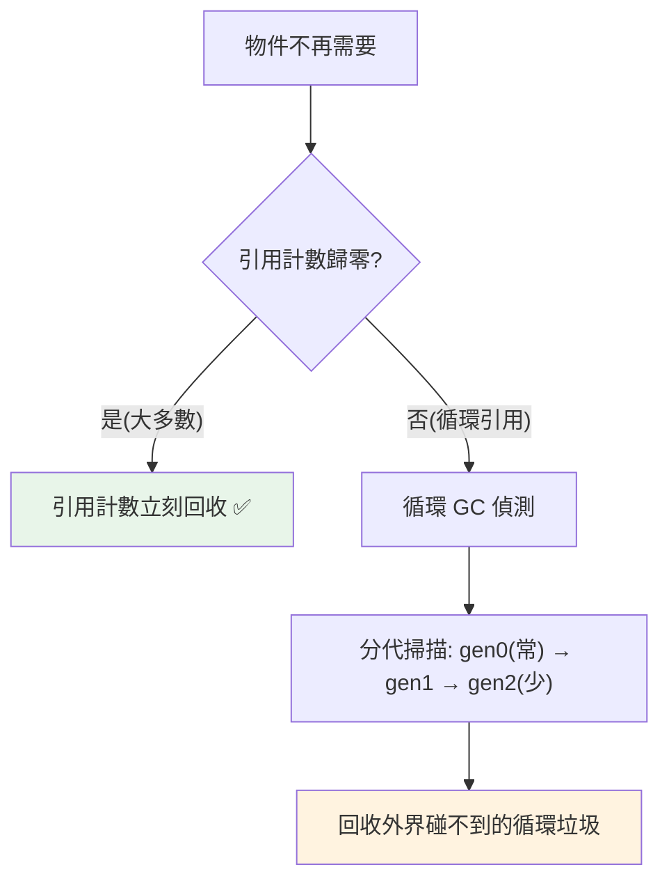

# 循環垃圾回收 GC

> 引用計數處理不了循環引用，所以 CPython 有第二道防線：一個**分代的循環垃圾回收器**，專門偵測並回收「彼此撐著、外界卻碰不到」的物件循環。理解它，才知道 Python 記憶體管理的全貌。

## Why（為什麼）

上一章講到引用計數的死角——循環引用（A 引用 B、B 引用 A）的引用計數永不歸零，會記憶體洩漏。CPython 用一個**專門的循環垃圾回收器（cyclic garbage collector）** 補上這個洞。理解它能解答：為什麼有時記憶體不是立刻釋放（GC 是週期性的）、`gc` 模組能做什麼、為什麼「分代」、以及何時該手動介入 GC。這是 Python 記憶體管理的完整拼圖，也是進階面試題。

## Theory（理論：兩道防線）

CPython 的記憶體回收是**兩套機制的組合**：

1. **引用計數（主力）**：處理絕大多數情況——歸零立刻回收（見 [引用計數](03-reference-counting.md)）。
2. **循環 GC（補充）**：處理引用計數無法回收的**循環引用**。

循環 GC 只負責一件事：**找出「彼此引用形成循環、但外界已無法觸及」的物件群，回收它們**。它不取代引用計數——大部分物件仍由引用計數即時回收，GC 只在「有循環垃圾」時介入。

**關鍵**：只有**可能形成循環的容器型物件**（list、dict、set、自訂物件等能持有其他物件的）才被 GC 追蹤。**不可變的原子型別（int、str、float）不會參與循環**（它們不持有其他物件的可變引用），所以不被 GC 追蹤。

## Specification（規範：gc 模組）

```python
import gc

gc.collect()          # 手動觸發一次完整 GC，回傳回收的物件數
gc.disable()          # 停用自動 GC（引用計數仍運作）
gc.enable()           # 啟用
gc.get_count()        # 各代目前的物件計數 (gen0, gen1, gen2)
gc.get_threshold()    # 各代的觸發閾值
gc.set_threshold(700, 10, 10)   # 調整閾值
gc.get_stats()        # GC 統計
gc.is_tracked(obj)    # 物件是否被 GC 追蹤
```

## Implementation（分代、觸發時機、gc 模組、何時介入）

### 分代回收（generational）

循環 GC 用**分代（generational）** 策略提升效率，基於一個觀察——**「大多數物件很快就死（短命），存活久的物件會繼續存活很久」**（弱世代假說）。

CPython 把物件分成**三代（generation 0, 1, 2）**：

- **新物件放在第 0 代**。
- 第 0 代 GC 掃描後**存活的物件晉升到第 1 代**，第 1 代存活的晉升到第 2 代。
- **越年輕的代掃描越頻繁**（第 0 代最常掃、第 2 代最少）。

這樣「大量短命物件」在第 0 代就被高頻回收，「長壽物件」不必每次都掃——**用「頻繁掃年輕代、少掃老年代」換取效率**。

### 觸發時機：基於分配數量

自動 GC 不是定時，而是**基於「分配的物件數」**：當「新分配的物件數 − 釋放的物件數」超過閾值（第 0 代預設 700），就觸發一次第 0 代 GC：

```pycon
>>> import gc
>>> gc.get_threshold()
(700, 10, 10)          # gen0 閾值 700，gen1/gen2 每 10 次晉升觸發
>>> gc.get_count()
(略, 略, 略)            # 各代目前累積數
```

所以 GC 是**週期性、非即時**的——循環垃圾不會馬上回收，要等下次 GC。這解釋了「為什麼記憶體有時延遲釋放」。

### 循環 GC 如何找出垃圾

簡化說，循環 GC 的演算法：對被追蹤的物件，暫時「扣掉容器內部互相的引用」，看誰的引用計數變成 0——那些「只被循環內部引用、外界碰不到」的物件就是垃圾，回收它們。這能正確處理任意複雜的循環。

### 手動介入 GC

多數情況不必碰 GC，但有些場景有用：

```python
import gc

# 1. 手動回收（如剛釋放大量循環物件後想立刻回收）
collected = gc.collect()
print(f"回收了 {collected} 個物件")

# 2. 效能敏感時暫時停用（如批次載入大量短命物件，避免 GC 頻繁打斷）
gc.disable()
# ... 大量分配 ...
gc.enable()
gc.collect()

# 3. 除錯記憶體洩漏
gc.set_debug(gc.DEBUG_LEAK)
```

**注意**：停用 GC 後引用計數仍運作（非循環物件照樣即時回收），只是循環垃圾會累積到重新啟用。停用要小心（可能記憶體暴增）。

### `__del__` 與循環的歷史問題

早期 Python，帶 `__del__` 的物件若在循環裡，GC **無法安全回收**（不知道以什麼順序呼叫 `__del__`），會被放進 `gc.garbage` 列表而洩漏。**Python 3.4（PEP 442）修正了這個**——現在有 `__del__` 的循環物件也能被回收。但這是「別依賴 `__del__` 做清理」的又一理由（用 `with`）。

## Code Example（可執行的 Python 範例）

```python
# gc_demo.py
from __future__ import annotations

import gc


class Node:
    """會形成循環的節點。"""

    def __init__(self, name: str) -> None:
        self.name = name
        self.ref: Node | None = None


def create_cycle() -> None:
    """建立循環引用（引用計數無法回收）。"""
    a = Node("A")
    b = Node("B")
    a.ref = b  # a → b
    b.ref = a  # b → a（循環！）
    # 函式返回後，a、b 名稱消失，但彼此引用 → 引用計數不歸零


def demo() -> None:
    # 1. 建立多個循環（引用計數無法回收）
    gc.collect()  # 先清乾淨
    for _ in range(100):
        create_cycle()

    # 這些循環物件靠引用計數不會被回收
    print("建立了 100 組循環引用")

    # 2. 手動 GC 回收循環垃圾
    collected = gc.collect()
    print(f"gc.collect() 回收了 {collected} 個物件（循環垃圾）")

    # 3. GC 只追蹤容器型物件
    print(f"\nlist 被追蹤: {gc.is_tracked([1, 2])}")     # True
    print(f"int 被追蹤: {gc.is_tracked(42)}")            # False（原子型別）
    print(f"str 被追蹤: {gc.is_tracked('hi')}")          # False

    # 4. 分代閾值
    print(f"\nGC 閾值（各代）: {gc.get_threshold()}")


if __name__ == "__main__":
    demo()
```

**預期輸出**（回收數字依版本而異）：

```pycon
$ python gc_demo.py
建立了 100 組循環引用
gc.collect() 回收了 200 個物件（循環垃圾）
list 被追蹤: True
int 被追蹤: False
str 被追蹤: False

GC 閾值（各代）: (700, 10, 10)
```

## Diagram（圖解：兩道防線 + 分代）



## Best Practice（最佳實踐）

- **多數情況不必管 GC**：引用計數 + 自動循環 GC 自動處理；別過早優化。
- **避免/打破循環引用**：雙向鏈結、父子互指、觀察者等易形成循環；用 `weakref`（見 [weakref](10-weakref.md)）讓某方向不增加引用計數。
- **效能敏感的批次分配可暫時 `gc.disable()`**（如載入大量短命物件），完成後 `enable()` + `collect()`——但小心記憶體暴增。
- **需要立刻回收循環垃圾用 `gc.collect()`**（如剛釋放大量循環物件）。
- **除錯記憶體洩漏用 `gc.set_debug` / `gc.get_objects` / tracemalloc**（見 [記憶體優化](../18-performance/06-memory-optimization.md)）。
- **別依賴 `__del__` 做清理**：回收時機不保證即時（尤其循環中）；用 `with`。

## Common Mistakes（常見誤解）

- **以為 Python 只用 GC 回收**：主力是引用計數，GC 只處理循環。
- **以為循環垃圾會立刻回收**：GC 是週期性/基於分配數觸發，非即時；要立刻用 `gc.collect()`。
- **以為所有物件都被 GC 追蹤**：只有容器型（能持有引用的）被追蹤；int/str 等原子型別不參與循環、不被追蹤。
- **停用 GC 忘了記憶體風險**：循環垃圾會累積；停用要短期且謹慎。
- **依賴 `__del__`**：時機不保證；重要清理用 `with`。
- **不知道分代策略**：以為 GC 每次全掃；其實分代（頻繁掃年輕代）以提升效率。

## Interview Notes（面試重點）

- **能說出 CPython 記憶體管理是兩道防線**：**引用計數（主力、即時）+ 循環 GC（補充、處理循環引用）**。
- **知道循環 GC 是分代的**：三代、基於弱世代假說（多數物件短命）、頻繁掃年輕代——是效率優化。
- 知道**觸發基於分配數（非定時）**，故循環垃圾**非即時回收**。
- 知道**只有容器型物件被 GC 追蹤**（int/str 等原子型別不參與循環）。
- 知道 `gc` 模組能 `collect()`/`disable()`/調閾值，以及何時介入（批次分配、立即回收、除錯）。
- 加分：知道 3.4（PEP 442）後 `__del__` 的循環物件也能回收，但仍不該依賴 `__del__` 清理。

---

➡️ 下一章：[記憶體管理與 arena](05-memory-management.md)

[⬆️ 回 Part 10 索引](README.md)
