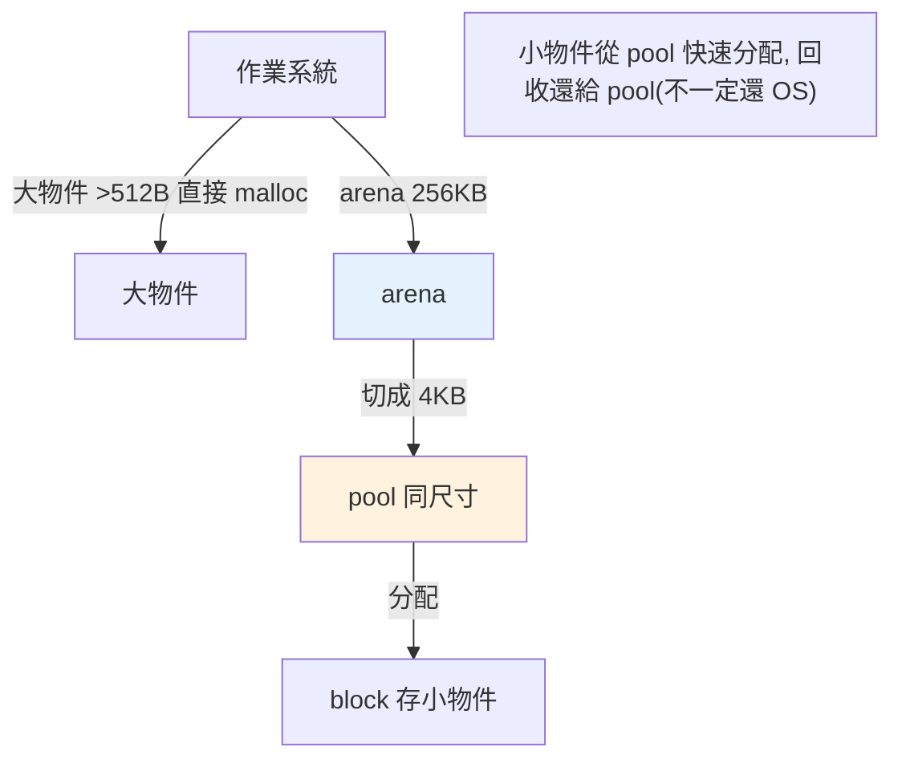

# 記憶體管理與 arena

> CPython 不是每個小物件都去跟作業系統要記憶體——它有一套分層的記憶體配置器（pymalloc），用 arena/pool/block 管理小物件，減少系統呼叫、提升效率。理解它，才知道 Python 物件「較重」與記憶體行為的根源。

## Why（為什麼）

「Python 物件為什麼比 C 的 primitive 重？」「為什麼釋放物件後，記憶體有時沒還給作業系統？」這些問題的答案在 CPython 的**記憶體配置器**。它不直接為每個小物件呼叫 `malloc`（那太慢），而是自己管理一大塊記憶體、切成小塊分配。理解 pymalloc 的分層結構與物件的記憶體開銷，能讓你看懂 Python 的記憶體行為，也是 `__slots__`、向量化等優化為何有效的基礎（見 [記憶體優化](../18-performance/06-memory-optimization.md)）。

## Theory（理論：分層的記憶體配置）

CPython 的記憶體管理分層——大物件直接找作業系統，小物件（≤ 512 bytes）由 CPython 自己的配置器 **pymalloc** 管理，避免頻繁的系統呼叫：

```text
作業系統記憶體
    ↑（大物件 > 512 bytes 直接 malloc）
CPython pymalloc（管理小物件 ≤ 512 bytes）
    ├── arena（256 KB 大塊，向 OS 要）
    │   └── pool（4 KB，同一 pool 分配同尺寸的 block）
    │       └── block（實際存物件的小塊）
```

- **arena**：pymalloc 向作業系統要的大塊記憶體（256 KB）。
- **pool**：arena 切成的 4 KB 頁，每個 pool 只分配**同一尺寸**的 block。
- **block**：物件實際佔用的小塊。

小物件從 pool 的空閒 block 快速分配，不必每次找 OS——這是 pymalloc 提升效率的核心。

## Specification（規範：查看記憶體）

```python
import sys

sys.getsizeof(obj)        # 物件佔用的位元組數（不含它引用的物件）

# 各型別的物件開銷（CPython 64 位元，數字約略）
sys.getsizeof(0)          # ~28 bytes（int 物件！不是 4/8）
sys.getsizeof("")         # ~49 bytes（空字串）
sys.getsizeof([])         # ~56 bytes（空 list）
sys.getsizeof({})         # ~64 bytes（空 dict）

# 追蹤記憶體分配
import tracemalloc
tracemalloc.start()
# ... 程式 ...
current, peak = tracemalloc.get_traced_memory()
```

## Implementation（物件開銷、pymalloc、記憶體不還 OS）

### 物件開銷：為什麼 int 是 28 bytes

每個 Python 物件都有**固定的物件標頭開銷**（呼應 [一切皆物件](01-everything-is-object.md)）——至少包含**引用計數 + 型別指標**，加上型別特定的資料：

```pycon
>>> import sys
>>> sys.getsizeof(0)       # 一個 int「物件」約 28 bytes
28
>>> sys.getsizeof(2**100)  # 大整數更多（任意精度）
44
```

C 的 `int` 是 4/8 bytes 的純數值；Python 的 `int` 是一個**物件**，有引用計數（8 bytes）、型別指標（8 bytes）、數值本身、以及其他欄位——所以約 28 bytes。**這就是「Python 物件較重」的根源**，也是為什麼一個裝百萬整數的 list 佔的記憶體遠大於 C 陣列（每個元素是完整物件 + list 存的是指標）。這也解釋了為什麼 CPU 密集的純 Python 數值運算慢、需要 numpy 向量化（連續的原生數值，見 [Part 17](../17-data-science/README.md)）。

### `getsizeof` 只算「淺層」

```pycon
>>> import sys
>>> lst = [1, 2, 3]
>>> sys.getsizeof(lst)     # 只算 list 物件本身（含 3 個指標），不含元素
88
>>> # 不含 1, 2, 3 這三個 int 物件的大小！
```

`getsizeof` 是**淺層**的——它算容器本身，不遞迴算內部元素。要算「連同內容的總大小」得自己遞迴（或用工具）。

### pymalloc：小物件的快速分配

當你建立小物件（如小 list、小 int），pymalloc 從已有的 pool 找一個空閒 block 給它——**不必每次向 OS 要記憶體**（系統呼叫昂貴）。物件被回收時，block 還給 pool，供下次同尺寸物件重用。這種「自己管理小物件池」的策略大幅減少系統呼叫，是 Python 建立/回收大量小物件（如迴圈裡的臨時物件）仍算快的原因。

### 記憶體不一定還給作業系統

一個常見困惑：**釋放大量物件後，Python 行程的記憶體佔用（從 OS 看）可能沒有下降**。原因：

- pymalloc 回收的 block 還給**pool**（供重用），不一定立刻還給 OS。
- 只有當**整個 arena 都空了**，才可能還給 OS——但若 arena 裡還有零星存活物件（記憶體碎片），整個 arena 就還不掉。

所以「Python 記憶體用了就不太還」是常見現象（尤其大量小物件後）。要真正釋放，有時得重啟行程，或用 multiprocessing 讓子行程處理完就結束（見 [multiprocessing](../09-concurrency/05-multiprocessing.md)）。

### 減少記憶體開銷的手段

- **`__slots__`**：讓類別實例不使用 `__dict__`（省下每實例的 dict 開銷），見 [記憶體優化](../18-performance/06-memory-optimization.md)。
- **numpy 陣列**：連續的原生數值，沒有「每個數字都是物件」的開銷。
- **生成器**：惰性產值，不一次把全部放進記憶體（見 [惰性求值](../07-iterators-generators/07-lazy-evaluation.md)）。
- **`array` 模組**：同質數值的緊湊陣列。

## Code Example（可執行的 Python 範例）

```python
# memory_management_demo.py
from __future__ import annotations

import sys


class WithDict:
    """一般類別：每個實例有 __dict__。"""

    def __init__(self, x: int, y: int) -> None:
        self.x = x
        self.y = y


class WithSlots:
    """用 __slots__：省下 __dict__ 開銷。"""

    __slots__ = ("x", "y")

    def __init__(self, x: int, y: int) -> None:
        self.x = x
        self.y = y


def deep_size(obj: object) -> int:
    """粗略計算容器 + 其元素的總大小（僅示範）。"""
    size = sys.getsizeof(obj)
    if isinstance(obj, (list, tuple, set)):
        size += sum(sys.getsizeof(item) for item in obj)
    return size


def demo() -> None:
    # 1. 物件開銷：int 也是完整物件
    print(f"int 0: {sys.getsizeof(0)} bytes")
    print(f"空 list: {sys.getsizeof([])} bytes")
    print(f"空 dict: {sys.getsizeof({})} bytes")

    # 2. getsizeof 是淺層的
    lst = [1, 2, 3]
    print(f"\nlist 淺層: {sys.getsizeof(lst)} bytes")
    print(f"list 含元素: {deep_size(lst)} bytes")

    # 3. __slots__ 省記憶體
    normal = WithDict(1, 2)
    slotted = WithSlots(1, 2)
    print(f"\n一般實例: {sys.getsizeof(normal)} + __dict__ {sys.getsizeof(normal.__dict__)} bytes")
    print(f"__slots__ 實例: {sys.getsizeof(slotted)} bytes（無 __dict__）")


if __name__ == "__main__":
    demo()
```

**預期輸出**（數字依平台略異）：

```pycon
$ python memory_management_demo.py
int 0: 28 bytes
空 list: 56 bytes
空 dict: 64 bytes

list 淺層: 88 bytes
list 含元素: 172 bytes

一般實例: 48 + __dict__ 296 bytes
__slots__ 實例: 48 bytes（無 __dict__）
```

## Diagram（圖解：pymalloc 分層）



## Best Practice（最佳實踐）

- **理解 Python 物件的固定開銷**：每個物件有引用計數 + 型別指標等（int ~28B）——解釋了記憶體用量與純 Python 數值運算的慢。
- **大量同質數值用 numpy / `array`**：避免「每個數字都是物件」的開銷（見 [Part 17](../17-data-science/README.md)）。
- **固定欄位的類別用 `__slots__`**：省下每實例的 `__dict__`（見 [記憶體優化](../18-performance/06-memory-optimization.md)）。
- **大資料用生成器惰性處理**：不一次全放進記憶體（見 [惰性求值](../07-iterators-generators/07-lazy-evaluation.md)）。
- **知道記憶體不一定還給 OS**：長跑服務處理大量資料後記憶體可能不降；必要時用 multiprocessing 子行程處理完即結束。
- **除錯記憶體用 `tracemalloc`**（標準庫，見 [記憶體優化](../18-performance/06-memory-optimization.md)）。

## Common Mistakes（常見誤解）

- **以為 Python int 是 4/8 bytes**：它是完整物件，約 28 bytes（含引用計數、型別指標等）。
- **以為 `getsizeof` 算「連內容」的總大小**：它是**淺層**的，不含容器內元素。
- **以為釋放物件後記憶體立刻還給 OS**：pymalloc 常保留供重用，碎片化時整個 arena 還不掉。
- **用大 list 存數值做數值運算**：物件開銷大且慢；用 numpy。
- **忽略 `__dict__` 的開銷**：大量小物件實例的 `__dict__` 佔用可觀；固定欄位用 `__slots__`。
- **以為 pymalloc 是給所有物件用**：只管小物件（≤512B），大物件直接找 OS。

## Interview Notes（面試重點）

- **能說明 CPython 記憶體分層**：小物件（≤512B）由 **pymalloc（arena → pool → block）** 管理、減少系統呼叫；大物件直接 malloc。
- **知道物件開銷**：每個物件有引用計數 + 型別指標等固定開銷（int ~28B），這是「Python 物件較重、純數值運算慢」的根源，故需 numpy 向量化。
- 知道 **`getsizeof` 是淺層的**（不含內部元素）。
- **知道「記憶體不一定還給 OS」**：pymalloc 保留 block 供重用、碎片化使 arena 還不掉——解釋長跑服務記憶體不降。
- 知道減少記憶體的手段：**`__slots__`、numpy/array、生成器**。
- 加分：知道用 `tracemalloc` 除錯記憶體。

---

➡️ 下一章：[bytecode 與 dis](06-bytecode-and-dis.md)

[⬆️ 回 Part 10 索引](README.md)
