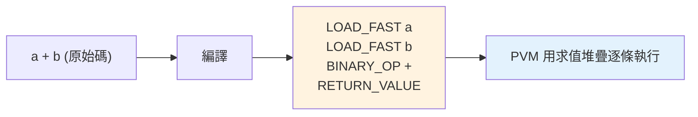

# bytecode 與 dis

> 你寫的 Python 原始碼會被編譯成 bytecode——一串給虛擬機執行的低階指令。`dis` 模組讓你看見它，是理解「Python 底層在做什麼」「兩種寫法哪個快」的最佳工具。

## 💡 白話導讀（建議先讀）

[Part 1 說過](../01-getting-started/12-how-python-runs.md)：CPython 先把你的程式改寫成「速記稿」（bytecode），再照稿執行。
這章拿出放大鏡——**`dis` 模組,把速記稿攤開來看**：

```pycon
>>> import dis
>>> dis.dis(lambda a, b: a + b)
    LOAD_FAST  a        # 把 a 推上堆疊
    LOAD_FAST  b        # 把 b 推上堆疊
    BINARY_OP  +        # 彈出兩個,相加,結果推回
    RETURN_VALUE        # 彈出堆疊頂,回傳
```

讀懂它只需要一個模型——**疊盤子**。bytecode 是「堆疊導向」的：

- 大多數指令圍繞一個「**求值堆疊**」工作:把值**疊上去**(LOAD)、**取下來運算、結果疊回去**(BINARY_OP)。
- `a + b` 於是變成:疊 a、疊 b、取兩盤合成一盤放回——四條指令。

會看速記稿,你就有了一件神器:**「兩種寫法哪個快」不用猜,攤開比**——
誰的指令少、誰在迴圈裡多做了重複工作,一目瞭然。之後 [Part 18 效能](../18-performance/README.md)的很多結論,都能用 dis 親手驗證。

順帶收編幾個熟面孔:速記稿存放在 `function.__code__`(code object)裡;import 時快取成 `.pyc`——[Part 1 的 `__pycache__`](../01-getting-started/12-how-python-runs.md) 謎底完全揭曉。

## Why（為什麼）

[Python 如何執行](../01-getting-started/12-how-python-runs.md) 提過 CPython 先把原始碼編成 bytecode。這章深入：bytecode 長什麼樣、如何用 `dis` 反組譯查看、以及它能回答什麼實際問題——「`a += 1` 底層是幾步？」「這兩種寫法為什麼一個快一個慢？」「`.pyc` 裡存的是什麼？」會讀 bytecode，你就能從「猜」變成「看」底層行為，是效能分析（見 [Part 18](../18-performance/README.md)）與深入理解 Python 的利器。

## Theory（理論：bytecode 是中間指令）

**bytecode（位元組碼）** 是 CPython 把原始碼編譯後產生的**低階指令序列**——那份「速記稿」，介於「人寫的原始碼」與「機器執行」之間的中間表示。它：

- 存在 **code object**（`function.__code__`）裡。
- 由 **PVM（Python 虛擬機，見 [PVM](07-pvm.md)）** 逐條執行。
- 被快取成 **`.pyc`** 檔（見[如何執行](../01-getting-started/12-how-python-runs.md)）加速 import。

bytecode 是**堆疊導向的**——疊盤子模型：大部分指令操作一個「求值堆疊（evaluation stack）」——把值推上堆疊、彈出來運算、把結果推回。

理解「疊盤子」，讀任何 bytecode 都不難。

## Specification（規範：dis 模組）

```python
import dis

dis.dis(func)          # 反組譯函式（或 code object、字串）
dis.dis("a + b")       # 反組譯一段程式碼字串
dis.show_code(func)    # 顯示 code object 的詳細資訊
func.__code__          # 取得 code object
func.__code__.co_consts    # 常數
func.__code__.co_varnames  # 區域變數名
func.__code__.co_names     # 全域/屬性名
```

## Implementation（讀 bytecode、常見指令、比較寫法）

### 讀一段 bytecode

```python
import dis

def add(a, b):
    return a + b

dis.dis(add)
```

輸出（版本間指令名稱可能略異）：

```text
  2  RESUME               0
  3  LOAD_FAST            0 (a)      # 把區域變數 a 推上堆疊
     LOAD_FAST            1 (b)      # 把 b 推上堆疊
     BINARY_OP            0 (+)      # 彈出兩個, 相加, 結果推回
     RETURN_VALUE                    # 回傳堆疊頂端
```

逐條讀（堆疊操作）：`LOAD_FAST a`（推 a）→ `LOAD_FAST b`（推 b）→ `BINARY_OP +`（彈兩個、加、推回結果）→ `RETURN_VALUE`（回傳）。**`a + b` 在底層是四條堆疊指令**——這就是 bytecode 的樣貌。每欄：位移、指令名、引數、（人類可讀的）說明。

### 常見指令一覽

| 指令 | 作用 |
|------|------|
| `LOAD_FAST` | 推區域變數上堆疊（快，用索引） |
| `LOAD_GLOBAL` | 推全域/內建（較慢，要查找） |
| `LOAD_CONST` | 推常數 |
| `STORE_FAST` | 從堆疊存進區域變數 |
| `BINARY_OP` | 二元運算（+、-、* …） |
| `CALL` | 呼叫函式 |
| `RETURN_VALUE` | 回傳 |
| `POP_JUMP_IF_FALSE` | 條件跳轉（if/while） |

`LOAD_FAST`（區域變數）比 `LOAD_GLOBAL`（全域）快——這解釋了「把常用的全域/函式綁成區域變數」的微優化（見 [Part 18](../18-performance/README.md)）。

### 用 dis 回答「哪個快」

bytecode 能客觀比較兩種寫法。例如「`+=` 對 list」vs「`+`」：

```python
import dis

def use_augmented(lst):
    lst += [1]        # 原地 extend

def use_concat(lst):
    lst = lst + [1]   # 建新 list

dis.dis(use_augmented)   # 用 INPLACE 操作（BINARY_OP with inplace）
dis.dis(use_concat)      # 建立新 list 再賦值
```

或看「串接字串」為何 `join` 勝過 `+=`（見 [字串](../02-fundamentals/04-strings.md)）、「推導式」為何比 `for`+`append` 快（見 [推導式](../02-fundamentals/13-comprehensions.md)）——`dis` 讓你看見底層指令數的差異，把「聽說比較快」變成「看到為什麼」。

### `.pyc` 就是 bytecode 的快取

`__pycache__/*.pyc` 裡存的就是 code object 的 bytecode（序列化後）。import 時若原始碼沒改，直接載入 `.pyc` 跳過編譯（見 [如何執行](../01-getting-started/12-how-python-runs.md)）。所以 `.pyc` 不是機器碼、不能獨立執行——仍需 PVM。

### bytecode 是 CPython 實作細節

**bytecode 指令會隨 Python 版本改變**——3.11 大幅重寫了指令集（配合適應性直譯器，見 [PEP 659](11-adaptive-interpreter.md)）。所以：別依賴特定的 bytecode 指令名、別跨版本比較 `.pyc`。bytecode 是 CPython 的實作細節，用 `dis` 是為了理解與分析，不是為了寫死依賴它。

## Code Example（可執行的 Python 範例）

```python
# bytecode_demo.py
from __future__ import annotations

import dis
import io
from contextlib import redirect_stdout


def add(a: int, b: int) -> int:
    return a + b


def disassemble_to_string(func: object) -> str:
    """把 dis 輸出捕捉成字串。"""
    buf = io.StringIO()
    with redirect_stdout(buf):
        dis.dis(func)
    return buf.getvalue()


def demo() -> None:
    # 1. 看 add 的 bytecode
    print("=== add(a, b) 的 bytecode ===")
    print(disassemble_to_string(add))

    # 2. code object 的資訊
    code = add.__code__
    print(f"參數名: {code.co_varnames}")
    print(f"常數: {code.co_consts}")
    print(f"指令數（bytecode 長度）: {len(code.co_code)} bytes")

    # 3. 反組譯一段運算式
    print("\n=== 'x = 1 + 2 * 3' 的 bytecode ===")
    print(disassemble_to_string("x = 1 + 2 * 3"))


if __name__ == "__main__":
    demo()
```

**預期輸出**（指令名稱依版本略異）：

```pycon
$ python bytecode_demo.py
=== add(a, b) 的 bytecode ===
  ...
    RESUME                   0
    LOAD_FAST                0 (a)
    LOAD_FAST                1 (b)
    BINARY_OP                0 (+)
    RETURN_VALUE

參數名: ('a', 'b')
常數: (None,)
指令數（bytecode 長度）: ...

=== 'x = 1 + 2 * 3' 的 bytecode ===
  ...
    LOAD_CONST               ... (7)   # 編譯期就算好 1+2*3=7（常數摺疊）
    STORE_NAME               0 (x)
  ...
```

注意 `1 + 2 * 3` 被編譯成 `LOAD_CONST 7`——編譯器在**編譯期**就算好了常數運算（**常數摺疊 constant folding**），這也是 `dis` 能揭露的優化。

## Diagram（圖解：原始碼 → bytecode → 堆疊執行）



## Best Practice（最佳實踐）

- **用 `dis` 理解底層與比較寫法**：想知道「這兩種寫法差在哪 / 哪個快」，反組譯看指令數與類型。
- **知道 `LOAD_FAST`（區域）比 `LOAD_GLOBAL`（全域）快**：熱點迴圈裡把常用全域綁成區域變數是有效的微優化（見 [Part 18](../18-performance/README.md)）。
- **知道常數摺疊**：`1 + 2 * 3` 編譯期就算好，別為此手動優化。
- **別依賴特定 bytecode 指令名**：它隨版本變（尤其 3.11+）；`dis` 用於理解，不是寫死依賴。
- **配 `timeit` 驗證**：`dis` 看指令、`timeit` 量實際時間（見 [timeit](../18-performance/02-timeit.md)），兩者互補。
- **理解 `.pyc` 是 bytecode 快取**（見 [如何執行](../01-getting-started/12-how-python-runs.md)）。

## Common Mistakes（常見誤解）

- **以為 `.pyc` 是機器碼/可獨立執行**：它是 **bytecode**，仍需 PVM。
- **依賴特定 bytecode 指令名跨版本**：3.11 大改了指令集；別寫死依賴。
- **只看 bytecode 不量時間**：指令數不完全等於速度（有適應性優化等）；配 `timeit` 驗證。
- **以為 `a + b` 是「一步」**：底層是多條堆疊指令。
- **忽略常數摺疊**：`1+2` 在編譯期已算好，執行期不重算。
- **把 `dis` 當「反編譯回原始碼」的工具**：它是反組譯成 bytecode，不是還原原始碼。

## Interview Notes（面試重點）

- **能說明 bytecode 是原始碼編譯後的低階中間指令**，存在 code object、由 PVM 執行、快取成 `.pyc`；**堆疊導向**（推值/彈值/運算）。
- **會用 `dis.dis`** 反組譯，並能讀基本指令（`LOAD_FAST`/`LOAD_CONST`/`BINARY_OP`/`CALL`/`RETURN_VALUE`）。
- 知道 **`LOAD_FAST`（區域）比 `LOAD_GLOBAL`（全域）快** 及其優化含意。
- 知道**編譯期的常數摺疊**（`1+2*3` → 7）。
- 知道 **bytecode 是 CPython 實作細節、隨版本變**（3.11 大改），別寫死依賴；`dis` 用於理解與效能分析。
- 能連結：`dis` 揭露「推導式 vs for+append」「join vs +=」等為何有差（連結效能章）。

---

➡️ 下一章：[PVM 位元組碼直譯器](07-pvm.md)

[⬆️ 回 Part 10 索引](README.md)
