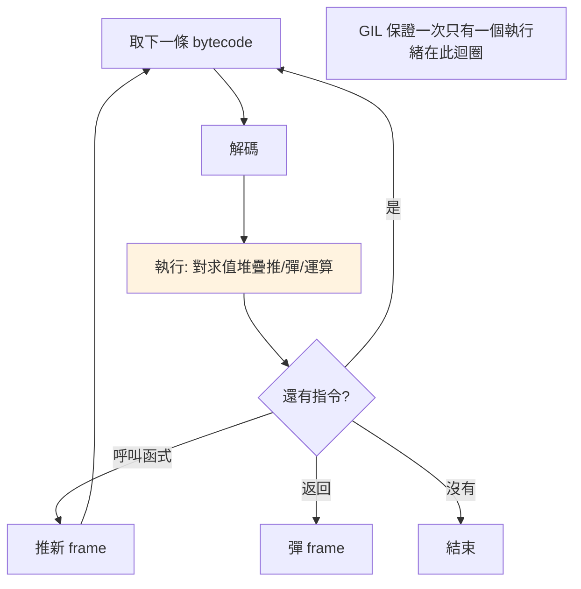

# PVM 位元組碼直譯器

> PVM 是 CPython 的心臟——一個「取指令、執行、重複」的巨大迴圈，用求值堆疊逐條執行 bytecode。理解它，就理解了 Python 為何比 C 慢，以及「直譯」的本質。

## 💡 白話導讀（建議先讀）

速記稿（bytecode）看過了。這章見**照稿執行的口譯員本人——PVM（Python 虛擬機）**。

他的工作,拆到底就是一個永不停歇的迴圈：

```text
while 稿子還沒念完:
    看下一條指令   (fetch)
    理解它         (decode)
    照做           (execute —— 對那疊盤子推推彈彈)
```

**取指令-執行迴圈（fetch-execute loop）**——CPython 原始碼裡它是一個巨大的 C 函式,你所有的 Python 程式最終都在這個迴圈裡被逐條消化。

這也正面回答了「**Python 為什麼比 C 慢**」——不是玄學,是結構：

- **C**:出發前把整篇講稿**翻成母語**（編譯成機器碼）,上台直接念——零翻譯開銷。
- **Python**:口譯員**每一條**都要「看-理解-做」——就算同一條指令在迴圈裡跑一百萬次,這三步固定開銷照付一百萬次。

再加上每個值都是[有戶口的物件](01-everything-is-object.md)（連 1+1 都要經過物件協定）,慢的來源就齊了。

但也別急著嫌棄:這個「逐條照稿」的結構,正是 Python **動態能力**的來源——執行到一半改型別、動態生成程式碼都行,因為沒有什麼是事先鎖死的。
而且口譯員最近變聰明了——[3.11 的適應性直譯器](11-adaptive-interpreter.md)讓他學會抄捷徑,本 Part 最後一章揭曉。

## Why（為什麼）

上一章看了 bytecode 長什麼樣，這章看**是誰執行它**——PVM（Python Virtual Machine，Python 虛擬機）。理解 PVM 能回答 Python 最根本的效能問題：「為什麼 Python 比 C 慢？」（每條 bytecode 都經過這層直譯迴圈的開銷）。也能理解「堆疊機器」的執行模型、frame（呼叫堆疊）的角色，以及 GIL 為何在這一層運作。這是把前面所有 CPython 內部知識（物件、bytecode）串起來的執行引擎。

## Theory（理論：取指令-執行的迴圈）

**PVM 是一個 bytecode 直譯器**——照速記稿念的口譯員。本質是一個巨大的迴圈（CPython 原始碼中的求值迴圈 `_PyEval_EvalFrameDefault`），不斷做：

```text
while 還有 bytecode:
    1. 取下一條指令（fetch）
    2. 解碼（decode）
    3. 執行它（對求值堆疊操作）
    4. 回到迴圈
```

這叫**取指令-執行迴圈（fetch-execute loop）**。PVM 是**堆疊機器（stack machine）**——用求值堆疊存中間值，指令從堆疊推/彈值（見 [bytecode](06-bytecode-and-dis.md) 的疊盤子）。

「直譯」的本質就在這裡：

> PVM **在執行期逐條讀 bytecode 並執行**，而不是像編譯語言事先把整支程式翻成機器碼。
> 每條 bytecode 都付一次「取指令、解碼、分派到 C 處理程式」的固定開銷——這是 Python 相對慢的結構性根源。

## Specification（規範：執行的組成）

PVM 執行時涉及幾個核心結構：

- **code object**：待執行的 bytecode + 中繼資料（`func.__code__`）。
- **frame（框架）**：一次函式呼叫的執行狀態——區域變數、求值堆疊、目前執行到哪（指令指標）。
- **求值堆疊（evaluation stack）**：每個 frame 有一個，存指令運算的中間值。
- **呼叫堆疊（call stack）**：一疊 frame——每呼叫一個函式就推一個新 frame，返回就彈掉。

```python
import sys
sys._getframe()          # 取得當前 frame
frame.f_locals           # 區域變數
frame.f_code             # 對應的 code object
frame.f_back             # 呼叫者的 frame（往上一層）
```

## Implementation（frame、堆疊執行、為何慢、GIL）

### frame：每次呼叫的執行狀態

每呼叫一個函式，PVM 建立一個 **frame** 來執行它的 code object——frame 持有該次呼叫的區域變數、求值堆疊、執行位置。函式返回時 frame 被彈掉。這疊 frame 就是**呼叫堆疊**——`traceback`（見 [traceback](../06-error-handling/12-assert-warnings-traceback.md)）顯示的就是這疊 frame：

```python
def c():
    raise ValueError("boom")   # frame c
def b():
    c()                        # frame b
def a():
    b()                        # frame a
a()
# traceback 顯示 a → b → c 的 frame 疊
```

`RecursionError`（遞迴太深）就是 frame 疊太高超過限制（`sys.getrecursionlimit()`，預設約 1000）——因為每次遞迴呼叫都推一個 frame。

### 堆疊執行的實例

回顧 `a + b` 的執行（見 [bytecode](06-bytecode-and-dis.md)），PVM 在求值堆疊上：

```text
LOAD_FAST a     堆疊: [a]
LOAD_FAST b     堆疊: [a, b]
BINARY_OP +     堆疊: [a+b]      （彈 a、b，推結果）
RETURN_VALUE    回傳 a+b
```

PVM 逐條執行，每條指令對堆疊做推/彈/運算——這就是「堆疊機器」的運作。

### 為什麼 Python 比 C 慢

PVM 的直譯開銷是 Python 慢的核心原因：

- **每條 bytecode 都要**：取指令、解碼、分派到 C 處理程式、操作堆疊——這些開銷在編譯語言（直接跑機器碼）不存在。
- **動態型別的代價**：`a + b` 時 PVM 要在執行期查 `a` 的型別、找 `__add__`——不像 C 編譯期就知道是整數加法。
- **物件開銷**：每個值是物件（見 [記憶體管理](05-memory-management.md)），操作要經過物件層。

所以 Python 的「慢」是直譯 + 動態 + 物件三者疊加。解法：**熱點下放到 C**（numpy、C 擴充）、**PyPy 的 JIT**（把常跑的 bytecode 編成機器碼）、或近年的**適應性直譯器**（見 [PEP 659](11-adaptive-interpreter.md)）優化 PVM 本身。

### GIL 在 PVM 這一層

**GIL 保護的正是 PVM 的執行**——它確保「同一時刻只有一個執行緒在這個求值迴圈裡執行 bytecode」（見 [GIL 底層](08-gil-internals.md)）。執行緒在 PVM 迴圈中定期檢查是否該釋放 GIL（讓別的執行緒跑），或在 I/O 時釋放。這是為何 CPython 執行緒無法並行執行 bytecode。

### PVM 是 CPython 實作、不是規範

再次強調：PVM、bytecode、求值堆疊都是 **CPython 的實作方式**。其他 Python 實作可以完全不同——**PyPy 用 JIT**（執行期把熱點 bytecode 編譯成機器碼，快很多）、**Jython 編成 JVM bytecode**。談 PVM 就是談 CPython 的直譯引擎（見 [為什麼是 Python](../01-getting-started/01-why-python.md)）。

## Code Example（可執行的 Python 範例）

```python
# pvm_demo.py
from __future__ import annotations

import sys


def show_call_stack() -> list[str]:
    """走訪呼叫堆疊（frame 疊）。"""
    frames = []
    frame = sys._getframe()
    while frame is not None:
        frames.append(frame.f_code.co_name)
        frame = frame.f_back
    return frames


def level_c() -> list[str]:
    return show_call_stack()


def level_b() -> list[str]:
    return level_c()


def level_a() -> list[str]:
    return level_b()


def demo() -> None:
    # 1. 呼叫堆疊 = 一疊 frame
    stack = level_a()
    print(f"呼叫堆疊（frame 疊，內到外）: {stack}")

    # 2. 遞迴限制 = frame 疊的上限
    print(f"\n遞迴上限（frame 疊上限）: {sys.getrecursionlimit()}")

    # 3. frame 持有區域變數
    def inner() -> None:
        x = 42
        y = "hello"
        frame = sys._getframe()
        print(f"\n當前 frame 的區域變數: {frame.f_locals}")
        print(f"對應的函式名: {frame.f_code.co_name}")

    inner()


if __name__ == "__main__":
    demo()
```

**預期輸出**：

```pycon
$ python pvm_demo.py
呼叫堆疊（frame 疊，內到外）: ['show_call_stack', 'level_c', 'level_b', 'level_a', 'demo', '<module>']
遞迴上限（frame 疊上限）: 1000
當前 frame 的區域變數: {'x': 42, 'y': 'hello'}
對應的函式名: inner
```

## Diagram（圖解：PVM 執行迴圈）



## Best Practice（最佳實踐）

- **理解 PVM 的直譯開銷是 Python 慢的根源**：熱點的 CPU 密集運算下放到 C（numpy、C 擴充）或用向量化（見 [Part 17](../17-data-science/README.md)、[Part 18](../18-performance/README.md)）。
- **避免深遞迴**：每次呼叫推一個 frame，太深會 `RecursionError`；改用迴圈或明確的堆疊。
- **理解 frame 與 traceback 的關係**：traceback 是 frame 疊的呈現（見 [traceback](../06-error-handling/12-assert-warnings-traceback.md)）。
- **知道 GIL 在 PVM 層運作**：解釋執行緒無法並行執行 bytecode（見 [GIL 底層](08-gil-internals.md)）。
- **需要極致效能考慮 PyPy**（JIT 編譯熱點）：純 Python 運算可快數倍（見 [為什麼是 Python](../01-getting-started/01-why-python.md)）。
- **PVM/bytecode 是實作細節**：理解它是為了效能與除錯，別寫死依賴。

## Common Mistakes（常見誤解）

- **以為 Python「純直譯、沒編譯」**：CPython 先編成 bytecode，再由 PVM 直譯 bytecode（兩段式，見 [如何執行](../01-getting-started/12-how-python-runs.md)）。
- **不理解 Python 慢的原因**：直譯開銷 + 動態型別查找 + 物件層——三者疊加。
- **深遞迴撞 `RecursionError`**：frame 疊有上限；別靠調高 recursionlimit 硬解（可能 stack overflow 崩潰），改寫成迭代。
- **以為 PVM 是 Python 語言的一部分**：它是 CPython 實作；PyPy（JIT）、Jython 完全不同。
- **以為 GIL 和 PVM 無關**：GIL 正是保護 PVM 的執行（一次一執行緒跑 bytecode）。
- **期待純 Python 迴圈能跑很快**：PVM 開銷讓它慢；CPU 密集用 numpy/C。

## Interview Notes（面試重點）

- **能描述 PVM**：CPython 的 bytecode 直譯器，一個**取指令-執行迴圈**、**堆疊機器**（用求值堆疊），逐條執行 bytecode。
- **能解釋 Python 為何比 C 慢**：PVM 的**直譯開銷**（每條 bytecode 取指令/解碼/分派）+ 動態型別執行期查找 + 物件層開銷。
- 知道 **frame**（每次呼叫的執行狀態，含區域變數/求值堆疊/位置），**呼叫堆疊 = frame 疊**，traceback / RecursionError 都源於此。
- 知道 **GIL 在 PVM 層保護執行**（一次一執行緒跑 bytecode）。
- 知道 **PVM 是 CPython 實作**，PyPy 用 JIT（編熱點成機器碼）快很多——加速 Python 的方向（C 擴充、向量化、JIT）。

---

➡️ 下一章：[GIL 底層原理](08-gil-internals.md)

[⬆️ 回 Part 10 索引](README.md)
