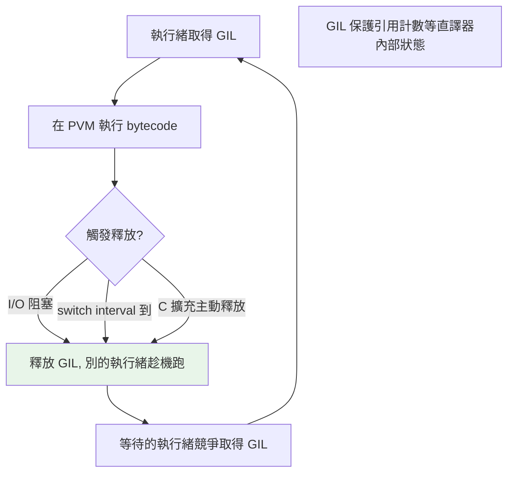

# GIL 底層原理

> [Part 9](../09-concurrency/02-gil.md) 講了 GIL 如何影響並發，這章從 CPython 內部看它「為什麼存在、如何運作」——它是為了保護引用計數而生的一把鎖，執行緒在 PVM 迴圈中定期釋放/重取它。

## Why（為什麼）

[Part 9 的 GIL 章](../09-concurrency/02-gil.md) 從「使用者」角度講了 GIL 對並發的影響（CPU 密集無效、I/O 有效）。這章從 **CPython 內部** 補完：GIL 為什麼是必要的（保護引用計數）、它實際上是什麼（一把互斥鎖）、執行緒如何取得/釋放它、以及為何移除它如此困難。這是把「引用計數」「PVM」「並發」三條線串起來的關鍵，也是資深面試的深水題。

## Theory（理論：GIL 是保護引用計數的鎖）

**GIL（Global Interpreter Lock）是 CPython 直譯器的一把全域互斥鎖，同一時刻只有一個執行緒能持有它、執行 PVM 的 bytecode（見 [PVM](07-pvm.md)）。**

它存在的**根本原因是保護引用計數**（見 [引用計數](03-reference-counting.md)）：

- 每個物件有一個引用計數 `ob_refcnt`，賦值/傳遞時 +1、消失時 −1。
- 這個 +1/−1 是**非原子操作**（讀-改-寫）。若兩個執行緒同時對同一物件增減引用計數，會產生**競態**——計數可能算錯，導致物件被過早回收（記憶體損毀）或永不回收（洩漏）。
- **最簡單的解法**：用一把大鎖（GIL）保證「一次只有一個執行緒動任何物件」——引用計數就不必為每個物件加細粒度鎖。

所以 GIL 是一個**設計取捨**：用「犧牲多執行緒並行」換「引用計數簡單安全 + 單執行緒高效 + C 擴充好寫」。

## Specification（規範：GIL 的行為）

- **一個執行緒必須持有 GIL 才能執行 bytecode**（在 PVM 求值迴圈中）。
- **執行緒會在這些時機釋放 GIL**：
  - 執行**阻塞 I/O**（網路、磁碟、`time.sleep`）→ 釋放（讓別的執行緒趁機跑）。
  - 執行一段時間後（由 **`sys.setswitchinterval`** 控制，預設約 5ms）→ 強制釋放，讓別的執行緒有機會。
  - 呼叫**主動釋放 GIL 的 C 擴充**（numpy 等在純 C 運算時）。
- 釋放後，等待的執行緒競爭重新取得 GIL。

```python
import sys
sys.getswitchinterval()      # 執行緒切換間隔（秒），預設 0.005
sys.setswitchinterval(0.001) # 調整（影響切換頻率）
```

## Implementation（取得/釋放機制、切換間隔、為何難移除）

### GIL 的取得與釋放循環

一個執行緒的 GIL 生命週期（簡化）：

1. 取得 GIL → 進入 PVM 求值迴圈執行 bytecode。
2. 執行過程中，PVM 定期檢查「是否該讓出 GIL」（每隔 switch interval，或有執行緒在等）。
3. 到了時機（或遇到 I/O / 呼叫釋放 GIL 的 C 碼），**釋放 GIL**、掛起。
4. 別的等待執行緒取得 GIL、開始執行。
5. 原執行緒稍後競爭重新取得 GIL、繼續。

**現代 CPython（3.2+）** 的 GIL 用「基於時間」的切換（`switchinterval`），比早期「基於執行的 bytecode 條數」的做法更公平，減少了執行緒飢餓。

### switch interval 的影響

`switchinterval`（預設 5ms）決定「一個執行緒最多連續持有 GIL 多久才被要求讓出」：

```python
import sys
# 預設 5ms：CPU 密集執行緒每 ~5ms 就被要求讓出 GIL
print(sys.getswitchinterval())      # 0.005
```

太小 → 切換頻繁、開銷大；太大 → 執行緒回應變差。多數情況用預設即可。這也解釋了 [Part 9](../09-concurrency/02-gil.md) 提到的「CPU 密集多執行緒不但不快、還因頻繁搶鎖/切換更慢」——切換本身有成本。

### I/O 釋放 GIL：threading 加速 I/O 的原理

當執行緒執行阻塞 I/O（在 C 層等網路/磁碟），CPython **在進入阻塞前主動釋放 GIL**——因為等 I/O 時不需要執行 bytecode，讓別的執行緒趁機跑。這就是 [threading](../09-concurrency/03-threading.md) 對 I/O 密集有效的底層機制：等待重疊。同理，numpy 等 C 擴充在做純 C 密集運算時可主動釋放 GIL，讓其他執行緒能跑。

### 為什麼移除 GIL 這麼難

歷史上多次嘗試移除 GIL 都失敗，原因：

1. **引用計數要改成執行緒安全**：無 GIL 下，每個物件的引用計數增減都要保證原子——用細粒度鎖或原子操作，這會**拖慢單執行緒**（每個物件操作都付鎖的代價）。
2. **C 擴充相容性**：大量 C 擴充假設 GIL 存在（不必自己處理執行緒安全）；移除 GIL 需要它們全部改寫。
3. **記憶體管理複雜化**：GC、記憶體配置器都要變成執行緒安全。

**PEP 703（free-threaded，見 [free-threaded](../09-concurrency/12-free-threaded-python.md)）** 用「偏向引用計數 + 無鎖資料結構 + 可選建置」的方案，才在可接受的取捨下實現了無 GIL——但仍實驗性、單執行緒有效能代價、生態遷移中。這印證了「GIL 存在是有原因的」。

## Code Example（可執行的 Python 範例）

```python
# gil_internals_demo.py
from __future__ import annotations

import sys
import threading
import time


def cpu_work(n: int) -> int:
    """CPU 密集：一直執行 bytecode（持有 GIL）。"""
    total = 0
    for i in range(n):
        total += i
    return total


def measure(target, args_list) -> float:
    threads = [threading.Thread(target=target, args=a) for a in args_list]
    start = time.perf_counter()
    for t in threads:
        t.start()
    for t in threads:
        t.join()
    return time.perf_counter() - start


def demo() -> None:
    # 1. GIL 切換間隔
    print(f"GIL switch interval: {sys.getswitchinterval() * 1000:.1f} ms")

    # 2. CPU 密集：GIL 讓多執行緒無法並行（輪流 + 切換開銷）
    n = 5_000_000
    start = time.perf_counter()
    cpu_work(n)
    cpu_work(n)
    serial = time.perf_counter() - start
    threaded = measure(cpu_work, [(n,), (n,)])

    print(f"\nCPU 密集（GIL 影響）:")
    print(f"  序列: {serial:.3f}s")
    print(f"  雙執行緒: {threaded:.3f}s")
    print("  → 雙執行緒沒更快（GIL 讓它們輪流跑 bytecode）")


if __name__ == "__main__":
    demo()
```

**預期輸出**（數字依機器而異）：

```pycon
$ python gil_internals_demo.py
GIL switch interval: 5.0 ms

CPU 密集（GIL 影響）:
  序列: 0.XXs
  雙執行緒: 0.XXs（≈ 序列，甚至更慢）
  → 雙執行緒沒更快（GIL 讓它們輪流跑 bytecode）
```

## Diagram（圖解：GIL 的取得/釋放）



## Best Practice（最佳實踐）

- **理解 GIL = 保護引用計數的鎖**：這解釋了它為何存在、為何難移除、以及並發策略（見 [Part 9](../09-concurrency/README.md)）。
- **CPU 密集用 multiprocessing**（獨立 GIL）；**I/O 密集用 threading/asyncio**（I/O 釋放 GIL）——底層原理如本章。
- **CPU 密集的數值運算用 numpy**（C 層釋放 GIL + 向量化），常比 multiprocessing 更好。
- **一般不必調 `switchinterval`**：預設 5ms 適用多數情況；除非有特殊的切換行為需求。
- **關注 free-threaded Python**（見 [free-threaded](../09-concurrency/12-free-threaded-python.md)）：它正試圖在可接受取捨下移除 GIL。
- **GIL 是 CPython 實作**：PyPy 有 GIL、Jython 沒有；並發決策要意識到實作差異。

## Common Mistakes（常見誤解）

- **不知道 GIL 為何存在**：它是為了**保護引用計數**（避免多執行緒競態損毀記憶體），不是「Python 設計者偷懶」。
- **以為 GIL 很容易移除**：引用計數要改執行緒安全（拖慢單執行緒）、C 擴充要改寫——這是難點。
- **以為 GIL 讓 Python 完全不能並行**：multiprocessing 能並行、I/O 等待時釋放 GIL、C 擴充可釋放 GIL。
- **調 `switchinterval` 想「加速」**：改變切換頻率不會讓 CPU 密集多執行緒變快（GIL 本質限制）。
- **以為 GIL 保證「所有操作原子」**：只保證單一 bytecode；`+=` 等多 bytecode 仍有競態，仍需鎖（見 [同步](../09-concurrency/04-thread-sync.md)）。
- **把 GIL 當語言規範**：它是 CPython 實作細節。

## Interview Notes（面試重點）

- **能說出 GIL 的根本原因**：**保護引用計數**（非原子的 +1/−1 在多執行緒下會競態損毀記憶體）；用一把大鎖比為每個物件加細粒度鎖簡單、且單執行緒更快、C 擴充好寫（是取捨）。
- 知道 **GIL 在 PVM 層運作**（一次一執行緒執行 bytecode），執行緒在 **I/O、switch interval（~5ms）、C 擴充主動釋放** 時讓出 GIL。
- **能解釋為何移除 GIL 難**：引用計數要改執行緒安全（拖慢單執行緒）、C 擴充相容性、記憶體管理複雜化——PEP 703 才在可接受取捨下實現。
- 知道 **GIL 只保證單一 bytecode 原子**，`+=` 等仍需鎖。
- 能串起 引用計數 → GIL → PVM → 並發策略 的完整因果。

---

➡️ 下一章：[小整數與字串 interning](09-interning.md)

[⬆️ 回 Part 10 索引](README.md)
