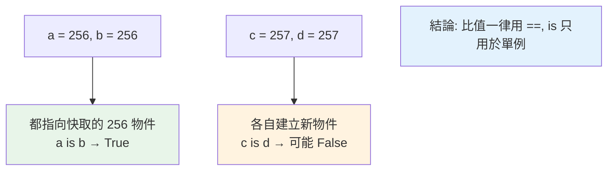

# 小整數與字串 interning

> CPython 對 −5 到 256 的小整數與某些字串做「快取重用」（interning）——所以 `a is b` 對它們有時 True。這正是「別用 `is` 比較值」的實作根源，也是常見的困惑來源。

## Why（為什麼）

`256 is 256` 是 True，但 `257 is 257` 有時 False——這個詭異現象讓無數人困惑，也是「為什麼別用 `is` 比較數字/字串」的具體原因。答案是 CPython 的 **interning（駐留）** 優化：它預先建立並重用常見的小整數與字串物件，避免重複建立。理解它能徹底解釋 `is` 的不可靠、以及一個效能優化背後的取捨。這是把 [物件模型](02-object-model.md)、[引用計數](03-reference-counting.md)、[記憶體管理](05-memory-management.md) 串起來的具體案例。

## Theory（理論：快取重用不可變物件）

**interning（駐留）** 是「快取並重用某些不可變物件」的優化——與其每次都建一個新物件，不如讓所有「相同值」的引用指向**同一個**快取物件。這對常用的不可變值（小整數、短字串）省記憶體、加速比較。

CPython 做兩種 interning：

- **小整數快取**：**−5 到 256** 的整數在直譯器啟動時就預先建好、永久存在。任何產生這範圍整數的操作都回傳**同一個**快取物件。
- **字串 interning**：某些字串（看起來像識別字的、字面值）被駐留，相同內容共用一個物件。

因為是快取重用，這些物件的 `id` 相同 → `is` 為 True。但這是**實作細節**，超出範圍的值就不保證。

## Specification（規範：觀察 interning）

```python
# 小整數快取（-5 到 256）
a = 256
b = 256
a is b            # True（同一個快取物件）

c = 257
d = 257
c is d            # 可能 False（超出快取範圍）

# 字串 interning
s1 = "hello"
s2 = "hello"
s1 is s2          # 通常 True（字面值被駐留）

# 手動駐留
import sys
x = sys.intern("some string")   # 明確駐留
```

## Implementation（小整數、字串、為何 is 不可靠）

### 小整數快取：−5 到 256

```pycon
>>> a = 100
>>> b = 100
>>> a is b            # True：100 在 -5~256，是同一個快取物件
True
>>> a = 1000
>>> b = 1000
>>> a is b            # False：1000 超出快取，各自建立
False
>>> a == b            # 但值當然相等
True
```

為什麼是 −5 到 256？這些是程式中**最常出現**的整數（迴圈計數、小索引、常見值），預先快取它們能大幅減少「重複建立小整數物件」的開銷。超出範圍的整數每次產生新物件（`is` 就 False）。

⚠️ **這是 CPython 實作細節**——範圍、行為可能隨版本/實作而異（PyPy 可能不同）。**永遠別依賴它**。

### 字串 interning

字串駐留較複雜——CPython 會自動駐留「看起來像識別字」的字串字面值（如變數名、`"hello"`），但**執行期動態產生的字串**（如拼接、格式化）通常**不**自動駐留：

```pycon
>>> a = "hello"
>>> b = "hello"
>>> a is b            # True（字面值被駐留）
True
>>> c = "hel" + "lo"  # 編譯期常數摺疊 → 也可能是同一個
>>> a is c
True
>>> d = "".join(["h", "e", "l", "l", "o"])  # 執行期動態產生
>>> a is d            # 通常 False（動態產生，未駐留）
False
>>> a == d            # 但值相等
True
```

規則模糊且依情況/版本——所以**別依賴字串的 `is` 結果**。需要「確保共用同一物件」（如大量重複字串省記憶體）可用 `sys.intern()` 明確駐留。

### 為什麼「別用 `is` 比較值」

interning 正是 [物件模型](02-object-model.md) 反覆強調「別用 `is` 比較數字/字串值」的根源：

```python
# ❌ 依賴 interning，不可靠
if x is 256:          # 可能 True（小整數快取），但...
    ...
if x is 257:          # ...這個可能 False！
    ...

# ✅ 比較值永遠用 ==
if x == 256:          # 永遠正確
    ...
```

`is` 比的是「同一物件」（id），而 interning 讓「有些值恰好是同一物件、有些不是」——所以用 `is` 比值的結果**時對時錯、依賴實作**。**比值一律用 `==`；`is` 只用於 `None`/`True`/`False` 這類真正的單例**（見 [物件模型](02-object-model.md)）。

### `sys.intern`：主動駐留省記憶體

若程式有**大量重複的字串**（如解析出許多相同的 key），主動 `sys.intern()` 讓它們共用一個物件，省記憶體、加速比較（駐留後可用 `is` 快速比較，因為相同內容保證同物件）：

```python
import sys
# 大量重複字串時，駐留省記憶體
keys = [sys.intern(parse_key(line)) for line in huge_file]
# 相同的 key 現在共用一個物件
```

這是 interning 的正當用途——優化，而非依賴自動駐留的行為。

## Code Example（可執行的 Python 範例）

```python
# interning_demo.py
from __future__ import annotations

import sys


def demo() -> None:
    # 1. 小整數快取（-5 到 256）
    a = 256
    b = 256
    print(f"256 is 256: {a is b}")  # True（快取範圍內）

    c = 257
    d = 257
    print(f"257 is 257: {c is d}")  # 可能 False（超出快取）

    # 邊界
    for n in [-5, 0, 256, 257, 1000]:
        x = n
        y = n
        # 用 int() 產生「新」物件避免編譯期優化
        z = int(str(n))
        in_cache = (x is z)
        print(f"  {n:>5}: is 快取 = {in_cache}")

    # 2. 值比較永遠正確
    print(f"\n257 == 257（值）: {257 == 257}")  # 永遠 True

    # 3. sys.intern 主動駐留
    s1 = "".join(["a", "b", "c"])  # 動態產生
    s2 = "".join(["a", "b", "c"])
    print(f"\n動態字串 is: {s1 is s2}")  # 通常 False
    i1 = sys.intern(s1)
    i2 = sys.intern(s2)
    print(f"駐留後 is: {i1 is i2}")  # True（共用同物件）
    print(f"值相等: {s1 == s2}")  # 永遠 True


if __name__ == "__main__":
    demo()
```

**預期輸出**（部分依實作而異）：

```pycon
$ python interning_demo.py
256 is 256: True
257 is 257: False
     -5: is 快取 = True
      0: is 快取 = True
    256: is 快取 = True
    257: is 快取 = False
   1000: is 快取 = False

257 == 257（值）: True

動態字串 is: False
駐留後 is: True
值相等: True
```

## Diagram（圖解：小整數快取）



## Best Practice（最佳實踐）

- **比較值一律用 `==`**：`is` 只用於 `None`/`True`/`False` 等單例；絕不用 `is` 比數字/字串的值。
- **永遠別依賴 interning 行為**：小整數範圍、字串駐留規則是實作細節，隨版本/實作變。
- **大量重複字串省記憶體用 `sys.intern`**：這是 interning 的正當用途（優化，非依賴自動行為）。
- **理解 interning 是一個「用快取換效能」的優化**：解釋了 `is` 的詭異、以及小整數為何「較便宜」。
- **除錯 `is` 的意外結果**：若 `is` 給了非預期的 True/False，八成是 interning——改用 `==`。

## Common Mistakes（常見誤解）

- **用 `is` 比較數字/字串的值**：`x is 257`、`s is "abc"` 結果依 interning 而定、不可靠——最經典的坑。
- **以為 `256 is 256` 為 True 代表「相同數字都是同一物件」**：只有 −5~256 快取範圍內，超出就不是。
- **依賴字串 `is` 的結果**：自動駐留規則模糊（字面值駐留、動態產生通常不駐留），別依賴。
- **以為 interning 是語言保證**：它是 CPython 實作細節，PyPy 等可能不同。
- **手動比較值卻用 `is`**：值相等用 `==`；只有判單例用 `is`。
- **不知道 `sys.intern` 可主動駐留**：大量重複字串時錯過省記憶體的機會。

## Interview Notes（面試重點）

- **能解釋 interning**：CPython 快取重用不可變物件——**小整數（−5 到 256）** 預先建好、常見字串駐留——相同值共用同物件，故 `is` 為 True。
- **知道這是「別用 `is` 比較數字/字串值」的實作根源**：範圍內 True、範圍外 False，依實作；**比值一律 `==`，`is` 只用於單例**。
- 知道**小整數範圍是 −5~256**（最常用的整數），是效能優化。
- 知道**字串駐留規則模糊**（字面值駐留、動態產生通常不駐留），且可用 **`sys.intern` 主動駐留**（大量重複字串省記憶體）。
- 知道 interning 是 **CPython 實作細節**，別依賴。

---

➡️ 下一章：[weakref 弱引用](10-weakref.md)

[⬆️ 回 Part 10 索引](README.md)
