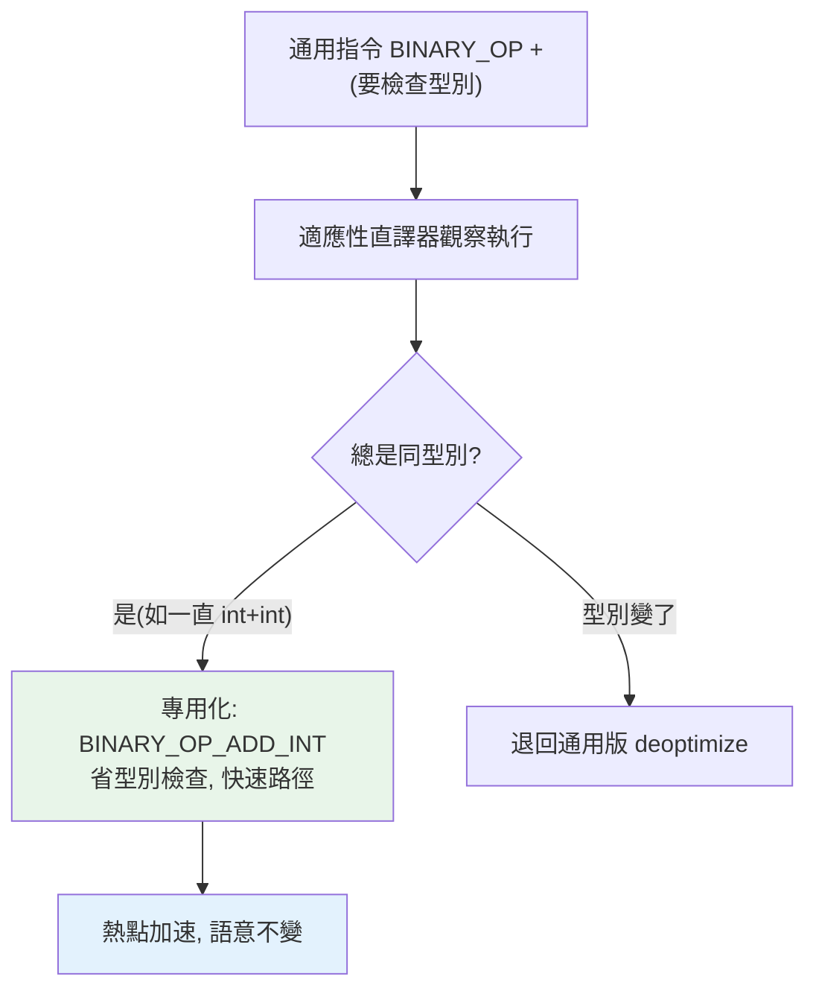

# 適應性直譯器與近期優化 (PEP 659, 3.11+)

> Python 3.11 的「適應性專用直譯器」讓 PVM 能觀察執行、把常跑的通用指令替換成專用的快速版本——這是 Faster CPython 計畫的核心，讓 Python 3.11+ 比 3.10 快 10–60%。理解它，就跟上了 CPython 的效能演進。

## 💡 白話導讀（建議先讀）

[第 7 章](07-pvm.md)說口譯員每條指令都要「看-理解-做」。Python 3.11 讓他**變得老練**——這是近年 Python 大提速（3.11 平均快 25%）的核心。

先看原本的浪費在哪。速記稿上一條 `BINARY_OP +`（做加法）是**萬用指令**——口譯員每次都要現場確認：
「兩邊是⋯⋯int 加 int?還是字串拼接?還是 list?還是自訂的 `__add__`?」——**同樣的確認,在迴圈裡重複一百萬次**。

**老練口譯員（適應性直譯器,PEP 659）** 的做法：

1. **邊做邊觀察**:「這個位置的 +,前幾次全是 int + int⋯⋯」
2. **換上專用快速版**:把這條萬用指令**當場改寫**成 `BINARY_OP_ADD_INT`——跳過所有確認,直接整數相加。
3. **猜錯就退回**:哪天這裡突然來了字串?退回萬用版（deoptimize）,不會出錯,只是變回原速。

這叫**專用化（specialization）**:賭「**同一個位置的型別通常穩定**」——動態語言的程式,實際跑起來型別出奇地單調,這個賭注勝率極高。

畫清一條界線:這**不是 JIT**——沒有翻譯成機器碼,仍然是照稿直譯,只是稿子會**自我改寫成更快的版本**。（真正的 JIT 是 3.13+ 的下一步實驗。）

對你的實際意義:**升級 Python 版本 = 免費效能**;而且寫「型別穩定」的程式碼（迴圈裡別讓變數一下 int 一下 str）,老練口譯員能幫你更多。

## Why（為什麼）

前面章節解釋了「Python 為什麼慢」（PVM 的直譯開銷、動態型別查找，見 [PVM](07-pvm.md)）。近年 CPython 投入巨大心力優化這一層——**Python 3.11 的適應性直譯器（PEP 659）** 是最重要的成果，帶來顯著加速而不改變語意。作為「到 Senior」的工程師，理解 CPython 正在如何變快、以及「specializing/adaptive」是什麼，能讓你跟上生態、寫出對這些優化友善的程式、並在面試談論 Python 效能演進。這章收尾 Part 10，展望 CPython 的未來。

## Theory（理論：專用化與適應性）

**PEP 659：Specializing Adaptive Interpreter（專用化適應性直譯器，3.11）** 的核心想法——讓口譯員變老練：

- 一般 bytecode 指令是**通用的**——`BINARY_OP +` 要能處理「int+int、str+str、list+list、自訂 `__add__`」所有情況，每次都要檢查型別、分派——動態型別的固定開銷。
- 但實際執行時，**同一個指令位置往往反覆處理同一種型別**（迴圈裡的 `+` 可能一直是 int+int）——型別出奇地穩定。
- **適應性直譯器**觀察執行：發現某指令總是處理同型別，就把它**替換成專用快速版本**（如 `BINARY_OP_ADD_INT`——省去型別檢查、直接整數加法）。之後型別變了，再退回通用版本（deoptimize）。

這叫**專用化（specialization）**——在執行期「適應」實際的型別模式，把熱點指令換成快速路徑。

界線：這**不是 JIT**（沒編譯成機器碼），而是「更聰明的 bytecode 直譯」——稿子自我改寫成更快的版本。

## Specification（規範：相關優化）

Python 3.11+ 的「Faster CPython」計畫包含多項優化：

| 優化 | 內容 | 版本 |
|------|------|------|
| **適應性專用直譯器** | 熱點指令專用化（PEP 659） | 3.11 |
| **零成本例外** | try 沒發生例外時無開銷 | 3.11 |
| **更省的 frame** | 函式呼叫的 frame 更輕量 | 3.11 |
| **內聯函式呼叫** | 純 Python 函式呼叫不建新 C frame | 3.11 |
| **更精準的錯誤訊息** | 指出錯誤的確切位置 | 3.11 |
| **JIT（實驗性）** | copy-and-patch JIT | 3.13+ |

結果：**Python 3.11 比 3.10 平均快 10–60%**（依工作負載），3.12/3.13 持續優化。

## Implementation（專用化如何運作、影響、如何受益）

### 專用化的運作（觀念）

```python
def sum_list(nums):
    total = 0
    for n in nums:
        total += n        # 這個 += 若總是 int，會被專用化
    return total

sum_list([1, 2, 3] * 1000)
```

執行時，`total += n` 這個 `BINARY_OP` 指令一開始是通用的（要檢查型別）。適應性直譯器觀察到它**一直在做 int + int**，就把它**專用化**成快速的整數加法路徑——省去每次的型別檢查與方法查找。這讓熱點迴圈明顯加速，而你的程式碼**完全不用改**。

若哪天 `nums` 裡混了非整數，專用版失效、退回通用版（deoptimize）——語意永遠正確，只是快慢不同。

### 零成本例外（zero-cost exceptions）

3.11 前，`try` 區塊即使沒發生例外也有小開銷（設定例外處理）。3.11 改成**「沒發生例外時零開銷」**——把成本移到「真的拋例外時」。這意味著：

```python
# 3.11+：try 沒出錯時幾乎無開銷
try:
    return d[key]         # 用 try 包住不再有「常態」成本
except KeyError:
    return default
```

這強化了 **EAFP**（見 [EAFP vs LBYL](../06-error-handling/09-eafp-vs-lbyl.md)）——「先試再處理」的成本更低，EAFP 風格更划算。

### 更輕的函式呼叫

3.11 讓純 Python 函式呼叫更便宜（更輕的 frame、內聯呼叫），減少了「Python 函式呼叫開銷大」的問題——雖然仍有開銷，但比以前小。

### 如何寫出「對優化友善」的程式

你**不需要**為這些優化改寫程式（它們自動生效），但知道原理能幫你：

- **型別一致的熱點迴圈受益最大**：迴圈裡變數型別穩定（一直是 int），專用化效果好。避免在熱點迴圈裡讓變數型別跳來跳去。
- **EAFP 更划算**（零成本例外）：放心用 try/except 而非到處 LBYL 檢查。
- **升級 Python 版本就免費加速**：3.11+ 比 3.10 快很多，升級是最省力的優化。
- **仍是直譯器優化、非 JIT**：CPU 密集的極致效能仍需 numpy/C 擴充/PyPy——這些優化縮小差距但沒消除。

### 未來：JIT

3.13 引入**實驗性的 copy-and-patch JIT**——真正把熱點 bytecode 編譯成機器碼（比適應性直譯更進一步）。目前實驗性、預設關閉，但代表 CPython 正朝「有 JIT」的方向走（過去只有 PyPy 有）。加上 free-threaded（見 [free-threaded](../09-concurrency/12-free-threaded-python.md)），CPython 正經歷多年來最大的效能演進。

## Code Example（可執行的 Python 範例）

```python
# adaptive_interpreter_demo.py
from __future__ import annotations

import sys
import timeit


def sum_ints(n: int) -> int:
    """型別一致的迴圈 → 適應性直譯器可專用化。"""
    total = 0
    for i in range(n):
        total += i  # 一直是 int + int → 被專用化
    return total


def eafp_access(d: dict[str, int], key: str) -> int:
    """EAFP：3.11+ 零成本例外讓 try 更划算。"""
    try:
        return d[key]
    except KeyError:
        return -1


def demo() -> None:
    print(f"Python 版本: {sys.version.split()[0]}")
    print("（3.11+ 有適應性專用直譯器，比 3.10 快 10-60%）\n")

    # 型別一致的迴圈（會被專用化）
    result = sum_ints(1000)
    print(f"sum_ints(1000) = {result}")

    # 量測（示範用；實際加速在版本比較才明顯）
    t = timeit.timeit(lambda: sum_ints(10000), number=100)
    print(f"sum_ints(10000) × 100 次: {t:.3f}s")

    # EAFP 存取
    d = {"a": 1, "b": 2}
    print(f"\nEAFP 存取 'a': {eafp_access(d, 'a')}")
    print(f"EAFP 存取 'z': {eafp_access(d, 'z')}")
    print("（3.11+ 零成本例外讓 EAFP 更划算）")


if __name__ == "__main__":
    demo()
```

**預期輸出**（版本與耗時依環境而異）：

```pycon
$ python adaptive_interpreter_demo.py
Python 版本: 3.12.x
（3.11+ 有適應性專用直譯器，比 3.10 快 10-60%）

sum_ints(1000) = 499500
sum_ints(10000) × 100 次: 0.0XXs

EAFP 存取 'a': 1
EAFP 存取 'z': -1
（3.11+ 零成本例外讓 EAFP 更划算）
```

## Diagram（圖解：適應性專用化）



## Best Practice（最佳實踐）

- **升級 Python 版本就免費加速**：3.11+ 比 3.10 快 10–60%，升級是最省力的優化。
- **型別一致的熱點迴圈受益最大**：避免在熱點讓變數型別跳動，讓專用化生效。
- **放心用 EAFP**：3.11+ 零成本例外讓 try/except 更划算（見 [EAFP](../06-error-handling/09-eafp-vs-lbyl.md)）。
- **理解這是直譯器優化、非 JIT**：CPU 密集的極致效能仍需 numpy/C 擴充/向量化（見 [Part 17](../17-data-science/README.md)、[Part 18](../18-performance/README.md)）；這些優化縮小但沒消除差距。
- **關注 CPython 效能演進**：適應性直譯器、實驗性 JIT（3.13）、free-threaded——CPython 正快速進步。
- **別為了「配合優化」寫奇怪的程式**：優化自動生效；寫清楚的 Pythonic 程式即可。

## Common Mistakes（常見誤解）

- **以為 3.11 的優化是 JIT**：適應性專用直譯器**不是 JIT**（沒編成機器碼）；3.13 才有實驗性 JIT。
- **以為要改寫程式才能受益**：優化自動生效，不需改碼；升級版本就快。
- **以為這些優化消除了「Python 慢」**：只是縮小差距；CPU 密集極致效能仍需 numpy/C/PyPy。
- **在熱點迴圈讓變數型別跳動**：破壞專用化（頻繁 deoptimize）；型別穩定更快。
- **不升級 Python 版本**：錯過免費的顯著加速。
- **以為適應性直譯改變了語意**：純效能優化，語意完全不變（型別變了會安全退回）。

## Interview Notes（面試重點）

- **能說明 PEP 659 適應性專用直譯器（3.11）**：觀察執行、把**熱點的通用指令專用化**成快速版本（如 int 專用的加法，省型別檢查），型別變了安全退回——**不是 JIT**，是更聰明的直譯。
- 知道 **Python 3.11+ 比 3.10 快 10–60%**（Faster CPython 計畫），還含**零成本例外**（強化 EAFP）、更輕的函式呼叫/frame。
- 知道 **3.13 引入實驗性 JIT**（copy-and-patch）——CPython 朝有 JIT 演進。
- 知道**升級版本就免費加速**、**型別一致的熱點受益最大**、這是直譯器優化非 JIT（極致效能仍需 numpy/C）。
- 能連結 Part 9/10：適應性直譯 + free-threaded + JIT 是 CPython 近年最大的效能與並發演進——談得出來代表跟上生態。

---

🎉 **恭喜完成 Part 10！** 你已深入 CPython 的內部：一切皆物件、物件模型（id/type/value）、引用計數與循環 GC、記憶體管理與 pymalloc、bytecode 與 dis、PVM 直譯器、GIL 底層原理、interning、weakref，以及適應性直譯器的效能演進。這是理解「Python 為何這樣運作」的核心。
接下來 [Part 11 標準庫](../11-stdlib/README.md) 將回到實用層面，深入 os/pathlib/datetime/json/re/logging 等日常必備模組。

[⬆️ 回 Part 10 索引](README.md)
