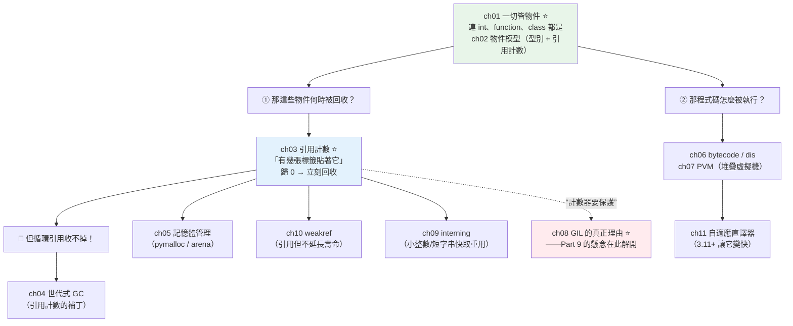

# Part 10 統整：CPython 內部與記憶體全貌

> 把這 11 章串成一張圖——它回答了前面所有 Part 留下的懸念，尤其那一個：**GIL 到底為什麼存在？**

## 🗺️ 知識地圖（這 11 章怎麼串起來）

Part 10 是全書的**引擎室**。它不教你「怎麼寫」，而是解釋「**為什麼 Python 是這樣**」——
而所有答案，都從一句話長出來：**一切皆物件**。



**一句話串起來**：

**一切皆物件**（ch01）——連 `int`、函式、class 都是。
每個物件都帶著**型別指標**和**引用計數**（ch02）。

**引用計數**（ch03）就是 Python 的記憶體管理核心：
**「有幾張[標籤](../02-fundamentals/01-dynamic-typing.md)貼著它」**——
歸 0 就**立刻回收**（不用等 GC 掃描，這是 CPython 的一大優點）。

但它有個致命缺陷：**循環引用收不掉**（A 指著 B、B 指著 A，兩邊的計數永遠不是 0）。
所以才需要 **[世代式 GC](04-garbage-collection.md)**（ch04）當補丁。

**而這個「引用計數」，正是 [GIL](08-gil-internals.md) 存在的理由**（ch08）——
**Part 9 留下的懸念在這裡解開**：
多執行緒同時改同一個計數器會出錯（race condition）。
CPython 的選擇是：**用一把大鎖（GIL）保護全部**，
而不是「每個物件都加一把小鎖」（那會讓單執行緒慢很多）。

**GIL 不是設計失誤，是一個權衡**：
用「多執行緒不能並行」，換來「**單執行緒更快、C 擴充更好寫**」。

另一條線是**執行**：你的程式碼被編成 [bytecode](06-bytecode-and-dis.md)（ch06），
交給 **[PVM](07-pvm.md)**（一台堆疊虛擬機）逐條執行（ch07）——
3.11+ 的[自適應直譯器](11-adaptive-interpreter.md)（ch11）讓這個過程快了不少。

## ⚡ 速查表（什麼情境用什麼）

| 情境 | 怎麼做／要知道 | 章節 |
|------|--------------|------|
| 想看某物件的引用計數 | `sys.getrefcount(obj)`（⚠️ **會多 1**，因為傳參數本身也算一次） | [ch03](03-reference-counting.md) |
| 想看程式碼被編成什麼 | `dis.dis(func)` | [ch06](06-bytecode-and-dis.md) |
| 排查記憶體洩漏 | `gc.get_objects()`、`tracemalloc`；找**循環引用**與**沒清的快取** | [ch04](04-garbage-collection.md)、[ch05](05-memory-management.md) |
| 快取／觀察者，但**不想延長物件壽命** | **`weakref`**（`WeakValueDictionary`） | [ch10](10-weakref.md) |
| 父子互相引用，怕循環 | 讓其中一邊（子→父）用**弱引用** | [ch10](10-weakref.md)、[ch04](04-garbage-collection.md) |
| 為什麼 `a is b` 有時碰巧是 True？ | **interning**：小整數（−5~256）與部分字串被快取重用 | [ch09](09-interning.md) |
| **比較數值／字串** | **一律用 `==`，絕不用 `is`**（`is` 只給 `None`／單例） | [ch09](09-interning.md) |
| 為什麼多執行緒不能並行？ | **GIL 保護引用計數**——見下方核心心智模型 | [ch08](08-gil-internals.md) |
| 想知道 3.11 為什麼變快 | **自適應直譯器**（specializing interpreter）+ inline caching | [ch11](11-adaptive-interpreter.md) |
| 大量小物件太吃記憶體 | `__slots__`（見 [Part 18](../18-performance/06-memory-optimization.md)）；理解 `__dict__` 的開銷 | [ch02](02-object-model.md) |

## 🔑 核心心智模型（帶得走的幾句話）

- **一切皆物件。** `1`、`"abc"`、函式、class、模組——全都是堆積（heap）上的物件，
  帶著型別指標與引用計數。你的「變數」只是[貼在上面的標籤](../02-fundamentals/01-dynamic-typing.md)。
- **引用計數 ＝ 有幾張標籤貼著它。** 歸 0 → **立刻回收**（確定性、即時，不像 Java 要等 GC）。
  代價是：**每次賦值／傳參都要改計數器**（有開銷），且**循環引用收不掉**。
- **GIL 的存在，就是為了保護那個計數器。**（**這是 Part 9 的答案**）
  多執行緒同時 `refcount++` 會出錯。CPython 的選擇是**一把大鎖鎖全部**，
  而不是「每個物件一把小鎖」——後者會讓**單執行緒**明顯變慢、C 擴充變難寫。
  **這是權衡，不是失誤。**
- **世代式 GC 是「引用計數的補丁」，不是主力。** 它只負責處理**循環引用**；
  99% 的物件是被引用計數直接回收的。
- **`is` 不能拿來比值。** 小整數與短字串會被 **interning**（快取重用），
  所以 `a is b` 有時**碰巧**為 True——而且**編譯器的常數摺疊**還會讓同一段程式碼裡的
  兩個字面值共用同一個物件。**依賴 `is` 比值，遲早出事。**
- **Python「不是純直譯」**：先編成 **bytecode**，再交給 **PVM**（堆疊機器）執行。

## 🛠️ 小實作：親眼看見引用計數、循環引用、interning 與 bytecode

```python
# cpython_internals_demo.py —— Part 10 主線：一切皆物件 → 引用計數 → GIL
from __future__ import annotations

import dis
import gc
import sys


class Node:
    """會製造循環引用的節點。"""

    def __init__(self, name: str) -> None:
        self.name = name
        self.partner: Node | None = None


def refcount_demo() -> None:
    """ch03：物件靠「有幾張標籤貼著」決定生死。"""
    a = [1, 2, 3]
    # ⚠️ getrefcount 本身傳參數也會 +1，所以減掉
    print(f"  建立 a                → refcount = {sys.getrefcount(a) - 1}")
    b = a                                    # 貼上第二張標籤
    print(f"  b = a（貼第二張標籤） → refcount = {sys.getrefcount(a) - 1}")
    del b                                    # 撕掉一張
    print(f"  del b                 → refcount = {sys.getrefcount(a) - 1}")
    print("  → 歸 0 就「立刻」回收。GIL 存在的理由，就是保護這個計數器！")


def cycle_demo() -> None:
    """ch04：引用計數的死角——循環引用，只能靠世代式 GC。"""
    gc.collect()
    x, y = Node("A"), Node("B")
    x.partner = y
    y.partner = x           # 循環！彼此指著對方
    del x, y                # 標籤撕光了，但兩者的 refcount 都還是 1
    collected = gc.collect()
    print("  建立循環引用 A↔B，然後 del 兩者")
    print("  → 光靠引用計數：收不掉（彼此的 refcount 都還是 1）")
    print(f"  → gc.collect() 回收了 {collected} 個物件  ← 世代式 GC 出手")


def interning_demo() -> None:
    """ch09：小整數被快取重用——所以 is 不能拿來比值。"""
    a, b = 256, int("256")      # 用 int() 強制在「執行期」建立，避開常數摺疊
    c, d = 257, int("257")
    print(f'  a=256, b=int("256") → a is b: {a is b}   ← 小整數池（−5~256）快取，同一個物件')
    print(f'  c=257, d=int("257") → c is d: {c is d}  ← 超出池子，是兩個不同物件')
    print("  ⚠️ 若寫成 c = 257; d = 257（同一段程式碼），編譯器會做「常數摺疊」，")
    print("     兩個字面值共用同一個常數物件 → is 又會變 True。")
    print("  → 結論：比較數值一律用 ==，永遠別用 is。")


def bytecode_demo() -> None:
    """ch06/ch07：你寫的一行，PVM 實際跑了好幾條堆疊指令。"""

    def add(a: int, b: int) -> int:
        return a + b

    print("  你寫的 `a + b`，CPython 實際執行的是：")
    for instr in dis.get_instructions(add):
        if instr.opname != "RESUME":
            print(f"    {instr.opname:16s} {instr.argrepr}")


def demo() -> None:
    print("【ch03 引用計數】物件靠「有幾張標籤貼著」決定生死")
    refcount_demo()
    print("\n【ch04 世代式 GC】引用計數的補丁：循環引用")
    cycle_demo()
    print("\n【ch09 interning】小整數被快取重用")
    interning_demo()
    print("\n【ch06/ch07 bytecode → PVM】")
    bytecode_demo()


if __name__ == "__main__":
    demo()
```

**預期輸出**：

```pycon
$ python cpython_internals_demo.py
【ch03 引用計數】物件靠「有幾張標籤貼著」決定生死
  建立 a                → refcount = 1
  b = a（貼第二張標籤） → refcount = 2
  del b                 → refcount = 1
  → 歸 0 就「立刻」回收。GIL 存在的理由，就是保護這個計數器！

【ch04 世代式 GC】引用計數的補丁：循環引用
  建立循環引用 A↔B，然後 del 兩者
  → 光靠引用計數：收不掉（彼此的 refcount 都還是 1）
  → gc.collect() 回收了 2 個物件  ← 世代式 GC 出手

【ch09 interning】小整數被快取重用
  a=256, b=int("256") → a is b: True   ← 小整數池（−5~256）快取，同一個物件
  c=257, d=int("257") → c is d: False  ← 超出池子，是兩個不同物件
  ⚠️ 若寫成 c = 257; d = 257（同一段程式碼），編譯器會做「常數摺疊」，
     兩個字面值共用同一個常數物件 → is 又會變 True。
  → 結論：比較數值一律用 ==，永遠別用 is。

【ch06/ch07 bytecode → PVM】
  你寫的 `a + b`，CPython 實際執行的是：
    LOAD_FAST        a
    LOAD_FAST        b
    BINARY_OP        +
    RETURN_VALUE
```

**這份輸出把整本書的幾條線接起來了**：

1. **`b = a` 讓 refcount 從 1 變 2** —— 這**證明**了
   [Part 2 的「變數是標籤，不是盒子」](../02-fundamentals/01-dynamic-typing.md)：
   `b = a` 沒有複製任何東西，只是**多貼一張標籤**。

2. **那個計數器，就是 GIL 存在的理由** ——
   [Part 9](../09-concurrency/02-gil.md) 問「為什麼有 GIL」，答案在這裡：
   多執行緒同時改它會出錯，而 CPython 選擇用**一把大鎖**保護，
   換取單執行緒的速度與 C 擴充的簡單。

3. **`is` 的坑有兩層**：小整數池（`256 is 256` → True）**和**編譯器的常數摺疊。
   兩者疊加，讓 `is` 的行為**看起來隨機**——這正是
   [Part 2](../02-fundamentals/05-operators.md) 說「**比值一律用 `==`**」的底層原因。

## ✅ 自測清單（答不出來就回去讀）

- [ ] 「一切皆物件」在 CPython 裡具體是什麼意思？一個 `int` 裡面裝了什麼？（[ch01](01-everything-is-object.md)、[ch02](02-object-model.md)）
- [ ] 引用計數怎麼運作？它的優點和兩個缺點是什麼？（[ch03](03-reference-counting.md)）
- [ ] 循環引用為什麼收不掉？誰來收拾？（[ch04](04-garbage-collection.md)）
- [ ] 世代式 GC 的「世代」是什麼意思？為什麼這樣分？（[ch04](04-garbage-collection.md)）
- [ ] **GIL 為什麼存在？**（提示：跟引用計數有關）（[ch08](08-gil-internals.md)）
- [ ] 為什麼不「每個物件一把小鎖」取代 GIL？（[ch08](08-gil-internals.md)）
- [ ] `a is b` 對小整數有時是 True，為什麼？這會有什麼危險？（[ch09](09-interning.md)）
- [ ] weakref 什麼時候用？它解決什麼問題？（[ch10](10-weakref.md)）
- [ ] PVM 是什麼機器？`a + b` 被編成哪幾條指令？（[ch06](06-bytecode-and-dis.md)、[ch07](07-pvm.md)）
- [ ] Python 3.11 為什麼變快了？（[ch11](11-adaptive-interpreter.md)）
- [ ] `pymalloc` 在做什麼？為什麼需要它？（[ch05](05-memory-management.md)）

## 🎯 面試速查

| 考點 | 面試官想聽到什麼 | 章節 |
|------|------------------|------|
| **Python 怎麼管理記憶體？** | 「**引用計數為主、世代式 GC 為輔**。每個物件記著『有幾個引用指向它』，**歸 0 就立刻回收**（確定性、即時）。但**循環引用**會讓計數永遠不歸 0，所以另有一個**世代式 GC** 定期掃描、回收不可達的循環。」 | [ch03](03-reference-counting.md)、[ch04](04-garbage-collection.md) |
| **GIL 為什麼存在？**（高頻） | 「**為了保護引用計數等直譯器內部狀態**。多執行緒同時改計數器會 race。CPython 選擇**一把大鎖**，而不是每個物件一把小鎖——因為後者會讓**單執行緒明顯變慢**、也讓 **C 擴充難寫**。這是**權衡**：犧牲多執行緒的 CPU 並行，換取單執行緒效能與生態的簡單。」 | [ch08](08-gil-internals.md) |
| **引用計數 vs 追蹤式 GC（如 Java）？** | 「引用計數：**即時回收**（物件一沒人用就死）、無需 stop-the-world；缺點是**有計數開銷**、**收不掉循環**。追蹤式 GC：沒有計數開銷、能處理循環；缺點是**回收時機不確定**、可能 stop-the-world。」 | [ch03](03-reference-counting.md) |
| **為什麼 `a is b` 對小整數是 True？** | 「**interning**——CPython 預先快取了 **−5 到 256** 的整數物件重複使用（省記憶體）。此外**編譯器的常數摺疊**也會讓同一段程式碼裡的相同字面值共用物件。**所以絕不能用 `is` 比較數值**，那是實作細節、不可依賴。」 | [ch09](09-interning.md) |
| **Python 是直譯還是編譯？** | 「兩者都有。先**編譯成 bytecode**（快取在 `__pycache__` 的 `.pyc`），再由 **PVM（堆疊虛擬機）** 逐條執行。所以 `a + b` 其實是 `LOAD_FAST`、`LOAD_FAST`、`BINARY_OP`、`RETURN_VALUE` 四條指令。」 | [ch06](06-bytecode-and-dis.md)、[ch07](07-pvm.md) |
| **3.11 為什麼快 10~60%？** | 「**自適應／特化直譯器**（PEP 659）——直譯器**觀察**某條指令實際遇到的型別，把通用的 `BINARY_OP` **特化**成 `BINARY_OP_ADD_INT` 之類的快版本（inline caching）。加上更輕量的函式呼叫（zero-cost exception、frame 優化）。」 | [ch11](11-adaptive-interpreter.md) |

---

🎉 **恭喜完成 Part 10！** 你已經看進了 Python 的引擎室——
**GIL、GC、bytecode 不再是黑箱，而是一連串可以解釋的權衡。**

到這裡，**Python 的語言與執行機制已經完整**。
接下來 [Part 11 標準庫](../11-stdlib/README.md) 開始**往上蓋**：
從「懂語言」轉向「**用 Python 做事**」——檔案、時間、JSON、正則、日誌、子行程……
這些是你每天都會用到的工具箱。

➡️ 下一 Part：[標準庫 Standard Library](../11-stdlib/README.md)

[⬆️ 回 Part 10 索引](README.md)
