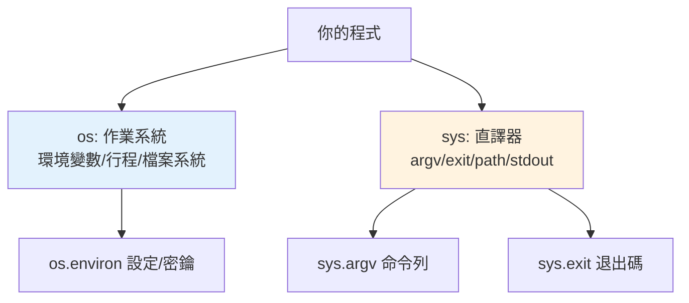

# os 與 sys

> `os` 是作業系統的介面（環境變數、行程、檔案系統操作），`sys` 是直譯器自身的介面（命令列引數、路徑、標準輸入輸出）。這兩個是幾乎每支實用程式都會用到的基礎模組。

## 💡 白話導讀（建議先讀）

寫實用程式，遲早要跟兩個「外面的世界」溝通。Python 給你兩扇窗，別搞混：

- **`os`——朝「作業系統」開的窗**：讀環境變數、看目前目錄、操作檔案系統、管行程。
  問自己：「這件事跟 **Windows/Linux 本身**有關嗎？」→ 用 os。
- **`sys`——朝「Python 直譯器自己」開的窗**：命令列引數（`sys.argv`）、模組搜尋路徑（`sys.path`）、標準輸出、退出程式。
  問自己：「這件事跟 **正在跑的這個 Python** 有關嗎？」→ 用 sys。

幾個立刻用得上的：

```python
os.environ.get("API_KEY")      # 讀環境變數(設定與密鑰的標準來源)
sys.argv                        # 命令列引數 list(腳本的輸入)
sys.exit(1)                     # 帶退出碼結束(0=成功,非 0=失敗)
```

口訣一句：**os 對外（作業系統），sys 對內（直譯器）**。分清這扇窗，查文件都快一倍。

## Why（為什麼）

寫實用程式免不了要和「外部世界」互動：讀環境變數（設定、密鑰）、取命令列引數、處理路徑、控制標準輸出、優雅退出。`os` 與 `sys` 提供這些能力。搞懂它們最常用的部分——尤其 `os.environ`（環境變數，12-factor 設定的基礎）、`sys.argv`（命令列）、`sys.exit`（退出）——是寫出能與系統整合的程式的基本功。

## Theory（理論：兩個模組的分工）

- **`os`**：**作業系統**的介面——環境變數、行程、檔案系統、路徑操作。「和 OS 打交道」用它（對外的窗）。
- **`sys`**：**Python 直譯器**自身的介面——命令列引數、模組搜尋路徑、標準輸入輸出、退出、版本資訊。「和直譯器打交道」用它（對內的窗）。

一句話：**`os` 面向作業系統，`sys` 面向直譯器**。

## Specification（規範：常用成員）

```python
import os
import sys

# --- os：作業系統 ---
os.environ                    # 環境變數（dict-like）
os.environ.get("KEY", "預設") # 安全取環境變數
os.getcwd()                   # 目前工作目錄
os.cpu_count()                # CPU 核心數
os.getpid()                   # 行程 ID
# 路徑操作現代優先用 pathlib（見下一章），但 os.path 仍常見
os.path.join("a", "b")        # 跨平台路徑組合

# --- sys：直譯器 ---
sys.argv                      # 命令列引數（list，argv[0] 是腳本名）
sys.exit(0)                   # 退出（0 成功，非 0 失敗）
sys.path                      # 模組搜尋路徑
sys.version_info              # 版本 (major, minor, ...)
sys.stdin / sys.stdout / sys.stderr   # 標準輸入/輸出/錯誤
sys.platform                  # 平台（'win32'/'linux'/'darwin'）
```

## Implementation（環境變數、命令列、退出碼、標準串流）

### `os.environ`：環境變數（設定的正解）

環境變數是**12-factor app**（見 [12-factor](../19-cloud-native/04-12-factor.md)）推薦的設定方式——把設定（DB 連線、密鑰、模式）放環境變數而非寫死在程式：

```python
import os

# 安全取用（不存在給預設）
db_url = os.environ.get("DATABASE_URL", "sqlite:///default.db")
debug = os.environ.get("DEBUG", "false").lower() == "true"

# 必填設定（不存在就報錯）
secret = os.environ["SECRET_KEY"]   # 缺少 → KeyError（讓它明確失敗）
```

**用 `.get(key, default)` 取可選設定、用 `os.environ[key]` 取必填設定**（缺少就明確報錯，符合「快速失敗」）。密鑰、連線字串等敏感資訊放環境變數，別寫進程式碼或版控（見 [密鑰管理](../20-security-system-design/05-secrets-management.md)）。

### `sys.argv`：命令列引數

`sys.argv` 是命令列引數的 list，`argv[0]` 是腳本名、之後是引數：

```python
import sys

# python script.py arg1 arg2
print(sys.argv)          # ['script.py', 'arg1', 'arg2']
script_name = sys.argv[0]
args = sys.argv[1:]
```

⚠️ **只有最簡單的腳本才手動解析 `sys.argv`**。稍微複雜（選項、旗標、型別、說明）就用 **`argparse`**（見 [argparse](10-argparse.md)）——別自己造命令列解析的輪子。

### `sys.exit`：退出與退出碼

`sys.exit(code)` 結束程式並回傳**退出碼**給作業系統（`0` = 成功、非 `0` = 失敗）——這對 shell 腳本、CI、管線很重要（它們靠退出碼判斷成敗）：

```python
import sys

if not valid_input:
    print("錯誤：輸入不合法", file=sys.stderr)
    sys.exit(1)          # 非 0 表示失敗

sys.exit(0)              # 成功（或省略，正常結束也是 0）
```

`sys.exit()` 其實是拋出 `SystemExit`（見 [例外階層](../06-error-handling/10-exception-hierarchy.md)）——所以 `except Exception` 不會攔住它（刻意設計）。

### 標準串流：stdout / stderr

- **`sys.stdout`**：正常輸出（`print` 預設寫這）。
- **`sys.stderr`**：錯誤/診斷輸出——**錯誤訊息該寫 stderr 不是 stdout**，這樣正常輸出（可能被管線接走）不會混入錯誤：

```python
import sys

print("正常結果")                          # → stdout
print("錯誤訊息", file=sys.stderr)          # → stderr
```

分開 stdout/stderr 讓程式能好好參與 shell 管線（`prog | other` 只接 stdout，錯誤仍顯示）。日誌用 `logging`（見 [logging](08-logging.md)）而非 print。

## Code Example（可執行的 Python 範例）

```python
# os_sys_demo.py
from __future__ import annotations

import os
import sys


def get_config() -> dict[str, str]:
    """從環境變數讀設定（12-factor 風格）。"""
    return {
        "mode": os.environ.get("APP_MODE", "development"),
        "workers": os.environ.get("WORKERS", str(os.cpu_count() or 1)),
        "cwd": os.getcwd(),
    }


def process_args(argv: list[str]) -> tuple[str, list[str]]:
    """解析命令列引數（簡單版；複雜的用 argparse）。"""
    script = argv[0] if argv else "unknown"
    args = argv[1:]
    return script, args


def demo() -> None:
    # 1. 環境變數設定
    config = get_config()
    print(f"設定: {config}")

    # 2. 命令列引數
    script, args = process_args(sys.argv)
    print(f"腳本: {os.path.basename(script)}, 引數: {args}")

    # 3. 系統資訊
    print(f"Python: {sys.version_info.major}.{sys.version_info.minor}")
    print(f"平台: {sys.platform}")

    # 4. stdout vs stderr
    print("這是正常輸出（stdout）")
    print("這是診斷訊息（stderr）", file=sys.stderr)


if __name__ == "__main__":
    demo()
```

**預期輸出**：

```pycon
$ python os_sys_demo.py extra1 extra2
設定: {'mode': 'development', 'workers': '8', 'cwd': '/path/to/dir'}
腳本: os_sys_demo.py, 引數: ['extra1', 'extra2']
Python: 3.12
平台: darwin
這是正常輸出（stdout）
這是診斷訊息（stderr）
```

## Diagram（圖解：os vs sys 分工）



## Best Practice（最佳實踐）

- **設定/密鑰用環境變數**（`os.environ`）：12-factor 風格，別寫死在程式或版控（見 [密鑰管理](../20-security-system-design/05-secrets-management.md)）；可選用 `.get(k, default)`、必填用 `os.environ[k]`。
- **命令列稍複雜就用 `argparse`**，別手動解析 `sys.argv`（見 [argparse](10-argparse.md)）。
- **錯誤訊息寫 `sys.stderr`**，讓正常輸出（stdout）能參與管線；日誌用 `logging`。
- **用 `sys.exit(code)` 回傳有意義的退出碼**（0 成功、非 0 失敗），供 shell/CI 判斷。
- **路徑操作優先用 `pathlib`**（見 [pathlib](02-pathlib.md)）而非 `os.path`（現代更好用）。
- **跨平台注意 `sys.platform`**：需要平台判斷時用它。

## Common Mistakes（常見誤解）

- **設定/密鑰寫死在程式碼**：難改、有洩漏風險；用環境變數。
- **手動解析 `sys.argv` 做複雜命令列**：容易出錯、缺說明；用 argparse。
- **錯誤訊息印到 stdout**：污染正常輸出、干擾管線；用 stderr。
- **`os.environ[key]` 取可選設定**：缺少會 `KeyError`；可選用 `.get(k, default)`。
- **用 `except Exception` 想攔 `sys.exit`**：`SystemExit` 繼承 `BaseException`，不被 `except Exception` 攔（見 [例外階層](../06-error-handling/10-exception-hierarchy.md)）。
- **忽略退出碼**：shell/CI 靠它判斷成敗；失敗要 `sys.exit(非0)`。

## Interview Notes（面試重點）

- **能區分 `os`（作業系統：環境變數/行程/檔案系統）vs `sys`（直譯器：argv/exit/path/stdout）**。
- 知道**環境變數（`os.environ`）是 12-factor 的設定方式**，可選用 `.get`、必填用 `[]`；密鑰不寫死。
- 知道 **`sys.argv`（複雜的用 argparse）、`sys.exit(code)`（退出碼、實為拋 SystemExit）、stdout vs stderr（錯誤寫 stderr）**。
- 知道 `SystemExit` 繼承 `BaseException`，`except Exception` 不攔它。
- 知道路徑優先用 `pathlib`（連結下一章）。

---

➡️ 下一章：[pathlib 路徑處理](02-pathlib.md)

[⬆️ 回 Part 11 索引](README.md)
