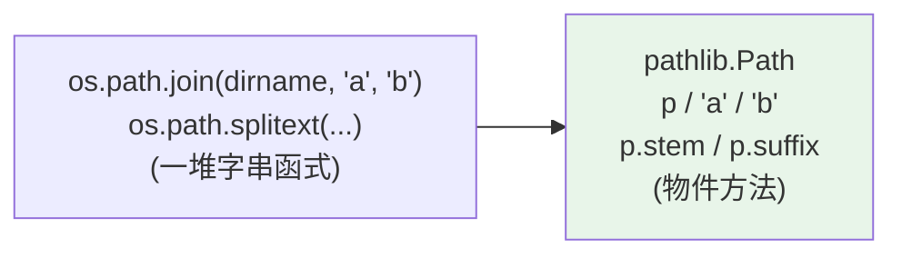

# pathlib 路徑處理

> `pathlib.Path` 用物件導向、跨平台的方式處理檔案路徑——`/` 運算子組路徑、`.read_text()` 讀檔、`.glob()` 找檔。它取代了老舊的 `os.path` 字串操作，是現代 Python 處理路徑的標準。

## 💡 白話導讀（建議先讀）

老派處理路徑是「手寫地址字串」：`"data" + os.sep + "logs" + os.sep + name`——拼接易錯、Windows/Linux 分隔符還不同。

`pathlib` 把路徑**從字串升級成物件**——像從「手寫地址」升級成「導航系統」：

```python
from pathlib import Path

p = Path("data") / "logs" / "app.txt"   # 用 / 拼路徑!直觀且自動處理分隔符
p.name        # "app.txt"     —— 檔名
p.suffix      # ".txt"        —— 副檔名
p.parent      # data/logs     —— 上一層
p.exists()    # 在不在?
p.read_text(encoding="utf-8")           # 直接讀!不用 open
```

三個立即的好處：

1. **`/` 運算子拼路徑**——不再手拼字串、不再管分隔符。
2. **想知道什麼,問路徑物件本人**——`.name`、`.parent`、`.glob("*.csv")`,不用背一堆 `os.path.*` 函式。
3. **跨平台**——同一份程式碼 Windows/Linux 都對。

守則:**新程式碼一律 pathlib**;`os.path` 看得懂即可(存量程式碼裡很多)。

## Why（為什麼）

用字串處理路徑很痛：手動拼 `/`（還要煩惱 Windows 的 `\`）、用 `os.path.join`/`os.path.dirname`/`os.path.splitext` 一堆函式、跨平台易錯。**`pathlib`（Python 3.4+）** 把路徑變成物件，用 `/` 運算子組路徑、用方法查詢與操作、自動跨平台。它讓路徑處理從「一堆字串函式」變成「乾淨的物件方法鏈」。現代 Python 一律用 pathlib，這章講清楚它的核心用法。

## Theory（理論：路徑即物件）

`pathlib` 把路徑表示成 **`Path` 物件**，而非字串——地址升級成導航物件。好處：

- **`/` 運算子組路徑**：`Path("a") / "b" / "c"`——直觀、自動處理分隔符。
- **方法查詢**：`.name`、`.suffix`、`.parent`、`.exists()`、`.is_file()`——問物件本人，不必背一堆 `os.path.*`。
- **跨平台**：`Path` 自動用當前 OS 的分隔符（Windows `\`、Unix `/`），一份程式碼到處跑。
- **整合操作**：`.read_text()`、`.write_text()`、`.glob()`、`.mkdir()`——路徑物件直接能讀寫、找檔、建目錄。

## Specification（規範：常用操作）

```python
from pathlib import Path

# 建立
p = Path("data/file.txt")
p = Path.home() / "documents"       # 家目錄
p = Path.cwd()                      # 目前目錄
p = Path(__file__).parent           # 目前檔案所在目錄

# 組路徑（/ 運算子）
config = Path("app") / "config" / "settings.json"

# 查詢屬性
p.name          # 'file.txt'（含副檔名）
p.stem          # 'file'（不含副檔名）
p.suffix        # '.txt'
p.parent        # Path('data')
p.parts         # ('data', 'file.txt')
p.absolute()    # 絕對路徑

# 判斷
p.exists()      # 是否存在
p.is_file()     # 是檔案
p.is_dir()      # 是目錄

# 讀寫（小檔）
p.read_text(encoding="utf-8")       # 讀整個檔為字串
p.write_text("內容", encoding="utf-8")  # 寫入
p.read_bytes() / p.write_bytes()    # 二進位

# 目錄操作
p.mkdir(parents=True, exist_ok=True)  # 建目錄（含父層、已存在不報錯）
p.iterdir()                          # 列出目錄內容
p.glob("*.txt")                      # 找符合的檔（本層）
p.rglob("*.py")                      # 遞迴找（所有子層）
```

## Implementation（/ 組路徑、查詢、glob、跨平台）

### `/` 運算子：組路徑的優雅方式

```python
from pathlib import Path

# ❌ os.path 字串拼接（囉嗦）
import os
path = os.path.join(os.path.dirname(__file__), "config", "settings.json")

# ✅ pathlib（直觀）
path = Path(__file__).parent / "config" / "settings.json"
```

`/` 運算子（其實是覆寫了 `__truediv__`，見 [運算子](../02-fundamentals/05-operators.md)）讓組路徑像寫真實路徑一樣自然，且自動處理平台分隔符。

### 路徑查詢：一組好記的屬性

```pycon
>>> from pathlib import Path
>>> p = Path("/home/user/report.tar.gz")
>>> p.name       # 'report.tar.gz'
>>> p.stem       # 'report.tar'（去掉最後一個副檔名）
>>> p.suffix     # '.gz'
>>> p.suffixes   # ['.tar', '.gz']（所有副檔名）
>>> p.parent     # Path('/home/user')
>>> p.parts      # ('/', 'home', 'user', 'report.tar.gz')
>>> p.with_suffix(".zip")   # Path('/home/user/report.tar.zip')（換副檔名）
```

這些屬性/方法取代了 `os.path.basename`/`dirname`/`splitext`——更好記、可鏈式。

### `glob`：找符合模式的檔案

```python
from pathlib import Path

project = Path("myproject")

# 本層找 .py
for py in project.glob("*.py"):
    print(py)

# 遞迴找所有 .py（含子目錄）
for py in project.rglob("*.py"):
    print(py)

# 用萬用字元
for f in project.glob("**/test_*.py"):   # ** 遞迴
    print(f)
```

`glob`（本層）/`rglob`（遞迴）用萬用字元（`*`、`?`、`**`）找檔，回傳 `Path` 物件的生成器（惰性）——比 `os.walk` + 字串比對簡潔。

### 讀寫檔案：小檔一行搞定

```python
from pathlib import Path

# 讀整個檔
content = Path("config.txt").read_text(encoding="utf-8")

# 寫入（覆蓋）
Path("output.txt").write_text("結果", encoding="utf-8")
```

`.read_text()`/`.write_text()` 適合**小檔**（一次讀寫）——它們自動開關檔案。大檔或逐行處理仍用 `open()` + `with`（見 [檔案與 io](06-io.md)），才能惰性、省記憶體。

### 跨平台：一份程式到處跑

`Path` 自動用當前 OS 的分隔符，所以 `Path("a") / "b"` 在 Windows 是 `a\b`、Unix 是 `a/b`——**你不必寫平台判斷**。且比較、`exists` 等都跨平台正確。這是 pathlib 勝過手動字串拼接的關鍵。

## Code Example（可執行的 Python 範例）

```python
# pathlib_demo.py
from __future__ import annotations

import tempfile
from pathlib import Path


def path_info(path_str: str) -> dict[str, str]:
    """查詢路徑的各部分。"""
    p = Path(path_str)
    return {
        "name": p.name,
        "stem": p.stem,
        "suffix": p.suffix,
        "parent": str(p.parent),
    }


def demo() -> None:
    # 1. 路徑查詢
    info = path_info("/home/user/report.tar.gz")
    print(f"路徑資訊: {info}")

    # 2. / 組路徑
    config = Path("app") / "config" / "settings.json"
    print(f"組路徑: {config}")

    # 3. with_suffix 換副檔名
    original = Path("data.csv")
    print(f"換副檔名: {original.with_suffix('.json')}")

    # 4. 實際讀寫（用臨時目錄）
    with tempfile.TemporaryDirectory() as tmp:
        base = Path(tmp)

        # 建立子目錄與檔案
        (base / "sub").mkdir()
        (base / "sub" / "hello.txt").write_text("你好", encoding="utf-8")
        (base / "sub" / "world.txt").write_text("世界", encoding="utf-8")

        # 讀回
        content = (base / "sub" / "hello.txt").read_text(encoding="utf-8")
        print(f"讀取內容: {content}")

        # glob 找檔
        txt_files = sorted(p.name for p in base.rglob("*.txt"))
        print(f"找到 txt: {txt_files}")


if __name__ == "__main__":
    demo()
```

**預期輸出**：

```pycon
$ python pathlib_demo.py
路徑資訊: {'name': 'report.tar.gz', 'stem': 'report.tar', 'suffix': '.gz', 'parent': '/home/user'}
組路徑: app/config/settings.json
換副檔名: data.json
讀取內容: 你好
找到 txt: ['hello.txt', 'world.txt']
```

## Diagram（圖解：pathlib 取代 os.path）



## Best Practice（最佳實踐）

- **路徑處理一律用 `pathlib.Path`**，取代 `os.path` 字串操作——更好讀、跨平台、可鏈式。
- **用 `/` 運算子組路徑**：`Path(__file__).parent / "config"`，別手動拼字串。
- **用屬性查詢**（`.name`/`.stem`/`.suffix`/`.parent`）取代 `os.path.basename`/`splitext`。
- **小檔用 `.read_text()`/`.write_text()`**（記得指定 `encoding="utf-8"`）；大檔/逐行用 `open()` + `with`。
- **找檔用 `glob`/`rglob`**（回傳惰性生成器）。
- **建目錄用 `.mkdir(parents=True, exist_ok=True)`**（含父層、已存在不報錯）。
- **相對於腳本的路徑用 `Path(__file__).parent`**，別依賴當前工作目錄（`Path.cwd()` 會變）。

## Common Mistakes（常見誤解）

- **還在用 `os.path` 字串操作**：pathlib 更好用；新程式用它。
- **手動拼路徑字串**（`dir + "/" + name`）：跨平台易錯；用 `/` 運算子。
- **`read_text` 忘了指定 encoding**：預設編碼依平台（Windows 可能是 cp950/gbk），造成亂碼；明確 `encoding="utf-8"`。
- **用 `read_text` 讀大檔**：一次全載入記憶體；大檔逐行用 `open` + `with`（見 [io](06-io.md)）。
- **依賴 `Path.cwd()`（當前工作目錄）定位檔案**：cwd 會依啟動位置變；相對腳本的路徑用 `Path(__file__).parent`。
- **`mkdir` 沒加 `exist_ok=True`**：目錄已存在會 `FileExistsError`。

## Interview Notes（面試重點）

- 知道 **`pathlib.Path` 是現代路徑處理**，取代 `os.path` 字串操作：物件導向、`/` 組路徑、跨平台。
- 會用 **`/` 運算子、`.name`/`.stem`/`.suffix`/`.parent`、`.exists()`/`.is_file()`、`.read_text()`/`.write_text()`、`.glob()`/`.rglob()`、`.mkdir(parents=, exist_ok=)`**。
- 知道 **read_text/write_text 要指定 encoding**、小檔用它、大檔用 open+with。
- 知道 **`Path(__file__).parent` 定位相對腳本的路徑**（別依賴 cwd）。
- 知道 pathlib 自動跨平台（分隔符），一份程式到處跑。

---

➡️ 下一章：[datetime 時間處理](03-datetime.md)

[⬆️ 回 Part 11 索引](README.md)
