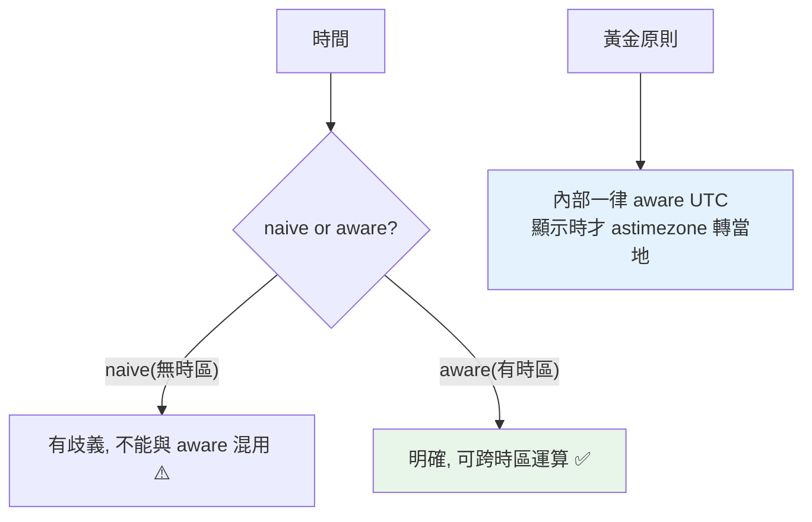

# datetime 時間處理

> 時間處理的頭號地雷是「時區」——naive（無時區）與 aware（有時區）的 datetime 不能混用，混了就出錯或算錯。掌握 `datetime`、時區、以及「一律用 aware UTC」的原則，才能正確處理時間。

## 💡 白話導讀（建議先讀）

時間處理的頭號地雷,一個問題就暴露：

> 「下午 3 點」——是**哪裡的**下午 3 點？台北的？倫敦的？

Python 的 `datetime` 物件分兩種,正對應這個問題：

- **naive（天真的）**：只寫「3 點」,**沒掛時區**——`datetime.now()` 預設給你這種。有歧義。
- **aware（有意識的）**：明確寫「UTC 的 3 點」「台北的 3 點」——**掛了時區牌**。無歧義。

兩者**不能混算**（比較/相減直接 TypeError）——這是時間 bug 的頭號來源。

黃金原則背起來,一輩子受用：

> **程式內部與資料庫,一律存 aware 的 UTC;只在顯示給使用者的最後一刻,轉成當地時區。**

```python
from datetime import datetime, UTC

now = datetime.now(UTC)               # ✓ aware 的 UTC —— 標準姿勢
now = datetime.now()                  # ✗ naive —— 埋雷
```

（時區資料用標準庫 `zoneinfo`:`ZoneInfo("Asia/Taipei")`——3.9+ 內建,不用裝 pytz。）

這章其餘是常用操作:格式化(`strftime`)、解析(`strptime`)、時間差(`timedelta`)——都是工具,地雷只有上面那顆。

## Why（為什麼）

時間看似簡單，卻是 bug 溫床：時區搞錯（伺服器在 UTC、使用者在台北）、naive/aware 混用、字串解析格式錯、日光節約時間。`datetime` 模組提供時間處理，但用不好會算錯時間、跨時區出包。這章講清楚 datetime 的核心，尤其**最重要的一課——naive vs aware 與時區處理**——這是時間 bug 的根源，也是面試常考的實務題。

## Theory（理論：naive vs aware）

`datetime` 物件分兩種——**這是最關鍵的區分**：

- **naive（天真的）**：**不帶時區資訊**——只是「某年某月某日某時」，不知道是哪個時區的（沒掛時區牌）。`datetime.now()` 預設回這種。
- **aware（有意識的）**：**帶時區資訊**（tzinfo）——明確知道是「UTC 的某時」或「台北的某時」。

**核心問題**：naive 有歧義（「下午 3 點」是哪裡的 3 點？），且 **naive 與 aware 不能互相比較/相減**（`TypeError`）。混用是時間 bug 的頭號來源。

**黃金原則**：

> **內部一律用 aware 的 UTC 時間，只在顯示給使用者時才轉成當地時區。**

## Specification（規範：datetime 核心）

```python
from datetime import datetime, date, time, timedelta, timezone
from zoneinfo import ZoneInfo   # Python 3.9+ 標準庫時區

# 當前時間
datetime.now()                          # naive（本地時間，不帶時區）⚠️
datetime.now(timezone.utc)              # aware UTC ✅
datetime.now(ZoneInfo("Asia/Taipei"))   # aware 台北時間

# 建立
datetime(2026, 7, 2, 15, 30, tzinfo=timezone.utc)   # aware
date(2026, 7, 2)                        # 只有日期
timedelta(days=7, hours=3)              # 時間差

# 時間運算
now = datetime.now(timezone.utc)
future = now + timedelta(days=30)       # 加 30 天
diff = future - now                     # timedelta

# 字串 ↔ datetime
dt.strftime("%Y-%m-%d %H:%M")           # datetime → 字串（格式化）
datetime.strptime("2026-07-02", "%Y-%m-%d")  # 字串 → datetime（解析）
dt.isoformat()                          # ISO 8601 字串
datetime.fromisoformat("2026-07-02T15:30:00+00:00")  # 解析 ISO
```

## Implementation（naive/aware 陷阱、時區轉換、格式化）

### naive/aware 不能混用

```python
from datetime import datetime, timezone

naive = datetime.now()                      # naive
aware = datetime.now(timezone.utc)          # aware

# ❌ 混用會報錯
# naive - aware
# TypeError: can't subtract offset-naive and offset-aware datetimes

# ❌ 比較也報錯
# naive < aware   →  TypeError
```

這是最常踩的坑——資料庫存的時間、API 回來的時間可能是不同種類，混算就爆。**解法：統一都用 aware UTC**。

### 時區轉換：內部 UTC、顯示當地

```python
from datetime import datetime, timezone
from zoneinfo import ZoneInfo

# 內部處理：一律 aware UTC
now_utc = datetime.now(timezone.utc)

# 顯示給台北使用者：轉當地時區
now_taipei = now_utc.astimezone(ZoneInfo("Asia/Taipei"))
print(now_utc.isoformat())      # 2026-07-02T07:30:00+00:00
print(now_taipei.isoformat())   # 2026-07-02T15:30:00+08:00（同一時刻，不同表示）

# 把 naive 標上時區（若你確定它是哪個時區的）
naive = datetime(2026, 7, 2, 15, 30)
taipei = naive.replace(tzinfo=ZoneInfo("Asia/Taipei"))   # 明確標記為台北時間
```

`astimezone` 轉換時區（同一時刻的不同表示）。`ZoneInfo`（3.9+ 標準庫）取代了需要第三方 `pytz` 的時代——用它處理具名時區（含日光節約）。

### 格式化與解析：strftime / strptime

```python
from datetime import datetime

dt = datetime(2026, 7, 2, 15, 30)

# datetime → 字串（format）
dt.strftime("%Y-%m-%d %H:%M:%S")    # '2026-07-02 15:30:00'
dt.strftime("%A, %B %d")            # 'Thursday, July 02'

# 字串 → datetime（parse）
datetime.strptime("2026-07-02", "%Y-%m-%d")
```

常用格式碼：`%Y`（年）、`%m`（月）、`%d`（日）、`%H`（時24）、`%M`（分）、`%S`（秒）、`%A`（星期名）、`%B`（月名）。**優先用 ISO 8601（`isoformat`/`fromisoformat`）** 做程式間交換——標準、無歧義、含時區。

### timedelta：時間運算

```python
from datetime import datetime, timedelta, timezone

now = datetime.now(timezone.utc)
tomorrow = now + timedelta(days=1)
week_ago = now - timedelta(weeks=1)
diff = tomorrow - now           # timedelta(days=1)
print(diff.total_seconds())     # 86400.0
```

`timedelta` 表示時間差，可加減 datetime、可相減得差、`total_seconds()` 取總秒數。

### 記錄「發生時間」用 UTC 時間戳

存資料庫、記 log 的時間一律用 aware UTC（或 UTC 時間戳 `time.time()`），顯示時才轉當地——避免「伺服器搬到別的時區」時間就亂掉。

## Code Example（可執行的 Python 範例）

```python
# datetime_demo.py
from __future__ import annotations

from datetime import datetime, timedelta, timezone
from zoneinfo import ZoneInfo


def utc_now() -> datetime:
    """取當前 aware UTC 時間（推薦做法）。"""
    return datetime.now(timezone.utc)


def to_timezone(dt: datetime, tz_name: str) -> datetime:
    """把 aware datetime 轉到指定時區。"""
    return dt.astimezone(ZoneInfo(tz_name))


def is_aware(dt: datetime) -> bool:
    """判斷是否為 aware（帶時區）。"""
    return dt.tzinfo is not None and dt.tzinfo.utcoffset(dt) is not None


def demo() -> None:
    # 1. aware UTC vs naive
    aware = utc_now()
    naive = datetime(2026, 7, 2, 15, 30)
    print(f"aware UTC 是 aware: {is_aware(aware)}")
    print(f"naive 是 aware: {is_aware(naive)}")

    # 2. 時區轉換（同一時刻，不同表示）
    utc = datetime(2026, 7, 2, 7, 30, tzinfo=timezone.utc)
    taipei = to_timezone(utc, "Asia/Taipei")
    print(f"\nUTC:   {utc.isoformat()}")
    print(f"台北:  {taipei.isoformat()}")

    # 3. timedelta 運算
    future = utc + timedelta(days=30)
    diff = future - utc
    print(f"\n30 天後: {future.date()}")
    print(f"時間差秒數: {diff.total_seconds():.0f}")

    # 4. 格式化與 ISO
    print(f"\n格式化: {utc.strftime('%Y-%m-%d %H:%M')}")
    print(f"ISO: {utc.isoformat()}")
    parsed = datetime.fromisoformat("2026-07-02T07:30:00+00:00")
    print(f"解析回: {parsed == utc}")


if __name__ == "__main__":
    demo()
```

**預期輸出**：

```pycon
$ python datetime_demo.py
aware UTC 是 aware: True
naive 是 aware: False

UTC:   2026-07-02T07:30:00+00:00
台北:  2026-07-02T15:30:00+08:00

30 天後: 2026-08-01
時間差秒數: 2592000

格式化: 2026-07-02 07:30
ISO: 2026-07-02T07:30:00+00:00
解析回: True
```

## Diagram（圖解：naive vs aware 與 UTC 原則）



## Best Practice（最佳實踐）

- **內部一律用 aware UTC**：`datetime.now(timezone.utc)`；只在顯示給使用者時 `astimezone` 轉當地時區。
- **絕不混用 naive 與 aware**：統一為 aware，避免 `TypeError` 與算錯。
- **具名時區用 `zoneinfo.ZoneInfo`**（3.9+ 標準庫，含日光節約），取代舊的 `pytz`。
- **程式間交換時間用 ISO 8601**（`isoformat`/`fromisoformat`）——標準、無歧義、含時區。
- **存資料庫/log 的時間用 UTC**：避免伺服器時區改變導致混亂。
- **`datetime.now()` 要小心**：它回 naive 本地時間；要 aware 就傳 `timezone.utc`。
- **時間差用 `timedelta`**，取秒數用 `.total_seconds()`。

## Common Mistakes（常見誤解）

- **naive/aware 混用**：相減/比較 `TypeError`——時間 bug 頭號來源；統一 aware UTC。
- **用 `datetime.now()` 當「當前時間」卻忘了它是 naive 本地時間**：跨時區出錯；用 `datetime.now(timezone.utc)`。
- **存本地時間到資料庫**：伺服器/使用者時區不同就亂；存 UTC。
- **用第三方 `pytz`**：3.9+ 有標準庫 `zoneinfo`，更簡單正確。
- **strftime/strptime 格式碼寫錯**：解析失敗或錯誤；優先用 ISO 格式。
- **忽略日光節約時間（DST）**：手動加減時區偏移會錯；用 `ZoneInfo`（自動處理 DST）。
- **用 `replace(tzinfo=)` 做時區轉換**：那只是「標記」時區（不改變時刻），轉換要用 `astimezone`。

## Interview Notes（面試重點）

- **naive vs aware 是必考**：能說出 naive（無時區、有歧義、不能與 aware 混用）vs aware（帶時區），以及**黃金原則「內部 aware UTC、顯示才轉當地」**。
- 知道 **`datetime.now()` 回 naive 本地時間**（陷阱），要 aware 用 `datetime.now(timezone.utc)`。
- 知道用 **`zoneinfo.ZoneInfo`（3.9+）** 處理具名時區與 DST，取代 pytz；`astimezone` 轉換時區。
- 知道 **ISO 8601（isoformat/fromisoformat）** 是程式間交換時間的標準。
- 知道 `timedelta` 做時間運算、`replace(tzinfo=)` 只標記不轉換（轉換用 astimezone）。

---

➡️ 下一章：[json 序列化](04-json.md)

[⬆️ 回 Part 11 索引](README.md)
