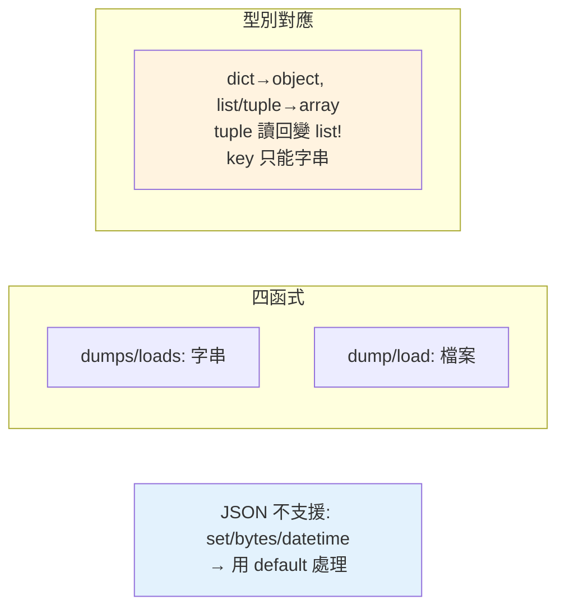

# json 序列化

> 為什麼 `json.dumps` 丟一個 `datetime` 進去就爆炸，丟 dict 卻沒事？json 是 API、設定、資料交換的通用語言，但它只認得幾種基本型別。這章講 `dumps`/`loads` 怎麼用，以及那幾個一定會遇到的型別陷阱。

## 💡 白話導讀（建議先讀）

JSON 是 API 世界的通用語——你的 Python dict 要出門見人（存檔、傳給前端、呼叫 API），得先翻譯成 JSON 文字；收到的 JSON 文字要用，得翻譯回 dict。

`json` 模組就是這位**翻譯官**，四個函式全部記住只要一個口訣：

> **有 `s` 的管字串（**s**tring），沒 `s` 的管檔案（file）。**

| 方向 | 字串版 | 檔案版 |
|------|--------|--------|
| Python → JSON（打包出門） | `dumps(obj)` | `dump(obj, f)` |
| JSON → Python（拆包進來） | `loads(text)` | `load(f)` |

兩個常用參數順手記：

```python
json.dumps(data, ensure_ascii=False, indent=2)
#          中文正常顯示不轉碼 ↑      ↑ 排版好讀
```

兩個常見疑問先答：

- **dict 的 key 變字串了？**——JSON 規格 key 只能是字串,`{1: "a"}` 過去會變 `{"1": "a"}`,回不來。
- **datetime/自訂物件不能直接 dumps？**——JSON 只支援基本型別(dict/list/str/數字/bool/null),其餘要自己轉(如 `.isoformat()`)。

跟 [pickle](12-pickle.md) 的分工之後會講:**JSON 安全、跨語言、限基本型別**——對外交流一律 JSON。

## 🔗 前端對照

JSON 處理是前端的母語,Python 的 `json` 模組幾乎一一對應:

| 目的 | Python | JavaScript |
|------|--------|-----------|
| 物件 → JSON 字串 | `json.dumps(obj)` | `JSON.stringify(obj)` |
| JSON 字串 → 物件 | `json.loads(s)` | `JSON.parse(s)` |
| 排版縮排 | `json.dumps(obj, indent=2)` | `JSON.stringify(obj, null, 2)` |
| 型別對應 | dict↔object、list↔array、None↔null、True↔true | 幾乎相同 |

一句話:`dumps` / `loads` ≈ `stringify` / `parse`,連參數的直覺都接近。小差異:Python 的 `None` / `True`
會轉成 JSON 的 `null` / `true`;而非 ASCII 字元預設會被跳脫,要 `ensure_ascii=False` 才保留中文。

## Why（為什麼）

JSON 是網路世界資料交換的通用格式——REST API、設定檔、前後端溝通都用它。`json` 模組讓 Python 物件（dict、list…）與 JSON 文字互轉。看似簡單，但有幾個實務要點：型別對應（Python 的 tuple → JSON array、dict key 只能是字串）、中文編碼（`ensure_ascii`）、以及「JSON 不支援的型別」（datetime、自訂物件）怎麼處理。搞懂這些，處理 API/設定資料才不會出包。

## Theory（理論：序列化與反序列化）

- **序列化（serialize / dump）**：Python 物件 → JSON 文字——打包出門。
- **反序列化（deserialize / load）**：JSON 文字 → Python 物件——拆包進來。

**四個核心函式**（口訣：有 `s` 的處理字串 **s**tring、沒 `s` 的處理檔案 file）：

| 函式 | 方向 | 對象 |
|------|------|------|
| `json.dumps(obj)` | 物件 → 字串 | 字串 |
| `json.loads(str)` | 字串 → 物件 | 字串 |
| `json.dump(obj, file)` | 物件 → 檔案 | 檔案 |
| `json.load(file)` | 檔案 → 物件 | 檔案 |

## Specification（規範：型別對應與參數）

```python
import json

# 字串
json.dumps({"a": 1})              # '{"a": 1}'
json.loads('{"a": 1}')            # {'a': 1}

# 檔案
with open("data.json", "w") as f:
    json.dump(obj, f)
with open("data.json") as f:
    obj = json.load(f)

# 常用參數
json.dumps(obj, indent=2)         # 美化縮排
json.dumps(obj, ensure_ascii=False)  # 保留中文（不轉 \uXXXX）
json.dumps(obj, sort_keys=True)   # key 排序
json.dumps(obj, default=str)      # 無法序列化的用 str() 處理
```

### Python ↔ JSON 型別對應

| Python | JSON |
|--------|------|
| `dict` | object |
| `list`、`tuple` | array（tuple 也變 array！） |
| `str` | string |
| `int`、`float` | number |
| `True`/`False` | `true`/`false` |
| `None` | `null` |

## Implementation（型別陷阱、中文、自訂型別、安全）

### 型別對應的陷阱

反序列化不完全「還原」——幾個要注意：

```pycon
>>> import json
>>> json.loads(json.dumps((1, 2, 3)))    # tuple 序列化後變 list！
[1, 2, 3]
>>> json.dumps({1: "a"})                 # int key 變字串
'{"1": "a"}'
>>> json.loads('{"1": "a"}')             # 讀回 key 是字串 "1"，不是 int 1
{'1': 'a'}
```

- **tuple → array → 讀回是 list**（不還原成 tuple）。
- **dict 的 key 只能是字串**——非字串 key（int）序列化時被轉成字串；讀回也是字串。
- JSON 沒有 `set`、`bytes`、`datetime`、自訂物件——這些不能直接序列化（見下）。

### 中文：`ensure_ascii=False`

預設 `json.dumps` 會把非 ASCII 字元轉成 `\uXXXX` 跳脫序列——中文會變亂碼似的字串：

```pycon
>>> import json
>>> json.dumps({"name": "小明"})              # 預設：中文被跳脫
'{"name": "\\u5c0f\\u660e"}'
>>> json.dumps({"name": "小明"}, ensure_ascii=False)  # 保留中文
'{"name": "小明"}'
```

**處理中文一律加 `ensure_ascii=False`**（並確保檔案用 UTF-8）——否則 JSON 檔滿是 `\uXXXX`，難讀。

### 自訂型別：`default` 與自訂編碼

JSON 不認識 datetime、自訂物件——直接序列化會 `TypeError`。用 `default` 參數指定「無法序列化時怎麼處理」：

```python
import json
from datetime import datetime

data = {"time": datetime(2026, 7, 2), "name": "test"}

# ❌ 直接序列化 datetime → TypeError
# json.dumps(data)

# ✅ 用 default 把無法序列化的轉成字串
json.dumps(data, default=str)     # datetime 用 str() 轉

# ✅ 自訂處理（更精確）
def encode(obj):
    if isinstance(obj, datetime):
        return obj.isoformat()
    raise TypeError(f"無法序列化 {type(obj)}")

json.dumps(data, default=encode)
```

反序列化自訂型別用 `object_hook`（`loads(s, object_hook=...)`）。實務上處理複雜資料驗證/序列化常用 **pydantic**（見 [pydantic](../14-web/06-pydantic-validation.md)）而非手刻。

### 安全：json 是安全的（不像 pickle）

**`json.loads` 是安全的**——它只解析資料，不會執行程式碼。這與 `pickle`（見 [pickle](12-pickle.md)）根本不同——pickle 反序列化不可信資料會執行任意程式碼（重大漏洞）。**接收外部資料一律用 JSON，絕不用 pickle**。但仍要注意：解析超大 JSON 可能耗記憶體（DoS），要限制大小。

## Code Example（可執行的 Python 範例）

```python
# json_demo.py
from __future__ import annotations

import json
from datetime import datetime


def encode_special(obj: object) -> str:
    """處理 JSON 不支援的型別。"""
    if isinstance(obj, datetime):
        return obj.isoformat()
    raise TypeError(f"無法序列化 {type(obj).__name__}")


def demo() -> None:
    # 1. 基本序列化/反序列化
    data = {"name": "小明", "age": 30, "tags": ["a", "b"], "active": True}
    text = json.dumps(data, ensure_ascii=False)  # 保留中文
    print(f"序列化: {text}")
    restored = json.loads(text)
    print(f"反序列化: {restored == data}")

    # 2. 型別陷阱：tuple → list
    original = {"point": (1, 2)}
    round_trip = json.loads(json.dumps(original))
    print(f"\ntuple 序列化後: {round_trip}")  # {'point': [1, 2]}（變 list）

    # 3. 美化輸出
    print("\n美化:")
    print(json.dumps({"a": 1, "b": [2, 3]}, indent=2, ensure_ascii=False))

    # 4. 自訂型別（datetime）
    with_time = {"event": "登入", "time": datetime(2026, 7, 2, 15, 30)}
    encoded = json.dumps(with_time, default=encode_special, ensure_ascii=False)
    print(f"\n含 datetime: {encoded}")


if __name__ == "__main__":
    demo()
```

**預期輸出**：

```pycon
$ python json_demo.py
序列化: {"name": "小明", "age": 30, "tags": ["a", "b"], "active": true}
反序列化: True

tuple 序列化後: {'point': [1, 2]}

美化:
{
  "a": 1,
  "b": [
    2,
    3
  ]
}

含 datetime: {"event": "登入", "time": "2026-07-02T15:30:00"}
```

## Diagram（圖解：json 四函式與型別對應）



## Best Practice（最佳實踐）

- **記住四函式**：`dumps`/`loads`（字串）、`dump`/`load`（檔案）——有 `s` 是 string。
- **中文加 `ensure_ascii=False`** + UTF-8 編碼，避免 `\uXXXX`。
- **無法序列化的型別用 `default`**（datetime → isoformat）；複雜資料考慮 pydantic。
- **知道型別對應陷阱**：tuple→list、dict key 只能字串、set/bytes 不支援。
- **接收外部資料用 JSON 不用 pickle**：JSON 安全（不執行程式碼），pickle 危險（見 [pickle](12-pickle.md)）。
- **美化輸出用 `indent=2`**（給人看的檔案）；程式間交換用緊湊格式（省空間）。
- **解析不可信的大 JSON 要限制大小**（避免記憶體 DoS）。

## Common Mistakes（常見誤解）

- **中文變 `\uXXXX`**：忘了 `ensure_ascii=False`。
- **序列化 datetime/set/自訂物件直接 TypeError**：用 `default` 或轉成 JSON 支援的型別。
- **以為 tuple 會還原**：JSON array 讀回是 list，不是 tuple。
- **用非字串當 dict key**：序列化被轉成字串，讀回也是字串（`{1:...}` → `{"1":...}`）。
- **用 pickle 處理外部/網路資料**：安全漏洞；用 JSON。
- **搞混 dumps/dump**：`dumps` 回字串、`dump` 寫檔案（多了 file 參數）。
- **解析不可信巨大 JSON 不設限**：可能耗盡記憶體。

## Interview Notes（面試重點）

- 知道**四函式**（dumps/loads 字串、dump/load 檔案）與 **Python↔JSON 型別對應**（dict→object、list/tuple→array、key 只能字串）。
- **知道型別陷阱**：**tuple 序列化後讀回變 list**、非字串 key 被轉字串、set/bytes/datetime 不支援（用 `default`）。
- 知道**中文用 `ensure_ascii=False`**。
- **關鍵安全點**：**JSON 是安全的（不執行程式碼），pickle 危險——外部資料用 JSON 不用 pickle**（連結 [pickle](12-pickle.md)）。
- 知道複雜資料序列化/驗證實務用 pydantic。

---

➡️ 下一章：[re 正規表達式](05-re.md)

[⬆️ 回 Part 11 索引](README.md)
