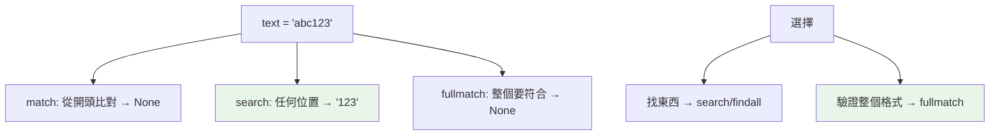

# re 正規表達式

> 從一堆文字裡抓出所有 email、把日期格式一次全部替換——這種「模式比對」的活，正規表達式一行就能搞定，卻也惡名昭彰地難讀、難維護、還可能藏效能與安全漏洞。這章講 `re` 的核心用法，以及同樣重要的「何時千萬別用 regex」。

## 💡 白話導讀（建議先讀）

普通的 Ctrl+F 只能找「確切的字」。但很多需求是找「**長某種樣子**的字」：

- 「所有的 email」——不知道具體是哪個，但知道長相：`一串字@一串字.一串字`
- 「所有手機號碼」：`09 開頭接 8 個數字`

**正規表達式（regex）** 就是描述「長相」的迷你語言。`re` 模組拿這個描述去文字裡比對。

先會五個符號就能幹活：

```text
\d   一個數字        \w   一個字母/數字/底線
+    前面的東西一個以上    *    零個以上
09\d{8}              → 09 開頭接 8 個數字(台灣手機)
```

四種操作對應四個函式：

```python
re.search(pat, text)    # 找到第一個(有沒有?在哪?)
re.findall(pat, text)   # 全部抓出來(list)
re.sub(pat, new, text)  # 找到就替換
re.split(pat, text)     # 依模式切開
```

兩句忠告,比語法更重要：

1. **regex 是雙面刃**——能一行解決的很優雅;但複雜的 pattern 三個月後連你自己都看不懂。**簡單字串操作(`in`、`startswith`、`split`)能解決的,別上 regex**。
2. 寫 pattern 用 **raw string**（`r"\d+"`）——不然反斜線會先被 Python 字串吃掉一層,經典坑。

## Why（為什麼）

正規表達式是文字處理的利器——驗證格式（email、電話）、抽取資料、搜尋替換。`re` 模組提供這能力。但 regex 也惡名昭彰：難讀難維護、效能陷阱（災難性回溯）、常被濫用（能用簡單字串方法就別用 regex）。這章講清楚核心函式、常用語法、raw string 的必要性，以及「何時該用、何時不該用」的判斷——後者和會寫 pattern 一樣重要。

## Theory（理論：模式比對）

**正規表達式（regular expression, regex）** 是描述「文字模式（長相）」的語言——用特殊符號表達「一個數字」「一個以上的字母」「開頭是⋯⋯」。`re` 模組編譯這些 pattern 並在文字上比對。

核心操作四類：

- **搜尋**：找 pattern 是否出現（`search`）、是否從開頭符合（`match`）。
- **抓取**：找出所有符合的（`findall`/`finditer`），用群組抽出部分。
- **替換**：把符合的換掉（`sub`）。
- **分割**：依 pattern 切分（`split`）。

## Specification（規範：核心函式與語法）

```python
import re

# 核心函式
re.search(pattern, text)      # 找第一個符合（在任何位置）→ Match 或 None
re.match(pattern, text)       # 從「開頭」比對 → Match 或 None
re.fullmatch(pattern, text)   # 整個字串完全符合
re.findall(pattern, text)     # 所有符合 → list
re.finditer(pattern, text)    # 所有符合 → Match 的迭代器
re.sub(pattern, repl, text)   # 替換 → 新字串
re.split(pattern, text)       # 分割 → list

# 編譯（重複用同一 pattern 時較快）
regex = re.compile(r"\d+")
regex.findall(text)

# Match 物件
m = re.search(r"(\d+)-(\d+)", "12-34")
m.group()        # '12-34'（整個）
m.group(1)       # '12'（第一個群組）
m.groups()       # ('12', '34')
```

### 常用語法

| 符號 | 意義 |
|------|------|
| `\d` `\w` `\s` | 數字、字元(含底線)、空白 |
| `.` | 任意字元（除換行） |
| `*` `+` `?` | 0+、1+、0或1 個 |
| `{n}` `{n,m}` | 剛好 n 個、n 到 m 個 |
| `^` `$` | 開頭、結尾 |
| `[abc]` `[^abc]` | 字元集合、否定集合 |
| `(...)` | 群組（抽取） |
| `|` | 或 |
| `\b` | 單字邊界 |

## Implementation（raw string、群組、search vs match、陷阱）

### 一律用 raw string `r"..."`

regex 大量用反斜線（`\d`、`\b`），而普通字串的 `\` 是跳脫字元——會衝突。**pattern 一律用 raw string**（見 [字串](../02-fundamentals/04-strings.md)）：

```python
import re

# ❌ 普通字串：\d 沒問題但 \b 會被當退格字元，且易錯
re.search("\\d+", text)     # 要雙反斜線，醜

# ✅ raw string：所見即所得
re.search(r"\d+", text)     # 清楚
```

`r"\d+"` 讓 `\d` 原樣傳給 regex 引擎，不被 Python 字串跳脫先處理。這是 regex 的鐵律。

### `search` vs `match` vs `fullmatch`

新手常混淆這三個：

```pycon
>>> import re
>>> re.match(r"\d+", "abc123")     # 從「開頭」比對 → 開頭不是數字 → None
>>> re.search(r"\d+", "abc123")    # 找「任何位置」→ 找到 '123'
<re.Match object; match='123'>
>>> re.fullmatch(r"\d+", "123")    # 「整個」字串符合 → 匹配
<re.Match object; match='123'>
>>> re.fullmatch(r"\d+", "123abc") # 整個要符合 → None
```

- **`match`**：只從**開頭**比對（不是「找到就好」）。
- **`search`**：找**任何位置**的第一個符合（最常用）。
- **`fullmatch`**：**整個**字串要符合（驗證格式常用）。

「驗證整個輸入是否符合格式」用 `fullmatch`；「找出文字裡的東西」用 `search`/`findall`。

### 群組：抽取部分

用 `(...)` 群組抽出符合的片段：

```python
import re

m = re.search(r"(\d{4})-(\d{2})-(\d{2})", "日期 2026-07-02")
if m:
    year, month, day = m.groups()    # ('2026', '07', '02')
    m.group(1)                       # '2026'

# 具名群組（更清楚）
m = re.search(r"(?P<year>\d{4})-(?P<month>\d{2})", "2026-07")
m.group("year")                      # '2026'
```

具名群組 `(?P<name>...)` 讓 pattern 更可讀、抽取更明確。

### 替換與分割

```python
import re

# 替換
re.sub(r"\s+", " ", "多個    空白")       # '多個 空白'（壓縮空白）
re.sub(r"(\d+)", r"[\1]", "價格 100")     # '價格 [100]'（\1 引用群組）

# 分割
re.split(r"[,;]\s*", "a, b; c,d")         # ['a', 'b', 'c', 'd']
```

### 效能與安全：災難性回溯

某些 pattern（巢狀量詞如 `(a+)+`）遇到特定輸入會**災難性回溯（catastrophic backtracking）**——比對時間指數爆炸，可能被惡意輸入癱瘓（ReDoS 攻擊，見 [安全](../20-security-system-design/README.md)）：

```python
# ❌ 危險 pattern：巢狀量詞
re.match(r"(a+)+$", "aaaaaaaaaaaaaaaaaaaX")   # 可能卡住很久！
```

**避免巢狀量詞**、對不可信輸入的 regex 要謹慎、或設逾時。**重複使用的 pattern 用 `re.compile`** 快取編譯結果（省重複編譯）。

### 何時「不該」用 regex

**能用簡單字串方法就別用 regex**——regex 難讀難維護：

```python
# ❌ 殺雞用牛刀
re.search(r"^hello", text)      # 用 regex 判斷開頭
# ✅ 字串方法更清楚
text.startswith("hello")

re.findall(r"foo", text)        # 用 regex 找子字串
text.count("foo")               # 或 "foo" in text
```

`startswith`/`endswith`/`in`/`split`/`replace` 能解決的，別用 regex。regex 留給「真正需要模式」的場景（格式驗證、複雜抽取）。

## Code Example（可執行的 Python 範例）

```python
# re_demo.py
from __future__ import annotations

import re


def extract_dates(text: str) -> list[tuple[str, str, str]]:
    """抽取所有 YYYY-MM-DD 日期（用具名群組）。"""
    pattern = re.compile(r"(?P<year>\d{4})-(?P<month>\d{2})-(?P<day>\d{2})")
    return [(m["year"], m["month"], m["day"]) for m in pattern.finditer(text)]


def is_valid_email(email: str) -> bool:
    """簡單 email 格式驗證（用 fullmatch）。"""
    pattern = r"[\w.+-]+@[\w-]+\.[\w.-]+"
    return re.fullmatch(pattern, email) is not None


def normalize_whitespace(text: str) -> str:
    """把多個空白壓成一個。"""
    return re.sub(r"\s+", " ", text).strip()


def demo() -> None:
    # 1. 抽取日期
    text = "會議在 2026-07-02，截止 2026-08-15"
    print(f"日期: {extract_dates(text)}")

    # 2. email 驗證
    for email in ["user@example.com", "bad@", "a.b+c@test.co.uk"]:
        print(f"  {email}: {is_valid_email(email)}")

    # 3. search vs match
    print(f"\nmatch 'abc123': {re.match(r'\\d+', 'abc123')}")  # None（開頭非數字）
    print(f"search 'abc123': {re.search(r'\\d+', 'abc123').group()}")  # '123'

    # 4. 壓縮空白
    print(f"\n壓縮空白: {normalize_whitespace('多個    空白  ')!r}")


if __name__ == "__main__":
    demo()
```

**預期輸出**：

```pycon
$ python re_demo.py
日期: [('2026', '07', '02'), ('2026', '08', '15')]
  user@example.com: True
  bad@: False
  a.b+c@test.co.uk: True

match 'abc123': None
search 'abc123': 123

壓縮空白: '多個 空白'
```

## Diagram（圖解：search vs match vs fullmatch）



## Best Practice（最佳實踐）

- **pattern 一律用 raw string** `r"..."`：避免反斜線衝突。
- **能用字串方法就別用 regex**：`startswith`/`in`/`split`/`replace` 更清楚；regex 留給真正的模式需求。
- **選對函式**：找東西用 `search`/`findall`、驗證整個格式用 `fullmatch`、從開頭用 `match`。
- **用具名群組 `(?P<name>...)`** 讓 pattern 可讀、抽取明確。
- **重複用的 pattern 用 `re.compile`** 快取編譯。
- **避免巢狀量詞**（`(a+)+`）防災難性回溯（ReDoS）；不可信輸入的 regex 要謹慎。
- **複雜 pattern 加註解**（用 `re.VERBOSE` 可分行加註）——regex 難讀，說明它做什麼。

## Common Mistakes（常見誤解）

- **pattern 沒用 raw string**：`\d`/`\b` 被 Python 字串跳脫誤處理；一律 `r"..."`。
- **混淆 `match`（開頭）與 `search`（任何位置）**：`match` 找不到不代表沒有，只是不在開頭。
- **驗證格式用 `search` 而非 `fullmatch`**：`search(r"\d+", "12a")` 會匹配（有數字就算），但你可能想要「整個都是數字」用 `fullmatch`。
- **濫用 regex**：簡單字串操作用 regex 難讀難維護。
- **災難性回溯**：巢狀量詞遇到惡意輸入卡死（ReDoS）；避免並對不可信輸入設限。
- **每次都重新編譯 pattern**：熱路徑用 `re.compile` 快取。
- **忘了 Match 可能是 None**：`re.search(...).group()` 若沒匹配會 `AttributeError`；先檢查 `if m:`。

## Interview Notes（面試重點）

- **能區分 `search`（任何位置）、`match`（從開頭）、`fullmatch`（整個符合）**，並知道驗證格式用 fullmatch、找東西用 search/findall。
- 知道 **pattern 一律用 raw string** 及原因（反斜線衝突）。
- 知道**群組 `(...)`、具名群組 `(?P<name>...)`、`sub` 替換（`\1` 引用）、`re.compile` 快取**。
- **知道「能用字串方法就別用 regex」**（可讀性、維護性）。
- **知道災難性回溯/ReDoS**（巢狀量詞的安全風險），對不可信輸入的 regex 要謹慎。
- 知道 Match 可能是 None，取 group 前要檢查。

---

➡️ 下一章：[檔案與 io](06-io.md)

[⬆️ 回 Part 11 索引](README.md)
