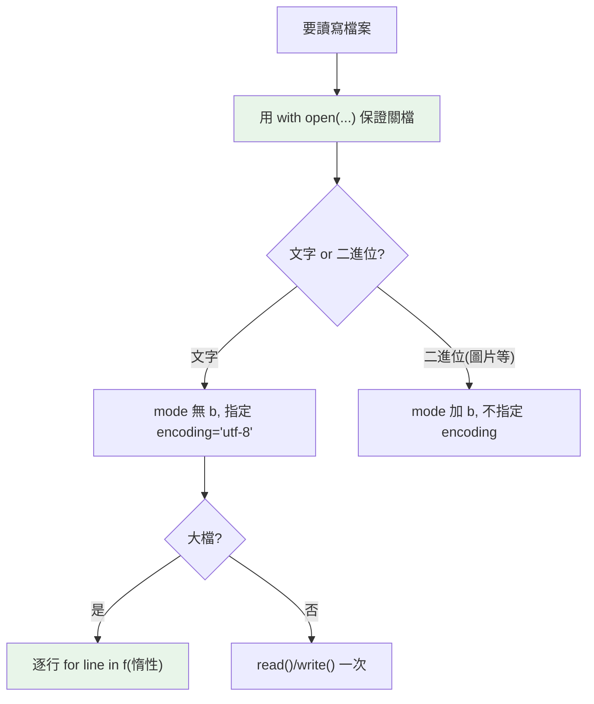

# 檔案與 io

> 讀寫檔案的核心是 `open()` + `with`——自動關檔、指定模式與編碼、逐行迭代省記憶體。搞懂文字vs二進位模式、編碼、以及 `io.StringIO`/`BytesIO` 記憶體檔案，就掌握了檔案 I/O。

## 💡 白話導讀（建議先讀）

讀寫檔案的標準姿勢就一行，先背再拆：

```python
with open("data.txt", "r", encoding="utf-8") as f:
    ...
```

三個零件各管一事：

1. **`open(路徑, 模式, encoding)`**——開一條通往檔案的「水管」。
2. **`with`**——[Part 6 的自動歸還閘門](../06-error-handling/06-context-manager.md)：離開區塊**保證關檔**，中途爆炸也關。
3. **`encoding="utf-8"`**——[Part 2 的電碼本](../02-fundamentals/16-encoding-bytes.md)：**永遠明寫**，別賭系統預設（Windows 預設不是 UTF-8，中文亂碼的最大宗來源）。

模式（mode）兩個維度組合：

- **做什麼**：`r` 讀 / `w` 寫（**覆蓋！**）/ `a` 追加 / `x` 新建（存在就報錯）
- **什麼型別**：預設文字模式（讀寫 `str`,自動過電碼本）;加 `b` 是二進位模式（讀寫 `bytes`,原汁原味——圖片、壓縮檔用這個）

還有一個省記憶體的好習慣：

```text
for line in f:        # 逐行迭代 —— 一次只載一行,10GB 檔案也不怕
```

（`f.read()` 是整份吞進記憶體——小檔可以,大檔爆炸。惰性的老朋友又出現了。）

## Why（為什麼）

讀寫檔案是最基本的 I/O。看似簡單，卻有幾個常踩的坑：忘了關檔（資源洩漏）、編碼沒指定（跨平台亂碼）、用 `readlines()` 讀大檔（記憶體爆）、文字/二進位模式搞混。掌握 `open` 的模式與編碼、`with` 的自動清理、逐行迭代的惰性、以及 `io.StringIO`（記憶體中的檔案）——這些是穩健檔案處理的基礎。

## Theory（理論：open + with + 模式）

檔案 I/O 的三要素：

- **`open(path, mode, encoding)`**：開檔，回傳一個檔案物件（水管）。
- **`with`**：context manager，**保證關檔**（即使出錯，見 [context manager](../06-error-handling/06-context-manager.md) 的自動歸還閘門）。
- **模式（mode）**：讀/寫/追加 × 文字/二進位。

**兩個模式維度**：

1. **操作**：`r`（讀）、`w`（寫，**覆蓋**）、`a`（追加）、`x`（新建，已存在則失敗）。
2. **型別**：文字模式（預設，處理 `str`、經過編碼轉換）vs 二進位模式（`b`，處理 `bytes`、原汁原味）。

## Specification（規範：open 模式與操作）

```text
# 開檔（一律用 with）
with open("file.txt", "r", encoding="utf-8") as f:
    content = f.read()

# 模式
# "r"  讀（預設）      "w"  寫（覆蓋）      "a"  追加
# "x"  新建（已存在則 FileExistsError）
# "rb"/"wb"  二進位讀/寫（bytes）
# "r+"  讀寫

# 讀取方法
f.read()          # 讀整個檔（字串/bytes）
f.read(100)       # 讀 100 字元/位元組
f.readline()      # 讀一行
f.readlines()     # 讀所有行 → list（大檔別用！）
for line in f:    # 逐行迭代（惰性，省記憶體）✅

# 寫入方法
f.write("text")   # 寫字串
f.writelines(lines)   # 寫多行（不自動加換行）

# io 記憶體檔案
import io
buf = io.StringIO()      # 記憶體中的文字檔
buf = io.BytesIO()       # 記憶體中的二進位檔
```

## Implementation（with、編碼、逐行、文字vs二進位、StringIO）

### `with`：保證關檔

```python
# ❌ 手動開關：出錯就洩漏
f = open("data.txt")
process(f)
f.close()          # 若 process 出錯，這行不執行 → 檔案沒關

# ✅ with：保證關閉（即使出錯）
with open("data.txt", encoding="utf-8") as f:
    process(f)     # 離開 with 自動關檔
```

**永遠用 `with` 開檔**——它保證關閉（context manager 的清理，見 [context manager](../06-error-handling/06-context-manager.md)），避免資源洩漏、確保寫入 flush 到磁碟。

### 一律指定 `encoding`

**文字模式一定要指定 `encoding`**——否則用平台預設編碼（Windows 可能是 cp950/big5、Unix 是 UTF-8），造成跨平台亂碼：

```python
# ❌ 沒指定編碼：跨平台可能亂碼
with open("data.txt") as f:      # 平台預設編碼
    ...

# ✅ 明確 UTF-8
with open("data.txt", encoding="utf-8") as f:
    ...
```

現代慣例：**檔案一律 UTF-8**（`encoding="utf-8"`）。這是處理中文/多語言不出錯的關鍵。

### 逐行迭代：處理大檔的正解

檔案物件是**可迭代的**（見 [iterable](../07-iterators-generators/01-iterable-iterator.md)），逐行迭代是**惰性**的——一次讀一行、不把整檔載入記憶體：

```python
# ❌ readlines / read 讀大檔：整檔進記憶體（GB 級檔會 OOM）
with open("huge.log", encoding="utf-8") as f:
    lines = f.readlines()        # 全部載入！

# ✅ 逐行迭代：記憶體恆定（能處理任意大的檔）
with open("huge.log", encoding="utf-8") as f:
    for line in f:               # 一次一行，惰性
        process(line)
```

逐行迭代（見 [惰性求值](../07-iterators-generators/07-lazy-evaluation.md)）讓你能處理遠大於記憶體的檔案。**大檔一律逐行、別 `read()`/`readlines()` 全載**。

### 文字模式 vs 二進位模式

- **文字模式**（預設）：讀寫 `str`，自動處理編碼與換行轉換（`\r\n` ↔ `\n`）。
- **二進位模式**（`b`）：讀寫 `bytes`，不做任何轉換——用於圖片、壓縮檔、非文字資料：

```python
# 文字：str
with open("text.txt", "r", encoding="utf-8") as f:
    content: str = f.read()

# 二進位：bytes
with open("image.png", "rb") as f:
    data: bytes = f.read()       # bytes，不解碼
```

**處理非文字資料（圖片、二進位格式）用二進位模式**；二進位模式**不指定 encoding**（bytes 沒有編碼）。

### `io.StringIO` / `BytesIO`：記憶體中的檔案

有時你想「像操作檔案一樣操作記憶體中的資料」（測試、暫存、組裝輸出）——用 `io.StringIO`（文字）/`io.BytesIO`（二進位）：

```python
import io

# 像檔案一樣寫，但在記憶體
buf = io.StringIO()
buf.write("第一行\n")
buf.write("第二行\n")
content = buf.getvalue()     # 取出全部內容

# 常用於測試（把「應該寫檔的」導向記憶體）或組裝字串
```

`StringIO`/`BytesIO` 提供檔案介面但資料在記憶體——測試（不碰真實檔案）、暫存、把接受「檔案物件」的 API 餵記憶體資料時很有用。

## Code Example（可執行的 Python 範例）

```python
# io_demo.py
from __future__ import annotations

import io
import tempfile
from pathlib import Path


def count_lines(path: Path) -> int:
    """逐行迭代計數（省記憶體，能處理大檔）。"""
    count = 0
    with open(path, encoding="utf-8") as f:
        for _ in f:
            count += 1
    return count


def build_report(items: list[str]) -> str:
    """用 StringIO 在記憶體組裝文字。"""
    buf = io.StringIO()
    buf.write("=== 報表 ===\n")
    for i, item in enumerate(items, 1):
        buf.write(f"{i}. {item}\n")
    return buf.getvalue()


def demo() -> None:
    with tempfile.TemporaryDirectory() as tmp:
        path = Path(tmp) / "data.txt"

        # 寫檔（with + encoding）
        with open(path, "w", encoding="utf-8") as f:
            f.write("第一行\n第二行\n第三行\n")

        # 讀整個
        with open(path, encoding="utf-8") as f:
            print(f"整檔:\n{f.read()}", end="")

        # 逐行計數
        print(f"行數: {count_lines(path)}")

    # StringIO 記憶體檔案
    report = build_report(["蘋果", "香蕉", "橘子"])
    print(f"\n{report}", end="")


if __name__ == "__main__":
    demo()
```

**預期輸出**：

```pycon
$ python io_demo.py
整檔:
第一行
第二行
第三行
行數: 3

=== 報表 ===
1. 蘋果
2. 香蕉
3. 橘子
```

## Diagram（圖解：檔案 I/O 決策）



## Best Practice（最佳實踐）

- **一律用 `with open(...)`**：保證關檔、flush 到磁碟（見 [context manager](../06-error-handling/06-context-manager.md)）。
- **文字模式一律指定 `encoding="utf-8"`**：避免跨平台亂碼。
- **大檔逐行迭代 `for line in f`**（惰性、省記憶體）；別 `read()`/`readlines()` 全載。
- **非文字資料用二進位模式**（`rb`/`wb`，處理 bytes、不指定 encoding）。
- **路徑用 pathlib**（見 [pathlib](02-pathlib.md)）；小檔可直接用 `Path.read_text()`/`write_text()`。
- **測試/暫存/組裝用 `io.StringIO`/`BytesIO`**：像檔案但在記憶體，不碰真實檔案。
- **寫入模式小心 `w`（覆蓋）**：`w` 會清空原檔；追加用 `a`、避免覆蓋用 `x`。

## Common Mistakes（常見誤解）

- **手動 open/close 忘了關**（尤其出錯時）：資源洩漏；用 `with`。
- **文字模式沒指定 encoding**：跨平台亂碼（Windows 預設非 UTF-8）。
- **用 `read()`/`readlines()` 讀大檔**：整檔進記憶體 → OOM；逐行迭代。
- **文字/二進位模式搞混**：文字模式讀 bytes 或反之會出錯；圖片等用 `rb`。
- **二進位模式指定 encoding**：bytes 沒有編碼，會 `ValueError`。
- **`w` 模式意外覆蓋檔案**：`w` 開檔立刻清空；讀用 `r`、追加用 `a`。
- **忘了 `write` 不自動加換行**：要自己加 `\n`。

## Interview Notes（面試重點）

- 知道**一律用 `with open(...)` 保證關檔**（context manager 清理）。
- 知道**文字模式要指定 `encoding="utf-8"`**（跨平台）、二進位模式（`b`）處理 bytes、不指定 encoding。
- **知道大檔逐行迭代 `for line in f`（惰性省記憶體）**，別 `read()`/`readlines()` 全載——連結惰性求值。
- 知道 open 的模式（`r`/`w`/`a`/`x` + `b`），`w` 會覆蓋。
- 知道 **`io.StringIO`/`BytesIO`** 是記憶體中的檔案（測試、暫存、餵檔案介面的 API）。
- 知道小檔可用 `pathlib.Path.read_text()/write_text()`。

---

➡️ 下一章：[subprocess 執行外部程式](07-subprocess.md)

[⬆️ 回 Part 11 索引](README.md)
