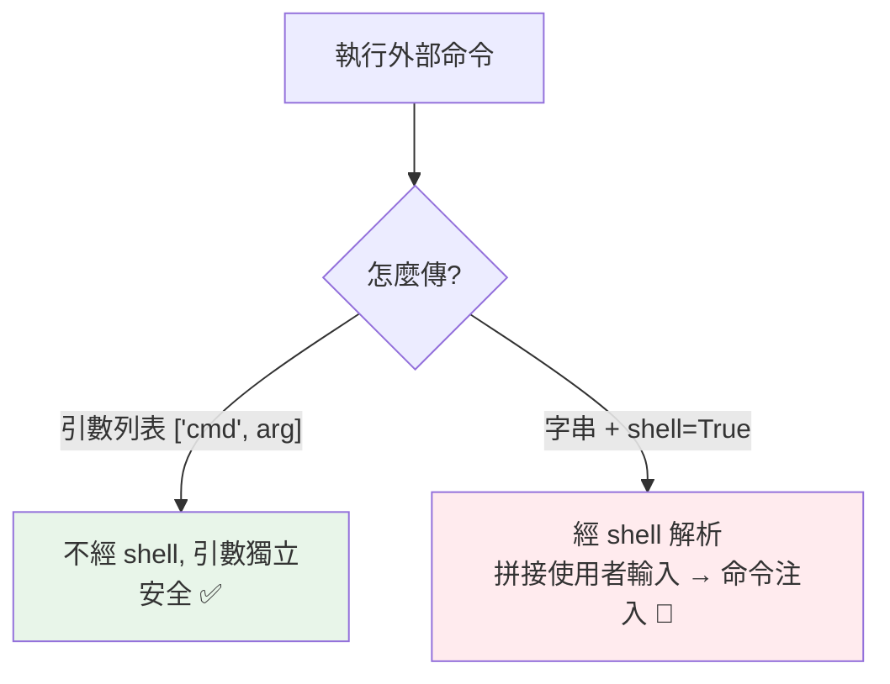

# subprocess 執行外部程式

> `subprocess.run` 是執行外部命令的正解——傳引數列表（不是字串）、取得輸出與退出碼、檢查錯誤。最重要的一課是安全：絕不用 `shell=True` 拼接使用者輸入（命令注入漏洞）。

## Why（為什麼）

Python 程式常需要呼叫外部命令：跑 git、呼叫 ffmpeg、執行系統工具。`subprocess` 模組提供這能力。但它也是**命令注入漏洞**的常見來源——用錯方式（`shell=True` + 字串拼接）會讓惡意輸入執行任意命令。這章講清楚 `subprocess.run` 的正確用法（引數列表、取輸出、檢查錯誤）與**安全鐵律**——這是既實用又攸關安全的模組。

## Theory（理論：run 與引數列表）

**`subprocess.run(args, ...)`** 是現代執行外部命令的主要介面（Python 3.5+，取代舊的 `os.system`、`call`）。核心原則：

- **args 傳「引數列表」而非「字串」**：`["git", "status"]` 而非 `"git status"`——這是安全與正確的關鍵。
- **取得結果**：`CompletedProcess` 物件，含 `returncode`（退出碼）、`stdout`、`stderr`。
- **檢查錯誤**：`check=True` 讓非零退出碼拋例外。

## Specification（規範：run 常用參數）

```python
import subprocess

# 基本：傳引數列表
result = subprocess.run(
    ["git", "status", "--short"],   # 引數列表（不是字串！）
    capture_output=True,             # 捕捉 stdout/stderr
    text=True,                        # 以文字（str）而非 bytes 處理
    check=True,                       # 非零退出碼 → 拋 CalledProcessError
    timeout=30,                        # 逾時（秒）
    cwd="/path/to/dir",               # 工作目錄
    env={...},                         # 環境變數
)

# 結果
result.returncode     # 退出碼（0 成功）
result.stdout         # 標準輸出（text=True 時是 str）
result.stderr         # 標準錯誤
```

## Implementation（引數列表、取輸出、check、安全）

### 傳引數列表，不是字串

**最重要的實務——args 用列表**：

```python
import subprocess

# ✅ 引數列表：每個引數是獨立元素，安全
subprocess.run(["ls", "-l", "/tmp"])
subprocess.run(["git", "commit", "-m", "訊息含空格也沒問題"])

# ❌ 字串（需要 shell=True 才能跑）：危險
subprocess.run("ls -l /tmp", shell=True)   # 見安全章節
```

引數列表讓每個引數獨立傳給程式（不經過 shell 解析）——即使引數含空格、特殊字元也正確，且**不會被當成 shell 命令執行**（安全）。

### 取得輸出與退出碼

```python
import subprocess

result = subprocess.run(
    ["python", "--version"],
    capture_output=True,
    text=True,
)
print(result.returncode)     # 0
print(result.stdout)         # 'Python 3.12.x\n'
```

`capture_output=True` 捕捉輸出（否則直接印到終端）、`text=True` 讓 stdout/stderr 是 `str`（否則是 bytes）。**幾乎總是加 `text=True`**（除非處理二進位輸出）。

### `check=True`：讓失敗拋例外

預設 `run` 不管退出碼——命令失敗（非零退出碼）也不會報錯，你得自己檢查 `returncode`。加 **`check=True`** 讓非零退出碼**拋 `CalledProcessError`**：

```python
import subprocess

try:
    subprocess.run(["git", "push"], check=True, capture_output=True, text=True)
except subprocess.CalledProcessError as e:
    print(f"命令失敗（退出碼 {e.returncode}）: {e.stderr}")
```

`check=True` 符合「快速失敗」——命令失敗就明確報錯，別默默繼續。搭配 try/except 處理失敗。

### 🔴 安全：絕不用 shell=True 拼接輸入

**這是本章最重要的一課**。`shell=True` 讓命令經過 shell 解析——若你把使用者輸入拼進命令字串，會造成**命令注入（command injection）**：

```python
import subprocess

# 🔴 極度危險：命令注入漏洞
filename = user_input               # 假設是 "; rm -rf /"
subprocess.run(f"cat {filename}", shell=True)   # 執行了 rm -rf /！

# ✅ 安全：引數列表，不經 shell
subprocess.run(["cat", filename])   # filename 就是個檔名，不會被當命令
```

用 `shell=True` + 字串拼接使用者輸入，惡意輸入（`; rm -rf /`、`&& curl evil.com`）會被 shell 執行——這是嚴重的安全漏洞（見 [注入攻擊](../20-security-system-design/02-injection.md)）。

**鐵律**：
- **一律用引數列表**（`["cmd", arg1, arg2]`），**不用 `shell=True`**。
- **真的需要 shell 功能（管道、萬用字元）時**，也別拼接不可信輸入；用 `shlex.quote` 或改用純 Python。

### 設逾時避免掛住

外部命令可能卡住——設 `timeout` 避免你的程式無限等待：

```python
try:
    subprocess.run(["slow_command"], timeout=10, check=True)
except subprocess.TimeoutExpired:
    print("命令逾時")
```

### Popen：需要更精細控制時

`run` 涵蓋多數需求；需要「即時讀輸出、雙向溝通、背景執行」時用低階的 `subprocess.Popen`（較複雜，一般用 `run` 就好）。

## Code Example（可執行的 Python 範例）

```python
# subprocess_demo.py
from __future__ import annotations

import subprocess
import sys


def run_command(args: list[str]) -> tuple[int, str, str]:
    """安全執行命令（引數列表），回傳 (退出碼, stdout, stderr)。"""
    result = subprocess.run(
        args,
        capture_output=True,
        text=True,
        timeout=30,
    )
    return result.returncode, result.stdout, result.stderr


def demo() -> None:
    # 1. 執行 python --version（安全的引數列表）
    code, out, err = run_command([sys.executable, "--version"])
    print(f"退出碼: {code}")
    print(f"輸出: {out.strip() or err.strip()}")

    # 2. check=True 讓失敗拋例外
    try:
        subprocess.run(
            [sys.executable, "-c", "import sys; sys.exit(1)"],
            check=True,
            capture_output=True,
            text=True,
        )
    except subprocess.CalledProcessError as e:
        print(f"\n命令失敗，退出碼: {e.returncode}")

    # 3. 執行一段 Python 印出結果
    code, out, _ = run_command(
        [sys.executable, "-c", "print(sum(range(10)))"]
    )
    print(f"\n計算結果: {out.strip()}")

    # 4. 安全提醒
    print("\n安全鐵律：一律用引數列表，絕不 shell=True 拼接使用者輸入")


if __name__ == "__main__":
    demo()
```

**預期輸出**：

```pycon
$ python subprocess_demo.py
退出碼: 0
輸出: Python 3.12.x

命令失敗，退出碼: 1

計算結果: 45

安全鐵律：一律用引數列表，絕不 shell=True 拼接使用者輸入
```

## Diagram（圖解：安全 vs 危險）



## Best Practice（最佳實踐）

- **用 `subprocess.run` + 引數列表**（`["cmd", arg1, ...]`），取代 `os.system`/舊 API。
- **絕不用 `shell=True` 拼接使用者輸入**：命令注入漏洞（見 [注入攻擊](../20-security-system-design/02-injection.md)）；一律引數列表。
- **加 `text=True`** 取 str 輸出、**`capture_output=True`** 捕捉輸出、**`check=True`** 讓失敗拋例外。
- **設 `timeout`** 避免命令掛住你的程式。
- **處理失敗用 try/except `CalledProcessError`/`TimeoutExpired`**。
- **能用純 Python 就別呼叫外部命令**：`shutil`（見 [tempfile/shutil](17-tempfile-shutil-glob.md)）、pathlib 等常能取代外部工具，更安全可攜。
- **需要即時輸出/雙向溝通用 `Popen`**（較複雜）。

## Common Mistakes（常見誤解）

- **`shell=True` + 字串拼接使用者輸入**：命令注入——最嚴重的錯誤。用引數列表。
- **忘了 `check=True`**：命令失敗（非零退出碼）不報錯，默默繼續；要主動檢查或 `check=True`。
- **忘了 `text=True`**：stdout/stderr 是 bytes 不是 str，處理麻煩。
- **不設 timeout**：外部命令卡住 → 你的程式無限等待。
- **用舊的 `os.system`/`os.popen`**：功能弱、不安全；用 `subprocess.run`。
- **能用純 Python 卻呼叫外部命令**：`ls`/`cp`/`mkdir` 等有 pathlib/shutil 對應，更可攜安全。
- **傳字串當 args 卻沒 shell=True**：`run("ls -l")` 會把整個字串當一個程式名找不到。

## Interview Notes（面試重點）

- 知道 **`subprocess.run` 是現代介面**，**args 傳引數列表**（`["cmd", arg]`）而非字串。
- **命令注入安全是必考**：**絕不用 `shell=True` 拼接使用者輸入**（會被 shell 執行惡意命令）；引數列表不經 shell、安全。
- 知道常用參數：**`capture_output=True`、`text=True`、`check=True`（失敗拋 CalledProcessError）、`timeout`**。
- 知道處理失敗用 try/except `CalledProcessError`/`TimeoutExpired`。
- 知道**能用純 Python（shutil/pathlib）就別呼叫外部命令**，及舊 `os.system` 該淘汰。

---

➡️ 下一章：[logging 日誌](08-logging.md)

[⬆️ 回 Part 11 索引](README.md)
