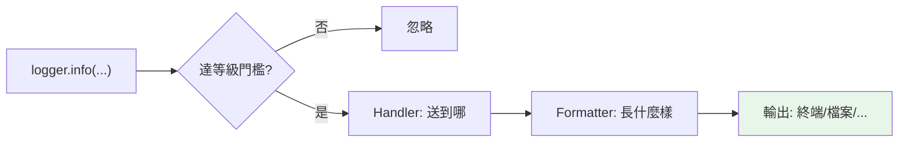

# logging 日誌

> `print` 除錯遲早會後悔——`logging` 給你分級（DEBUG/INFO/WARNING/ERROR）、可開關、含時間戳與來源、可輸出到檔案/多目的地的專業日誌。正式程式一律用 logging 不用 print。

## Why（為什麼）

用 `print` 除錯的問題：無法分級（全部混在一起）、無法關閉（正式環境還在印）、無時間/來源、無法輸出到檔案、混在正常輸出裡。**`logging`** 解決這一切——分級記錄、可設定門檻開關、含脈絡（時間、模組、行號）、可送到檔案/syslog/多目的地。正式程式、函式庫、服務一律用 logging。這章講清楚 logging 的核心概念與正確用法。

## Theory（理論：logger、level、handler）

logging 有幾個核心概念：

- **Logger**：記錄日誌的入口，通常每個模組一個（`logging.getLogger(__name__)`）。
- **Level（等級）**：日誌的嚴重程度——`DEBUG < INFO < WARNING < ERROR < CRITICAL`。設定門檻，低於門檻的不記錄。
- **Handler**：決定日誌**送到哪**（終端、檔案、網路…）。
- **Formatter**：決定日誌**長什麼樣**（時間、等級、訊息、來源）。

一條日誌流程：`logger.info(...)` → 若等級達門檻 → 交給 handler → formatter 格式化 → 輸出。

## Specification（規範：基本用法）

```python
import logging

# 快速設定（腳本層級）
logging.basicConfig(
    level=logging.INFO,                    # 門檻：INFO 以上才記錄
    format="%(asctime)s %(name)s %(levelname)s: %(message)s",
)

# 每個模組取一個 logger（慣例用 __name__）
logger = logging.getLogger(__name__)

# 記錄（五個等級）
logger.debug("除錯細節")      # 開發時的詳細資訊
logger.info("一般資訊")       # 正常運作的訊息
logger.warning("警告")        # 可能有問題但還能運作
logger.error("錯誤")          # 發生錯誤
logger.critical("嚴重")       # 嚴重錯誤

# 在 except 內記錄含 traceback
try:
    risky()
except Exception:
    logger.exception("操作失敗")   # 自動含 traceback！
```

## Implementation（等級、getLogger、exception、輸出到檔案）

### 五個等級與門檻

日誌分五級，`basicConfig(level=...)` 設門檻——**只有達到門檻的才被記錄**：

```python
import logging
logging.basicConfig(level=logging.WARNING)   # 門檻 WARNING

logger = logging.getLogger(__name__)
logger.debug("看不到")       # DEBUG < WARNING，不記錄
logger.info("看不到")        # INFO < WARNING，不記錄
logger.warning("看得到")     # WARNING 達門檻
logger.error("看得到")       # ERROR > WARNING
```

用等級**開發時開 DEBUG（看細節）、正式環境設 INFO/WARNING（少雜訊）**——調門檻就能開關詳細程度，不必改程式碼。這是 logging 勝過 print 的核心。

### `getLogger(__name__)`：每模組一個 logger

**慣例每個模組用 `logging.getLogger(__name__)` 取 logger**——`__name__` 是模組名，讓日誌顯示「來自哪個模組」，也能針對特定模組調整等級：

```python
# 在 myapp/database.py
logger = logging.getLogger(__name__)   # logger 名為 'myapp.database'
logger.info("連線資料庫")               # 日誌會標明來源模組
```

這讓大型程式的日誌可追溯來源、可分模組控制（如只把 `myapp.database` 開 DEBUG）。**函式庫尤其該用 `getLogger(__name__)`**（別自己 basicConfig，讓使用者決定如何處理）。

### `logger.exception`：記錄含 traceback

在 `except` 區塊裡記錄錯誤，用 **`logger.exception(msg)`**——它自動附上完整 traceback（見 [錯誤處理最佳實踐](../06-error-handling/08-error-handling-best-practices.md)）：

```python
try:
    process()
except Exception:
    logger.exception("處理失敗")   # 訊息 + 完整 traceback
    # 等同 logger.error("處理失敗", exc_info=True)
```

`logger.exception` 只該在 except 內用（它取當前例外的 traceback）。這比 print 錯誤好太多——有時間、等級、來源、完整堆疊。

### 輸出到檔案 / 多目的地

用 handler 控制輸出到哪——檔案、終端、或兩者：

```python
import logging

logger = logging.getLogger("myapp")
logger.setLevel(logging.DEBUG)

# 輸出到檔案
file_handler = logging.FileHandler("app.log", encoding="utf-8")
file_handler.setLevel(logging.INFO)         # 檔案只記 INFO 以上

# 輸出到終端
console_handler = logging.StreamHandler()
console_handler.setLevel(logging.DEBUG)     # 終端記 DEBUG 以上

formatter = logging.Formatter("%(asctime)s %(levelname)s: %(message)s")
file_handler.setFormatter(formatter)
console_handler.setFormatter(formatter)

logger.addHandler(file_handler)
logger.addHandler(console_handler)
```

一個 logger 可掛多個 handler（同一條日誌送到多處，各自可設不同等級/格式）——這是 logging 的彈性。實務上輪替檔案用 `RotatingFileHandler`/`TimedRotatingFileHandler`（避免 log 檔無限成長）。

### 結構化日誌（進階）

正式服務常用**結構化日誌（JSON 格式）** 方便機器解析與集中收集（見 [可觀測性](../19-cloud-native/08-observability.md)）——用 `python-json-logger` 等或自訂 formatter。

## Code Example（可執行的 Python 範例）

```python
# logging_demo.py
from __future__ import annotations

import logging

# 設定（腳本層級）
logging.basicConfig(
    level=logging.INFO,
    format="%(name)s %(levelname)s: %(message)s",
)

logger = logging.getLogger(__name__)


def process_order(order_id: int, amount: float) -> bool:
    """示範不同等級的日誌。"""
    logger.debug("開始處理訂單 %d（看不到，DEBUG < INFO）", order_id)
    logger.info("處理訂單 %d，金額 %.2f", order_id, amount)

    if amount <= 0:
        logger.warning("訂單 %d 金額異常: %.2f", order_id, amount)
        return False

    if amount > 10000:
        logger.error("訂單 %d 金額超過上限", order_id)
        return False

    return True


def risky_operation() -> None:
    """示範 logger.exception 記錄 traceback。"""
    try:
        _ = 1 / 0
    except ZeroDivisionError:
        logger.exception("運算失敗")  # 自動含 traceback


def demo() -> None:
    process_order(1, 500.0)      # INFO
    process_order(2, -10.0)      # WARNING
    process_order(3, 50000.0)    # ERROR

    print("\n--- exception 含 traceback ---")
    risky_operation()


if __name__ == "__main__":
    demo()
```

**預期輸出**：

```pycon
$ python logging_demo.py
__main__ INFO: 處理訂單 1，金額 500.00
__main__ INFO: 處理訂單 2，金額 -10.00
__main__ WARNING: 訂單 2 金額異常: -10.00
__main__ INFO: 處理訂單 3，金額 50000.00
__main__ ERROR: 訂單 3 金額超過上限

--- exception 含 traceback ---
__main__ ERROR: 運算失敗
Traceback (most recent call last):
  File "logging_demo.py", line ..., in risky_operation
    _ = 1 / 0
ZeroDivisionError: division by zero
```

## Diagram（圖解：logging 流程）



## Best Practice（最佳實踐）

- **正式程式用 logging 不用 print**：可分級、可開關、含脈絡、可導向檔案。
- **每模組 `logging.getLogger(__name__)`**：日誌可追溯來源、可分模組控制；函式庫尤其該這樣（別自己 basicConfig）。
- **用等級表達嚴重程度**：DEBUG（開發細節）、INFO（正常）、WARNING（可疑）、ERROR（錯誤）、CRITICAL（嚴重）；正式環境設 INFO/WARNING 門檻。
- **在 except 內用 `logger.exception`** 記錄含 traceback。
- **用 `%s` 佔位而非 f-string**：`logger.info("值 %s", x)` 讓「未達門檻時不做字串格式化」（省效能）。
- **輪替日誌檔用 `RotatingFileHandler`**：避免 log 無限成長。
- **正式服務考慮結構化（JSON）日誌**（見 [可觀測性](../19-cloud-native/08-observability.md)）。

## Common Mistakes（常見誤解）

- **用 print 除錯正式程式**：無法分級/關閉/導向；用 logging。
- **不設 logger 名（用 root logger）**：無法追溯來源、難分模組控制；用 `getLogger(__name__)`。
- **函式庫裡呼叫 `basicConfig`**：搶了使用者的設定權；函式庫只 `getLogger` + 記錄，讓使用者決定 handler。
- **在 except 用 `logger.error` 而非 `logger.exception`**：漏了 traceback；exception 自動含。
- **用 f-string 而非 `%s` 佔位**：即使未達門檻也做字串格式化（浪費）；用 `logger.info("%s", x)`。
- **log 檔無限成長**：用 RotatingFileHandler 輪替。
- **日誌記錄敏感資訊**（密碼、密鑰）：安全風險；記錄前過濾。

## Interview Notes（面試重點）

- **知道為何用 logging 不用 print**：可分級（DEBUG~CRITICAL）、可設門檻開關、含脈絡（時間/模組/等級）、可導向檔案/多目的地。
- 知道核心概念：**Logger（每模組 `getLogger(__name__)`）、Level（門檻）、Handler（送到哪）、Formatter（格式）**。
- 知道 **五個等級順序**與正式環境設 INFO/WARNING 門檻。
- 知道 **`logger.exception`（except 內，自動含 traceback）**。
- 知道**函式庫不該 basicConfig**（讓使用者控制）、用 `%s` 佔位省效能、輪替日誌檔。
- 知道正式服務用結構化（JSON）日誌利於集中收集（連結可觀測性）。

---

➡️ 下一章：[collections / functools / itertools 回顧](09-collections-functools-itertools.md)

[⬆️ 回 Part 11 索引](README.md)
