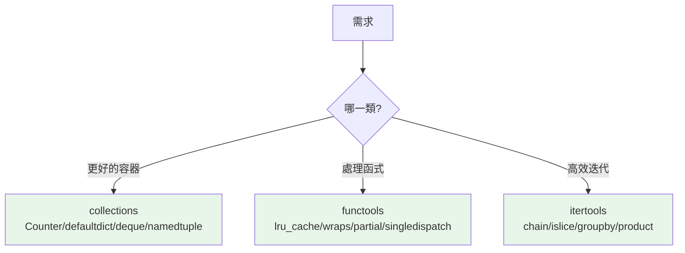

# collections / functools / itertools 回顧

> 這三個模組是 Python 標準庫的「三劍客」——`collections`（專用容器）、`functools`（函式工具）、`itertools`（迭代工具）。前面章節已分別深入，這章從「標準庫地圖」的角度整合回顧，讓你知道「需要 X 時去哪找」。

## Why（為什麼）

`collections`、`functools`、`itertools` 是最常用的三個標準庫模組——幾乎每個稍具規模的程式都會用到。前面章節已分別深入（見對應連結），但工程師常見的問題是「**遇到某需求時，該用哪個模組的什麼工具？**」這章不重複細節，而是從「標準庫地圖」的角度整合三者，建立「需求 → 工具」的對照，讓你需要時能快速定位。這是把散落知識收斂成可用心智地圖的一章。

## Theory（理論：三個模組的定位）

| 模組 | 提供什麼 | 一句話 |
|------|----------|--------|
| **`collections`** | 專用容器型別 | 補內建 dict/list 的不足 |
| **`functools`** | 操作/增強函式的工具 | 處理函式的函式 |
| **`itertools`** | 惰性迭代工具 | 高效組合/處理序列 |

它們的共同點：**都是「電池內建」的高品質工具，用它們取代自己造輪子**。

## Specification（規範：三模組速查）

```python
# --- collections（見 Part 3）---
from collections import Counter, defaultdict, deque, namedtuple, OrderedDict, ChainMap
Counter(items)                  # 計數
defaultdict(list)               # 缺 key 自動預設
deque(maxlen=100)               # 兩端 O(1) 佇列
namedtuple("Point", ["x", "y"]) # 具名 tuple

# --- functools（見 Part 8）---
from functools import lru_cache, cache, wraps, partial, reduce, singledispatch, total_ordering
@lru_cache(maxsize=None)        # 記憶化
@wraps(func)                    # 裝飾器保留資訊
partial(func, arg)              # 固定部分參數
@total_ordering                 # 補齊比較方法
@singledispatch                 # 依型別分派

# --- itertools（見 Part 7）---
import itertools as it
it.chain(a, b)                  # 串接
it.islice(gen, n)               # 切片（取無限生成器）
it.groupby(sorted_data, key)    # 分組（需先排序）
it.product(a, b)                # 笛卡兒積
it.combinations(items, r)       # 組合
it.accumulate(nums)             # 累加
```

## Implementation（需求 → 工具對照）

以下是「遇到需求時去哪找」的實務對照——這是本章的核心價值。

### collections：需要「更好的容器」時

| 需求 | 工具 | 章節 |
|------|------|------|
| 計數（詞頻、統計） | `Counter` | [collections](../03-data-structures/08-collections-module.md) |
| 分組、缺 key 自動預設 | `defaultdict` | 同上 |
| 佇列、兩端進出、滑動視窗 | `deque` | 同上 |
| 具名欄位的輕量紀錄 | `namedtuple` | 同上 |
| 多層設定疊加查找 | `ChainMap` | 同上 |
| 抽象容器介面（型別檢查） | `collections.abc` | [collections.abc](16-collections-abc.md) |

### functools：需要「處理函式」時

| 需求 | 工具 | 章節 |
|------|------|------|
| 快取昂貴函式結果 | `lru_cache`/`cache` | [functools](../08-functional-decorators/05-functools.md) |
| 寫裝飾器保留原函式資訊 | `wraps` | 同上 |
| 固定部分參數（回呼、特化） | `partial` | [partial](../08-functional-decorators/06-partial.md) |
| 補齊全套比較方法 | `total_ordering` | [functools](../08-functional-decorators/05-functools.md) |
| 依型別分派 | `singledispatch` | 同上 |
| 快取的計算屬性 | `cached_property` | [property](../04-oop/06-property.md) |

### itertools：需要「高效迭代」時

| 需求 | 工具 | 章節 |
|------|------|------|
| 串接多個序列 | `chain` | [itertools](../07-iterators-generators/06-itertools.md) |
| 取無限生成器的一段 | `islice` | 同上 |
| 連續分組 | `groupby`（需先排序） | 同上 |
| 排列/組合/笛卡兒積 | `permutations`/`combinations`/`product` | 同上 |
| 累加/相鄰配對 | `accumulate`/`pairwise` | 同上 |

### 共同精神：別造輪子

這三個模組的核心價值是「**用標準庫的高品質工具，取代手寫**」：

```python
# ❌ 手寫計數
counts = {}
for x in items:
    counts[x] = counts.get(x, 0) + 1

# ✅ Counter
from collections import Counter
counts = Counter(items)

# ❌ 手寫快取
_cache = {}
def fib(n):
    if n in _cache: return _cache[n]
    ...

# ✅ lru_cache
@cache
def fib(n): ...

# ❌ 手寫串接
result = []
for lst in lists:
    result.extend(lst)

# ✅ chain
from itertools import chain
result = list(chain.from_iterable(lists))
```

看到「手寫迴圈做常見操作」時，先問「標準庫有沒有現成的」——通常有，且更快更清楚。

## Code Example（可執行的 Python 範例）

```python
# stdlib_trio_demo.py
from __future__ import annotations

import itertools as it
from collections import Counter, defaultdict
from functools import lru_cache


@lru_cache(maxsize=None)
def fib(n: int) -> int:
    """functools：記憶化。"""
    return n if n < 2 else fib(n - 1) + fib(n - 2)


def analyze_text(text: str) -> dict[str, object]:
    """整合三模組分析文字。"""
    words = text.lower().split()

    # collections.Counter：詞頻
    word_counts = Counter(words)

    # collections.defaultdict：依首字母分組
    by_letter: defaultdict[str, list[str]] = defaultdict(list)
    for w in set(words):
        by_letter[w[0]].append(w)

    return {
        "top_words": word_counts.most_common(2),
        "groups": {k: sorted(v) for k, v in sorted(by_letter.items())},
    }


def demo() -> None:
    # functools
    print(f"fib(20) = {fib(20)}")

    # collections
    result = analyze_text("the cat the dog the bird")
    print(f"詞頻: {result['top_words']}")
    print(f"分組: {result['groups']}")

    # itertools
    print(f"\n串接: {list(it.chain([1, 2], [3, 4]))}")
    print(f"組合: {list(it.combinations([1, 2, 3], 2))}")
    print(f"累加: {list(it.accumulate([1, 2, 3, 4]))}")


if __name__ == "__main__":
    demo()
```

**預期輸出**：

```pycon
$ python stdlib_trio_demo.py
fib(20) = 6765
詞頻: [('the', 3), ('cat', 1)]
分組: {'b': ['bird'], 'c': ['cat'], 'd': ['dog'], 't': ['the']}

串接: [1, 2, 3, 4]
組合: [(1, 2), (1, 3), (2, 3)]
累加: [1, 3, 6, 10]
```

## Diagram（圖解：三模組地圖）



## Best Practice（最佳實踐）

- **看到「手寫常見操作」先找標準庫**：計數→Counter、分組→defaultdict、快取→lru_cache、串接→chain——通常有現成的。
- **計數/分組用 collections**、**快取/裝飾器/固定參數用 functools**、**組合/惰性迭代用 itertools**。
- **這三個模組免安裝、高品質、C 實作**（多數）——優先用它們。
- **記住「需求 → 工具」對照**（本章表格），需要時快速定位。
- **深入細節看對應章節**（Part 3 collections、Part 8 functools、Part 7 itertools）。
- **社群套件補充**：`more-itertools` 補了更多迭代工具（chunked、windowed 等）。

## Common Mistakes（常見誤解）

- **手寫計數/分組/快取/串接**：重造輪子；標準庫更快更清楚。
- **不知道這些工具的存在**：於是用一長串迴圈做本可一行的事。
- **groupby 忘了先排序**（itertools 經典坑，見 [itertools](../07-iterators-generators/06-itertools.md)）。
- **lru_cache 用在不純函式**（見 [functools](../08-functional-decorators/05-functools.md)）。
- **可變 class 屬性 vs defaultdict 混淆**：分組用 defaultdict 或 Counter，別用可變 class 屬性。
- **忘了 itertools 回傳惰性 iterator**：要 `list()` 才看內容。

## Interview Notes（面試重點）

- **能說出三模組的定位**：collections（專用容器）、functools（函式工具）、itertools（惰性迭代工具）。
- **能做「需求 → 工具」對照**：計數→Counter、分組→defaultdict、佇列→deque、快取→lru_cache、固定參數→partial、串接→chain、組合→combinations、分組→groupby。
- 知道核心精神：**用標準庫取代手寫**（更快、更清楚、C 實作）。
- 記得各自的陷阱（groupby 需排序、lru_cache 需純函式、itertools 惰性）。
- 知道深入細節在各自的章節（Part 3/7/8）。

---

➡️ 下一章：[argparse 與命令列工具](10-argparse.md)

[⬆️ 回 Part 11 索引](README.md)
