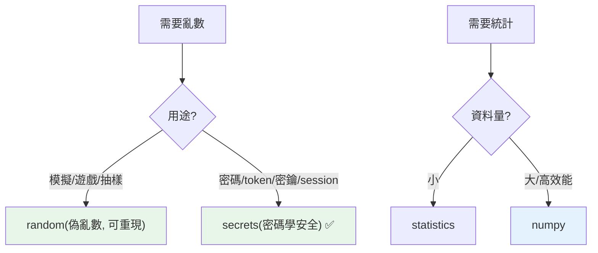

# random / math / statistics

> `random` 產生亂數（但別用它做密碼學——那要用 `secrets`）、`math` 提供數學函式、`statistics` 做基本統計。三個小而常用的標準庫模組，各有一個關鍵安全/正確性要點。

## Why（為什麼）

需要亂數（洗牌、抽樣、模擬）、數學運算（開根號、對數、常數）、基本統計（平均、中位數、標準差）時，這三個模組就是答案。它們簡單，但各有一個容易忽略的重點：`random` **不安全於密碼學**（密鑰/token 要用 `secrets`）、`math` 的浮點函式有精度考量、`statistics` 適合小資料（大資料用 numpy）。這章講清楚三者的常用功能與這些關鍵點。

## Theory（理論：三模組定位）

| 模組 | 用途 | 關鍵點 |
|------|------|--------|
| **`random`** | 偽亂數（模擬、抽樣、洗牌） | **不可用於密碼學**（用 `secrets`） |
| **`math`** | 數學函式與常數 | 浮點運算（精度見 [decimal](../02-fundamentals/15-float-precision-decimal.md)） |
| **`statistics`** | 基本統計 | 小資料用它、大資料用 numpy |

## Specification（規範：三模組速覽）

```python
import random
import math
import statistics

# --- random ---
random.random()              # [0.0, 1.0) 的浮點
random.randint(1, 6)         # [1, 6] 的整數（含兩端）
random.uniform(0, 10)        # [0, 10] 的浮點
random.choice(seq)           # 隨機選一個
random.choices(seq, k=3)     # 有放回抽 3 個
random.sample(seq, k=3)      # 無放回抽 3 個
random.shuffle(lst)          # 原地洗牌
random.seed(42)              # 設種子（可重現）

# --- math ---
math.pi, math.e, math.inf, math.nan
math.sqrt(16)                # 4.0
math.floor(3.7), math.ceil(3.2)   # 3, 4
math.log(100, 10)            # 2.0
math.isclose(a, b)           # 浮點比較（見 Part 2）
math.gcd(12, 18)             # 最大公因數

# --- statistics ---
statistics.mean([1, 2, 3])       # 平均
statistics.median([1, 2, 3, 4])  # 中位數
statistics.mode([1, 1, 2])       # 眾數
statistics.stdev(data)           # 標準差（樣本）
statistics.variance(data)        # 變異數
```

## Implementation（random 安全性、math、statistics）

### 🔴 `random` 不可用於密碼學

**最重要的一點**：`random` 產生的是**偽亂數（pseudo-random）**——由種子決定、可預測。它適合模擬、遊戲、抽樣，**但絕不可用於安全場景**（密碼、token、密鑰、session ID）：

```python
import random
import secrets

# 🔴 危險：用 random 產生 token/密碼（可被預測）
token = "".join(random.choices("abc123", k=16))   # 不安全！

# ✅ 安全：用 secrets 模組（密碼學安全的亂數）
token = secrets.token_hex(16)                       # 安全的隨機 token
password = secrets.choice(chars)                    # 安全選擇
secrets.randbelow(100)                              # 安全的隨機整數
```

`secrets` 模組（Python 3.6+）用作業系統的密碼學安全亂數源——**任何安全相關的隨機（密碼、token、驗證碼、密鑰）一律用 `secrets`，不用 `random`**（見 [密鑰管理](../20-security-system-design/05-secrets-management.md)）。這是面試與實務的安全常識。

### `random.seed`：可重現的亂數

設種子讓亂數序列可重現——**測試、除錯、科學實驗需要重現性**：

```python
import random

random.seed(42)
print(random.random())    # 每次執行都一樣（種子固定）

# 測試時固定種子，讓「隨機」的行為可預測、可測試
```

同一種子產生同一序列——這對測試「用到隨機的程式」很重要（讓結果可預測）。

### `math`：數學函式

```python
import math

math.sqrt(2)              # 1.4142...
math.pow(2, 10)           # 1024.0（浮點；整數次方用 2**10）
math.factorial(5)         # 120
math.log(math.e)          # 1.0（自然對數）
math.log2(8), math.log10(1000)   # 3.0, 3.0
math.degrees(math.pi), math.radians(180)   # 角度/弧度轉換
math.isnan(x), math.isinf(x)     # 判斷 NaN/無限
```

`math` 是浮點運算——注意精度（見 [浮點誤差](../02-fundamentals/15-float-precision-decimal.md)），比較用 `math.isclose`。整數運算（如次方）優先用內建 `**`（保持任意精度整數）。

### `statistics`：基本統計

```python
import statistics

data = [2, 4, 4, 4, 5, 5, 7, 9]
statistics.mean(data)        # 5.0（平均）
statistics.median(data)      # 4.5（中位數）
statistics.mode(data)        # 4（眾數）
statistics.stdev(data)       # 2.13...（樣本標準差）
statistics.pstdev(data)      # 母體標準差
```

`statistics` 適合**小資料集的基本統計**。**大資料/高效能用 numpy**（見 [Part 17](../17-data-science/README.md)）——numpy 快得多且功能豐富。`statistics` 的優點是標準庫、無需安裝、適合輕量需求。

## Code Example（可執行的 Python 範例）

```python
# random_math_stats_demo.py
from __future__ import annotations

import math
import random
import secrets
import statistics


def roll_dice(seed: int, count: int) -> list[int]:
    """用固定種子擲骰（可重現）。"""
    rng = random.Random(seed)  # 獨立的隨機產生器
    return [rng.randint(1, 6) for _ in range(count)]


def secure_token(length: int) -> str:
    """安全的隨機 token（用 secrets，不用 random）。"""
    return secrets.token_hex(length)


def analyze(data: list[float]) -> dict[str, float]:
    """基本統計。"""
    return {
        "mean": statistics.mean(data),
        "median": statistics.median(data),
        "stdev": statistics.stdev(data),
    }


def demo() -> None:
    # 1. 可重現的亂數（固定種子）
    print(f"擲骰(種子42): {roll_dice(42, 5)}")
    print(f"再擲一次:     {roll_dice(42, 5)}")  # 相同（種子固定）

    # 2. 安全 vs 不安全的隨機
    print(f"\n安全 token（secrets）: {secure_token(8)}")
    print("→ 密碼/token 一律用 secrets，不用 random！")

    # 3. math
    print(f"\nsqrt(16)={math.sqrt(16)}, log10(1000)={math.log10(1000)}")

    # 4. statistics
    stats = analyze([2, 4, 4, 4, 5, 5, 7, 9])
    print(f"統計: mean={stats['mean']}, median={stats['median']}, stdev={stats['stdev']:.2f}")


if __name__ == "__main__":
    demo()
```

**預期輸出**（token 每次不同）：

```pycon
$ python random_math_stats_demo.py
擲骰(種子42): [6, 1, 1, 6, 3]
再擲一次:     [6, 1, 1, 6, 3]

安全 token（secrets）: a3f9b2c1d4e5f6a7
→ 密碼/token 一律用 secrets，不用 random！

sqrt(16)=4.0, log10(1000)=3.0
統計: mean=5, median=4.5, stdev=2.13
```

## Diagram（圖解：random vs secrets）



## Best Practice（最佳實踐）

- **安全相關的隨機（密碼、token、驗證碼、密鑰、session ID）一律用 `secrets`**，絕不用 `random`（見 [密鑰管理](../20-security-system-design/05-secrets-management.md)）。
- **模擬/遊戲/抽樣用 `random`**；測試需重現時用 `random.seed()` 或 `random.Random(seed)`。
- **整數次方用內建 `**`**（保持任意精度），`math.pow` 回浮點。
- **浮點比較用 `math.isclose`**（見 [浮點誤差](../02-fundamentals/15-float-precision-decimal.md)）。
- **小資料基本統計用 `statistics`**（標準庫、無需安裝）；大資料/高效能用 numpy。
- **需要獨立的隨機狀態用 `random.Random(seed)`**（而非全域 `random`），避免互相干擾。

## Common Mistakes（常見誤解）

- **用 `random` 產生密碼/token**：偽亂數可預測，安全漏洞——用 `secrets`。這是嚴重的安全錯誤。
- **忘了 `random` 需要種子才能重現**：測試「隨機行為」要固定種子。
- **用 `math.pow` 算整數次方**：回浮點且可能溢位；整數用 `**`。
- **用 `==` 比較 `math` 的浮點結果**：用 `math.isclose`。
- **大資料用 `statistics`**：慢；用 numpy。
- **`statistics.stdev`（樣本）vs `pstdev`（母體）搞混**：依你的資料是樣本還是母體選對的。
- **以為 `random.seed` 讓亂數「不隨機」**：它讓序列可重現（測試用），不是失去隨機性。

## Interview Notes（面試重點）

- **關鍵安全點：`random` 是偽亂數不可用於密碼學，安全隨機（密碼/token/密鑰）用 `secrets`**——這是高頻安全考點。
- 知道 `random` 常用（`randint`/`choice`/`sample`/`shuffle`/`seed`）與 **`seed` 用於重現（測試）**。
- 知道 `math` 是浮點運算（比較用 `isclose`）、整數次方用 `**` 而非 `math.pow`。
- 知道 **`statistics` 適合小資料、大資料用 numpy**，以及 stdev（樣本）vs pstdev（母體）。
- 知道 `random.Random(seed)` 建獨立隨機狀態。

---

➡️ 下一章：[pickle 與序列化](12-pickle.md)

[⬆️ 回 Part 11 索引](README.md)
