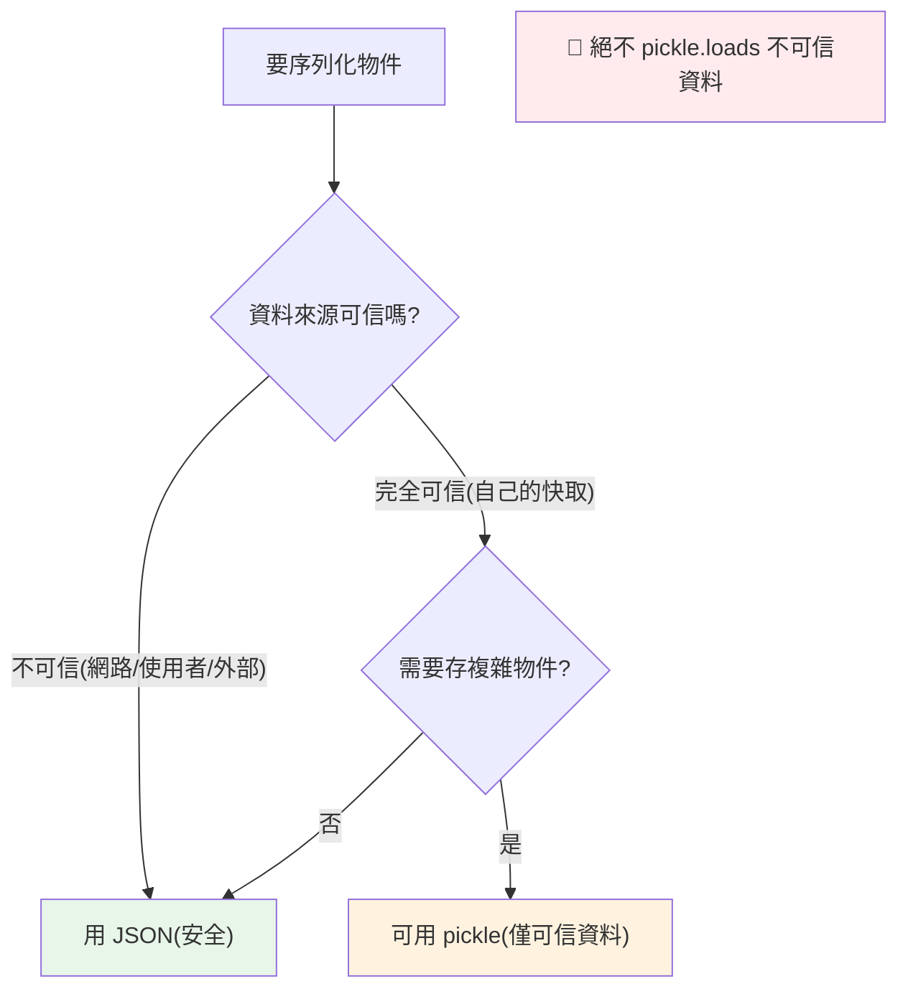

# pickle 與序列化

> `pickle` 能序列化幾乎任何 Python 物件（不像 JSON 只支援基本型別）——但它有致命的安全問題：**反序列化不可信資料會執行任意程式碼**。理解它的能力與危險，是每個工程師的資安常識。

## 💡 白話導讀（建議先讀）

[json](04-json.md) 只能打包基本型別。那自訂類別的實例、複雜的巢狀物件呢？

**`pickle`——把「活的」Python 物件整隻冷凍封存**：

```python
import pickle

frozen = pickle.dumps(my_object)    # 冷凍:幾乎任何物件 → bytes
thawed = pickle.loads(frozen)       # 解凍:原樣復活(連類別、狀態都在)
```

能力驚人——但這章真正要刻進腦子的是一條**安全鐵律**：

> 🔴 **絕對不要解凍「來源不明的罐頭」——`pickle.loads` 不可信資料＝執行任意程式碼。**

為什麼？pickle 的解凍過程**會執行資料裡描述的操作**——惡意罐頭可以在「打開的瞬間」在你機器上跑任何指令（刪檔、開後門）。這不是理論風險,是真實攻擊手法。

所以分工非常清楚：

| | JSON | pickle |
|--|------|--------|
| 安全性 | ✅ 安全 | 🔴 解不明罐頭=中毒 |
| 跨語言 | ✅ 通用語 | ❌ Python 專屬 |
| 能裝什麼 | 基本型別 | 幾乎萬能 |
| 適用 | **一切對外交流**(API、跨服務) | **自己冷凍自己吃**(本機快取、ML 模型存檔) |

口訣:**出門用 JSON,自家冰箱才用 pickle——而且永遠別吃別人給的罐頭。**

## Why（為什麼）

有時你想「把一個 Python 物件存起來、之後原樣還原」——複雜的自訂物件、機器學習模型、快取。JSON 只支援基本型別（見 [json](04-json.md)），存不了自訂物件。**`pickle`** 能序列化幾乎任何 Python 物件。但它有一個**重大的安全陷阱**——反序列化來自不可信來源的 pickle 資料，可能執行任意惡意程式碼。這章講清楚 pickle 的能力、與 JSON 的取捨，以及那條不可違背的安全鐵律。

## Theory（理論：Python 專屬的序列化）

**pickle** 是 Python 專屬的序列化格式——把 Python 物件冷凍成 bytes（`dumps`/`dump`）、再解凍還原（`loads`/`load`）：

- **能力強**：幾乎任何 Python 物件都能 pickle——自訂類別實例、巢狀結構、函式引用等（JSON 做不到）。
- **Python 專屬**：pickle 的 bytes 只有 Python 能讀（不像 JSON 跨語言）。
- **🔴 不安全**：反序列化會**執行**資料中描述的操作——惡意 pickle 能執行任意程式碼（打開罐頭的瞬間中毒）。

一句話對比：

> **JSON：安全、跨語言、限基本型別；pickle：危險、Python 專屬、幾乎萬能。**
> 出門用 JSON，自家冰箱才用 pickle。

## Specification（規範：pickle API）

```python
import pickle

# 序列化（物件 → bytes）
data = pickle.dumps(obj)              # → bytes
with open("data.pkl", "wb") as f:     # 二進位模式！
    pickle.dump(obj, f)

# 反序列化（bytes → 物件）
obj = pickle.loads(data)              # ⚠️ 只對「可信」資料
with open("data.pkl", "rb") as f:
    obj = pickle.load(f)

# 可 pickle 的：多數內建型別、自訂類別實例、巢狀結構
# 不可 pickle 的：lambda、巢狀函式、開啟的檔案/連線、部分 C 物件
```

## Implementation（能力、pickle vs JSON、安全、限制）

### pickle 能序列化 JSON 不行的東西

```python
import pickle
from dataclasses import dataclass

@dataclass
class Config:
    name: str
    settings: dict

obj = Config("app", {"debug": True, "port": 8080})

# pickle 能存自訂物件（JSON 不行，除非手動轉）
data = pickle.dumps(obj)
restored = pickle.loads(data)
print(restored == obj)      # True，完整還原成 Config 物件
```

pickle 保留物件的型別與結構——還原的是**真正的 Config 物件**，不像 JSON 只能得到 dict。這對「存複雜物件狀態」（快取、ML 模型、遊戲存檔）很方便。

### 🔴 安全：反序列化執行任意程式碼

**這是本章的核心警告**。pickle 反序列化時會執行資料中的操作——精心構造的惡意 pickle 能在 `loads` 時**執行任意程式碼**：

```python
import pickle

# 🔴 極度危險：反序列化不可信的 pickle
untrusted_data = receive_from_network()   # 來自使用者/網路/檔案
obj = pickle.loads(untrusted_data)        # 可能執行惡意程式碼！
```

攻擊者能構造一個 pickle，讓 `loads` 執行 `os.system("rm -rf /")` 之類的操作（透過 `__reduce__` 機制）。**這不是理論——是真實的攻擊向量。**

**安全鐵律**：
- **絕不反序列化來自不可信來源的 pickle**（網路、使用者上傳、外部檔案）。
- **接收外部資料用 JSON**（安全，見 [json](04-json.md)）。
- pickle 只用於**你完全控制的、可信的**內部資料（如自己程式的快取檔）。

### pickle vs JSON：怎麼選

| | pickle | JSON |
|--|--------|------|
| 支援型別 | 幾乎任何 Python 物件 | 基本型別（見 [json](04-json.md)） |
| 安全 | 🔴 危險（執行程式碼） | ✅ 安全 |
| 跨語言 | ❌ Python 專屬 | ✅ 通用 |
| 人類可讀 | ❌ 二進位 | ✅ 文字 |
| 用途 | 內部可信資料（快取、狀態） | API、設定、資料交換 |

**準則**：**對外/不可信資料一律用 JSON；只有「完全可信的內部資料 + 需要存複雜物件」才用 pickle**。

### pickle 的其他限制

- **不能 pickle lambda、巢狀函式**（見 [multiprocessing](../09-concurrency/05-multiprocessing.md) 的 pickle 限制）——用具名函式或 partial。
- **版本相容性弱**：不同 Python 版本、或類別定義改變後，舊 pickle 可能載入失敗。所以**別用 pickle 做長期儲存或跨系統交換**（用 JSON 或專門格式）。
- **檔案用二進位模式**（`wb`/`rb`）：pickle 是 bytes。

### 替代方案

- **對外交換 → JSON**（見 [json](04-json.md)）。
- **設定檔 → JSON/TOML**（見 [csv/tomllib](13-csv-config-tomllib.md)）。
- **資料驗證/序列化 → pydantic**（見 [pydantic](../14-web/06-pydantic-validation.md)）。
- **ML 模型 → joblib（底層 pickle，但同樣有安全問題）或框架專屬格式**。

## Code Example（可執行的 Python 範例）

```python
# pickle_demo.py
from __future__ import annotations

import json
import pickle
from dataclasses import dataclass


@dataclass
class GameState:
    level: int
    score: int
    inventory: list[str]


def pickle_roundtrip(obj: object) -> object:
    """pickle 序列化再還原（僅用於可信資料）。"""
    data = pickle.dumps(obj)
    return pickle.loads(data)  # noqa: S301  # 示範用，此處資料可信


def demo() -> None:
    state = GameState(level=5, score=1200, inventory=["劍", "盾"])

    # 1. pickle 能完整還原自訂物件
    restored = pickle_roundtrip(state)
    print(f"pickle 還原: {restored}")
    print(f"型別保留: {type(restored).__name__}")  # GameState（真正的物件）
    print(f"相等: {restored == state}")

    # 2. JSON 只能存基本型別（自訂物件要手動轉）
    as_dict = {"level": state.level, "score": state.score, "inventory": state.inventory}
    json_str = json.dumps(as_dict, ensure_ascii=False)
    print(f"\nJSON（手動轉 dict）: {json_str}")
    print("→ JSON 還原得到 dict，不是 GameState")

    # 3. 安全提醒
    print("\n🔴 安全鐵律：絕不 pickle.loads 不可信資料（會執行任意程式碼）")
    print("   對外/網路資料一律用 JSON")


if __name__ == "__main__":
    demo()
```

**預期輸出**：

```pycon
$ python pickle_demo.py
pickle 還原: GameState(level=5, score=1200, inventory=['劍', '盾'])
型別保留: GameState
相等: True

JSON（手動轉 dict）: {"level": 5, "score": 1200, "inventory": ["劍", "盾"]}
→ JSON 還原得到 dict，不是 GameState

🔴 安全鐵律：絕不 pickle.loads 不可信資料（會執行任意程式碼）
   對外/網路資料一律用 JSON
```

## Diagram（圖解：pickle vs JSON 選擇）



## Best Practice（最佳實踐）

- **絕不反序列化不可信的 pickle**：網路、使用者上傳、外部檔案——會執行任意程式碼。這是不可違背的鐵律。
- **對外/不可信資料一律用 JSON**（安全、跨語言，見 [json](04-json.md)）。
- **pickle 只用於完全可信的內部資料**（自己程式的快取、暫存狀態）。
- **別用 pickle 做長期儲存/跨系統交換**：版本相容性弱；用 JSON 或專門格式。
- **檔案用二進位模式**（`wb`/`rb`）。
- **需要驗證/結構化序列化用 pydantic**；ML 模型用框架格式（意識到 joblib/pickle 的安全問題）。
- **不能 pickle lambda/巢狀函式**：用具名函式（連結 [multiprocessing](../09-concurrency/05-multiprocessing.md)）。

## Common Mistakes（常見誤解）

- **反序列化不可信的 pickle**：重大安全漏洞（任意程式碼執行）——最嚴重的錯誤。
- **用 pickle 接收網路/API 資料**：危險；用 JSON。
- **用 pickle 做長期儲存**：Python/類別版本變了就載入失敗；用穩定格式。
- **忘了用二進位模式**：pickle 是 bytes，文字模式會出錯。
- **pickle lambda/巢狀函式**：`PicklingError`；用具名函式。
- **以為 pickle 跨語言**：它是 Python 專屬，其他語言讀不了。
- **以為 pickle 安全**：它不安全（與 JSON 相反）——這是常見誤解。

## Interview Notes（面試重點）

- **pickle 的安全問題是必考**：**反序列化不可信資料會執行任意程式碼**（透過 `__reduce__`）——**絕不 pickle.loads 不可信來源**，對外資料用 JSON。
- **能對比 pickle vs JSON**：pickle（幾乎任何 Python 物件、危險、Python 專屬、二進位）vs JSON（基本型別、安全、跨語言、文字）。
- 知道 pickle 適用「**完全可信的內部資料 + 需存複雜物件**」（快取、狀態）。
- 知道 pickle **版本相容性弱**（不適合長期儲存/跨系統）、**不能 pickle lambda**（連結 multiprocessing）。
- 知道替代：對外 JSON、驗證 pydantic、設定 TOML。

---

➡️ 下一章：[csv、tomllib 與設定檔](13-csv-config-tomllib.md)

[⬆️ 回 Part 11 索引](README.md)
