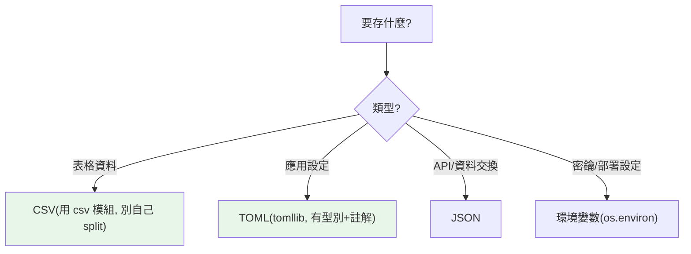

# csv、tomllib 與設定檔

> `csv` 處理表格資料（別自己 split，會被引號/逗號咬到）、`tomllib`（3.11+）讀 TOML 設定（`pyproject.toml` 的格式）。加上 JSON，這些是處理資料檔與設定檔的標準工具。

## 💡 白話導讀（建議先讀）

兩類日常檔案的正確開法。

**第一類:CSV（表格）——別自己 split！**

看起來 `line.split(",")` 就搞定？直到遇到這行：

```text
"Wang, Ming",25,"他說:「你好」再見"
```

欄位裡有逗號（被引號包著）、有引號跳脫、甚至有換行——手刨的 split 全部陣亡。
`csv` 模組替你處理所有這些鬼細節：

```python
import csv
with open("data.csv", encoding="utf-8", newline="") as f:
    for row in csv.DictReader(f):    # 每列變 dict,用欄名取值
        print(row["name"])
```

（`DictReader` 比 `reader` 好用:`row["name"]` 比 `row[0]` 可讀多了。）

**第二類:設定檔——現代答案是 TOML。**

```python
import tomllib                        # 3.11+ 內建
with open("config.toml", "rb") as f:  # 注意:要用二進位模式 "rb"
    config = tomllib.load(f)
```

TOML 就是 `pyproject.toml` 的格式——支援註解、型別清楚,是 Python 生態的現代標準。
其他格式的江湖地位:JSON(通用但**不能寫註解**,當設定檔很痛)、INI(老,configparser)、YAML(強大但複雜,需第三方套件)。

守則:**新專案的設定檔,預設 TOML。**

## Why（為什麼）

兩個常見需求：讀寫 **CSV**（試算表、資料匯出、簡單資料交換）與讀 **設定檔**（應用設定、`pyproject.toml`）。CSV 看似「用逗號 split 就好」，但正確處理引號、逗號、換行很麻煩——`csv` 模組幫你做對。設定檔方面，TOML 是現代 Python 的標準格式（`pyproject.toml`），`tomllib`（3.11+）讓你讀它。這章講清楚 csv 的正確用法與 tomllib/設定檔的選擇。

## Theory（理論：兩類需求）

- **CSV（逗號分隔值）**：表格資料的通用格式。**用 `csv` 模組，別自己 split**——欄位可能含逗號（引號包住）、換行、引號跳脫，手動 split 必陣亡。
- **設定檔**：Python 生態的格式地圖：
  - **TOML**：現代標準（`pyproject.toml` 的格式），`tomllib` 讀（3.11+ 內建，注意用 `"rb"` 模式）。**新專案預設它。**
  - **JSON**：通用但**不支援註解**（見 [json](04-json.md)）——當設定檔很痛。
  - **INI**：`configparser` 讀（老格式）。
  - **YAML**：需第三方 `pyyaml`（強大但複雜）。

## Specification（規範：csv 與 tomllib）

```python
import csv

# 讀 CSV
with open("data.csv", newline="", encoding="utf-8") as f:
    reader = csv.reader(f)              # 每列是 list
    for row in reader:
        print(row)

with open("data.csv", newline="", encoding="utf-8") as f:
    reader = csv.DictReader(f)          # 每列是 dict（用標頭當 key）
    for row in reader:
        print(row["name"])

# 寫 CSV
with open("out.csv", "w", newline="", encoding="utf-8") as f:
    writer = csv.writer(f)
    writer.writerow(["name", "age"])    # 一列
    writer.writerows([["Alice", 30]])   # 多列

# 讀 TOML（3.11+）
import tomllib
with open("config.toml", "rb") as f:   # 二進位模式！
    config = tomllib.load(f)
config = tomllib.loads('key = "value"')
```

## Implementation（csv 正確處理、DictReader、tomllib、格式選擇）

### CSV：別自己 split

CSV 看似簡單，但正確解析很難——欄位可能含逗號（`"Smith, John"`）、引號、換行。`csv` 模組正確處理這些：

```python
import csv

# ❌ 自己 split：遇到引號內的逗號就錯
line = 'Alice,"Smith, John",30'
line.split(",")     # ['Alice', '"Smith', ' John"', '30']  ← 錯！

# ✅ csv 模組：正確處理
import io
reader = csv.reader(io.StringIO(line))
next(reader)        # ['Alice', 'Smith, John', '30']  ← 對！
```

`csv.reader` 正確處理引號、跳脫、換行——**永遠用 csv 模組讀寫 CSV，別手動 split/join**。

⚠️ **開 CSV 檔要加 `newline=""`**：讓 csv 模組自己處理換行（否則 Windows 上可能出現空行）。

### `DictReader`：用標頭當 key

`csv.DictReader` 把每列讀成 dict（用第一列標頭當 key），比用索引取值清楚：

```python
import csv

# CSV: name,age,city
with open("people.csv", newline="", encoding="utf-8") as f:
    for row in csv.DictReader(f):
        print(f"{row['name']} 來自 {row['city']}")   # 用欄位名，不用 row[0]
```

`DictReader` 讓你用**欄位名**取值（`row["name"]`），比 `row[0]` 可讀且不怕欄位順序變。寫入對應用 `DictWriter`。

### `tomllib`：讀 TOML 設定（3.11+）

TOML 是現代 Python 設定的標準格式（`pyproject.toml` 就是，見 [pyproject.toml](../13-tooling-packaging/04-pyproject-toml.md)）。`tomllib`（3.11 標準庫）讀它：

```python
import tomllib

# config.toml:
#   [database]
#   host = "localhost"
#   port = 5432
#   tags = ["a", "b"]

with open("config.toml", "rb") as f:    # 注意：二進位模式
    config = tomllib.load(f)

config["database"]["host"]    # 'localhost'
config["database"]["port"]    # 5432（TOML 有型別！int、str、list、bool...）
```

TOML 的好處：**有型別**（int/str/bool/list/日期）、**支援註解**（JSON 不行）、**人類好讀好寫**。`tomllib` **只能讀不能寫**（3.11+）；要寫 TOML 用第三方 `tomli-w`。注意 `tomllib.load` 要**二進位模式**開檔（`"rb"`）。

### 設定檔格式怎麼選

| 格式 | 讀取工具 | 註解 | 型別 | 用途 |
|------|----------|------|------|------|
| **TOML** | `tomllib`（3.11+，只讀） | ✅ | ✅ | 現代標準（pyproject.toml、應用設定） |
| **JSON** | `json`（見 [json](04-json.md)） | ❌ | ✅ | 通用、API、機器產生 |
| **INI** | `configparser` | ✅（`;`/`#`） | ❌（全字串） | 老格式、簡單 key-value |
| **YAML** | `pyyaml`（第三方） | ✅ | ✅ | 複雜設定（但語法陷阱多） |
| **環境變數** | `os.environ`（見 [os/sys](01-os-sys.md)） | — | 全字串 | 密鑰、部署設定（12-factor） |

**準則**：**應用設定用 TOML**（現代標準、好讀、有型別）、**API/資料交換用 JSON**、**密鑰/部署設定用環境變數**。

## Code Example（可執行的 Python 範例）

```python
# csv_toml_demo.py
from __future__ import annotations

import csv
import io
import tomllib


def parse_csv(text: str) -> list[dict[str, str]]:
    """用 DictReader 解析 CSV（正確處理引號）。"""
    reader = csv.DictReader(io.StringIO(text))
    return list(reader)


def write_csv(rows: list[dict[str, str]]) -> str:
    """用 DictWriter 寫 CSV。"""
    if not rows:
        return ""
    buf = io.StringIO()
    writer = csv.DictWriter(buf, fieldnames=list(rows[0].keys()))
    writer.writeheader()
    writer.writerows(rows)
    return buf.getvalue()


def parse_toml(text: str) -> dict[str, object]:
    """解析 TOML 設定。"""
    return tomllib.loads(text)


def demo() -> None:
    # 1. CSV 正確處理引號內的逗號
    csv_text = 'name,note\nAlice,"Smith, John"\nBob,plain'
    rows = parse_csv(csv_text)
    print(f"CSV 解析: {rows}")
    print(f"→ 'Smith, John' 正確保留（沒被逗號切開）")

    # 2. 寫 CSV
    output = write_csv([{"id": "1", "value": "含,逗號"}])
    print(f"\n寫 CSV:\n{output}", end="")

    # 3. TOML 設定（有型別）
    toml_text = """
[server]
host = "localhost"
port = 8080
debug = true
tags = ["web", "api"]
"""
    config = parse_toml(toml_text)
    server = config["server"]
    print(f"\nTOML: host={server['host']}, port={server['port']}（int）")
    print(f"debug={server['debug']}（bool）, tags={server['tags']}（list）")


if __name__ == "__main__":
    demo()
```

**預期輸出**：

```pycon
$ python csv_toml_demo.py
CSV 解析: [{'name': 'Alice', 'note': 'Smith, John'}, {'name': 'Bob', 'note': 'plain'}]
→ 'Smith, John' 正確保留（沒被逗號切開）

寫 CSV:
id,value
1,"含,逗號"

TOML: host=localhost, port=8080（int）
debug=True（bool）, tags=['web', 'api']（list）
```

## Diagram（圖解：設定檔格式選擇）



## Best Practice（最佳實踐）

- **CSV 一律用 `csv` 模組**，別自己 split/join——正確處理引號、逗號、換行；開檔加 `newline=""`。
- **用 `DictReader`/`DictWriter`** 以欄位名存取，比索引清楚、不怕順序變。
- **應用設定用 TOML**（`tomllib` 讀，3.11+，二進位模式）——現代標準、有型別、支援註解。
- **API/資料交換用 JSON**、**密鑰/部署設定用環境變數**（見 [os/sys](01-os-sys.md)）。
- **寫 TOML 用第三方 `tomli-w`**（`tomllib` 只讀）；相容 3.10 以前用第三方 `tomli`。
- **YAML 謹慎用**：語法陷阱多（如 `yes`/`no` 被當布林），且用 `yaml.safe_load`（`yaml.load` 不安全，類似 pickle）。

## Common Mistakes（常見誤解）

- **自己 split CSV**：遇到引號內的逗號/換行就錯；用 csv 模組。
- **開 CSV 忘了 `newline=""`**：Windows 上出現空行。
- **`tomllib.load` 用文字模式**：要**二進位模式**（`"rb"`），否則報錯。
- **以為 `tomllib` 能寫**：它只讀（3.11+）；寫用 `tomli-w`。
- **用 JSON 當人寫的設定檔**：JSON 不支援註解、對人不友善；用 TOML。
- **用 `yaml.load`（非 safe_load）**：不安全（能執行程式碼，類似 pickle）；用 `yaml.safe_load`。
- **設定/密鑰硬寫在程式**：用設定檔或環境變數（見 [密鑰管理](../20-security-system-design/05-secrets-management.md)）。

## Interview Notes（面試重點）

- 知道 **CSV 用 `csv` 模組別自己 split**（正確處理引號/逗號/換行），`DictReader`/`DictWriter` 以欄位名存取，開檔加 `newline=""`。
- 知道 **`tomllib`（3.11+）讀 TOML**（二進位模式、只讀）、TOML 是現代 Python 設定標準（有型別、支援註解）。
- **能做設定格式選擇**：應用設定→TOML、API/交換→JSON、密鑰/部署→環境變數、老格式→INI(configparser)。
- 知道 **`tomllib` 只讀**（寫用 tomli-w）、相容舊版用 `tomli`。
- 知道 **YAML 用 `safe_load`**（`yaml.load` 不安全，類似 pickle）。

---

➡️ 下一章：[HTTP client：urllib / requests / httpx](14-http-client.md)

[⬆️ 回 Part 11 索引](README.md)
