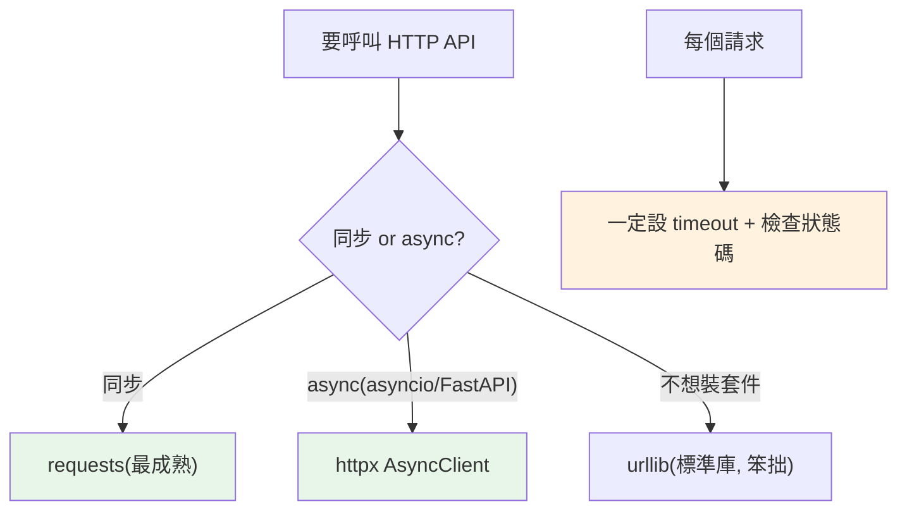

# HTTP client：urllib / requests / httpx

> 呼叫別人的 API 是後端日常。標準庫有 `urllib`（能用但笨拙），實務上幾乎都用第三方的 `requests`（同步、經典）或 `httpx`（支援 async、現代）。搞懂請求、回應、錯誤處理與逾時，才能可靠地與外部服務溝通。

## 💡 白話導讀（建議先讀）

呼叫別人的 API 是後端日常。Python 的 HTTP client 江湖很簡單，三個選手：

| 選手 | 身分 | 一句話 |
|------|------|--------|
| **`urllib`** | 標準庫 | 能用,但囉嗦得像填公文 |
| **`requests`** | 第三方經典 | `requests.get(url).json()` 一行搞定——**同步程式的預設** |
| **`httpx`** | 第三方新秀 | API 長得像 requests,**還會 async**——配 FastAPI/asyncio 的預設 |

選擇樹兩句話：

- 一般同步腳本 → **requests**（生態最熟、範例最多）。
- 專案有 asyncio（[Part 9 的服務生](../09-concurrency/07-asyncio-basics.md)）→ **httpx**——記住:**在 async 裡用 requests 是「服務生站住」的經典事故**（同步 HTTP 會凍結整個 event loop）。
- 堅決不裝套件 → urllib 忍著用。

不管用哪個,共通的專業習慣三件套：

```python
r = httpx.get(url, timeout=10)   # 1. 永遠設 timeout(不設=可能永遠卡住)
r.raise_for_status()             # 2. 檢查狀態碼(4xx/5xx 拋例外,別默默用錯誤回應)
data = r.json()                  # 3. 解析 JSON
```

這章用三個選手各示範一遍,重點放在 requests/httpx 的實戰模式（headers、POST、重試）。

## Why（為什麼）

現代程式很少獨立運作——要呼叫第三方 API、抓資料、串接微服務。這需要 **HTTP client**。標準庫的 `urllib` 能做但囉嗦；社群標準是 **`requests`**（「HTTP for Humans」，同步、極簡）與 **`httpx`**（requests 的現代繼任者，支援 async）。這章講清楚三者的定位、基本的請求/回應處理、以及可靠呼叫外部服務的關鍵（逾時、錯誤處理、狀態碼）——這是後端工程師的必備技能。

## Theory（理論：三個選擇）

| Client | 定位 | 何時用 |
|--------|------|--------|
| **`urllib`** | 標準庫、無需安裝、但笨拙（填公文） | 不想裝套件的簡單需求 |
| **`requests`** | 第三方、同步、極簡好用、生態成熟 | **同步程式的首選** |
| **`httpx`** | 第三方、同步 + **async**、API 類似 requests | **需要 async、或新專案** |

**準則**：同步程式用 `requests`（最成熟）；需要 async（配 asyncio/FastAPI）用 `httpx`（見 [async/await](../09-concurrency/08-async-await.md)——在 async 裡用同步 requests 會凍結 event loop）。`urllib` 只在「絕不想裝套件」時用。

## Specification（規範：三者語法）

```python
# --- urllib（標準庫）---
import urllib.request
import json
with urllib.request.urlopen("https://api.example.com/data") as resp:
    data = json.loads(resp.read().decode())

# --- requests（第三方，同步）---
import requests
resp = requests.get("https://api.example.com/data", timeout=10)
resp.raise_for_status()          # 4xx/5xx 拋例外
data = resp.json()               # 解析 JSON
resp = requests.post(url, json={"key": "value"}, timeout=10)
resp = requests.get(url, params={"q": "search"}, headers={"Authorization": "..."})

# --- httpx（第三方，同步 + async）---
import httpx
resp = httpx.get(url, timeout=10)           # 同步（同 requests）
# async：
async with httpx.AsyncClient() as client:
    resp = await client.get(url, timeout=10)
```

## Implementation（requests 基本、狀態碼、逾時、session、async）

### requests：基本請求

`requests` 的 API 極簡——動詞方法（`get`/`post`/`put`/`delete`）對應 HTTP 方法：

```python
import requests

# GET + query 參數
resp = requests.get(
    "https://api.example.com/users",
    params={"page": 1, "limit": 10},        # → ?page=1&limit=10
    headers={"Authorization": "Bearer token"},
    timeout=10,                              # ⚠️ 一定要設！
)

# POST + JSON body
resp = requests.post(
    "https://api.example.com/users",
    json={"name": "Alice"},                  # 自動序列化 + 設 Content-Type
    timeout=10,
)

# 讀回應
resp.status_code       # 200
resp.json()            # 解析 JSON body
resp.text              # 原始文字
resp.headers           # 回應標頭
```

### 狀態碼與 `raise_for_status`

HTTP 回應有**狀態碼**——2xx 成功、4xx 客戶端錯誤、5xx 伺服器錯誤。`requests` **預設不因錯誤狀態碼拋例外**（`resp.status_code` 是 404 也不報錯）。用 `raise_for_status()` 讓 4xx/5xx 拋例外：

```python
import requests

resp = requests.get(url, timeout=10)
resp.raise_for_status()          # 4xx/5xx → 拋 HTTPError

# 或手動檢查
if resp.status_code == 200:
    data = resp.json()
elif resp.status_code == 404:
    ...
```

**呼叫外部 API 一律檢查狀態碼**（`raise_for_status` 或手動），別假設成功。

### 🔴 一定要設 timeout

**這是最重要的實務**：`requests` **預設沒有逾時**——若對方伺服器不回應，你的程式會**永遠掛住**：

```python
# 🔴 危險：沒逾時，對方不回就永遠等
resp = requests.get(url)

# ✅ 一律設 timeout
resp = requests.get(url, timeout=10)     # 10 秒沒回應就拋 Timeout
```

**每個 HTTP 請求都要設 `timeout`**——外部服務不可靠，沒逾時的請求可能拖垮整個程式。

### Session：重用連線

多個請求到同一主機時，用 `Session` 重用 TCP 連線（更快）並共享設定（標頭、認證）：

```python
import requests

with requests.Session() as session:
    session.headers.update({"Authorization": "Bearer token"})
    resp1 = session.get(url1, timeout=10)   # 重用連線、共享標頭
    resp2 = session.get(url2, timeout=10)
```

### httpx：async HTTP

配 asyncio/FastAPI 時，用 `httpx` 的 async client 做非阻塞請求（見 [asyncio 基礎](../09-concurrency/07-asyncio-basics.md)——`requests` 是阻塞的，會卡住 event loop）：

```python
import httpx
import asyncio

async def fetch_all(urls: list[str]) -> list[dict]:
    async with httpx.AsyncClient(timeout=10) as client:
        # 並發抓取多個 URL
        responses = await asyncio.gather(*(client.get(u) for u in urls))
        return [r.json() for r in responses]
```

httpx 的同步 API 幾乎和 requests 一樣，async API 則配 `await`——這是它勝過 requests 的地方（見 [Part 14](../14-web/README.md)）。

### 錯誤處理

網路請求會失敗（逾時、連線錯誤、DNS）——要處理：

```python
import requests

try:
    resp = requests.get(url, timeout=10)
    resp.raise_for_status()
    data = resp.json()
except requests.Timeout:
    print("逾時")
except requests.ConnectionError:
    print("連線失敗")
except requests.HTTPError as e:
    print(f"HTTP 錯誤: {e.response.status_code}")
except requests.RequestException as e:      # 所有 requests 錯誤的基底
    print(f"請求失敗: {e}")
```

`requests.RequestException` 是所有 requests 例外的基底（見 [自訂例外](../06-error-handling/04-custom-exceptions.md) 的階層概念）——可一次接住所有請求錯誤。

## Code Example（可執行的 Python 範例，不需網路）

```python
# http_client_demo.py
from __future__ import annotations

# 註：實際 HTTP 請求需網路；此範例示範「處理回應」的邏輯（用假資料）


def parse_response(status_code: int, body: dict[str, object]) -> str:
    """依狀態碼處理回應（模擬 requests 的回應處理邏輯）。"""
    if 200 <= status_code < 300:
        return f"成功: {body}"
    if status_code == 404:
        return "找不到資源"
    if 400 <= status_code < 500:
        return f"客戶端錯誤 {status_code}"
    if status_code >= 500:
        return f"伺服器錯誤 {status_code}"
    return f"未知狀態 {status_code}"


def build_request(base: str, params: dict[str, str]) -> str:
    """組出帶 query 參數的 URL（模擬 requests 的 params）。"""
    from urllib.parse import urlencode

    return f"{base}?{urlencode(params)}"


def demo() -> None:
    # 1. 狀態碼處理
    print(parse_response(200, {"id": 1, "name": "Alice"}))
    print(parse_response(404, {}))
    print(parse_response(500, {}))

    # 2. 組請求 URL
    url = build_request("https://api.example.com/users", {"page": "1", "limit": "10"})
    print(f"\n請求 URL: {url}")

    # 3. 實務提醒
    print("\n實務要點：")
    print("  - 同步用 requests、async 用 httpx")
    print("  - 每個請求一定設 timeout（否則可能永遠掛住）")
    print("  - 用 raise_for_status() 檢查狀態碼")


if __name__ == "__main__":
    demo()
```

**預期輸出**：

```pycon
$ python http_client_demo.py
成功: {'id': 1, 'name': 'Alice'}
找不到資源
伺服器錯誤 500

請求 URL: https://api.example.com/users?page=1&limit=10

實務要點：
  - 同步用 requests、async 用 httpx
  - 每個請求一定設 timeout（否則可能永遠掛住）
  - 用 raise_for_status() 檢查狀態碼
```

## Diagram（圖解：HTTP client 選擇）



## Best Practice（最佳實踐）

- **同步用 `requests`、async 用 `httpx`**（配 asyncio/FastAPI）；`urllib` 只在不想裝套件時用。
- **每個請求一定設 `timeout`**：外部服務不可靠，沒逾時可能永遠掛住——這是最重要的實務。
- **檢查狀態碼**：用 `raise_for_status()`（4xx/5xx 拋例外）或手動檢查，別假設成功。
- **處理網路錯誤**：try/except `Timeout`/`ConnectionError`/`HTTPError`/`RequestException`。
- **多請求同主機用 `Session`**（requests）/`Client`（httpx）：重用連線、共享設定。
- **POST JSON 用 `json=` 參數**（自動序列化 + 設 Content-Type），別自己 `dumps`。
- **async 場景別用 requests**（阻塞會卡 event loop，見 [to_thread](../09-concurrency/11-blocking-in-async.md)）——用 httpx。

## Common Mistakes（常見誤解）

- **不設 timeout**：對方不回應時程式永遠掛住——最嚴重的實務錯誤。
- **不檢查狀態碼**：`requests` 預設不因 404/500 拋例外；要 `raise_for_status()` 或手動檢查。
- **在 async 程式用 requests**：阻塞 event loop（見 [asyncio 基礎](../09-concurrency/07-asyncio-basics.md)）；用 httpx。
- **每個請求都建新連線**：多請求同主機用 Session 重用。
- **自己 `json.dumps` 當 body**：用 `json=` 參數更簡潔（自動設 header）。
- **不處理網路錯誤**：網路會失敗；要 try/except。
- **把 API 密鑰寫死在程式**：用環境變數（見 [os/sys](01-os-sys.md)）。

## Interview Notes（面試重點）

- 知道 **HTTP client 選擇：同步用 `requests`（最成熟）、async 用 `httpx`（配 asyncio）、`urllib` 是標準庫但笨拙**。
- **關鍵實務：每個請求一定設 `timeout`**（否則對方不回會永遠掛住）。
- 知道 **`requests` 預設不因錯誤狀態碼拋例外**，要 `raise_for_status()` 或手動檢查。
- 知道處理網路錯誤（`Timeout`/`ConnectionError`/`RequestException`）、用 `Session` 重用連線、POST 用 `json=`。
- **知道 async 程式別用 requests（阻塞 loop），用 httpx**（連結 asyncio）。

---

➡️ 下一章：[socket 網路程式基礎](15-socket.md)

[⬆️ 回 Part 11 索引](README.md)
