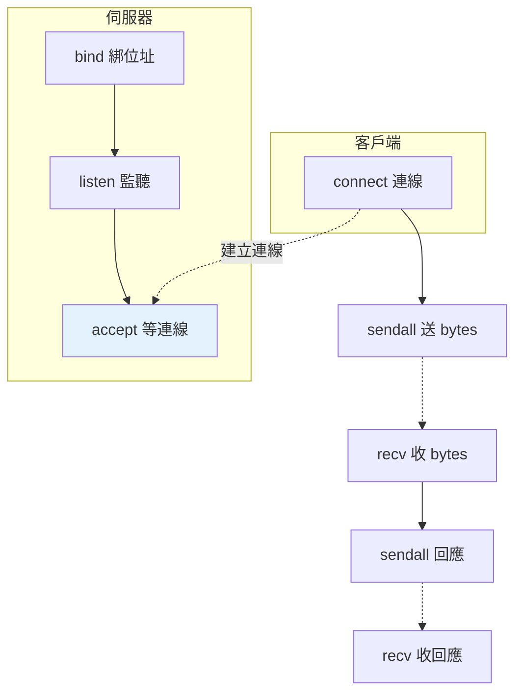

# socket 網路程式基礎

> socket 是網路通訊的最底層——TCP/UDP 連線、伺服器/客戶端模型。你多半用不到它（有 HTTP client、Web 框架），但理解 socket 能讓你看懂網路的本質，也是「網路是怎麼運作的」面試題的基礎。

## 💡 白話導讀（建議先讀）

你每天用的 HTTP、資料庫連線,底下全是同一個東西——**socket**。這章往下挖一層,看網路通訊的地基。

**socket ＝ 網路通訊的「電話插孔」**：兩支程式各有一個插孔,插上線就能互傳資料。作業系統提供這個機制,Python 的 `socket` 模組是它的直接包裝。

線路有兩種規格：

- **TCP ＝ 掛號信**：有連線、**保證送達、保證順序**——慢一點但可靠。HTTP、資料庫、絕大多數應用走它。
- **UDP ＝ 明信片**：無連線、**寄了就寄了**（可能掉、可能亂序）——但快。直播、線上遊戲、DNS 走它（掉一兩張沒關係,即時最重要）。

通話的固定劇本（伺服器/客戶端模型）：

```text
伺服器:裝好插孔 → 綁定門牌(IP+埠) → listen(開始守著電話)→ accept(有人打來,接!)
客戶端:裝好插孔 → connect(撥打伺服器的門牌) → 雙方 send/recv 對話
```

老實說:**日常你幾乎不會手寫 socket**（有 HTTP client、有框架）。學它的價值是**看懂上層**——
「連線被拒」「port 被占用」「連線重置」這些報錯,懂了 socket 就知道在說哪個環節;
[Web 框架](../14-web/README.md)、資料庫連線池,底下都是這些插孔。

## Why（為什麼）

`requests`、Web 框架、資料庫驅動——這些高階工具底層都建立在 **socket** 之上。你日常很少直接寫 socket（該用高階工具），但**理解 socket 能讓你懂網路的本質**：TCP 連線怎麼建立、伺服器怎麼監聽、資料怎麼收發。這對除錯網路問題、理解「HTTP 底下是什麼」、以及面試「解釋 TCP/socket」很有價值。這章講 socket 的核心模型與基本用法，重點在「理解」而非「日常使用」。

## Theory（理論：socket 與 TCP/UDP）

**socket（套接字）** 是「網路通訊的端點」——電話插孔。兩個程式透過各自的 socket 建立連線、收發資料。它是作業系統提供的網路介面，Python 的 `socket` 模組是它的封裝。

兩種主要協定：

- **TCP（傳輸控制協定）**：**可靠、有連線、有序**——掛號信：保證資料完整到達、順序正確。HTTP、資料庫、多數應用用 TCP。
- **UDP（使用者資料報協定）**：**快、無連線、不保證**——明信片：不保證到達或順序，但延遲低。影音串流、遊戲、DNS 用 UDP。

**伺服器/客戶端模型**：伺服器**監聽**某個位址+埠（守著電話）、等待連線；客戶端**連線**到伺服器（撥號）；建立連線後雙向收發資料。

## Specification（規範：socket API）

```python
import socket

# 建立 socket
sock = socket.socket(socket.AF_INET, socket.SOCK_STREAM)   # IPv4 + TCP
#                    AF_INET6 (IPv6)   SOCK_DGRAM (UDP)

# --- 伺服器端 ---
sock.bind(("localhost", 8080))    # 綁定位址+埠
sock.listen()                     # 開始監聽
conn, addr = sock.accept()        # 接受連線（阻塞直到有客戶端）
data = conn.recv(1024)            # 接收資料（最多 1024 bytes）
conn.sendall(b"response")         # 送出資料
conn.close()

# --- 客戶端 ---
sock.connect(("localhost", 8080)) # 連線到伺服器
sock.sendall(b"request")          # 送出
data = sock.recv(1024)            # 接收
sock.close()

# 用 with 自動關閉（推薦）
with socket.socket(socket.AF_INET, socket.SOCK_STREAM) as sock:
    ...
```

## Implementation（TCP 伺服器/客戶端、bytes、高階替代）

### TCP 伺服器：綁定、監聽、接受

TCP 伺服器的流程：`bind`（綁位址）→ `listen`（監聽）→ `accept`（接受連線）→ 收發 → 關閉：

```python
import socket

def simple_server() -> None:
    with socket.socket(socket.AF_INET, socket.SOCK_STREAM) as server:
        server.setsockopt(socket.SOL_SOCKET, socket.SO_REUSEADDR, 1)  # 允許重用位址
        server.bind(("localhost", 8080))
        server.listen()
        print("監聽 8080...")

        conn, addr = server.accept()      # 阻塞，直到有客戶端連線
        with conn:
            print(f"連線來自 {addr}")
            data = conn.recv(1024)         # 接收（bytes）
            print(f"收到: {data.decode()}")
            conn.sendall(b"Hello from server")   # 回應
```

`accept()` 阻塞等待連線，回傳 `(連線 socket, 客戶端位址)`。每個連線用獨立的 socket 收發。要同時服務多個客戶端需並發（threading/asyncio，見 [Part 9](../09-concurrency/README.md)）——這正是 Web 框架幫你處理的。

### TCP 客戶端：連線、收發

```python
import socket

def simple_client() -> str:
    with socket.socket(socket.AF_INET, socket.SOCK_STREAM) as client:
        client.connect(("localhost", 8080))    # 連線
        client.sendall(b"Hello from client")   # 送出
        response = client.recv(1024)           # 接收回應
        return response.decode()
```

### socket 收發的是 bytes

**socket 收發的永遠是 `bytes`（不是 str）**——網路傳輸是位元組。要傳字串得 `encode`，收到後 `decode`（見 [字串](../02-fundamentals/04-strings.md) 的 str/bytes）：

```python
conn.sendall("你好".encode("utf-8"))    # str → bytes
text = conn.recv(1024).decode("utf-8")  # bytes → str
```

且 `recv(n)` **不保證一次收到完整資料**——TCP 是串流，一則訊息可能分多次到達。真實協定要處理「訊息邊界」（如加長度前綴、分隔符）——這是自己寫 socket 通訊的複雜之處，也是為什麼該用高階工具。

### 幾乎總是用高階工具

**你日常幾乎不該直接寫 socket**——它太底層，要自己處理連線管理、訊息邊界、並發、錯誤、協定。高階工具已封裝好：

| 需求 | 用 |
|------|-----|
| 呼叫 HTTP API | `requests`/`httpx`（見 [HTTP client](14-http-client.md)） |
| 寫 Web 服務 | FastAPI/Flask（見 [Part 14](../14-web/README.md)） |
| 高並發 socket | `asyncio`（見 [asyncio](../09-concurrency/07-asyncio-basics.md)） |
| 簡單 TCP 伺服器 | `socketserver` 模組 |

**理解 socket 是為了懂底層，不是為了日常用它**——真要寫網路服務用框架。

## Code Example（可執行的 Python 範例）

```python
# socket_demo.py
from __future__ import annotations

import socket
import threading
import time


def echo_server(port: int, ready: threading.Event) -> None:
    """簡單的 echo 伺服器（收到什麼回什麼）。"""
    with socket.socket(socket.AF_INET, socket.SOCK_STREAM) as server:
        server.setsockopt(socket.SOL_SOCKET, socket.SO_REUSEADDR, 1)
        server.bind(("localhost", port))
        server.listen()
        ready.set()  # 通知伺服器就緒

        conn, _ = server.accept()
        with conn:
            data = conn.recv(1024)
            conn.sendall(data)  # echo：原樣回傳


def echo_client(port: int, message: str) -> str:
    """連線並收發。"""
    with socket.socket(socket.AF_INET, socket.SOCK_STREAM) as client:
        client.connect(("localhost", port))
        client.sendall(message.encode("utf-8"))  # str → bytes
        return client.recv(1024).decode("utf-8")  # bytes → str


def demo() -> None:
    port = 9999
    ready = threading.Event()

    # 在背景執行緒開伺服器
    server_thread = threading.Thread(target=echo_server, args=(port, ready), daemon=True)
    server_thread.start()
    ready.wait(timeout=2)  # 等伺服器就緒
    time.sleep(0.05)

    # 客戶端連線收發
    response = echo_client(port, "你好，socket！")
    print(f"送出: 你好，socket！")
    print(f"收到 echo: {response}")

    print("\n實務提醒：日常用 requests/httpx/FastAPI，socket 用於理解底層")


if __name__ == "__main__":
    demo()
```

**預期輸出**：

```pycon
$ python socket_demo.py
送出: 你好，socket！
收到 echo: 你好，socket！

實務提醒：日常用 requests/httpx/FastAPI，socket 用於理解底層
```

## Diagram（圖解：TCP 伺服器/客戶端）



## Best Practice（最佳實踐）

- **日常網路需求用高階工具**：HTTP 用 requests/httpx、Web 服務用 FastAPI/Flask、高並發用 asyncio——別直接寫 socket。
- **理解 socket 是為了懂底層**：TCP/UDP、伺服器/客戶端模型、bytes 收發——除錯與面試有用。
- **socket 用 `with` 自動關閉**；伺服器加 `SO_REUSEADDR` 允許快速重啟。
- **記得 socket 收發 bytes**：str 要 encode/decode。
- **知道 `recv` 不保證完整訊息**：TCP 是串流，真實協定要處理訊息邊界。
- **多客戶端需並發**：threading/asyncio（框架幫你處理）。
- **簡單 TCP 伺服器可用 `socketserver`**（比裸 socket 高階一點）。

## Common Mistakes（常見誤解）

- **日常直接寫裸 socket**：太底層、易錯；用高階工具。
- **以為 `recv(1024)` 收到完整訊息**：TCP 是串流，訊息可能分多次到達；要自己處理邊界。
- **socket 傳 str**：socket 收發 bytes，要 encode/decode。
- **伺服器沒設 `SO_REUSEADDR`**：重啟時「位址已使用」錯誤。
- **忘了關 socket**：資源洩漏；用 `with`。
- **單執行緒 socket 伺服器服務多客戶端**：`accept` 阻塞，一次只能一個；需並發。
- **搞混 TCP/UDP**：TCP 可靠有序、UDP 快但不保證；依需求選。

## Interview Notes（面試重點）

- 知道 **socket 是網路通訊的底層端點**，高階工具（requests/Web 框架/asyncio）都建立在它之上。
- **能對比 TCP（可靠、有連線、有序）vs UDP（快、無連線、不保證）**及各自用途。
- 知道**伺服器/客戶端模型**：伺服器 bind→listen→accept、客戶端 connect，之後雙向 recv/sendall。
- 知道 **socket 收發 bytes**（要 encode/decode）、**`recv` 不保證完整訊息**（TCP 串流、要處理訊息邊界）。
- **知道日常該用高階工具**、理解 socket 是為了懂底層與除錯。
- 知道多客戶端需並發（threading/asyncio）。

---

➡️ 下一章：[collections.abc 與抽象基底](16-collections-abc.md)

[⬆️ 回 Part 11 索引](README.md)
