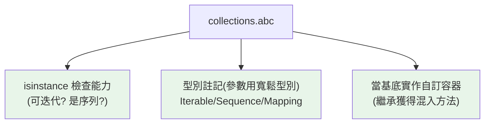

# collections.abc 與抽象基底

> `collections.abc` 提供一組「抽象容器型別」——`Iterable`、`Sequence`、`Mapping`、`Hashable` 等。用它們做 `isinstance` 檢查（「這東西可不可迭代？」）、做型別註記（參數用寬鬆型別）、或當基底類別實作自訂容器。

## Why（為什麼）

「怎麼判斷一個東西可不可迭代/是不是序列/像不像 dict？」——用 `isinstance(x, list)` 太窄（tuple、生成器也可迭代但不是 list）。`collections.abc` 提供**抽象基底類別（ABC）**，描述「能做什麼」而非「是什麼具體型別」——`Iterable`（可迭代）、`Sequence`（有序可索引）、`Mapping`（像 dict）。它們是型別註記（見 [基本註記](../05-typing/02-basic-annotations.md)）與鴨子型別檢查的基礎，也是實作自訂容器時該繼承的基底。

## Theory（理論：以「能力」分類）

`collections.abc` 用**能力（協定）** 而非具體型別來分類物件。核心 ABC 形成一個階層——每個描述「支援哪些操作」：

| ABC | 意義（能做什麼） | 需要的方法 |
|-----|------------------|-----------|
| `Iterable` | 可迭代（能 for） | `__iter__` |
| `Iterator` | 迭代器 | `__iter__`, `__next__` |
| `Hashable` | 可 hash（能當 key） | `__hash__` |
| `Sized` | 有長度（能 len） | `__len__` |
| `Container` | 支援 `in` | `__contains__` |
| `Collection` | Sized + Iterable + Container | 上述組合 |
| `Sequence` | 有序、可索引（list/tuple/str） | `__getitem__`, `__len__` |
| `Mapping` | 鍵值對映（dict） | `__getitem__`, `__iter__`, `__len__` |
| `Set` | 集合 | 集合操作 |
| `Callable` | 可呼叫 | `__call__` |

這呼應 [ABC](../04-oop/10-abc.md)（抽象基底）與 [Protocol](../05-typing/06-protocol.md)（結構化子型別）——`collections.abc` 是標準庫預先定義好的一組容器 ABC。

## Specification（規範：用法）

```python
from collections.abc import Iterable, Sequence, Mapping, Hashable, Callable

# 1. isinstance 檢查（「能做什麼」）
isinstance([1, 2], Iterable)     # True
isinstance("abc", Iterable)      # True（str 可迭代）
isinstance((1, 2), Sequence)     # True
isinstance({1: 2}, Mapping)      # True
isinstance(42, Iterable)         # False

# 2. 型別註記（參數用寬鬆的抽象型別）
def process(items: Iterable[int]) -> int:    # 接受 list/tuple/生成器...
    return sum(items)

# 3. 當基底實作自訂容器（繼承 → 獲得混入方法）
from collections.abc import Sequence
class MySeq(Sequence):
    def __getitem__(self, i): ...
    def __len__(self): ...
    # 自動獲得 __contains__, __iter__, index, count 等！
```

## Implementation（isinstance 檢查、型別註記、實作容器）

### `isinstance` 檢查「能力」

比 `isinstance(x, list)`（具體型別）更好的是檢查「能力」——「可不可迭代」而非「是不是 list」：

```python
from collections.abc import Iterable, Mapping

def flatten(obj: object) -> list:
    """遞迴攤平，但不把 str 當可迭代拆開。"""
    result = []
    for item in obj:  # type: ignore[attr-defined]
        # 用 abc 檢查「可迭代但不是字串」
        if isinstance(item, Iterable) and not isinstance(item, str | bytes):
            result.extend(flatten(item))
        else:
            result.append(item)
    return result
```

`isinstance(x, Iterable)` 對 list、tuple、生成器、自訂可迭代物件都是 True——**檢查能力比檢查具體型別更符合鴨子型別**。（注意 str 也是 Iterable，處理時常要排除。）

### 型別註記：參數用寬鬆的抽象型別

如 [最佳實踐](../05-typing/08-typing-best-practices.md) 所述「參數寬、回傳窄」——函式參數用 `collections.abc` 的抽象型別，接受更多種輸入：

```python
from collections.abc import Iterable, Mapping, Sequence

# ✅ 參數用 Iterable：接受 list/tuple/生成器/set...
def total(nums: Iterable[int]) -> int:
    return sum(nums)

# ✅ 只讀 dict 用 Mapping
def get_names(data: Mapping[int, str]) -> list[str]:
    return list(data.values())

# ✅ 需索引/長度用 Sequence
def first_and_last(seq: Sequence[int]) -> tuple[int, int]:
    return seq[0], seq[-1]
```

準則：**只遍歷用 `Iterable`、需索引/長度用 `Sequence`、dict 類唯讀用 `Mapping`**——讓函式接受最廣的輸入。注意從 `collections.abc` import（不是 `typing`，見 [typing 模組](../05-typing/03-typing-module.md)）。

### 實作自訂容器：繼承獲得混入方法

`collections.abc` 的 ABC 不只是檢查用——**繼承它們，只實作少數必需方法，就自動獲得一堆混入方法**（見 [ABC](../04-oop/10-abc.md)）：

```python
from collections.abc import Sequence

class Deck(Sequence):
    def __init__(self, cards: list[str]) -> None:
        self._cards = cards

    def __getitem__(self, i: int) -> str:    # 必需
        return self._cards[i]

    def __len__(self) -> int:                # 必需
        return len(self._cards)

    # 自動獲得：__contains__, __iter__, __reversed__, index(), count()！

deck = Deck(["A", "K", "Q"])
"A" in deck          # 自動有（來自 Sequence 的混入）
list(deck)           # 自動可迭代
deck.index("K")      # 自動有 index()
```

繼承 `Sequence` 只需寫 `__getitem__` + `__len__`，就免費得到 `__contains__`、`__iter__`、`index`、`count` 等——這是實作「行為像內建容器」的自訂類別的省力方式。

### 與 Protocol 的關係

`collections.abc` 的許多 ABC 也支援**結構化檢查**（不需明確繼承就能 `isinstance`，因為它們用 `__subclasshook__`）——所以 `isinstance([1], Iterable)` 為 True，即使 list 沒明確繼承 Iterable。這和 [Protocol](../05-typing/06-protocol.md) 的結構化子型別精神相通。

## Code Example（可執行的 Python 範例）

```python
# collections_abc_demo.py
from __future__ import annotations

from collections.abc import Iterable, Mapping, Sequence


def describe_capabilities(obj: object) -> list[str]:
    """檢查物件支援哪些能力。"""
    caps = []
    if isinstance(obj, Iterable):
        caps.append("可迭代")
    if isinstance(obj, Sequence):
        caps.append("有序可索引")
    if isinstance(obj, Mapping):
        caps.append("鍵值對映")
    return caps


def total(nums: Iterable[int]) -> int:
    """參數用 Iterable：接受各種可迭代物件。"""
    return sum(nums)


class Playlist(Sequence):
    """繼承 Sequence，只實作兩個方法就獲得完整序列行為。"""

    def __init__(self, songs: list[str]) -> None:
        self._songs = songs

    def __getitem__(self, index: int) -> str:  # type: ignore[override]
        return self._songs[index]

    def __len__(self) -> int:
        return len(self._songs)


def demo() -> None:
    # 1. 能力檢查
    for obj in [[1, 2], (1, 2), {1: 2}, "abc", 42]:
        print(f"{obj!r:>10} → {describe_capabilities(obj)}")

    # 2. Iterable 參數接受多種輸入
    print(f"\ntotal(list): {total([1, 2, 3])}")
    print(f"total(tuple): {total((1, 2, 3))}")
    print(f"total(生成器): {total(x for x in range(4))}")

    # 3. 繼承 Sequence 獲得混入方法
    pl = Playlist(["歌1", "歌2", "歌3"])
    print(f"\n長度: {len(pl)}")
    print(f"'歌2' in pl: {'歌2' in pl}")       # 自動來自 Sequence
    print(f"index('歌2'): {pl.index('歌2')}")  # 自動來自 Sequence
    print(f"反轉: {list(reversed(pl))}")        # 自動來自 Sequence


if __name__ == "__main__":
    demo()
```

**預期輸出**：

```pycon
$ python collections_abc_demo.py
    [1, 2] → ['可迭代', '有序可索引']
    (1, 2) → ['可迭代', '有序可索引']
    {1: 2} → ['可迭代', '鍵值對映']
     'abc' → ['可迭代', '有序可索引']
        42 → []

total(list): 6
total(tuple): 6
total(生成器): 6

長度: 3
'歌2' in pl: True
index('歌2'): 1
反轉: ['歌3', '歌2', '歌1']
```

## Diagram（圖解：abc 三種用途）



## Best Practice（最佳實踐）

- **檢查「能力」用 `collections.abc`**（`isinstance(x, Iterable)`）而非具體型別（`isinstance(x, list)`）——符合鴨子型別、更彈性。
- **函式參數用抽象型別**（`Iterable`/`Sequence`/`Mapping`）接受更廣輸入（見 [型別最佳實踐](../05-typing/08-typing-best-practices.md)）；從 `collections.abc` import。
- **實作自訂容器繼承對應 ABC**（`Sequence`/`Mapping`/`MutableSequence`…）：只寫必需方法，免費獲得混入方法。
- **處理 Iterable 時常要排除 str/bytes**（它們也是 Iterable，但通常不想拆成字元）。
- **只讀對映用 `Mapping`、可變用 `MutableMapping`**（同理 Sequence/MutableSequence）。
- **和 Protocol 互補**：abc 是預定義的容器協定；自訂結構化介面用 Protocol（見 [Protocol](../05-typing/06-protocol.md)）。

## Common Mistakes（常見誤解）

- **用具體型別檢查該用能力的地方**：`isinstance(x, list)` 拒絕了 tuple/生成器；用 `Iterable`。
- **從 `typing` import 這些**：現代從 `collections.abc` import（`typing.Iterable` 已是別名，見 [typing 模組](../05-typing/03-typing-module.md)）。
- **忘了 str 也是 Iterable/Sequence**：遞迴處理時會把字串拆成字元；要排除。
- **實作自訂容器不繼承 ABC**：白白手寫 `__contains__`/`__iter__` 等；繼承就免費獲得。
- **參數型別註記太窄**：用 `list[int]` 卻只是遍歷；用 `Iterable[int]` 更彈性。
- **可變/唯讀混淆**：`Mapping`（唯讀）vs `MutableMapping`（可變）；選對的。

## Interview Notes（面試重點）

- 知道 **`collections.abc` 提供容器 ABC**（`Iterable`/`Sequence`/`Mapping`/`Hashable`/`Callable`…），以**能力**分類（能做什麼）而非具體型別。
- 知道**三種用途**：**isinstance 檢查能力、型別註記（參數用寬鬆抽象型別）、當基底實作自訂容器（繼承獲得混入方法）**。
- 知道**繼承 `Sequence` 只需 `__getitem__`+`__len__` 就獲得 `__contains__`/`__iter__`/`index`/`count`**。
- 知道**從 `collections.abc` import**（非 typing）、str 也是 Iterable（要留意）。
- 能連結 [ABC](../04-oop/10-abc.md)/[Protocol](../05-typing/06-protocol.md)：這是標準庫預定義的容器協定。

---

➡️ 下一章：[tempfile / shutil / glob 檔案操作](17-tempfile-shutil-glob.md)

[⬆️ 回 Part 11 索引](README.md)
