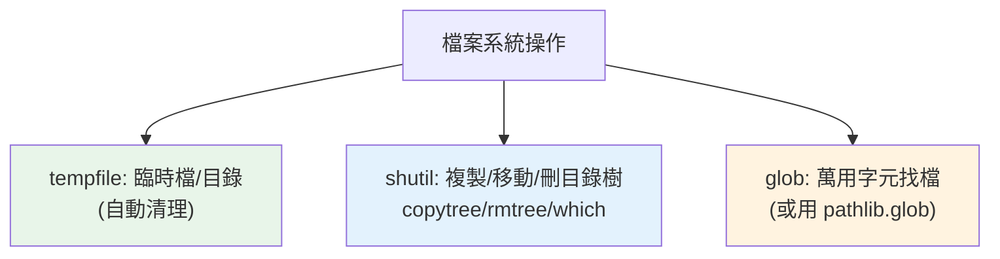

# tempfile / shutil / glob 檔案操作

> `tempfile` 建臨時檔/目錄（自動清理）、`shutil` 做高階檔案操作（複製、移動、刪整個目錄樹）、`glob` 用萬用字元找檔。這三個補足了 pathlib，是檔案系統操作的常用工具。

## 💡 白話導讀（建議先讀）

檔案雜務三兄弟，各管一攤：

**`tempfile`——自動收拾的臨時工作桌。**
需要一個暫存檔/暫存目錄做中間處理？別自己在 /tmp 亂建（撞名、忘了刪、權限問題）：

```python
with tempfile.TemporaryDirectory() as tmpdir:
    ...   # 在這個專屬臨時目錄裡隨便折騰
# 離開 with —— 整個目錄自動消失,乾乾淨淨
```

（測試裡建暫存檔的標準姿勢;pytest 的 `tmp_path` fixture 底層就是它。）

**`shutil`——搬家公司。**
`pathlib` 管單一檔案的日常,但「整個目錄樹」級別的粗活找 shutil：

```python
shutil.copy2(src, dst)        # 複製檔案(含中繼資料)
shutil.copytree(src, dst)     # 複製整棵目錄樹
shutil.rmtree(path)           # ⚠️ 刪整棵樹 —— 不進資源回收桶,三思!
shutil.make_archive(...)      # 打包 zip/tar
```

**`glob`——萬用字元找檔。**
`*.csv`、`data/**/*.log`(`**` 遞迴)——shell 的找檔語法搬進 Python。
（`pathlib` 的 `.glob()` 同功能,新程式碼建議直接用 pathlib 版——見 [pathlib](02-pathlib.md)。）

三句定位:**臨時的交給 tempfile 自動收,搬大件的找 shutil,按模式找檔用 glob**。

## Why（為什麼）

檔案操作除了讀寫（見 [io](06-io.md)）與路徑（見 [pathlib](02-pathlib.md)），還有幾個常見需求：需要臨時檔案（測試、暫存、處理中間結果）、複製/移動/刪除檔案與整個目錄、用模式找一批檔案。手動做這些又麻煩又容易出錯（臨時檔忘了刪、遞迴刪目錄要自己寫）。`tempfile`、`shutil`、`glob` 提供這些高階操作。這章講清楚它們的常用功能，尤其 `tempfile` 的自動清理（測試必備）。

## Theory（理論：三模組定位）

| 模組 | 用途 | 一句話 |
|------|------|--------|
| **`tempfile`** | 建臨時檔/目錄 | 自動收拾的臨時工作桌 |
| **`shutil`** | 高階檔案操作 | 搬家公司：複製/移動/刪目錄樹 |
| **`glob`** | 萬用字元找檔 | 模式比對找檔案 |

（註：`glob` 的功能 `pathlib.Path.glob` 也有，見 [pathlib](02-pathlib.md)——新程式碼建議 pathlib 版；這裡也介紹獨立的 `glob` 模組。）

## Specification（規範：三模組速覽）

```python
import tempfile
import shutil
import glob
from pathlib import Path

# --- tempfile ---
with tempfile.TemporaryDirectory() as tmp:      # 臨時目錄（自動刪除）
    p = Path(tmp) / "file.txt"
    ...
# 離開 with → 整個目錄自動刪除

with tempfile.NamedTemporaryFile(mode="w", delete=True) as f:  # 臨時檔
    f.write("暫存內容")

fd, path = tempfile.mkstemp()                   # 低階：回傳 (檔案描述符, 路徑)

# --- shutil ---
shutil.copy(src, dst)          # 複製檔案
shutil.copy2(src, dst)         # 複製 + 保留 metadata
shutil.copytree(src, dst)      # 複製整個目錄樹
shutil.move(src, dst)          # 移動/改名
shutil.rmtree(path)            # 刪除整個目錄樹（危險！）
shutil.disk_usage(path)        # 磁碟使用量
shutil.which("git")            # 找可執行檔路徑（像 which 命令）

# --- glob ---
glob.glob("*.txt")             # 本層符合的檔（list）
glob.glob("**/*.py", recursive=True)   # 遞迴
```

## Implementation（tempfile 自動清理、shutil 操作、glob）

### `tempfile`：自動清理的臨時空間

需要臨時檔案（測試不碰真實檔案、處理中間結果）——`tempfile` 建立並**自動清理**：

```python
import tempfile
from pathlib import Path

# ✅ TemporaryDirectory：離開 with 自動刪整個目錄
with tempfile.TemporaryDirectory() as tmp:
    base = Path(tmp)
    (base / "data.txt").write_text("暫存", encoding="utf-8")
    process(base)
# 離開 → tmp 及其內容全部自動刪除，不留垃圾
```

`TemporaryDirectory`（context manager）保證離開時清理——**測試中處理檔案的標準做法**（本書的範例就大量用它）。比手動建目錄再記得刪安全太多。臨時檔用 `NamedTemporaryFile`。tempfile 也知道系統的臨時目錄位置（`/tmp`、`%TEMP%`），跨平台正確。

### `shutil`：高階檔案操作

`shutil` 做「`os`/`pathlib` 沒有的高階操作」——尤其**整個目錄樹**的複製/刪除：

```python
import shutil

# 複製
shutil.copy("src.txt", "dst.txt")          # 複製檔案
shutil.copytree("src_dir", "dst_dir")      # 複製整個目錄樹（遞迴）

# 移動/改名
shutil.move("old.txt", "new_location/")

# 🔴 刪除整個目錄樹（含所有內容）——危險！
shutil.rmtree("dir_to_delete")             # 遞迴刪除，不可復原
```

⚠️ **`shutil.rmtree` 遞迴刪除整個目錄——極度危險**。刪錯路徑就災難（尤其動態組出的路徑）。用它前務必確認路徑正確；別對使用者輸入的路徑直接 rmtree。

`shutil.which("git")` 很實用——找可執行檔的路徑（像 shell 的 `which`），判斷某工具是否安裝。

### `glob`：萬用字元找檔

`glob` 用萬用字元找檔案（`*` 任意字元、`?` 單字元、`**` 遞迴）：

```python
import glob

glob.glob("*.py")                        # 本層所有 .py
glob.glob("src/*.txt")                   # src 下的 .txt
glob.glob("**/test_*.py", recursive=True)  # 遞迴找 test_*.py
```

回傳符合的路徑字串 list。**pathlib 的 `Path.glob`/`rglob`（見 [pathlib](02-pathlib.md)）通常更好**（回 Path 物件、更 OO）——`glob` 模組是較舊的選擇，但仍常見。

### 用純 Python 取代外部命令

這三個模組（+ pathlib）讓你**用純 Python 做檔案操作，不必呼叫外部命令**（`cp`/`mv`/`rm`/`find`）——更可攜、更安全（避免 [subprocess](07-subprocess.md) 的命令注入風險）：

```python
# ❌ 呼叫外部命令（不可攜、有注入風險）
subprocess.run(f"cp {src} {dst}", shell=True)

# ✅ 純 Python
shutil.copy(src, dst)
```

**能用 shutil/pathlib 就別 subprocess 呼叫 shell 命令**——更安全可攜。

## Code Example（可執行的 Python 範例）

```python
# tempfile_shutil_glob_demo.py
from __future__ import annotations

import glob
import shutil
import tempfile
from pathlib import Path


def demo() -> None:
    # tempfile：自動清理的臨時目錄
    with tempfile.TemporaryDirectory() as tmp:
        base = Path(tmp)

        # 建立一些檔案
        (base / "a.txt").write_text("A", encoding="utf-8")
        (base / "b.txt").write_text("B", encoding="utf-8")
        (base / "c.log").write_text("C", encoding="utf-8")
        (base / "sub").mkdir()
        (base / "sub" / "d.txt").write_text("D", encoding="utf-8")

        # shutil：複製檔案
        shutil.copy(base / "a.txt", base / "a_copy.txt")
        print(f"複製後存在: {(base / 'a_copy.txt').exists()}")

        # shutil：複製整個目錄樹
        shutil.copytree(base / "sub", base / "sub_copy")
        print(f"目錄樹複製: {(base / 'sub_copy' / 'd.txt').exists()}")

        # glob：找 .txt（用 pathlib 的 glob）
        txt_files = sorted(p.name for p in base.glob("*.txt"))
        print(f"本層 txt: {txt_files}")

        # glob 模組：遞迴找
        all_txt = sorted(Path(p).name for p in glob.glob(str(base / "**/*.txt"), recursive=True))
        print(f"遞迴 txt: {all_txt}")

        # shutil.which：找可執行檔
        python_path = shutil.which("python") or shutil.which("python3")
        print(f"找到 python: {python_path is not None}")

    # 離開 with → 整個臨時目錄自動刪除
    print(f"\n臨時目錄已自動清理: {not base.exists()}")


if __name__ == "__main__":
    demo()
```

**預期輸出**：

```pycon
$ python tempfile_shutil_glob_demo.py
複製後存在: True
目錄樹複製: True
本層 txt: ['a.txt', 'a_copy.txt', 'b.txt']
遞迴 txt: ['a.txt', 'a_copy.txt', 'b.txt', 'd.txt']
找到 python: True

臨時目錄已自動清理: True
```

## Diagram（圖解：三模組用途）



## Best Practice（最佳實踐）

- **臨時檔/目錄用 `tempfile`**（`TemporaryDirectory`/`NamedTemporaryFile`）：自動清理、跨平台、測試必備。
- **複製/移動/刪目錄樹用 `shutil`**：`copytree`/`move`/`rmtree`；別自己寫遞迴。
- **找可執行檔用 `shutil.which`**（判斷工具是否安裝）。
- **找檔優先用 `pathlib.Path.glob`/`rglob`**（回 Path 物件、更 OO）；`glob` 模組是較舊選擇。
- **用純 Python（shutil/pathlib）取代外部命令**（cp/mv/rm/find）：更可攜、安全（避免 subprocess 注入）。
- **`shutil.rmtree` 極度小心**：遞迴刪除不可復原；確認路徑、別對使用者輸入直接 rmtree。
- **路徑一律用 pathlib**（見 [pathlib](02-pathlib.md)）。

## Common Mistakes（常見誤解）

- **手動建臨時檔忘了刪**：留下垃圾；用 `tempfile`（自動清理）。
- **`shutil.rmtree` 刪錯路徑**：災難性、不可復原；務必確認路徑，尤其動態組出的。
- **自己寫遞迴複製/刪除目錄**：易錯；用 `shutil.copytree`/`rmtree`。
- **呼叫外部命令做檔案操作**（`cp`/`rm`）：不可攜、有注入風險；用 shutil/pathlib。
- **`copytree` 目標已存在報錯**：預設目標不能已存在（`dirs_exist_ok=True` 可放寬，3.8+）。
- **對使用者輸入的路徑直接 rmtree/move**：路徑遍歷風險；驗證路徑。

## Interview Notes（面試重點）

- 知道三模組用途：**`tempfile`（臨時檔/目錄、自動清理）、`shutil`（高階操作：copytree/move/rmtree/which）、`glob`（萬用字元找檔）**。
- 知道 **`tempfile.TemporaryDirectory` 自動清理**（context manager），是測試處理檔案的標準做法。
- 知道 **`shutil.rmtree` 遞迴刪除、危險**（不可復原、別對不可信路徑用）。
- 知道 **`shutil.which`** 找可執行檔、**能用 shutil/pathlib 就別 subprocess 呼叫 shell 命令**（可攜、安全）。
- 知道找檔優先用 `pathlib.Path.glob`（回 Path 物件）勝過舊的 `glob` 模組。

---

🎉 **恭喜完成 Part 11！** 你已掌握 Python 標準庫的日常必備模組：os/sys、pathlib、datetime、json、re、io、subprocess、logging、collections/functools/itertools、argparse、random/math/statistics、pickle、csv/tomllib、HTTP client、socket、collections.abc、tempfile/shutil/glob。這是「電池內建」的實戰工具箱。
接下來 [Part 12 測試](../12-testing/README.md) 將進入 unittest、pytest、fixture、mock 與 TDD。

[⬆️ 回 Part 11 索引](README.md)
