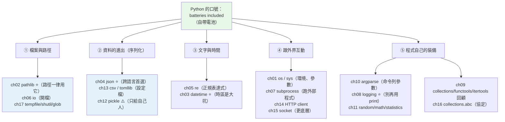

# Part 11 統整：標準庫全貌

> 把這 17 章串成一張圖——Python 的口號是 **「batteries included（自帶電池）」**：多數雜事，標準庫已經幫你寫好了。

## 🗺️ 知識地圖（這 17 章怎麼串起來）

Part 10 之前你在學「**語言怎麼運作**」；從 Part 11 開始，轉向「**怎麼用 Python 做事**」。
標準庫看似零散，其實按「**你要處理什麼**」分成五組：



**一句話串起來**：

標準庫不需要「背」，只需要知道**遇到某類問題時，該去翻哪一個模組**：

- **碰路徑** → **一律用 [`pathlib`](02-pathlib.md)**（`/` 運算子接路徑，比字串拼接安全太多）
- **要存取檔案** → `open()` 配 `with`，**永遠明確指定 `encoding="utf-8"`**（ch06）
- **資料要跨程式／跨語言傳** → **`json`**（ch04）；**只有自己人才用 `pickle`**（ch12，會執行任意程式碼）
- **抽取文字裡的欄位** → `re`（ch05）
- **處理時間** → `datetime`（ch03，**時區是最大的坑**）
- **跑外部程式** → `subprocess`（ch07，**用參數列表，別用 `shell=True`**）
- **腳本要收參數** → `argparse`（ch10）
- **想知道程式在幹嘛** → **`logging`（ch08），不是 `print`**

## ⚡ 速查表（什麼情境用什麼）

| 情境 | 用什麼 | 章節 |
|------|--------|------|
| **任何路徑操作** | **`pathlib.Path`**（`p / "sub" / "f.txt"`、`.exists()`、`.read_text()`）——別用 `os.path` 拼字串 | [ch02](02-pathlib.md) |
| 開檔讀寫 | `with open(p, encoding="utf-8") as f:`（**編碼一定要寫**） | [ch06](06-io.md) |
| 讀取環境變數／命令列 | `os.environ`、`sys.argv`；離開程式用 `sys.exit(1)` | [ch01](01-os-sys.md) |
| 臨時檔／臨時目錄 | **`tempfile.TemporaryDirectory()`**（自動清理，測試必備） | [ch17](17-tempfile-shutil-glob.md) |
| 複製／移動／刪除**整棵目錄** | `shutil.copytree` / `move` / **`rmtree`（⚠️ 不可復原）** | [ch17](17-tempfile-shutil-glob.md) |
| 找檔案 | `Path.glob("*.py")` / `rglob`（遞迴） | [ch17](17-tempfile-shutil-glob.md) |
| **跨語言／跨服務傳資料** | **`json`**（`ensure_ascii=False` 才不會把中文變 `\uXXXX`） | [ch04](04-json.md) |
| 存 Python 專屬物件（**只給自己人**） | `pickle`（⚠️ **絕不 `loads` 不可信來源**——會執行任意程式碼） | [ch12](12-pickle.md) |
| 讀設定檔 | **`tomllib`**（3.11+，讀 `pyproject.toml`）；表格資料用 `csv` | [ch13](13-csv-config-tomllib.md) |
| 從文字抽取欄位 | `re` + **具名群組** `(?P<name>...)`；**先 `re.compile`** 再重複用 | [ch05](05-re.md) |
| 時間戳、時區 | `datetime`；**存 UTC、顯示才轉當地**；`datetime.now(UTC)` | [ch03](03-datetime.md) |
| **執行外部指令** | `subprocess.run([...], check=True)`——**用列表，別用 `shell=True`**（注入風險） | [ch07](07-subprocess.md) |
| 呼叫 HTTP API | `httpx` / `requests`（第三方）；標準庫只有 `urllib` | [ch14](14-http-client.md) |
| **記錄程式在做什麼** | **`logging`**（有等級、可設目的地、可關閉）——**正式程式別用 `print`** | [ch08](08-logging.md) |
| 命令列參數 | `argparse`（自動生 `--help`） | [ch10](10-argparse.md) |
| 隨機／統計 | `random`（⚠️ **密碼用 `secrets`**）、`statistics.median` | [ch11](11-random-math-statistics.md) |
| 計數／分組／雙端佇列 | `Counter` / `defaultdict` / `deque` | [ch09](09-collections-functools-itertools.md) |
| 自訂容器想被 `for`／`len()` 支援 | 繼承 `collections.abc.Sequence` 等（免費得到一堆方法） | [ch16](16-collections-abc.md) |
| 更底層的網路（自己實作協定） | `socket` | [ch15](15-socket.md) |

## 🔑 核心心智模型（帶得走的幾句話）

- **先問「標準庫有沒有」再裝套件。** Python 的殺手鐧就是「自帶電池」——
  處理路徑、JSON、時間、正則、日誌、子行程、CLI，全都內建。
- **路徑一律 `pathlib`。** `Path("a") / "b" / "c.txt"` 跨平台又安全；
  字串拼接（`"a" + "/" + "b"`）在 Windows 會出事。
- **開檔永遠寫 `encoding="utf-8"`。** 不寫的話，Python 會用**作業系統的預設編碼**——
  在 Windows 是 cp950，讀 UTF-8 檔案就會 `UnicodeDecodeError`。**這是台灣開發者最常踩的坑。**
- **`json` 給外人，`pickle` 給自己人。** `pickle.loads()` **會執行任意程式碼**——
  拿它讀不可信的資料，等於把伺服器交給對方（見 [Part 20](../20-security-system-design/09-deserialization-security.md)）。
- **`logging` 不是「比較潮的 print」。** 它能**分等級**（DEBUG/INFO/ERROR）、
  **不改程式就切換輸出目的地**、**上線後關掉細節**。`print` 全部做不到。
- **`subprocess` 用列表，不要 `shell=True`。**
  `subprocess.run(f"ping {host}", shell=True)` 讓使用者輸入 `; rm -rf /` 就完蛋了
  （見 [Part 20 注入](../20-security-system-design/02-injection.md)）。

## 🛠️ 小實作：一支 log 分析 ETL，用上半個標準庫

一個真實的小任務：**讀 log → 用正則抽欄位 → 過濾慢請求 → 輸出 JSON 報表**。
過程中會用到 `tempfile`、`pathlib`、`io`、`re`、`datetime`、`json`、`logging` **七個模組**。

```python
# stdlib_etl_demo.py —— Part 11 主線：batteries included
from __future__ import annotations

import json
import logging
import re
import tempfile
from datetime import UTC, datetime
from pathlib import Path

# ch08 logging：有等級、可設格式——別用 print
logging.basicConfig(level=logging.INFO, format="    [%(levelname)s] %(message)s")
logger = logging.getLogger("etl")

# ch05 re：具名群組 (?P<name>...)，且 \s+ 容許欄位間有多個空白
LOG_LINE = re.compile(r"(?P<ts>\S+)\s+(?P<level>\w+)\s+user=(?P<user>\w+)\s+ms=(?P<ms>\d+)")

RAW = """\
2026-07-08T10:00:00Z INFO  user=alice ms=120
2026-07-08T10:00:01Z ERROR user=bob   ms=980
2026-07-08T10:00:02Z INFO  user=alice ms=95
壞掉的一行，解析不了
2026-07-08T10:00:03Z ERROR user=carol ms=1500
"""


def parse_line(line: str) -> dict[str, object] | None:
    """解析一行 log；解析不了回 None（而不是拋例外——壞行是預期內的）。"""
    match = LOG_LINE.match(line)
    if match is None:
        return None
    parts = match.groupdict()
    return {
        "ts": datetime.fromisoformat(parts["ts"]),   # ch03 datetime
        "level": parts["level"],
        "user": parts["user"],
        "ms": int(parts["ms"]),
    }


def demo() -> None:
    # ch17 tempfile：自動收拾的臨時工作桌（離開 with 就整個消失）
    with tempfile.TemporaryDirectory() as tmp:
        workdir = Path(tmp)                       # ch02 pathlib
        src = workdir / "app.log"                 # 用 / 接路徑，不用字串拼接
        src.write_text(RAW, encoding="utf-8")     # ch06 io：編碼一定要寫
        logger.info("寫入 %s (%d bytes)", src.name, src.stat().st_size)

        records: list[dict[str, object]] = []
        bad = 0
        for line in src.read_text(encoding="utf-8").splitlines():
            record = parse_line(line)
            if record is None:
                bad += 1
                logger.warning("跳過無法解析的行: %s", line[:16])
                continue
            records.append(record)

        logger.info("解析 %d 筆, 跳過 %d 筆", len(records), bad)

        slow = [r for r in records if int(str(r["ms"])) > 500]
        errors = [r for r in records if r["level"] == "ERROR"]

        report = {
            "total": len(records),
            "errors": len(errors),
            "slow_requests": [{"user": r["user"], "ms": r["ms"]} for r in slow],
        }
        out = workdir / "report.json"
        # ch04 json：ensure_ascii=False，中文才不會變成 \uXXXX
        out.write_text(json.dumps(report, indent=2, ensure_ascii=False), encoding="utf-8")
        logger.info("產出 %s", out.name)

        print("\n  ── report.json ──")
        for line in out.read_text(encoding="utf-8").splitlines():
            print(f"    {line}")

    # 離開 with → 臨時目錄自動刪除，不留垃圾
    print(f"\n  離開 with → 臨時目錄自動刪除，還在嗎? {workdir.exists()}")


if __name__ == "__main__":
    demo()
```

**預期輸出**：

```pycon
$ python stdlib_etl_demo.py
    [INFO] 寫入 app.log (214 bytes)
    [WARNING] 跳過無法解析的行: 壞掉的一行，解析不了
    [INFO] 解析 4 筆, 跳過 1 筆
    [INFO] 產出 report.json

  ── report.json ──
    {
      "total": 4,
      "errors": 2,
      "slow_requests": [
        {
          "user": "bob",
          "ms": 980
        },
        {
          "user": "carol",
          "ms": 1500
        }
      ]
    }

  離開 with → 臨時目錄自動刪除，還在嗎? False
```

**這支不到 60 行的腳本，示範了標準庫的威力**：

- **零第三方套件**——`tempfile`、`pathlib`、`io`、`re`、`datetime`、`json`、`logging` 全部內建。
- **壞掉的那一行沒有讓程式崩潰**——`parse_line` 回 `None`，
  用 `logger.warning` 記錄後跳過（**壞資料是預期內的，不該當成例外**）。
- **臨時目錄自動消失**（`False`）——`tempfile` + `with`，不留垃圾檔案。
  這正是 [Part 6 context manager](../06-error-handling/06-context-manager.md) 的實際應用。
- **中文沒有變成 `\uXXXX`**——因為 `ensure_ascii=False`。

## ✅ 自測清單（答不出來就回去讀）

- [ ] 為什麼路徑要用 `pathlib` 而不是字串拼接／`os.path`？（[ch02](02-pathlib.md)）
- [ ] `open()` 不寫 `encoding` 會發生什麼事？（尤其在 Windows）（[ch06](06-io.md)）
- [ ] `json.dumps` 的中文變成 `\uXXXX`，怎麼解？（[ch04](04-json.md)）
- [ ] `pickle` 為什麼危險？什麼時候才能用？（[ch12](12-pickle.md)）
- [ ] `subprocess` 為什麼不能用 `shell=True` 拼使用者輸入？（[ch07](07-subprocess.md)）
- [ ] `logging` 比 `print` 好在哪三點？（[ch08](08-logging.md)）
- [ ] 時區處理的原則是什麼？（提示：存什麼、顯示什麼）（[ch03](03-datetime.md)）
- [ ] 正則的具名群組怎麼寫？為什麼要 `re.compile`？（[ch05](05-re.md)）
- [ ] 測試需要臨時檔案，該用什麼？（[ch17](17-tempfile-shutil-glob.md)）
- [ ] `random` 和 `secrets` 差在哪？什麼時候一定要用 `secrets`？（[ch11](11-random-math-statistics.md)）
- [ ] 自己寫的容器想支援 `len()`／`for`，最省力的做法？（[ch16](16-collections-abc.md)）
- [ ] `os` / `sys` 各管什麼？（[ch01](01-os-sys.md)）
- [ ] 讀 `pyproject.toml` 用什麼？（[ch13](13-csv-config-tomllib.md)）
- [ ] `socket` 和 HTTP client 是什麼關係？（[ch15](15-socket.md)、[ch14](14-http-client.md)）
- [ ] `Counter`、`defaultdict`、`deque` 各解決什麼？（[ch09](09-collections-functools-itertools.md)）
- [ ] 寫一個 CLI 工具收參數，用什麼？（[ch10](10-argparse.md)）

## 🎯 面試速查

| 考點 | 面試官想聽到什麼 | 章節 |
|------|------------------|------|
| **`logging` vs `print`？** | 「`logging` 有**等級**（DEBUG/INFO/WARNING/ERROR），能**不改程式碼就切換輸出目的地**（檔案／stdout／遠端），能在**正式環境調高等級關掉細節**，還帶時間戳與模組名。`print` 全部做不到——**正式程式碼不該有 `print`**。」 | [ch08](08-logging.md) |
| **`pickle` 的風險？** | 「`pickle.loads()` 在還原時**會執行任意程式碼**（`__reduce__`）——所以**絕不能拿它讀不可信的資料**（使用者上傳、網路傳來）。跨信任邊界一律用 **JSON**。pickle 只用於『自己存、自己讀』。」 | [ch12](12-pickle.md) |
| **`subprocess` 的安全寫法？** | 「**用參數列表**：`subprocess.run(["ping", host], check=True)`。**絕不用 `shell=True` 拼字串**——使用者輸入 `; rm -rf /` 就會被執行（**命令注入**）。另外要加 `check=True`，否則失敗會被靜默忽略。」 | [ch07](07-subprocess.md) |
| **時區怎麼處理？** | 「**存 UTC、顯示才轉當地時區**。用 **aware datetime**（帶時區）而非 naive；`datetime.now(UTC)`。天真地用 `datetime.now()` 存到資料庫，跨時區部署就會出事。」 | [ch03](03-datetime.md) |
| **`pathlib` 比 `os.path` 好在哪？** | 「**物件導向、可讀性高、跨平台**。`p / "sub" / "f.txt"` 用 `/` 運算子接路徑（自動處理分隔符）；還內建 `.read_text()`、`.exists()`、`.glob()`。字串拼接在 Windows／POSIX 之間很容易出錯。」 | [ch02](02-pathlib.md) |
| **`random` 能拿來產生密碼嗎？** | 「**絕對不行**。`random` 是**偽隨機**（可預測，種子固定就重現）。產生密碼、token、金鑰**必須用 `secrets`**（密碼學安全的隨機源）。」 | [ch11](11-random-math-statistics.md) |

---

🎉 **恭喜完成 Part 11！** 你已經摸熟 Python 的工具箱——
**大部分的雜事，標準庫早就幫你寫好了。**

接下來 [Part 12 測試](../12-testing/README.md) 問一個殘酷的問題：
**你怎麼知道你的程式是對的？**
——「我跑過了，看起來沒問題」不是答案。

➡️ 下一 Part：[測試 Testing](../12-testing/README.md)

[⬆️ 回 Part 11 索引](README.md)
