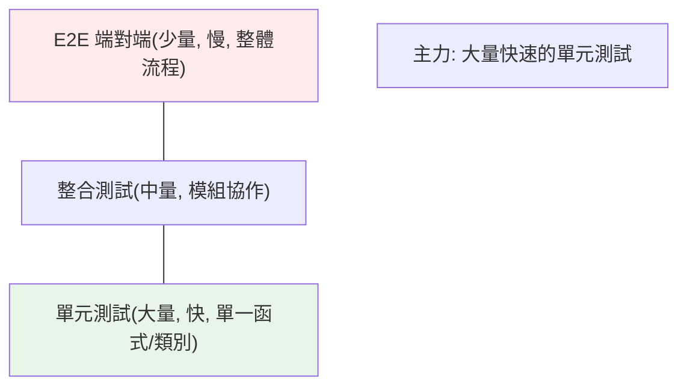

# 為什麼要測試

> 測試不是「寫完程式後的額外工作」，而是「讓你能安心改動程式的安全網」。自動化測試抓回歸、當活文件、逼你寫出可測試（即良好設計）的程式——不會測試的工程師，改動大型程式時就是在賭博。

## Why（為什麼）

「程式能跑就好，為什麼還要花時間寫測試？」——這是新手最常見的疑問。答案：**沒有測試，你不敢改程式**。改一行怕弄壞十處、重構怕引入 bug、升級依賴怕出事。自動化測試是「改動程式的安全網」——改完跑測試，綠燈就知道沒弄壞既有功能。它還是活文件、是設計的試金石。理解「為什麼測試」的價值，你才會願意投入，也才懂後面各章的工具（pytest、fixture、mock）在解決什麼問題。

## Theory（理論：測試的價值）

自動化測試提供幾個核心價值：

1. **防回歸（regression）**：改動後跑測試，確認沒弄壞既有功能——這是最大的價值。**沒測試就不敢改程式**。
2. **活文件**：測試展示「這個函式該怎麼用、預期什麼行為」——比註解更可靠（測試會被執行，過期就紅燈）。
3. **設計回饋**：難測試的程式通常是設計不良（緊耦合、職責不清）——寫測試逼你寫出鬆耦合、可測試的程式。
4. **快速定位**：測試失敗直接指出「哪個功能壞了」，比手動點來點去快。
5. **信心**：綠燈讓你敢重構、敢升級、敢部署。

## Specification（規範：測試金字塔）

測試分層，比例呈「金字塔」：

```text
         /\
        /  \  E2E（端對端）：少量，慢，整體流程
       /----\
      / 整合 \  整合測試：中量，測模組協作
     /--------\
    /   單元    \  單元測試：大量，快，測單一函式/類別
   /------------\
```

- **單元測試（unit）**：測單一函式/類別，隔離、快、多——**測試的主力**。
- **整合測試（integration）**：測多個模組協作（如 API + DB）。
- **端對端測試（E2E）**：測整個系統流程（如瀏覽器操作，見 [Playwright](../14-web/README.md)）——慢、脆弱，少量即可。

**準則**：**大量快速的單元測試 + 適量整合測試 + 少量 E2E**。倒金字塔（大量 E2E）會又慢又脆弱。

## Implementation（測試結構、什麼該測、Python 生態）

### 測試的基本結構：Arrange-Act-Assert

好的測試遵循 **AAA** 三段結構：

```python
def test_add():
    # Arrange（準備）：設定輸入與環境
    a, b = 2, 3

    # Act（執行）：呼叫被測的東西
    result = add(a, b)

    # Assert（斷言）：驗證結果符合預期
    assert result == 5
```

一個測試**測一件事**、有清楚的三段——這讓測試易讀、失敗時容易定位。

### 什麼該測、什麼不必

- **該測**：核心邏輯、邊界條件（空輸入、極值）、錯誤處理（例外）、bug 修復（寫測試防它重現）、公開 API。
- **不必過度測**：瑣碎的 getter/setter、第三方函式庫本身（假設它已測過）、純設定。
- **重點測「容易出錯、後果嚴重」的地方**：金額計算、權限、資料轉換。

不是「覆蓋率越高越好」（見 [覆蓋率](07-coverage.md)）——是「測到重要的、容易錯的」。

### Python 的測試生態

| 工具 | 定位 |
|------|------|
| **`pytest`** | **社群標準**——簡潔（用 `assert`）、強大（fixture、參數化）、外掛豐富 |
| `unittest` | 標準庫、xUnit 風格（見 [unittest](02-unittest.md)） |
| `mock` | 隔離依賴（見 [mock](06-mock.md)） |
| `coverage` | 覆蓋率（見 [覆蓋率](07-coverage.md)） |
| `hypothesis` | 屬性測試（進階） |

**本 Part 以 pytest 為主**（社群標準），也介紹標準庫的 unittest 與 doctest。

### 好測試的特質：FIRST

- **Fast（快）**：跑得快才會常跑。
- **Independent（獨立）**：測試間不互相依賴、順序無關。
- **Repeatable（可重複）**：每次結果一致（不依賴時間、亂數、外部狀態）。
- **Self-validating（自我驗證）**：明確 pass/fail，不需人工判讀。
- **Timely（及時）**：和程式一起寫（甚至先寫，見 [TDD](08-tdd.md)）。

## Code Example（可執行的 Python 範例）

```python
# why_testing_demo.py
from __future__ import annotations


def calculate_discount(price: float, discount_percent: float) -> float:
    """計算折扣後價格。"""
    if not 0 <= discount_percent <= 100:
        raise ValueError(f"折扣須在 0-100 之間，得到 {discount_percent}")
    return round(price * (1 - discount_percent / 100), 2)


# --- 這些就是測試（用 assert，pytest 風格）---
def test_normal_discount() -> None:
    # Arrange-Act-Assert
    result = calculate_discount(100, 20)
    assert result == 80.0


def test_zero_discount() -> None:
    assert calculate_discount(100, 0) == 100.0


def test_boundary_full_discount() -> None:
    # 邊界條件：100% 折扣
    assert calculate_discount(100, 100) == 0.0


def test_invalid_discount_raises() -> None:
    # 錯誤處理：非法折扣應拋例外
    import pytest

    with pytest.raises(ValueError):
        calculate_discount(100, 150)


def demo() -> None:
    """手動跑一遍測試（實際用 pytest 執行）。"""
    print(f"100 打 8 折: {calculate_discount(100, 20)}")
    print(f"100 打 0 折: {calculate_discount(100, 0)}")
    try:
        calculate_discount(100, 150)
    except ValueError as e:
        print(f"非法折扣擋下: {e}")
    print("\n→ 用 pytest 執行本檔的 test_* 函式來自動驗證")


if __name__ == "__main__":
    demo()
```

**執行**（用 pytest）：

```pycon
$ pytest why_testing_demo.py -v
test_normal_discount PASSED
test_zero_discount PASSED
test_boundary_full_discount PASSED
test_invalid_discount_raises PASSED
```

## Diagram（圖解：測試金字塔）



## Best Practice（最佳實踐）

- **把測試當「改動程式的安全網」**：有測試才敢改、敢重構、敢升級——這是最大的價值。
- **測試金字塔**：大量單元測試 + 適量整合 + 少量 E2E；別倒金字塔。
- **測試遵循 AAA（Arrange-Act-Assert）**、一個測試測一件事。
- **重點測「容易錯、後果嚴重」的**：核心邏輯、邊界、錯誤處理、bug 修復；別追求無意義的高覆蓋率。
- **好測試符合 FIRST**：快、獨立、可重複、自我驗證、及時。
- **用 pytest**（社群標準，見 [pytest 基礎](03-pytest-basics.md)）；把測試納入 CI（見 [CI/CD](../19-cloud-native/05-ci-cd.md)）。
- **修 bug 先寫「重現它的測試」**（見 [TDD](08-tdd.md)、[系統性除錯](../18-performance/README.md)），修好後測試防它重現。

## Common Mistakes（常見誤解）

- **「程式能跑就不用測」**：沒測試 = 不敢改；改大型程式如同賭博。
- **倒金字塔（大量 E2E）**：慢、脆弱、難維護；主力該是單元測試。
- **追求 100% 覆蓋率**：覆蓋率高不代表測得好（見 [覆蓋率](07-coverage.md)）；重點是測對地方。
- **測試依賴外部狀態/時間/亂數**：不可重複、脆弱；隔離依賴（見 [mock](06-mock.md)）、固定亂數種子。
- **測試互相依賴/有順序**：一個壞全壞、難除錯；每個測試獨立。
- **一個測試測太多事**：失敗時不知哪裡錯；一測試一件事。
- **不測邊界與錯誤路徑**：bug 常在邊界（空、極值）與例外處。

## Interview Notes（面試重點）

- **能說出測試的核心價值**：**防回歸（改動的安全網）、活文件、設計回饋、快速定位、信心**——尤其「沒測試不敢改程式」。
- 知道**測試金字塔**（大量單元 + 適量整合 + 少量 E2E）與為何別倒金字塔。
- 知道 **AAA 結構**、一測試一件事、**FIRST 特質**（快/獨立/可重複/自我驗證/及時）。
- 知道**該測什麼**（核心邏輯、邊界、錯誤處理、bug 修復），且**覆蓋率高 ≠ 測得好**。
- 知道 Python 生態：**pytest（社群標準）**、unittest、mock、coverage。
- 知道修 bug 先寫重現測試（連結 TDD）。

---

➡️ 下一章：[unittest](02-unittest.md)

[⬆️ 回 Part 12 索引](README.md)
