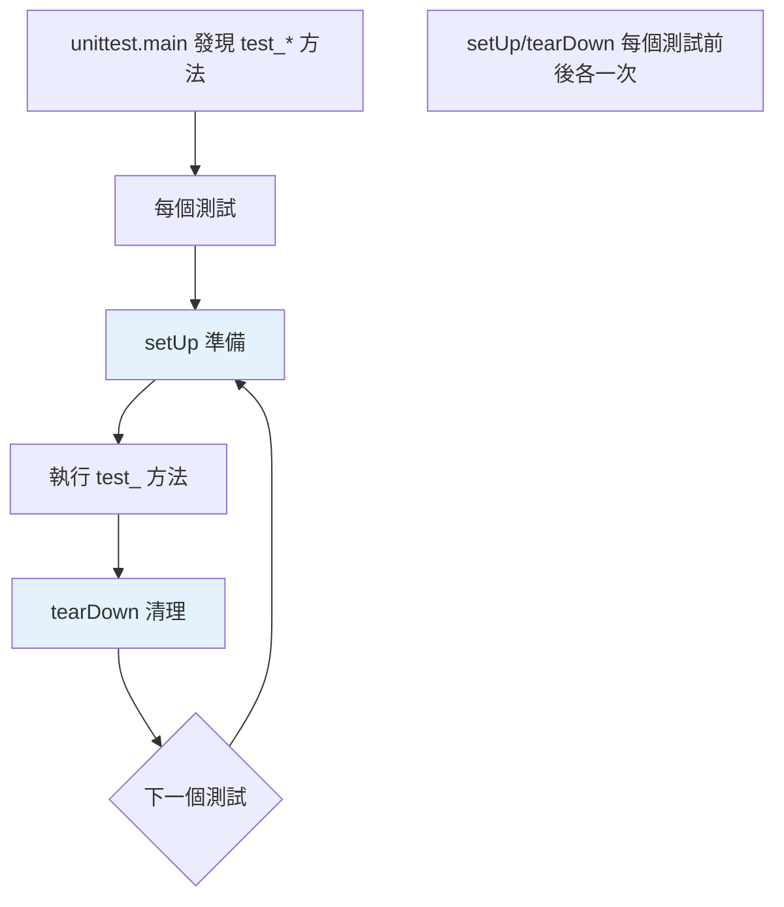

# unittest

> `unittest` 是標準庫的測試框架——xUnit 風格、類別導向、`assertEqual`/`setUp`/`tearDown`。雖然實務上多用 pytest，但理解 unittest 有助於讀既有程式碼、也是「不想裝套件」時的選擇。

## 💡 白話導讀（建議先讀）

`unittest` 是標準庫自帶的測試框架——一套**老派但正式的制服**,源自 Java 世家的 xUnit 傳統：

```python
import unittest

class TestMath(unittest.TestCase):          # 測試要穿「類別」這件外套
    def setUp(self):                        # 每題考前的準備動作
        self.data = [1, 2, 3]

    def test_sum(self):                     # 測試方法以 test_ 開頭
        self.assertEqual(sum(self.data), 6) # 斷言要用專屬方法,不能裸 assert
```

規矩不少:要開類別、要繼承 TestCase、斷言要背一族方法（assertEqual、assertTrue、assertRaises⋯⋯）。

**那為什麼還要學它？**兩個現實理由：

1. **存量龐大**——無數專案、公司程式碼庫用它寫的,你會讀到。
2. **零依賴**——標準庫內建,不能裝套件的環境它是唯一選擇。

但先講結論,免得走錯路：

> **新程式碼用 pytest**（下一章）——它把這套制服全部簡化掉了。
> 這章的目標是「**看得懂** unittest」,不是「愛上它」。

（好消息:pytest 能直接執行 unittest 寫的測試——兩個世界相容,遷移不痛。）

## Why（為什麼）

`unittest` 是 Python 內建的測試框架（無需安裝），源自 Java 的 JUnit（xUnit 家族）。雖然社群已大量轉向 pytest（更簡潔，見 [pytest 基礎](03-pytest-basics.md)），但你仍會在既有專案、標準庫測試、或「不想裝第三方套件」的場景遇到 unittest。理解它的 xUnit 風格（測試類別、assert 方法、setUp/tearDown）能讓你讀懂這些程式，也理解「pytest 改善了什麼」。這章講 unittest 的核心，並對比 pytest。

## Theory（理論：xUnit 風格）

`unittest` 採 **xUnit 風格**（源自 Java 世家的老派制服）——測試組織成**類別**，每個測試是類別的方法：

- **測試類別**繼承 `unittest.TestCase`。
- **測試方法**以 `test_` 開頭。
- **斷言**用 `self.assertEqual`、`self.assertTrue` 等專屬方法（不是裸 `assert`）。
- **`setUp`/`tearDown`**：每個測試前/後執行（準備/清理）。

這種類別導向、方法斷言的風格較「重」——這正是 pytest 用裸 `assert` 與普通函式改善的地方。

## Specification（規範：unittest 結構）

```python
import unittest

class TestCalculator(unittest.TestCase):
    def setUp(self) -> None:
        # 每個 test 前執行（準備）
        self.calc = Calculator()

    def tearDown(self) -> None:
        # 每個 test 後執行（清理）
        pass

    def test_add(self) -> None:
        self.assertEqual(self.calc.add(2, 3), 5)

    def test_divide_by_zero(self) -> None:
        with self.assertRaises(ZeroDivisionError):
            self.calc.divide(1, 0)


# 常用斷言方法
self.assertEqual(a, b)        # a == b
self.assertNotEqual(a, b)
self.assertTrue(x)            # bool(x) is True
self.assertFalse(x)
self.assertIsNone(x)          # x is None
self.assertIn(a, b)           # a in b
self.assertRaises(Exc)        # 拋出例外
self.assertAlmostEqual(a, b)  # 浮點近似相等

# 執行
# python -m unittest test_module.py
# python -m unittest discover      # 自動找測試
```

## Implementation（TestCase、斷言方法、setUp/tearDown、vs pytest）

### 測試類別與 `test_` 方法

```python
import unittest

class TestStringMethods(unittest.TestCase):
    def test_upper(self) -> None:
        self.assertEqual("hello".upper(), "HELLO")

    def test_isupper(self) -> None:
        self.assertTrue("HELLO".isupper())
        self.assertFalse("Hello".isupper())

    def test_split(self) -> None:
        s = "a b c"
        self.assertEqual(s.split(), ["a", "b", "c"])
        with self.assertRaises(TypeError):
            s.split(2)     # 分隔符必須是字串

if __name__ == "__main__":
    unittest.main()
```

每個 `test_` 方法是獨立測試——unittest 自動發現並執行它們，各自回報 pass/fail。

### 斷言方法：不用裸 assert

unittest 用**斷言方法**（`assertEqual` 等）而非裸 `assert`——好處是失敗時有更詳細的訊息（顯示兩邊的值）：

```python
self.assertEqual(result, expected)   # 失敗時顯示 result 與 expected 的值
# vs 裸 assert（unittest 不鼓勵）
assert result == expected            # 失敗訊息較少
```

常用：`assertEqual`/`assertTrue`/`assertFalse`/`assertIsNone`/`assertIn`/`assertRaises`/`assertAlmostEqual`（浮點）。**要記一堆方法名**——這正是 pytest 用裸 `assert` + 智慧內省改善的地方（pytest 的裸 assert 失敗時也顯示詳細值）。

### `setUp` / `tearDown`：測試的前後處理

`setUp` 在**每個** `test_` 方法**前**執行、`tearDown` 在**後**執行——用於準備共用的測試環境與清理：

```python
import unittest

class TestDatabase(unittest.TestCase):
    def setUp(self) -> None:
        self.db = create_test_db()      # 每個測試前建立乾淨的 DB
        self.db.insert({"id": 1})

    def tearDown(self) -> None:
        self.db.close()                 # 每個測試後清理

    def test_query(self) -> None:
        self.assertEqual(self.db.get(1), {"id": 1})
    # setUp 讓每個測試從乾淨狀態開始（測試獨立性）
```

`setUp`/`tearDown` 確保每個測試從一致的狀態開始（測試獨立性，見 [為什麼測試](01-why-testing.md)）。也有 `setUpClass`/`tearDownClass`（整個類別一次）。這對應 pytest 的 **fixture**（更彈性，見 [fixture](04-fixtures.md)）。

### unittest vs pytest 對比

| | unittest | pytest |
|--|----------|--------|
| 斷言 | `self.assertEqual(a, b)` | `assert a == b`（裸 assert） |
| 組織 | 類別（繼承 TestCase） | 函式（也支援類別） |
| 前後處理 | setUp/tearDown | fixture（更彈性） |
| 參數化 | 較笨拙 | `@pytest.mark.parametrize`（簡潔） |
| 需安裝 | ❌（標準庫） | ✅ |
| 生態 | 內建 | 外掛豐富 |

**pytest 更簡潔、功能更強**（見 [pytest 基礎](03-pytest-basics.md)），是社群標準。unittest 的優勢是標準庫（無需安裝）、xUnit 熟悉度。**好消息：pytest 能執行 unittest 的測試**——所以既有 unittest 測試可無痛用 pytest 跑。

## Code Example（可執行的 Python 範例）

```python
# unittest_demo.py
from __future__ import annotations

import unittest


def calculate_discount(price: float, discount_percent: float) -> float:
    if not 0 <= discount_percent <= 100:
        raise ValueError(f"折扣須在 0-100，得到 {discount_percent}")
    return round(price * (1 - discount_percent / 100), 2)


class TestDiscount(unittest.TestCase):
    def setUp(self) -> None:
        self.base_price = 100.0

    def test_normal_discount(self) -> None:
        self.assertEqual(calculate_discount(self.base_price, 20), 80.0)

    def test_zero_discount(self) -> None:
        self.assertEqual(calculate_discount(self.base_price, 0), 100.0)

    def test_full_discount(self) -> None:
        self.assertEqual(calculate_discount(self.base_price, 100), 0.0)

    def test_invalid_raises(self) -> None:
        with self.assertRaises(ValueError):
            calculate_discount(self.base_price, 150)

    def test_almost_equal(self) -> None:
        # 浮點近似比較
        self.assertAlmostEqual(calculate_discount(99.99, 10), 89.99, places=2)


if __name__ == "__main__":
    unittest.main(verbosity=2)
```

**執行**：

```pycon
$ python unittest_demo.py
test_almost_equal ... ok
test_full_discount ... ok
test_invalid_raises ... ok
test_normal_discount ... ok
test_zero_discount ... ok

----------------------------------------------------------------------
Ran 5 tests in 0.001s

OK
```

## Diagram（圖解：unittest 生命週期）



## Best Practice（最佳實踐）

- **新專案優先用 pytest**（更簡潔、功能強，見 [pytest 基礎](03-pytest-basics.md)）；unittest 用於既有專案或不想裝套件時。
- **用 `pytest` 執行 unittest 測試**：既有 unittest 測試可無痛用 pytest 跑（享受更好的輸出）。
- **用 `setUp`/`tearDown` 確保測試獨立**：每個測試從乾淨狀態開始。
- **選對斷言方法**：`assertEqual`（顯示兩值）、`assertRaises`（例外）、`assertAlmostEqual`（浮點）。
- **`python -m unittest discover` 自動發現測試**。
- **理解 unittest 是為了讀既有程式**：標準庫、Django 等仍用它。

## Common Mistakes（常見誤解）

- **在 unittest 用裸 `assert`**：unittest 鼓勵斷言方法（失敗訊息更詳細）；但 pytest 相反（裸 assert）。
- **測試共用可變狀態**：忘了在 `setUp` 重建乾淨狀態，測試互相污染。
- **`setUpClass` 與 `setUp` 混淆**：前者整個類別一次、後者每個測試一次。
- **浮點用 `assertEqual`**：用 `assertAlmostEqual`（見 [浮點誤差](../02-fundamentals/15-float-precision-decimal.md)）。
- **以為 unittest 和 pytest 不相容**：pytest 能跑 unittest 測試。
- **新專案硬用 unittest**：pytest 更省事；除非有特殊理由。

## Interview Notes（面試重點）

- 知道 **unittest 是標準庫的 xUnit 風格框架**：測試**類別**（繼承 `TestCase`）、`test_` 方法、**斷言方法**（`assertEqual` 等）、`setUp`/`tearDown`（每個測試前後）。
- **能對比 unittest vs pytest**：pytest 用**裸 assert**（智慧內省）、函式導向、fixture 更彈性、參數化簡潔——是社群標準；unittest 是標準庫、無需安裝。
- 知道 **`setUp`/`tearDown` 確保測試獨立**（對應 pytest 的 fixture）。
- 知道 **pytest 能執行 unittest 測試**（既有測試可無痛遷移）。
- 知道浮點用 `assertAlmostEqual`。

---

➡️ 下一章：[pytest 基礎](03-pytest-basics.md)

[⬆️ 回 Part 12 索引](README.md)
