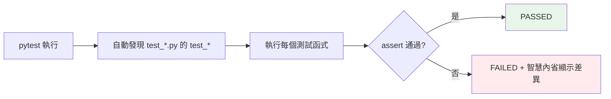

# pytest 基礎

> pytest 用「裸 `assert` + 函式」讓測試極簡——不必記斷言方法、不必開類別。加上智慧的失敗輸出、自動發現、豐富外掛，它是 Python 測試的社群標準。

## 💡 白話導讀（建議先讀）

看完上一章的制服，pytest 是一場**便服革命**——同一個測試,兩種寫法：

```python
# unittest:類別 + 專屬斷言方法
class TestMath(unittest.TestCase):
    def test_sum(self):
        self.assertEqual(sum([1, 2, 3]), 6)

# pytest:就是一個普通函式 + 裸 assert
def test_sum():
    assert sum([1, 2, 3]) == 6
```

沒有類別、沒有繼承、不用背斷言方法——**會寫函式和 assert,就會寫 pytest 測試**。

你可能想問:裸 `assert` 失敗時不是只會冷冷地說 AssertionError 嗎?
這正是 pytest 的招牌魔法——**斷言內省（assertion introspection）**:

```text
def test_sum():
>       assert sum([1, 2, 3]) == 7
E       assert 6 == 7          ← 自動告訴你兩邊的實際值!
```

它重寫了 assert,失敗時把**左右兩邊的值攤開給你看**——除錯資訊直接到位。

日常操作三件事就夠上工：

```bash
pytest                  # 自動找所有 test_*.py 裡的 test_* 函式,全部跑
pytest -k "sum"         # 只跑名字含 sum 的
pytest -x               # 遇到第一個失敗就停
```

pytest 是 Python 測試的社群標準（本書全部測試都用它）——這章開始,它是你的主力武器。

## 🔗 前端對照

如果你用過 Jest / Vitest,pytest 的概念都能對上,只是斷言風格不同:

| | pytest | Jest / Vitest |
|---|--------|---------------|
| 測試 | `def test_xxx():` | `test("xxx", () => {})` / `it(...)` |
| 斷言 | **`assert x == y`**（原生 assert） | `expect(x).toBe(y)` |
| 分組 | 檔案 / 類別 | `describe(...)` |
| 前後置 | fixture（見下一章） | `beforeEach` / `afterEach` |

一句話:最大差異在斷言——Jest 是 **`expect(x).toBe(y)`** 的鏈式風格;
**pytest 直接用 Python 原生 `assert x == y`**,失敗時它會自動拆解印出兩邊的值,不必背一堆 matcher。

## Why（為什麼）

pytest 是現代 Python 測試的**事實標準**——比 unittest（見 [unittest](02-unittest.md)）簡潔太多：測試就是普通函式、斷言就用裸 `assert`（pytest 讓它失敗時顯示詳細值）、無需繼承類別或記斷言方法。加上自動發現測試、清楚的失敗輸出、fixture、參數化、龐大的外掛生態——寫測試變得輕鬆。這章講 pytest 的核心用法，是後面 fixture、參數化、mock 各章的基礎。

## Theory（理論：極簡的測試）

pytest 的設計哲學是**極簡**——便服革命：

- **測試 = 普通函式**（`def test_xxx():`），不必開類別。
- **斷言 = 裸 `assert`**——靠 **assertion introspection（斷言內省）**，`assert a == b` 失敗時自動顯示 a、b 的實際值（不像普通 assert 只說 AssertionError）。
- **自動發現**：自動找 `test_*.py` 檔裡的 `test_*` 函式。
- **豐富的失敗報告**：清楚顯示哪裡、為什麼失敗。

寫測試的門檻於是降到最低——會寫函式和 `assert` 就會寫 pytest 測試。

## Specification（規範：pytest 基本）

```python
# test_example.py（檔名要 test_ 開頭或 _test 結尾）

def test_addition():
    assert 1 + 1 == 2

def test_string():
    result = "hello".upper()
    assert result == "HELLO"

# 測試例外
import pytest
def test_raises():
    with pytest.raises(ValueError):
        int("not a number")

def test_raises_with_message():
    with pytest.raises(ValueError, match="invalid literal"):
        int("abc")

# 浮點近似
def test_float():
    assert 0.1 + 0.2 == pytest.approx(0.3)

# 執行
# pytest                    # 跑所有測試
# pytest test_file.py       # 跑特定檔
# pytest -v                 # 詳細輸出
# pytest -k "addition"      # 只跑名稱含 addition 的
# pytest -x                 # 第一個失敗就停
# pytest --tb=short         # 精簡 traceback
```

## Implementation（裸 assert、pytest.raises、approx、markers、發現規則）

### 裸 `assert` + 智慧內省

pytest 最大的優勢——用裸 `assert`，但失敗時顯示詳細資訊：

```python
def test_list():
    result = [1, 2, 3]
    assert result == [1, 2, 4]

# pytest 失敗輸出（清楚顯示差異）：
#   assert [1, 2, 3] == [1, 2, 4]
#     At index 2 diff: 3 != 4
```

不必記 `assertEqual`/`assertIn`/`assertTrue`——各種比較都用 `assert`，pytest 自動顯示有意義的失敗訊息。這是 pytest 勝過 unittest 的核心（見 [unittest](02-unittest.md)）。

### `pytest.raises`：測試例外

```python
import pytest

def test_raises():
    with pytest.raises(ValueError):
        parse_config("invalid")

def test_raises_and_check_message():
    with pytest.raises(ValueError, match="必須為正"):   # match 用 regex 檢查訊息
        validate(-1)

def test_exception_details():
    with pytest.raises(ValueError) as exc_info:
        validate(-1)
    assert exc_info.value.args[0] == "..."      # 檢查例外物件
```

`pytest.raises` 是 context manager——區塊內若拋出指定例外就通過，沒拋或拋別的就失敗。`match=` 用 regex 檢查訊息、`as exc_info` 取得例外物件。

### `pytest.approx`：浮點比較

浮點不能用 `==`（見 [浮點誤差](../02-fundamentals/15-float-precision-decimal.md)）——用 `pytest.approx`：

```python
import pytest

def test_float():
    assert 0.1 + 0.2 == pytest.approx(0.3)          # 通過（近似相等）
    assert [0.1 + 0.2, 0.2] == pytest.approx([0.3, 0.2])   # 也可用於容器
```

`pytest.approx` 是測試浮點的標準做法（對應 `math.isclose`）。

### markers：標記測試

pytest **marker** 用來標記測試（跳過、預期失敗、分類）：

```python
import pytest

@pytest.mark.skip(reason="尚未實作")
def test_future_feature():
    ...

@pytest.mark.skipif(sys.platform == "win32", reason="不支援 Windows")
def test_unix_only():
    ...

@pytest.mark.xfail(reason="已知 bug")       # 預期失敗（失敗不算錯）
def test_known_bug():
    ...

@pytest.mark.slow                            # 自訂標記（分類）
def test_expensive():
    ...
# pytest -m slow        # 只跑標記 slow 的
# pytest -m "not slow"  # 跳過 slow 的
```

markers 讓你能跳過、標記預期失敗、分類測試（配 `-m` 選擇性執行）。

### 測試發現規則

pytest 自動發現測試，依慣例：

- **檔案**：`test_*.py` 或 `*_test.py`。
- **函式**：`test_*`。
- **類別**（可選）：`Test*` 開頭、其中的 `test_*` 方法（不需繼承 TestCase）。

在 `pyproject.toml` 設定發現路徑（見 [pyproject.toml](../13-tooling-packaging/04-pyproject-toml.md)）：

```toml
[tool.pytest.ini_options]
testpaths = ["tests"]
python_files = ["test_*.py"]
```

### 常用命令列選項

```bash
pytest                 # 跑所有
pytest -v              # 詳細（顯示每個測試）
pytest -k "keyword"    # 只跑名稱符合的
pytest -x              # 第一個失敗就停
pytest --lf            # 只跑上次失敗的（last-failed）
pytest -s              # 不捕捉 print 輸出（除錯用）
pytest --tb=short      # 精簡 traceback
```

## Code Example（可執行的 Python 範例）

```python
# pytest_basics_demo.py
# 這是一個「被測程式 + 測試」的示範
from __future__ import annotations

import pytest


def divide(a: float, b: float) -> float:
    if b == 0:
        raise ZeroDivisionError("除數不能為零")
    return a / b


def average(numbers: list[float]) -> float:
    if not numbers:
        raise ValueError("清單不能為空")
    return sum(numbers) / len(numbers)


# --- 測試 ---
def test_divide_normal() -> None:
    assert divide(10, 2) == 5.0


def test_divide_by_zero() -> None:
    with pytest.raises(ZeroDivisionError, match="除數不能為零"):
        divide(1, 0)


def test_average() -> None:
    assert average([1, 2, 3, 4]) == 2.5


def test_average_float_approx() -> None:
    # 浮點用 approx
    assert average([1, 2, 2]) == pytest.approx(1.6667, abs=1e-4)


def test_average_empty_raises() -> None:
    with pytest.raises(ValueError):
        average([])


@pytest.mark.skip(reason="示範 skip")
def test_skipped() -> None:
    assert False  # 不會執行


if __name__ == "__main__":
    # 直接執行時提示用 pytest
    print("用 pytest 執行本檔：pytest pytest_basics_demo.py -v")
    print(f"divide(10, 2) = {divide(10, 2)}")
    print(f"average([1,2,3,4]) = {average([1, 2, 3, 4])}")
```

**執行**：

```pycon
$ pytest pytest_basics_demo.py -v
test_divide_normal PASSED
test_divide_by_zero PASSED
test_average PASSED
test_average_float_approx PASSED
test_average_empty_raises PASSED
test_skipped SKIPPED (示範 skip)

===== 5 passed, 1 skipped =====
```

## Diagram（圖解：pytest 流程）



## Best Practice（最佳實踐）

- **用 pytest（社群標準）**：裸 `assert`、函式、自動發現——最省事。
- **測試檔命名 `test_*.py`、函式 `test_*`**：讓 pytest 自動發現。
- **用裸 `assert`**（享受智慧內省的詳細失敗訊息），不必記斷言方法。
- **例外用 `pytest.raises`（配 `match=` 檢查訊息）、浮點用 `pytest.approx`**。
- **用 markers 管理測試**：`skip`/`skipif`/`xfail`/自訂標記 + `-m` 選擇執行。
- **善用命令列**：`-v`（詳細）、`-k`（篩選）、`-x`（快速失敗）、`--lf`（只跑上次失敗）、`-s`（看 print）。
- **設定放 `pyproject.toml`**（testpaths 等）；納入 CI（見 [CI/CD](../19-cloud-native/05-ci-cd.md)）。

## Common Mistakes（常見誤解）

- **測試檔/函式命名不符慣例**：pytest 發現不到（要 `test_*`）。
- **浮點用 `assert a == b`**：精度問題；用 `pytest.approx`。
- **測試例外用 try/except 手動**：用 `pytest.raises`（更清楚，且「沒拋例外」也會失敗）。
- **`pytest.raises` 不檢查訊息**：只測型別可能漏掉「拋對型別但原因不對」；用 `match=`。
- **在測試裡用 print 除錯卻看不到**：pytest 預設捕捉輸出；用 `-s` 顯示，或用斷言。
- **一個測試函式測太多事**：失敗難定位；一測試一件事。
- **不設定 testpaths**：pytest 到處找測試，慢或誤抓。

## Interview Notes（面試重點）

- **知道 pytest 是社群標準**，優勢是**裸 `assert` + 斷言內省**（失敗顯示詳細值）、函式導向、自動發現——比 unittest 簡潔。
- 會用 **`pytest.raises`（測例外，`match=` 檢查訊息）、`pytest.approx`（浮點）、markers（skip/skipif/xfail/自訂）**。
- 知道**測試發現規則**（`test_*.py` / `test_*` 函式）。
- 知道常用選項（`-v`/`-k`/`-x`/`--lf`/`-s`）。
- 知道 pytest 能跑 unittest 測試、設定放 pyproject.toml。

---

➡️ 下一章：[fixture](04-fixtures.md)

[⬆️ 回 Part 12 索引](README.md)
