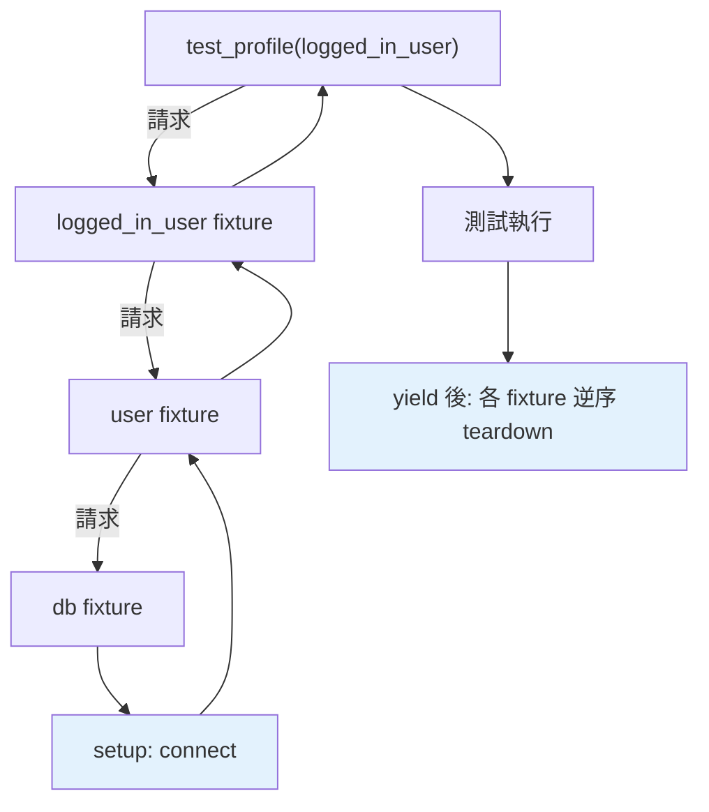

# fixture

> fixture 是 pytest 的「測試前置準備」機制——用 `@pytest.fixture` 定義，測試函式用參數名「請求」它。它比 setUp/tearDown 更彈性：可組合、可設定作用域、用 `yield` 做清理。

## Why（為什麼）

測試常需要「準備好的東西」——一個資料庫連線、一個測試檔案、一個已登入的使用者、一份範例資料。多個測試共用這些準備，若每個測試都重寫一遍很囉嗦。pytest 的 **fixture** 讓你把「準備 + 清理」抽成可重用的元件，測試函式**用參數名「請求」它**。fixture 比 unittest 的 setUp/tearDown（見 [unittest](02-unittest.md)）彈性太多——可組合、可控制作用域、可參數化。這是寫可維護測試的關鍵機制。

## Theory（理論：依賴注入式的前置準備）

**fixture** 是「提供測試所需資源」的函式，用 `@pytest.fixture` 標記。核心機制是**依賴注入**——測試函式的**參數名**對應到 fixture 名，pytest 自動呼叫該 fixture 並把回傳值注入：

```python
import pytest

@pytest.fixture
def sample_data():
    return [1, 2, 3]

def test_sum(sample_data):        # 參數名 = fixture 名 → 自動注入
    assert sum(sample_data) == 6
```

pytest 看到 `test_sum` 需要 `sample_data`，就找同名 fixture、呼叫它、把回傳值傳入。這種「宣告需要什麼、pytest 提供」的模式（依賴注入，見 [DI](../16-architecture/03-dependency-injection.md)）讓測試乾淨、fixture 可重用。

## Specification（規範：fixture 語法）

```python
import pytest

# 基本 fixture
@pytest.fixture
def resource():
    return create_resource()

# yield fixture（含清理）
@pytest.fixture
def db():
    conn = connect()          # setup
    yield conn                # 提供給測試
    conn.close()              # teardown（測試後執行）

# 作用域
@pytest.fixture(scope="function")  # 預設：每個測試一次
@pytest.fixture(scope="module")    # 每個模組一次
@pytest.fixture(scope="session")   # 整個測試 session 一次

# 使用
def test_something(resource, db):  # 請求多個 fixture
    ...

# conftest.py：跨檔案共用的 fixture（放這裡自動可用，不必 import）
```

## Implementation（yield 清理、作用域、組合、conftest）

### `yield` fixture：setup + teardown

fixture 用 `yield`（見 [contextlib](../06-error-handling/07-contextlib.md) 的 generator context manager）——`yield` 前是 setup、`yield` 的值提供給測試、`yield` 後是 teardown（測試結束後執行）：

```python
import pytest

@pytest.fixture
def temp_file(tmp_path):
    # setup：建立臨時檔
    file = tmp_path / "test.txt"
    file.write_text("測試資料")
    yield file                    # 提供給測試
    # teardown：清理（自動，即使測試失敗也執行）
    if file.exists():
        file.unlink()

def test_read(temp_file):
    assert temp_file.read_text() == "測試資料"
    # 測試結束後，fixture 的 teardown 自動清理
```

`yield` 後的清理**保證執行**（即使測試失敗），對應 unittest 的 tearDown 但更清楚（setup/teardown 在同一函式）。

### 作用域（scope）：控制建立頻率

fixture 預設**每個測試建立一次**（`scope="function"`）。昂貴的資源（DB 連線、啟動服務）可設更大作用域，多個測試共用一份：

```python
import pytest

@pytest.fixture(scope="session")   # 整個測試 session 只建一次
def database():
    db = expensive_setup()          # 昂貴，只做一次
    yield db
    db.teardown()

@pytest.fixture(scope="function")  # 每個測試一次（預設）
def clean_table(database):
    database.clear()
    yield
```

- `function`（預設）：每個測試一次——最隔離、最安全。
- `module`：每個檔案一次。
- `session`：整個測試執行一次——最省，但要小心測試間共用狀態。

**準則**：預設用 `function`（隔離）；只有昂貴且無狀態污染風險的才用更大作用域。

### fixture 可組合：fixture 用 fixture

fixture 可以**請求其他 fixture**（同樣用參數名），組合成複雜的準備：

```python
@pytest.fixture
def db():
    return connect()

@pytest.fixture
def user(db):                    # user fixture 用 db fixture
    return db.create_user("test")

@pytest.fixture
def logged_in_user(user):        # 再組合
    user.login()
    return user

def test_profile(logged_in_user):   # 只請求最終的，pytest 自動解析整條依賴鏈
    assert logged_in_user.is_logged_in
```

pytest 自動解析 fixture 依賴鏈（`logged_in_user` → `user` → `db`），依序建立。這種組合性讓複雜的測試準備可模組化。

### `conftest.py`：跨檔案共用 fixture

放在 `conftest.py`（特殊檔名）的 fixture **自動對同目錄及子目錄的所有測試可用**（不必 import）：

```python
# tests/conftest.py
import pytest

@pytest.fixture
def api_client():
    return TestClient()

# tests/test_users.py（自動能用 api_client，不必 import）
def test_get_user(api_client):
    ...
```

`conftest.py` 是共用 fixture、設定的地方——測試不必 import 就能用其中的 fixture。這是組織大型測試套件的關鍵。

### 內建 fixture

pytest 提供好用的內建 fixture：

- **`tmp_path`**：臨時目錄（`pathlib.Path`，自動清理，見 [tempfile](../11-stdlib/17-tempfile-shutil-glob.md)）。
- **`capsys`**：捕捉 stdout/stderr（測試 print 輸出）。
- **`monkeypatch`**：暫時修改屬性/環境變數（見 [mock](06-mock.md)）。
- **`caplog`**：捕捉 log 輸出。

```python
def test_output(capsys):
    print("hello")
    captured = capsys.readouterr()
    assert captured.out == "hello\n"

def test_with_tmp(tmp_path):
    file = tmp_path / "data.txt"    # 自動清理的臨時目錄
    file.write_text("x")
    assert file.read_text() == "x"
```

## Code Example（可執行的 Python 範例）

```python
# fixtures_demo.py
# 這是「被測程式 + 使用 fixture 的測試」
from __future__ import annotations

import pytest


class ShoppingCart:
    def __init__(self) -> None:
        self.items: list[tuple[str, float]] = []

    def add(self, name: str, price: float) -> None:
        self.items.append((name, price))

    def total(self) -> float:
        return sum(price for _, price in self.items)


# --- fixtures ---
@pytest.fixture
def empty_cart() -> ShoppingCart:
    """提供一個空購物車。"""
    return ShoppingCart()


@pytest.fixture
def cart_with_items(empty_cart: ShoppingCart) -> ShoppingCart:
    """組合：在空車上加商品。"""
    empty_cart.add("蘋果", 30.0)
    empty_cart.add("香蕉", 20.0)
    return empty_cart


# --- 測試 ---
def test_empty_cart_total(empty_cart: ShoppingCart) -> None:
    assert empty_cart.total() == 0.0


def test_cart_with_items(cart_with_items: ShoppingCart) -> None:
    assert cart_with_items.total() == 50.0


def test_add_more(cart_with_items: ShoppingCart) -> None:
    cart_with_items.add("橘子", 25.0)
    assert cart_with_items.total() == 75.0


def test_tmp_file(tmp_path) -> None:  # 內建 fixture
    file = tmp_path / "cart.txt"
    file.write_text("蘋果,30")
    assert file.read_text() == "蘋果,30"


if __name__ == "__main__":
    print("用 pytest 執行本檔：pytest fixtures_demo.py -v")
```

**執行**：

```pycon
$ pytest fixtures_demo.py -v
test_empty_cart_total PASSED
test_cart_with_items PASSED
test_add_more PASSED
test_tmp_file PASSED

===== 4 passed =====
```

## Diagram（圖解：fixture 依賴注入）



## Best Practice（最佳實踐）

- **用 fixture 抽出重複的測試準備**：資料、連線、物件——比每個測試重寫或用 setUp 彈性。
- **清理用 `yield` fixture**（yield 後 teardown，保證執行）。
- **作用域預設 `function`（隔離）**；昂貴且無污染風險的才用 `module`/`session`。
- **組合 fixture**：fixture 請求其他 fixture，模組化複雜準備。
- **共用 fixture 放 `conftest.py`**：同目錄測試自動可用、不必 import。
- **善用內建 fixture**：`tmp_path`（臨時目錄）、`capsys`（捕捉輸出）、`monkeypatch`（暫時修改）、`caplog`（log）。
- **fixture 保持聚焦**：一個 fixture 準備一種資源。

## Common Mistakes（常見誤解）

- **在每個測試重複準備程式**：用 fixture 抽出。
- **fixture 沒清理**：用 `yield` + teardown（尤其外部資源）。
- **作用域設太大導致測試互相污染**：`session` fixture 若有狀態，測試會互相影響；預設用 `function`。
- **fixture 放錯位置**：跨檔案共用要放 `conftest.py`（不是某個測試檔）。
- **fixture 名與測試參數不符**：pytest 靠名稱注入，拼錯就找不到。
- **在 fixture 做太多事**：一個 fixture 準備一種資源，別包山包海。
- **忘了內建 fixture**：`tmp_path`/`capsys` 等已解決常見需求。

## Interview Notes（面試重點）

- **知道 fixture 是 pytest 的測試前置準備機制**，用**依賴注入**（測試參數名 = fixture 名，pytest 自動注入回傳值）。
- 知道 **`yield` fixture**（yield 前 setup、值提供給測試、yield 後 teardown 保證執行）。
- **能對比 fixture vs setUp/tearDown**：fixture 更彈性——**可組合（fixture 用 fixture）、可設作用域（function/module/session）、conftest.py 跨檔共用**。
- 知道**作用域**的取捨（預設 function 隔離、大作用域省但要防污染）。
- 知道 **`conftest.py`（自動可用、不必 import）** 與內建 fixture（`tmp_path`/`capsys`/`monkeypatch`/`caplog`）。

---

➡️ 下一章：[參數化測試](05-parametrize.md)

[⬆️ 回 Part 12 索引](README.md)
