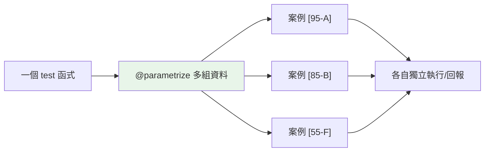

# 參數化測試

> 用同一段測試邏輯跑多組輸入輸出，別複製貼上五個幾乎一樣的測試——`@pytest.mark.parametrize` 讓一個測試函式自動展開成多個測試案例，每組獨立回報。

## Why（為什麼）

測試常需要「用不同輸入驗證同一邏輯」——分級函式測 A/B/C/D/F、驗證函式測各種合法/非法輸入。若每組寫一個測試函式，會有五個幾乎一樣的 `test_grade_a`、`test_grade_b`……重複又難維護。**`@pytest.mark.parametrize`** 讓你把「測試邏輯」寫一次、「測試資料」列成多組，pytest 自動展開成多個獨立測試案例。這大幅減少重複、讓「加一組案例」變成「加一行」，是寫全面測試的利器。

## Theory（理論：資料驅動測試）

**參數化（parametrize）** 是**資料驅動測試**——把「測試邏輯」與「測試資料」分離：

- **邏輯**：一個測試函式（Arrange-Act-Assert）。
- **資料**：多組「輸入 → 預期輸出」。
- pytest 為**每組資料**產生一個獨立的測試案例——各自執行、各自回報 pass/fail。

好處：一個失敗不影響其他（每組獨立）、失敗時清楚顯示是「哪組資料」出錯、加案例只需加一行。

## Specification（規範：parametrize 語法）

```python
import pytest

# 單一參數
@pytest.mark.parametrize("value", [1, 2, 3])
def test_positive(value):
    assert value > 0

# 多個參數（輸入 → 預期）
@pytest.mark.parametrize(
    ("input", "expected"),
    [
        (2, 4),
        (3, 9),
        (4, 16),
    ],
)
def test_square(input, expected):
    assert input ** 2 == expected

# 給案例取 id（讓輸出更清楚）
@pytest.mark.parametrize(
    ("score", "grade"),
    [(95, "A"), (85, "B"), (55, "F")],
    ids=["優秀", "良好", "不及格"],
)
def test_grade(score, grade):
    assert to_grade(score) == grade

# 堆疊多個 parametrize → 笛卡兒積
@pytest.mark.parametrize("x", [1, 2])
@pytest.mark.parametrize("y", [10, 20])
def test_combinations(x, y):    # 產生 4 組：(1,10),(1,20),(2,10),(2,20)
    ...
```

## Implementation（多組資料、id、與 fixture 搭配、pytest.param）

### 一個函式，多組案例

```python
import pytest

def to_grade(score: int) -> str:
    if score >= 90: return "A"
    if score >= 80: return "B"
    if score >= 70: return "C"
    if score >= 60: return "D"
    return "F"

# ❌ 重複：五個幾乎一樣的測試
def test_grade_a(): assert to_grade(95) == "A"
def test_grade_b(): assert to_grade(85) == "B"
# ... 還有 C、D、F

# ✅ 參數化：一個函式，五組案例
@pytest.mark.parametrize(
    ("score", "expected"),
    [(95, "A"), (85, "B"), (75, "C"), (65, "D"), (55, "F")],
)
def test_grade(score: int, expected: str):
    assert to_grade(score) == expected
```

pytest 把這一個函式展開成**五個獨立測試案例**——`test_grade[95-A]`、`test_grade[85-B]`……各自執行、各自回報。加一組案例只需在 list 加一行。

### 案例 id：讓輸出清楚

pytest 自動用參數值當案例 id（`test_grade[95-A]`）。複雜參數可用 `ids=` 自訂：

```python
@pytest.mark.parametrize(
    ("email", "valid"),
    [
        ("user@example.com", True),
        ("bad@", False),
        ("", False),
    ],
    ids=["正常email", "缺網域", "空字串"],
)
def test_email(email: str, valid: bool):
    assert is_valid_email(email) == valid
# 輸出：test_email[正常email], test_email[缺網域], test_email[空字串]
```

清楚的 id 讓「哪組失敗」一目了然。

### 涵蓋邊界與錯誤案例

參數化最適合系統性地測**邊界條件與各種情況**（見 [為什麼測試](01-why-testing.md)）：

```python
@pytest.mark.parametrize(
    ("input", "expected"),
    [
        (0, "zero"),          # 邊界：零
        (-1, "negative"),     # 邊界：負
        (100, "large"),       # 邊界：大值
        (1, "positive"),      # 正常
    ],
)
def test_classify(input: int, expected: str):
    assert classify(input) == expected
```

把「正常 + 邊界 + 錯誤」各種案例列成資料，一次覆蓋——這是寫全面測試的好習慣。

### `pytest.param`：個別案例加 marker

用 `pytest.param` 可對**個別案例**加 marker（如 xfail、skip）：

```python
import pytest

@pytest.mark.parametrize(
    ("input", "expected"),
    [
        (2, 4),
        (3, 9),
        pytest.param(0, 0, marks=pytest.mark.xfail(reason="已知邊界 bug")),
    ],
)
def test_square(input, expected):
    assert square(input) == expected
```

### 與 fixture 搭配

參數化可和 fixture（見 [fixture](04-fixtures.md)）並用——參數化提供資料、fixture 提供資源：

```python
@pytest.mark.parametrize("amount", [100, 500, 1000])
def test_deposit(bank_account, amount):   # bank_account 是 fixture、amount 是參數
    bank_account.deposit(amount)
    assert bank_account.balance == amount
```

也可**參數化 fixture 本身**（`@pytest.fixture(params=[...])`）——讓所有用該 fixture 的測試都跑多組。

## Code Example（可執行的 Python 範例）

```python
# parametrize_demo.py
from __future__ import annotations

import pytest


def to_grade(score: int) -> str:
    if score >= 90:
        return "A"
    if score >= 80:
        return "B"
    if score >= 70:
        return "C"
    if score >= 60:
        return "D"
    return "F"


def is_valid_email(email: str) -> bool:
    import re

    return re.fullmatch(r"[\w.+-]+@[\w-]+\.[\w.-]+", email) is not None


# --- 參數化測試 ---
@pytest.mark.parametrize(
    ("score", "expected"),
    [(95, "A"), (85, "B"), (75, "C"), (65, "D"), (55, "F"), (90, "A"), (60, "D")],
)
def test_grade_boundaries(score: int, expected: str) -> None:
    assert to_grade(score) == expected


@pytest.mark.parametrize(
    ("email", "valid"),
    [
        ("user@example.com", True),
        ("a.b+c@test.co.uk", True),
        ("bad@", False),
        ("@nodomain.com", False),
        ("", False),
    ],
    ids=["正常", "複雜", "缺網域", "缺帳號", "空"],
)
def test_email_validation(email: str, valid: bool) -> None:
    assert is_valid_email(email) == valid


if __name__ == "__main__":
    print("用 pytest 執行：pytest parametrize_demo.py -v")
    for s in [95, 85, 55]:
        print(f"to_grade({s}) = {to_grade(s)}")
```

**執行**：

```pycon
$ pytest parametrize_demo.py -v
test_grade_boundaries[95-A] PASSED
test_grade_boundaries[85-B] PASSED
test_grade_boundaries[55-F] PASSED
...（共 7 組）
test_email_validation[正常] PASSED
test_email_validation[缺網域] PASSED
...（共 5 組）

===== 12 passed =====
```

## Diagram（圖解：一個函式展開成多案例）



## Best Practice（最佳實踐）

- **用 `@pytest.mark.parametrize` 取代複製貼上的相似測試**：一個邏輯、多組資料。
- **系統性列出案例**：正常 + 邊界（零/負/極值/空）+ 錯誤，一次覆蓋。
- **複雜參數用 `ids=`** 讓輸出清楚（哪組失敗一目了然）。
- **個別案例的特殊處理用 `pytest.param(..., marks=...)`**（xfail/skip 單一案例）。
- **參數化與 fixture 並用**：參數提供資料、fixture 提供資源。
- **參數用 tuple + 名稱清楚**：`("input", "expected")`。
- **加案例只需加一行**：讓測試容易擴充。

## Common Mistakes（常見誤解）

- **複製貼上相似測試**：五個 `test_grade_x`；用參數化。
- **參數化的資料含可變預設/共用狀態**：案例間互相影響；資料應獨立。
- **參數順序與函式參數不符**：`parametrize("a,b", ...)` 的順序要對應函式參數。
- **不加 `ids` 導致輸出難讀**：複雜參數的自動 id 可能很長/不清楚。
- **把「不同邏輯」硬塞進一個參數化**：參數化用於「同一邏輯、不同資料」；不同邏輯該分開測試。
- **忘了測邊界/錯誤案例**：只測正常路徑；參數化正好方便補齊。

## Interview Notes（面試重點）

- **知道 `@pytest.mark.parametrize` 做資料驅動測試**：一個測試函式 + 多組資料 → pytest 展開成**多個獨立案例**（各自執行/回報）。
- 知道好處：**減少重複、失敗清楚顯示哪組、加案例只需加一行、每組獨立**。
- 會寫多參數（`("input", "expected")` + tuple list）、用 **`ids=`** 命名、**`pytest.param(marks=)`** 對個別案例加 marker。
- 知道**系統性涵蓋正常 + 邊界 + 錯誤案例**。
- 知道可**與 fixture 並用**、可**參數化 fixture 本身**（`params=`）。

---

➡️ 下一章：[mock 與 patch](06-mock.md)

[⬆️ 回 Part 12 索引](README.md)
