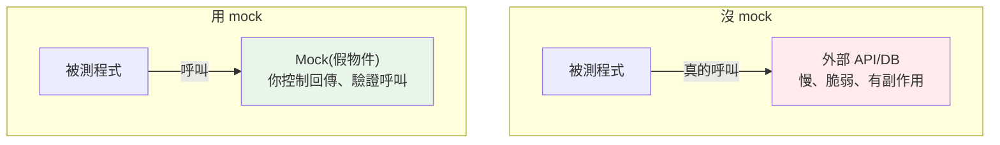

# mock 與 patch

> 測試不該真的打網路、寫資料庫、呼叫付款——用 mock 把這些外部依賴替換成「假的、可控的」物件。`unittest.mock` 的 `Mock`/`patch` 讓你隔離被測程式，測得快、穩定、可重複。

## 💡 白話導讀（建議先讀）

有些程式碼「不能真的執行」來測：真的打 API（慢、要網路、人家會限流）、真的扣款（!!）、真的寄 email。

電影怎麼拍危險動作？**替身演員**。測試也一樣——**mock 就是替身**：

```python
from unittest.mock import Mock

fake_gateway = Mock()                        # 請一位萬能替身
fake_gateway.charge.return_value = "ok"      # 教他:被呼叫 charge 就回 "ok"

result = checkout(cart, gateway=fake_gateway)   # 用替身演出——沒有真的扣款

fake_gateway.charge.assert_called_once_with(100)  # 事後問替身:
# 「導演剛剛有沒有叫你 charge(100)?只叫一次?」——驗證互動!
```

替身的兩大本事都在上面了：

1. **照劇本演**（`return_value`/`side_effect`）——你要它回什麼、拋什麼例外,它照辦。危險/慢/不穩定的依賴全部可控。
2. **記得自己被怎麼使喚**（`assert_called_with`）——測「你的程式有沒有**正確地呼叫**依賴」。

另一個主角 **`patch`——臨時換角**：真實物件在模組深處、沒法用參數傳替身進去?
`with patch("myapp.requests.get") as fake:` 在測試期間**把它換成替身,戲殺青自動換回原角**。
（patch 有個經典坑「要 patch 使用處而非定義處」——章內重點拆解。）

最後一句平衡話:mock 是利器也是陷阱——**mock 得越多,測試離真實越遠**。能用真物件(記憶體 repo、暫存檔)就別 mock;mock 留給真正碰不得的邊界。

## 🔗 前端對照

mock（替身）在兩邊解決同一件事——把「難測的相依」換成可控的假物件:

| 目的 | Python | Jest / Vitest |
|------|--------|---------------|
| 替換函式 / 方法 | `unittest.mock.patch(...)` / `monkeypatch` | `jest.mock(...)` / `vi.mock(...)` |
| 假函式 | `Mock()` / `MagicMock()` | `jest.fn()` / `vi.fn()` |
| 設定回傳值 | `m.return_value = 42` | `fn.mockReturnValue(42)` |
| 驗證有沒有被呼叫 | `m.assert_called_once_with(...)` | `expect(fn).toHaveBeenCalledWith(...)` |

一句話:概念與 API 對應得很整齊。要點也一樣——**mock 你「擁有的邊界」而非別人的內部**,
而且能不能輕鬆 mock 常反映設計好不好（相依有沒有注入,呼應 [Part 16 DI](../16-architecture/03-dependency-injection.md)）。

## Why（為什麼）

單元測試的核心是**隔離**——只測「你的邏輯」，不測「外部依賴」。但真實程式常依賴外部：呼叫 API、查資料庫、讀檔、發 email、處理付款。測試若真的執行這些，會**慢**（等網路）、**脆弱**（外部服務掛了測試就紅）、**有副作用**（真的發了 email）、**難重複**（外部狀態會變）。**mock** 把這些依賴替換成「假物件」——你控制它回傳什麼、驗證它被怎麼呼叫。這是寫可靠單元測試的必備技術。

## Theory（理論：測試替身）

**mock（模擬物件）** 是一種**測試替身（test double）**——用「假的、可控的」物件替換真實依賴（替身演員）。`unittest.mock`（標準庫）提供：

- **`Mock`/`MagicMock`**：萬能替身——存取任何屬性/方法都自動回傳一個 Mock；可設定回傳值（照劇本演）、可記錄呼叫（記得被怎麼使喚）。
- **`patch`**：測試期間**暫時替換**某個物件（模組層級的函式、類別、方法），測試結束自動還原（臨時換角，殺青換回）。

核心用途一句話：

> **替換外部依賴**（讓它回傳你要的、不真的執行）＋ **驗證互動**（它有沒有被正確呼叫）。

## Specification（規範：Mock 與 patch）

```python
from unittest.mock import Mock, MagicMock, patch

# Mock：假物件
m = Mock()
m.method.return_value = 42        # 設定回傳值
m.method()                        # 42
m.method.assert_called_once()     # 驗證被呼叫一次
m.method.assert_called_with(1, 2) # 驗證用什麼引數呼叫

# side_effect：拋例外或依輸入回傳
m.method.side_effect = ValueError("boom")   # 呼叫時拋例外
m.method.side_effect = [1, 2, 3]            # 每次呼叫回傳序列的下一個
m.method.side_effect = lambda x: x * 2      # 依輸入計算

# patch：暫時替換
@patch("mymodule.requests.get")   # 替換 mymodule 裡的 requests.get
def test_fetch(mock_get):
    mock_get.return_value.json.return_value = {"data": 1}
    ...

# patch 當 context manager
with patch("mymodule.database") as mock_db:
    ...

# pytest 的 monkeypatch（更簡單的替代，見下）
def test_env(monkeypatch):
    monkeypatch.setenv("KEY", "value")
```

## Implementation（Mock、patch、驗證呼叫、patch 位置、monkeypatch）

### Mock：可控的假物件

```python
from unittest.mock import Mock

# 建立假物件，設定行為
fake_api = Mock()
fake_api.get_user.return_value = {"id": 1, "name": "Alice"}

# 用它（就像真的 API）
result = fake_api.get_user(1)
print(result)                       # {'id': 1, 'name': 'Alice'}

# 驗證它被怎麼呼叫
fake_api.get_user.assert_called_once_with(1)   # 確認呼叫了一次、引數是 1
```

Mock 物件對任何屬性/方法存取都「有回應」——你設定 `return_value`（回傳值）或 `side_effect`（副作用/例外），並能事後驗證「被呼叫幾次、用什麼引數」。

### `patch`：替換真實依賴

`patch` 在測試期間把某個名稱替換成 Mock，測試結束自動還原：

```python
from unittest.mock import patch

# 被測程式：mymodule.py
def get_weather(city):
    import requests
    resp = requests.get(f"https://api.weather.com/{city}")
    return resp.json()["temp"]

# 測試：patch 掉 requests.get，不真的打網路
@patch("mymodule.requests.get")
def test_get_weather(mock_get):
    # 設定假回應
    mock_get.return_value.json.return_value = {"temp": 25}

    result = get_weather("Taipei")

    assert result == 25
    mock_get.assert_called_once()   # 確認有呼叫 API
```

測試沒真的打網路——`requests.get` 被替換成 Mock，回傳你設定的假資料。測試因此**快、穩定、可重複**。

### 🔴 patch 的位置：patch「使用處」不是「定義處」

**這是 mock 最容易錯的地方**。`patch` 要替換的是「**被測程式 import 該名稱的位置**」，不是「該名稱定義的位置」：

```text
# mymodule.py
from external import fetch_data     # 在這裡 import

def process():
    return fetch_data()

# ❌ 錯：patch 定義處
@patch("external.fetch_data")       # 沒效果！process 用的是 mymodule.fetch_data
# ✅ 對：patch 使用處（mymodule 裡的名稱）
@patch("mymodule.fetch_data")       # 正確替換 process 用的那個
```

規則：**patch 你要 mock 的東西「在被測模組裡的名字」**。因為 `from external import fetch_data` 在 mymodule 建立了一個 `mymodule.fetch_data` 的引用——你要 patch 的是這個。搞錯位置是 mock 最常見的困惑。

### 驗證互動

mock 不只提供假回傳值，還能**驗證被測程式如何互動**：

```python
mock.assert_called()                # 至少呼叫一次
mock.assert_called_once()           # 剛好一次
mock.assert_called_with(1, 2)       # 最後一次用 (1,2) 呼叫
mock.assert_called_once_with(1, 2)  # 剛好一次且用 (1,2)
mock.assert_not_called()            # 從未呼叫
mock.call_count                     # 呼叫次數
mock.call_args_list                 # 所有呼叫的引數
```

這對測試「有沒有正確呼叫依賴」很有用（如「確認發了通知」「確認記了 log」）——但別過度（見下）。

### pytest 的 `monkeypatch`：更簡單的替代

pytest 內建 `monkeypatch` fixture（見 [fixture](04-fixtures.md)），對「暫時改屬性/環境變數」比 `patch` 更簡單：

```python
def test_with_env(monkeypatch):
    monkeypatch.setenv("API_KEY", "test-key")     # 暫時設環境變數
    monkeypatch.setattr("mymodule.CONFIG", {"x": 1})  # 暫時改屬性
    # 測試結束自動還原
```

`monkeypatch` 適合「改設定、環境變數、屬性」；複雜的依賴替換用 `patch` + Mock。

### 別過度 mock

mock 是必要的（隔離外部依賴），但**過度 mock 是反模式**：

- **mock 太多 → 測試變成「測 mock 的設定」** 而非測真實行為，失去意義。
- **mock 內部實作細節 → 重構就壞**（測試綁死實作）。
- **原則**：**mock 外部邊界（網路、DB、時間、隨機、第三方），別 mock 自己的內部邏輯**。內部邏輯應該真的執行、真的測。

## Code Example（可執行的 Python 範例）

```python
# mock_demo.py
from __future__ import annotations

from unittest.mock import Mock, patch


class WeatherService:
    """依賴外部 API 的服務。"""

    def __init__(self, api_client: object) -> None:
        self.api = api_client

    def get_temperature(self, city: str) -> int:
        data = self.api.fetch(city)  # type: ignore[attr-defined]
        return data["temp"]

    def is_hot(self, city: str) -> bool:
        return self.get_temperature(city) > 30


# --- 測試：用 Mock 替換 API ---
def test_get_temperature_with_mock() -> None:
    # 建立假的 API client
    mock_api = Mock()
    mock_api.fetch.return_value = {"temp": 25}

    service = WeatherService(mock_api)
    result = service.get_temperature("Taipei")

    assert result == 25
    mock_api.fetch.assert_called_once_with("Taipei")  # 驗證呼叫


def test_is_hot() -> None:
    mock_api = Mock()
    mock_api.fetch.return_value = {"temp": 35}
    service = WeatherService(mock_api)
    assert service.is_hot("Taipei") is True


def test_side_effect_raises() -> None:
    import pytest

    mock_api = Mock()
    mock_api.fetch.side_effect = ConnectionError("網路斷線")  # 模擬失敗

    service = WeatherService(mock_api)
    with pytest.raises(ConnectionError):
        service.get_temperature("Taipei")


def demo() -> None:
    # 用真實（假的）依賴示範
    fake = Mock()
    fake.fetch.return_value = {"temp": 28}
    service = WeatherService(fake)
    print(f"溫度: {service.get_temperature('Taipei')}")
    print(f"很熱嗎: {service.is_hot('Taipei')}")
    print(f"fetch 被呼叫: {fake.fetch.call_count} 次")


if __name__ == "__main__":
    demo()
```

**執行**：

```pycon
$ python mock_demo.py
溫度: 28
很熱嗎: False
fetch 被呼叫: 2 次
```

## Diagram（圖解：mock 隔離外部依賴）



## Best Practice（最佳實踐）

- **mock 外部依賴**（網路、DB、時間、隨機、第三方、付款、email）：讓測試快、穩定、可重複、無副作用。
- **patch「使用處」不是「定義處」**：patch 被測模組裡的名字（最常見的錯）。
- **設 `return_value`（回傳）/`side_effect`（例外或依輸入）** 控制 mock 行為。
- **用 `assert_called_*` 驗證互動**（有沒有正確呼叫依賴），但別過度。
- **簡單的環境變數/屬性替換用 pytest `monkeypatch`**（比 patch 簡單）。
- **別過度 mock**：只 mock 外部邊界，別 mock 自己的內部邏輯（否則測試綁死實作、失去意義）。
- **優先用依賴注入設計**（見 [DI](../16-architecture/03-dependency-injection.md)）：把依賴當參數傳入，測試時傳 mock 更乾淨（如範例的 `WeatherService(api_client)`）。

## Common Mistakes（常見誤解）

- **patch 錯位置**（定義處而非使用處）：mock 沒生效，測試還是打真實依賴——最經典的坑。
- **過度 mock**：mock 太多變成「測 mock 設定」，失去測試意義；只 mock 外部邊界。
- **mock 內部實作細節**：重構就壞（測試綁死實作）；測行為不測實作。
- **忘了 `side_effect` 可模擬失敗**：只測成功路徑；用 side_effect 測錯誤處理。
- **真的打網路/DB 的「單元測試」**：慢、脆弱；那是整合測試，單元測試該 mock。
- **`Mock` vs `MagicMock` 混淆**：MagicMock 支援魔術方法（`__len__` 等），一般用它。
- **不驗證互動**：只設回傳值卻不確認依賴被正確呼叫。

## Interview Notes（面試重點）

- **知道 mock 用於隔離外部依賴**（網路/DB/時間/隨機/第三方），讓單元測試**快、穩定、可重複、無副作用**。
- 知道 **`Mock`/`MagicMock`（假物件，設 `return_value`/`side_effect`）+ `patch`（暫時替換）**，以及 **`assert_called_*` 驗證互動**。
- **關鍵陷阱：patch「使用處」不是「定義處」**（patch 被測模組裡的名字）——高頻考點。
- 知道 **`side_effect` 可模擬例外/依輸入回傳**、pytest `monkeypatch` 是簡單替代。
- **知道別過度 mock**：只 mock 外部邊界、別 mock 內部邏輯（否則綁死實作）；優先用依賴注入設計讓測試更乾淨。

---

➡️ 下一章：[測試覆蓋率](07-coverage.md)

[⬆️ 回 Part 12 索引](README.md)
