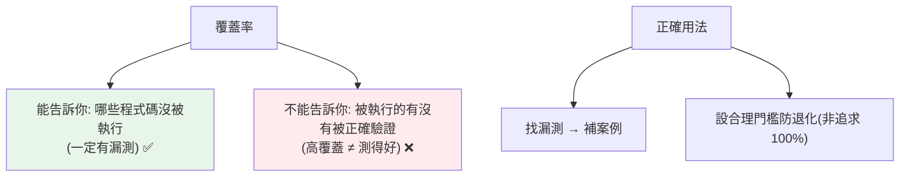

# 測試覆蓋率

> 覆蓋率量「測試執行到多少程式碼」——用 `pytest-cov` 產生報告，找出沒被測到的地方。但覆蓋率高不代表測得好：它是「找漏測」的工具，不是「測試品質」的目標。

## Why（為什麼）

寫了測試，怎麼知道「有沒有漏測」？**測試覆蓋率（coverage）** 量化「測試執行到程式碼的比例」——哪些行被測到、哪些沒有。它幫你找出「完全沒測的函式、沒走到的分支」。但覆蓋率也常被誤用——追求 100% 覆蓋率反而寫出無意義的測試。這章講清楚覆蓋率工具的用法，以及最重要的觀念：**覆蓋率是「找漏洞」的工具，不是「品質」的指標**。

## Theory（理論：覆蓋率的種類）

**覆蓋率** 量測「測試執行時，程式碼被執行的比例」。幾種：

- **行覆蓋率（line coverage）**：多少比例的「程式碼行」被執行——最常見。
- **分支覆蓋率（branch coverage）**：多少比例的「分支」（if 的兩邊、迴圈進出）被執行——更嚴格、更有意義。

**關鍵觀念**：覆蓋率告訴你「哪些程式碼**沒被執行**」（一定有漏測），但**不**告訴你「被執行的有沒有被**正確驗證**」。所以高覆蓋率是**必要非充分**——沒被覆蓋的一定沒測，但被覆蓋的不代表測得好。

## Specification（規範：pytest-cov 用法）

```bash
# 安裝
pip install pytest-cov

# 執行測試 + 覆蓋率
pytest --cov=mymodule                    # 量 mymodule 的覆蓋率
pytest --cov=src --cov-report=term       # 終端報告
pytest --cov=src --cov-report=html       # HTML 報告（可視化，看哪行沒測）
pytest --cov=src --cov-report=term-missing  # 顯示「哪些行沒覆蓋」
pytest --cov=src --cov-branch            # 含分支覆蓋率

# 設定門檻（低於就失敗，用於 CI）
pytest --cov=src --cov-fail-under=80
```

在 `pyproject.toml` 設定（見 [pyproject.toml](../13-tooling-packaging/04-pyproject-toml.md)）：

```toml
[tool.coverage.run]
branch = true
source = ["src"]

[tool.coverage.report]
show_missing = true
exclude_lines = ["pragma: no cover", "if __name__"]
```

## Implementation（讀報告、找漏測、門檻、覆蓋率的迷思）

### 讀覆蓋率報告

`--cov-report=term-missing` 顯示每個檔案的覆蓋率與「哪些行沒測到」：

```text
Name              Stmts   Miss  Cover   Missing
-----------------------------------------------
myapp/calc.py        20      3    85%   15-17
myapp/utils.py       10      0   100%
-----------------------------------------------
TOTAL                30      3    90%
```

- `Stmts`：總行數、`Miss`：沒測到的行數、`Cover`：覆蓋率、`Missing`：具體哪些行。
- `calc.py` 的 15-17 行沒被測到——去看那是什麼（可能是沒測的錯誤處理、邊界分支）。

**HTML 報告（`--cov-report=html`）** 最好用——可視化每行是否被覆蓋（綠=測到、紅=沒測），一眼看出漏洞。

### 用覆蓋率找漏測

覆蓋率的正確用法是**找「完全沒測的地方」**：

```python
def process(x):
    if x > 0:
        return "positive"
    elif x < 0:
        return "negative"    # 若測試只傳正數，這行沒被覆蓋 → 提醒你補測
    else:
        return "zero"        # 這行也可能漏
```

若你的測試只傳正數，覆蓋率報告會標出 `negative`/`zero` 分支沒測到——**這是有用的提醒**：你漏了負數與零的案例（配 [參數化](05-parametrize.md) 補齊）。**用覆蓋率驅動「補上漏測的案例」**，這是它的價值。

### 覆蓋率門檻（CI）

在 CI 設**最低覆蓋率門檻**——低於就讓 build 失敗，防止覆蓋率退化：

```bash
pytest --cov=src --cov-fail-under=80    # 低於 80% 就失敗
```

但**別設得太高（如強制 100%）**——會逼人寫無意義的測試來衝數字。合理門檻（70-85%）當「防退化的底線」，而非追求的目標。

### 🔴 覆蓋率的迷思：高 ≠ 測得好

**這是最重要的觀念**。100% 覆蓋率**不代表**測試好——因為覆蓋率只量「程式碼被執行」，不量「有沒有被正確驗證」：

```python
# ❌ 100% 覆蓋率，但沒有斷言 → 完全沒驗證！
def test_process():
    process(5)      # 執行了 process，覆蓋率算數
    process(-5)     # 但沒有 assert，根本沒驗證結果！
    # 這測試永遠通過，即使 process 完全壞掉
```

上面達 100% 覆蓋率，但**沒有任何斷言**——process 回傳錯誤也不會失敗。**覆蓋率高但測試爛**。反之，可能有 80% 覆蓋率但每行都被嚴格驗證（好測試）。

**結論**：
- 覆蓋率是**「找漏測」的工具**（沒覆蓋的一定沒測）。
- 覆蓋率**不是「測試品質」的指標**（覆蓋到不代表驗證了）。
- **別為了衝覆蓋率而寫無斷言/無意義的測試**——那是自欺欺人。
- 重點是**測到重要的邏輯、邊界、錯誤路徑**（見 [為什麼測試](01-why-testing.md)），覆蓋率只是輔助檢查。

### 排除不需覆蓋的程式

有些程式不值得測（`if __name__ == "__main__"`、防禦性的 `raise NotImplementedError`）——用 `# pragma: no cover` 標記排除：

```python
if __name__ == "__main__":   # pragma: no cover
    main()
```

## Code Example（可執行的 Python 範例）

```python
# coverage_demo.py
from __future__ import annotations


def classify_number(n: int) -> str:
    """有多個分支——覆蓋率能顯示哪些分支沒測。"""
    if n > 0:
        return "positive"
    elif n < 0:
        return "negative"
    else:
        return "zero"


def divide(a: float, b: float) -> float:
    if b == 0:
        raise ZeroDivisionError("除數為零")  # 錯誤路徑，也該測
    return a / b


# --- 好測試：涵蓋所有分支 + 有斷言 ---
import pytest


@pytest.mark.parametrize(
    ("n", "expected"),
    [(5, "positive"), (-3, "negative"), (0, "zero")],  # 涵蓋三個分支
)
def test_classify_all_branches(n: int, expected: str) -> None:
    assert classify_number(n) == expected  # 有斷言（真的驗證）


def test_divide_normal() -> None:
    assert divide(10, 2) == 5.0


def test_divide_by_zero() -> None:
    with pytest.raises(ZeroDivisionError):  # 涵蓋錯誤路徑
        divide(1, 0)


def demo() -> None:
    print("執行覆蓋率：pytest coverage_demo.py --cov=coverage_demo --cov-report=term-missing")
    print(f"classify(5)={classify_number(5)}, classify(-3)={classify_number(-3)}")


if __name__ == "__main__":  # pragma: no cover
    demo()
```

**執行**：

```pycon
$ pytest coverage_demo.py --cov=coverage_demo --cov-report=term-missing
test_classify_all_branches[5-positive] PASSED
test_classify_all_branches[-3-negative] PASSED
test_classify_all_branches[0-zero] PASSED
test_divide_normal PASSED
test_divide_by_zero PASSED

Name               Stmts   Miss  Cover   Missing
------------------------------------------------
coverage_demo.py      15      0   100%
```

## Diagram（圖解：覆蓋率的正確定位）



## Best Practice（最佳實踐）

- **用覆蓋率找漏測**：`--cov-report=term-missing`/`html` 看哪些行/分支沒測到，補上案例。
- **用分支覆蓋率**（`--cov-branch`）：比行覆蓋率更有意義（測到 if 的兩邊）。
- **設合理的覆蓋率門檻防退化**（CI，如 `--cov-fail-under=80`），但**別追求 100%**。
- **記住：覆蓋率是找漏洞的工具，不是品質指標**——高覆蓋率的爛測試（無斷言）比低覆蓋率的好測試更糟。
- **重點測重要邏輯、邊界、錯誤路徑**（覆蓋率輔助檢查有沒有漏）。
- **排除不值得測的程式**用 `# pragma: no cover`（`__main__`、防禦性程式）。
- **HTML 報告最直觀**：可視化每行覆蓋狀態。

## Common Mistakes（常見誤解）

- **追求 100% 覆蓋率**：逼人寫無意義測試衝數字；合理門檻即可。
- **以為高覆蓋率 = 測試好**：覆蓋率不量「有沒有正確驗證」；無斷言的測試也能達 100%。
- **只看行覆蓋率不看分支**：行覆蓋可能漏掉沒走到的分支；用 `--cov-branch`。
- **為衝覆蓋率寫無斷言的測試**：自欺欺人，測試失去意義。
- **不看 Missing 具體行**：只看總覆蓋率百分比，錯過「哪裡沒測」的資訊。
- **測第三方函式庫來衝覆蓋率**：那不是你的程式；測你自己的邏輯。

## Interview Notes（面試重點）

- 知道**覆蓋率量「程式碼被測試執行的比例」**（行覆蓋/分支覆蓋），用 `pytest-cov`（`--cov`/`--cov-report`）。
- **核心觀念（必考）：覆蓋率是「找漏測」的工具，不是「測試品質」的指標**——**高覆蓋率 ≠ 測得好**（覆蓋率不量「有沒有正確驗證」，無斷言的測試也能 100%）。
- 知道**別追求 100%**、設合理門檻防退化（CI）、用**分支覆蓋率**更有意義。
- 知道用 **`term-missing`/HTML 報告找漏測分支** → 補案例（配參數化）。
- 知道 `# pragma: no cover` 排除不值得測的程式。

---

➡️ 下一章：[TDD 測試驅動開發](08-tdd.md)

[⬆️ 回 Part 12 索引](README.md)
